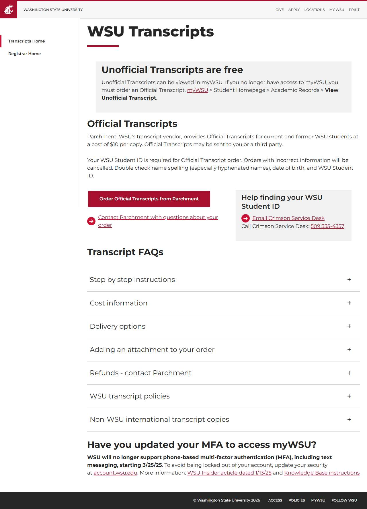

# 📄 Page Scan Report

> **URL:** https://transcript.wsu.edu/  
> **Captured:** 2026-02-19 02:12:29 UTC  
> **Status:** ❌ 0  

---

## 📑 Contents

- [Summary](#-summary)
- [Screenshots](#-screenshots)
- [Page Images](#-page-images)
- [Accessibility](#-accessibility)
- [Actions](#-actions)
- [Files](#-files)

---

## 📋 Summary

| Field | Value |
|-------|-------|
| URL | https://transcript.wsu.edu/ |
| Title | Order Student Transcript |
| Status | ❌ 0 |
| HTML Size | 649.8 KB |
| Screenshots | 1 (146.4 KB) |
| Images | 10 (referenced by URL) |
| Images Missing Alt | ✅ 0 |
| JS Errors | ✅ 0 |
| JS Warnings | 1 |
| A11y Violations | ⚠️ 1 |
| 🔴 Critical | 1 |
| 🟠 Serious | 0 |
| 🟡 Moderate | 0 |
| 🔵 Minor | 0 |
| Tools Run | axe, htmlcheck |
| Auth | none |
| Captured | 2026-02-19T02:12:29.8620963Z |

## 🔧 Actions

<strong>4 action(s) performed</strong>

- Screenshot #1: page-loaded (146.4 KB)
- Cataloged 10 images by URL (no download)
- axe-core: 1 violations (299ms)
- htmlcheck: 0 violations (0ms)

## 📸 Screenshots

<table>
<tr>
<td align="center" width="50%">

 <strong>1. page-loaded</strong>
 146.4 KB
</td>
<td></td>
</tr>
</table>

## 🖼️ Page Images (10)

<strong>📋 Image Index</strong> — 10 images (referenced by URL)

| # | Source URL | Alt Text |
|--:|-----------|----------|
| 1 | https://transcript.wsu.edu/media/l0bn12bj/parchmentaddschool.png?rmode=max&wi... | Parchment enter school name in search... |
| 2 | https://transcript.wsu.edu/media/me3dbjy3/parchmentlinkschool.png?rmode=max&h... | Parchment confirm if currently enrolled |
| 3 | https://transcript.wsu.edu/media/y54jk2ee/parchmentenrollmentinformation.png?... | Parchment enter enrollment information |
| 4 | https://transcript.wsu.edu/media/2vkkzy1j/parchmentordertranscript.png?rmode=... | Parchment select order your transcrip... |
| 5 | https://transcript.wsu.edu/media/u4ydjmdh/parchmentdeliverydestination.png?rm... | Parchment enter transcript recipient ... |
| 6 | https://transcript.wsu.edu/media/0zjjhbbl/parchmentsendtoself.png?rmode=max&w... | Parchment confirm delivery destination |
| 7 | https://transcript.wsu.edu/media/lfinfwnt/parchmentitemdetails.png?rmode=max&... | Parchment transcript delivery details... |
| 8 | https://transcript.wsu.edu/media/wp4ff5p0/parchmentsignature.png?rmode=max&he... | Parchment enter electronic signature |
| 9 | https://transcript.wsu.edu/media/0ftj3wpp/parchmentpaymentinfo.png?rmode=max&... | Parchment payment page |
| 10 | https://transcript.wsu.edu/media/mecppd2w/parchmentattachment.png?rmode=max&w... | Parchment add attachment on delivery ... |

<strong>🖼️ Gallery</strong>

<table>
<tr>
<td align="center" width="33%">

 https://transcript.wsu.edu/media/l0bn12bj/parch...
</td>
<td align="center" width="33%">

 https://transcript.wsu.edu/media/me3dbjy3/parch...
</td>
<td align="center" width="33%">

 https://transcript.wsu.edu/media/y54jk2ee/parch...
</td>
</tr>
<tr>
<td align="center" width="33%">

 https://transcript.wsu.edu/media/2vkkzy1j/parch...
</td>
<td align="center" width="33%">

 https://transcript.wsu.edu/media/u4ydjmdh/parch...
</td>
<td align="center" width="33%">

 https://transcript.wsu.edu/media/0zjjhbbl/parch...
</td>
</tr>
<tr>
<td align="center" width="33%">

 https://transcript.wsu.edu/media/lfinfwnt/parch...
</td>
<td align="center" width="33%">

 https://transcript.wsu.edu/media/wp4ff5p0/parch...
</td>
<td align="center" width="33%">

 https://transcript.wsu.edu/media/0ftj3wpp/parch...
</td>
</tr>
<tr>
<td align="center" width="33%">

 https://transcript.wsu.edu/media/mecppd2w/parch...
</td>
<td></td>
<td></td>
</tr>
</table>

## ♿ Accessibility

### Summary

| Severity | axe | htmlcheck |
|----------|:---:|:---:|
| 🔴 critical | 1 | 0 |
| 🟠 serious | 0 | 0 |
| 🟡 moderate | 0 | 0 |
| 🔵 minor | 0 | 0 |
| **Total** | **1** | **0** |

### Violations by Confidence

<strong>1 rule(s) violated</strong>

| # | Rule | Sev | Confidence | axe | htmlcheck | Example |
|--:|------|:---:|:----------:|:---:|:---:|---------|
| 1 | [aria-allowed-attr](../../a11y-rules.md#aria-allowed-attr) | 🔴 | 🟢 1/1 | ⚠️ | — | `

> **Note:** Automated scanning catches ~30-60% of WCAG issues. Manual keyboard and screen reader testing is still required for full compliance.

## 📁 Files

| File | Description |
|------|-------------|
| `01-page-loaded.jpg` | page-loaded (146.4 KB) |
| `page.html` | Rendered HTML content |
| `metadata.json` | Machine-readable scan data |
| `errors.log` | JavaScript console errors |
| `warnings.log` | JavaScript console warnings |
| `info.log` | Navigation and timing details |
| `actions.log` | Interactions performed |
| `a11y-axe.json` | axe accessibility results |
| `a11y-htmlcheck.json` | htmlcheck accessibility results |
| `a11y-summary.json` | Merged cross-tool accessibility summary |

---

*Generated by AccessibilityScanner (FreeTools) v1.0*
