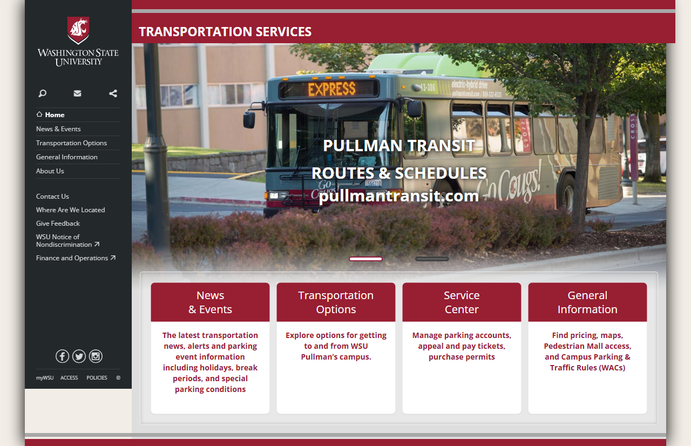
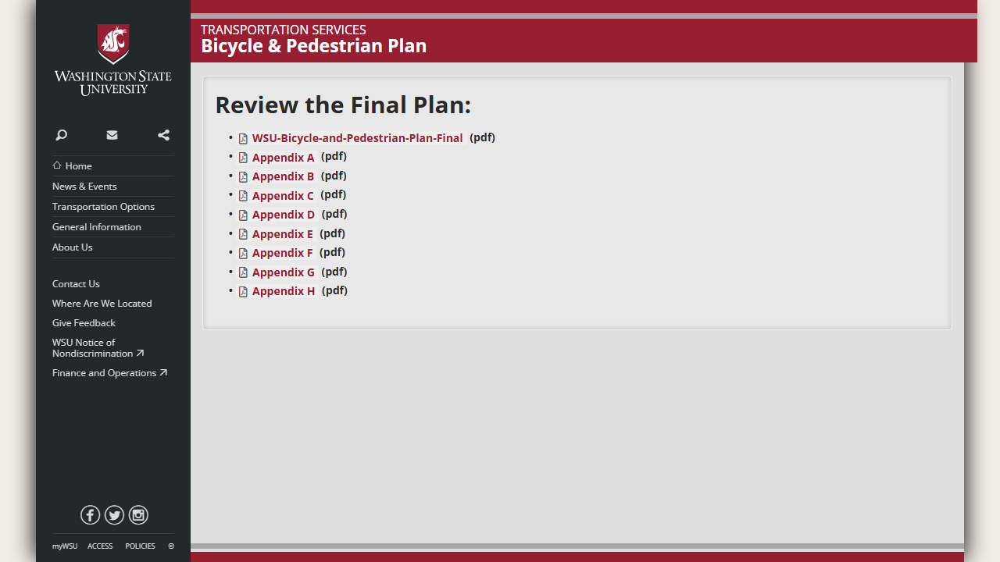
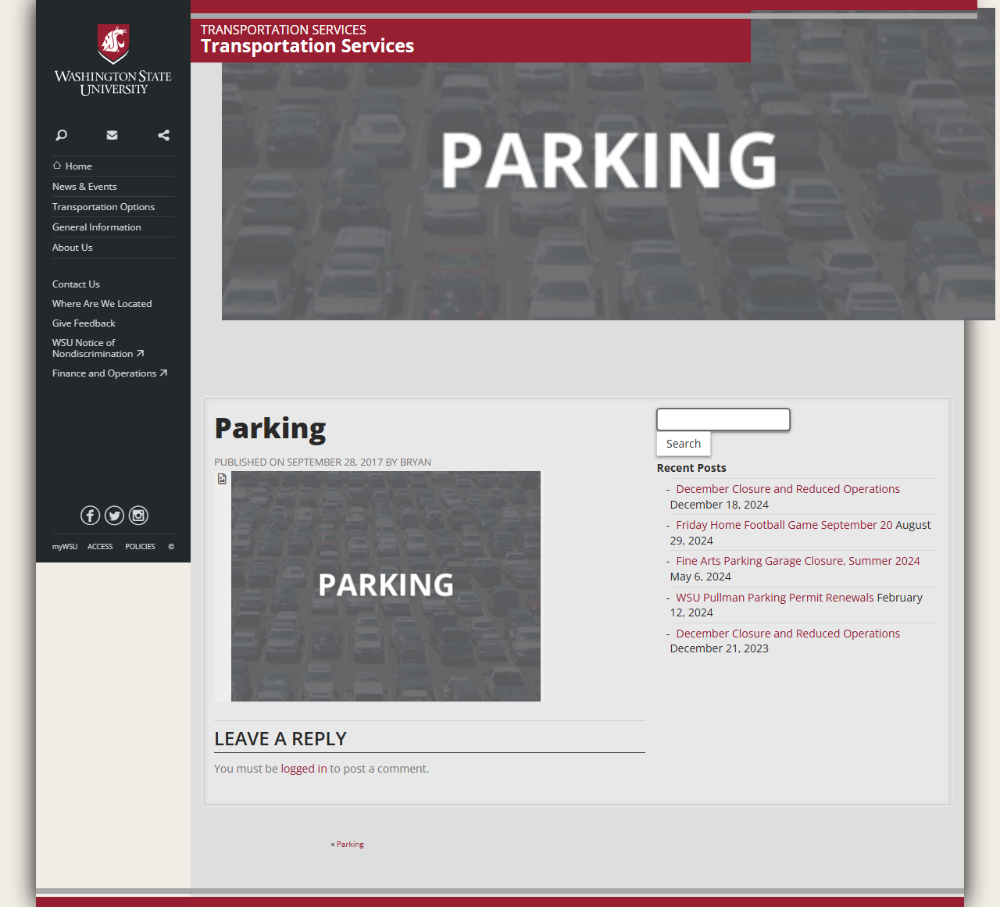

# 🌐 Site Report: https://transportation.wsu.edu/

> **Status:** ✅ 5/5 pages OK  
> **Folder:** `transportation-wsu-edu/`  

---

## 📋 Summary

```
Success Rate:  [██████████████████████████████] 100%
```

| Metric | Value |
|--------|-------|
| Pages Scanned | 5 |
| Pages Passed | ✅ 5 |
| Pages Failed | 0 |
| Total JS Errors | 0 |
| Total JS Warnings | 5 |
| Total Images | 9 (1.9 MB) |
| Images Missing Alt | ⚠️ 1 |
| Total HTML | 327.1 KB |
| Total Screenshots | 2.2 MB |

## 📑 Pages

| Status | Page | HTTP | Title | JS Errors | Images | Missing Alt |
|:------:|------|:----:|-------|:---------:|:------:|:-----------:|
| ✅ | [/](_root/report.md) | 200 | Transportation Services \| Washington... | 0 | 0 | 0 |
| ✅ | [/bike/](bike/report.md) | 200 | Bike_Ped_Plan \| Transportation Servi... | 0 | 0 | 0 |
| ✅ | [/contact/](contact/report.md) | 200 | Contact \| Transportation Services \|... | 0 | 5 | 0 |
| ✅ | [/parking/](parking/report.md) | 200 | Parking \| Transportation Services \|... | 0 | 1 | ⚠️ 1 |
| ✅ | [/transit/](transit/report.md) | 200 | Transit Options \| Transportation Ser... | 0 | 3 | 0 |

## 📸 Page Screenshots

Click any thumbnail to view the full page report.

<table>
<tr>
<td align="center" width="33%">
<a href="_root/report.md">

</a>
<br />✅ <code>/</code>
</td>
<td align="center" width="33%">
<a href="bike/report.md">

</a>
<br />✅ <code>/bike/</code>
</td>
<td align="center" width="33%">
<a href="contact/report.md">

</a>
<br />✅ <code>/contact/</code>
</td>
</tr>
<tr>
<td align="center" width="33%">
<a href="parking/report.md">

</a>
<br />✅ <code>/parking/</code>
</td>
<td align="center" width="33%">
<a href="transit/report.md">

</a>
<br />✅ <code>/transit/</code>
</td>
<td></td>
</tr>
</table>

---

*Generated by AccessibilityScanner (FreeTools) v1.0*
