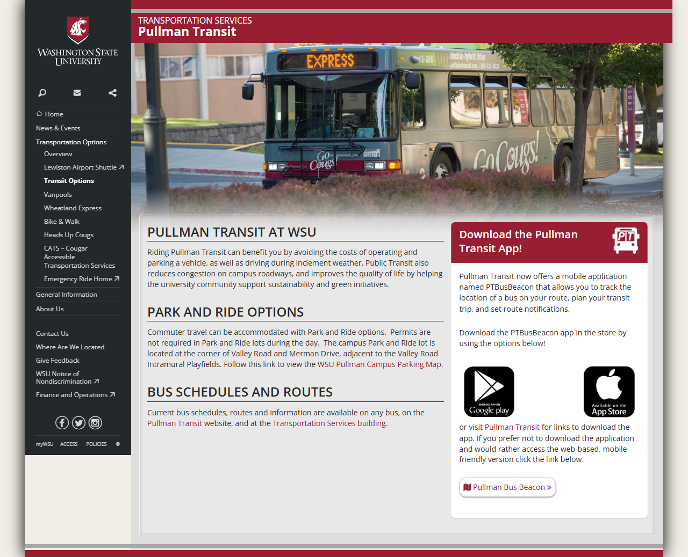

# 📄 Page Scan Report

> **URL:** https://transportation.wsu.edu/transit/  
> **Captured:** 2026-02-16 22:12:35 UTC  
> **Status:** ✅ 200  

---

## 📑 Contents

- [Summary](#-summary)
- [Screenshots](#-screenshots)
- [Page Images](#-page-images)
- [Actions](#-actions)
- [Files](#-files)

---

## 📋 Summary

| Field | Value |
|-------|-------|
| URL | https://transportation.wsu.edu/transit/ |
| Redirected To | https://transportation.wsu.edu/transportation-options/transit-options/ |
| Title | Transit Options | Transportation Services | Washington State University |
| Status | ✅ 200 |
| HTML Size | 65.8 KB |
| Screenshots | 1 (647.0 KB) |
| Images | 3 (134.7 KB) |
| Images Missing Alt | ✅ 0 |
| JS Errors | ✅ 0 |
| JS Warnings | 1 |
| Auth | none |
| Captured | 2026-02-16T22:12:35.6677819Z |

## 🔧 Actions

<strong>2 action(s) performed</strong>

- Screenshot #1: page-loaded (647.0 KB)
- Downloaded 3 images to /images/

## 📸 Screenshots

<table>
<tr>
<td align="center" width="50%">

 <strong>1. page-loaded</strong>
 647.0 KB
</td>
<td></td>
</tr>
</table>

## 🖼️ Page Images (3)

<strong>📋 Image Index</strong> — 3 images, 134.7 KB

| # | Image | Alt Text | Size |
|--:|-------|----------|-----:|
| 1 | [PTBusBeacon_cropped.png](images/PTBusBeacon_cropped.png) | Android app download | 27.1 KB |
| 2 | [Gooogle_Play_2.png](images/Gooogle_Play_2.png) | Android app download | 33.7 KB |
| 3 | [appstore2.png](images/appstore2.png) | Apple app download | 73.8 KB |

<strong>🖼️ Gallery</strong>

<table>
<tr>
<td align="center" width="33%">

 PTBusBeacon_cropped.png
</td>
<td align="center" width="33%">

 Gooogle_Play_2.png
</td>
<td align="center" width="33%">

 appstore2.png
</td>
</tr>
</table>

## 📁 Files

| File | Description |
|------|-------------|
| `01-page-loaded.png` | page-loaded (647.0 KB) |
| `page.html` | Rendered HTML content |
| `metadata.json` | Machine-readable scan data |
| `errors.log` | JavaScript console errors |
| `warnings.log` | JavaScript console warnings |
| `info.log` | Navigation and timing details |
| `actions.log` | Interactions performed |
| `images/` | 3 page images (134.7 KB) |

---

*Generated by AccessibilityScanner (FreeTools) v1.0*
