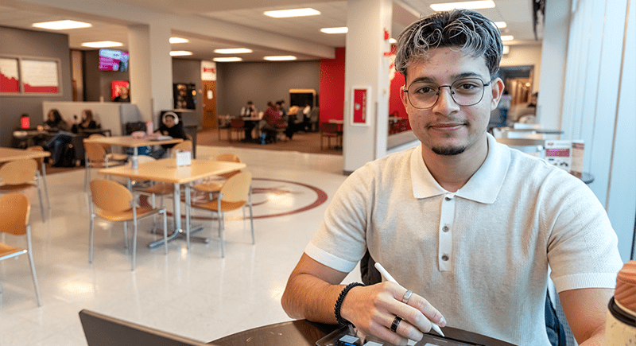
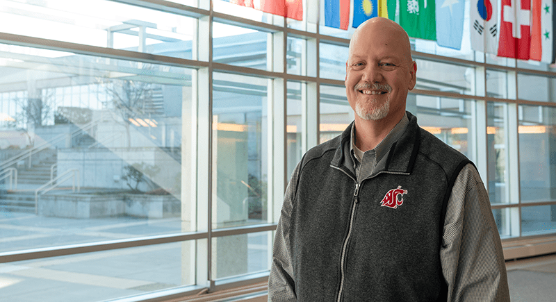
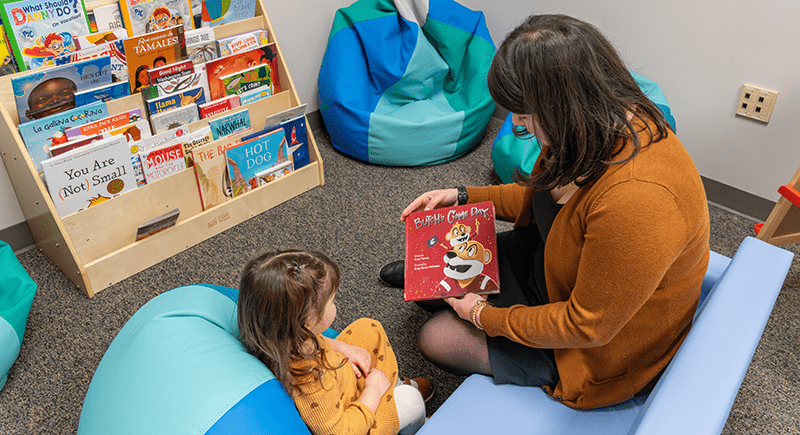
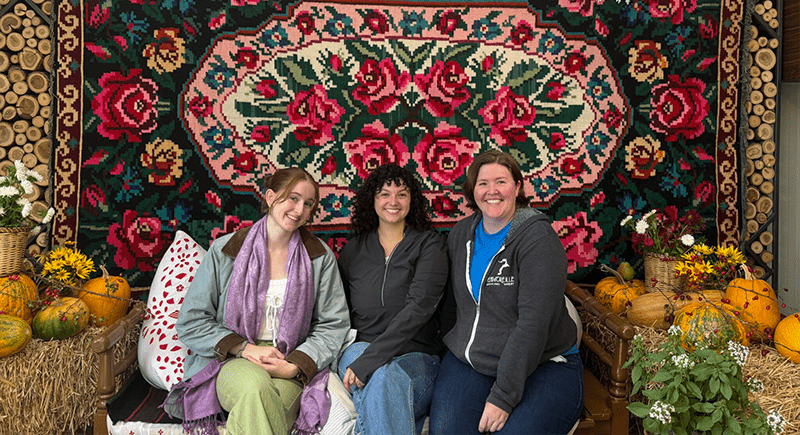
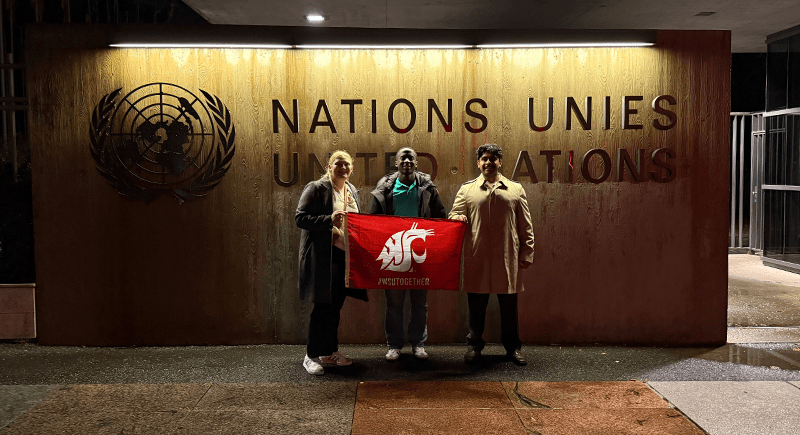
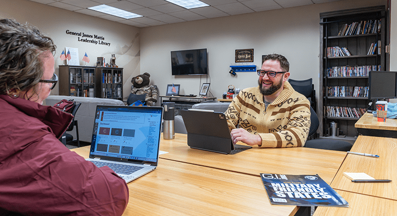
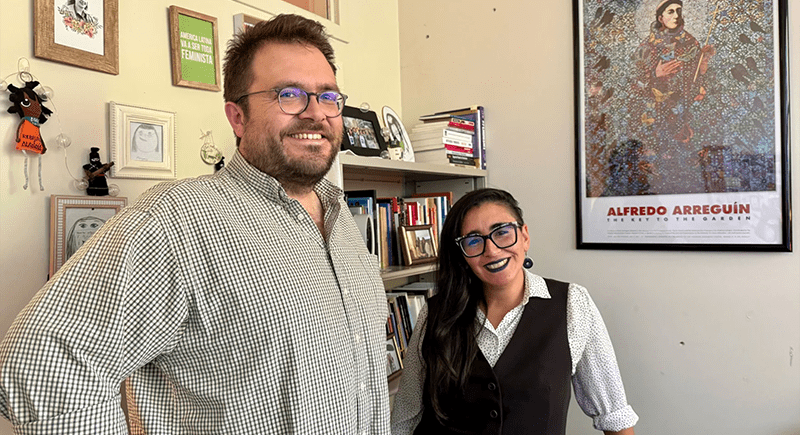
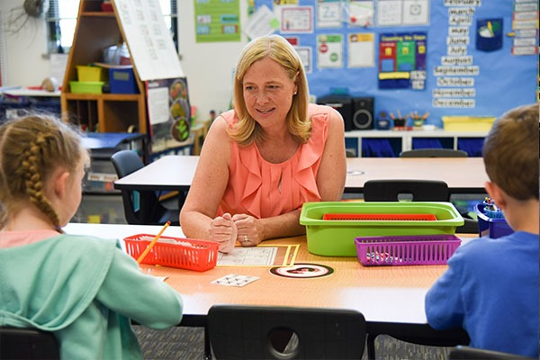
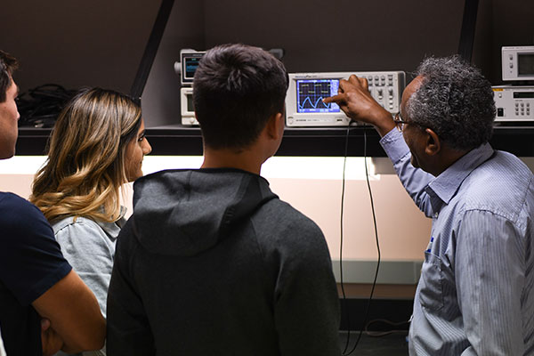

# 📄 Page Scan Report

> **URL:** https://tricities.wsu.edu/  
> **Captured:** 2026-02-16 22:12:12 UTC  
> **Status:** ✅ 200  

---

## 📑 Contents

- [Summary](#-summary)
- [Screenshots](#-screenshots)
- [Page Images](#-page-images)
- [Actions](#-actions)
- [Files](#-files)

---

## 📋 Summary

| Field | Value |
|-------|-------|
| URL | https://tricities.wsu.edu/ |
| Title | WSU Tri-Cities - apply now to earn your degree |
| Status | ✅ 200 |
| HTML Size | 207.9 KB |
| Screenshots | 1 (2.1 MB) |
| Images | 32 (2.5 MB) |
| Images Missing Alt | ⚠️ 11 |
| JS Errors | ✅ 0 |
| JS Warnings | 1 |
| Auth | none |
| Captured | 2026-02-16T22:12:12.5194771Z |

## 🔧 Actions

<strong>2 action(s) performed</strong>

- Screenshot #1: page-loaded (2.1 MB)
- Downloaded 32 images to /images/

## 📸 Screenshots

<table>
<tr>
<td align="center" width="50%">

 <strong>1. page-loaded</strong>
 2.1 MB
</td>
<td></td>
</tr>
</table>

## 🖼️ Page Images (32)

<strong>📋 Image Index</strong> — 32 images, 2.5 MB

| # | Image | Alt Text | Size |
|--:|-------|----------|-----:|
| 1 | [WSU-TC-lockup-horz-4c_WEB-01.png](images/WSU-TC-lockup-horz-4c_WEB-01.png) | Logo | 12.6 KB |
| 2 | [WSU-TC-lockup-horz-rev_WEB_Spaced_larger-1.png](images/WSU-TC-lockup-horz-rev_WEB_Spaced_larger-1.png) | Logo | 7.3 KB |
| 3 | [WSU-TC-lockup-horz-4c_WEB_Spaced-01.png](images/WSU-TC-lockup-horz-4c_WEB_Spaced-01.png) | Logo | 12.8 KB |
| 4 | [WSU-TC-lockup-horz-rev_WEB_Spaced_Sticky.png](images/WSU-TC-lockup-horz-rev_WEB_Spaced_Sticky.png) | Logo | 2.1 KB |
| 5 | [WSU-TC-lockup-vert-rev_WEB-01.png](images/WSU-TC-lockup-vert-rev_WEB-01.png) | Logo | 15.9 KB |
| 6 | [KPanthagani-Web-Story.jpg](images/KPanthagani-Web-Story.jpg) | Kristen Panthagani. | 52.3 KB |
| 7 | [Eric-Mayo-Gutierrez-Web-Story.png](images/Eric-Mayo-Gutierrez-Web-Story.png) | Eric Mayo-Gutierrez. | 173.6 KB |
| 8 | [Mark-Schuster-Web-Story.png](images/Mark-Schuster-Web-Story.png) | Mark Schuster. | 181.1 KB |
| 9 | [Cascadia-Web-Story.jpg](images/Cascadia-Web-Story.jpg) | WSU President Cantwell and BSEL Direc... | 74.4 KB |
| 10 | [Manager-Coaching-Series-Web-Story.png](images/Manager-Coaching-Series-Web-Story.png) | Finger pointing to a word cloud with ... | 145.0 KB |
| 11 | [Nursing-Convocation-Fall-2025-Web-Story.png](images/Nursing-Convocation-Fall-2025-Web-Story.png) | Edith Nateras speaking at a podium on... | 168.7 KB |
| 12 | [Coug-Family-Corner-Butch-Book.png](images/Coug-Family-Corner-Butch-Book.png) | Woman reading a book to a child title... | 197.1 KB |
| 13 | [WSU-Wine-Moldova-Students-Web-Story.png](images/WSU-Wine-Moldova-Students-Web-Story.png) | Three students sit in front of a mult... | 252.1 KB |
| 14 | [United-Nations-WSU-Cougs-Students.png](images/United-Nations-WSU-Cougs-Students.png) | WSU students holding a WSU Coug head ... | 194.0 KB |
| 15 | [WSUTC-Veterans-Center-Students.png](images/WSUTC-Veterans-Center-Students.png) | Jeff Wilson sits with a tablet comput... | 184.2 KB |
| 16 | [Robert-Franklin-Sabrina-Gonzalez.png](images/Robert-Franklin-Sabrina-Gonzalez.png) | Robert Franklin and Sabrina González. | 224.1 KB |
| 17 | [Fall-2025-Enrollment-Web-Story.png](images/Fall-2025-Enrollment-Web-Story.png) | WSU Tri-Cities students and staff wav... | 174.0 KB |
| 18 | [image-18.jpg](images/image-18.jpg) | Logo including a circle segmented int... | 5.5 KB |
| 19 | [cougar-bank.png](images/cougar-bank.png) | ⚠️ *(missing)* | 2.9 KB |
| 20 | [minority-150x114.png](images/minority-150x114.png) | ⚠️ *(missing)* | 10.9 KB |
| 21 | [CAS.jpg](images/CAS.jpg) | ⚠️ *(missing)* | 35.1 KB |
| 22 | [CAS-2home-page-400x700-1.jpg](images/CAS-2home-page-400x700-1.jpg) | ⚠️ *(missing)* | 36.0 KB |
| 23 | [business-home-page-400x700-1.jpg](images/business-home-page-400x700-1.jpg) | ⚠️ *(missing)* | 46.6 KB |
| 24 | [educationhome-page-400x700-1.jpg](images/educationhome-page-400x700-1.jpg) | ⚠️ *(missing)* | 64.8 KB |
| 25 | [engineeringhome-page-400x700-1.jpg](images/engineeringhome-page-400x700-1.jpg) | ⚠️ *(missing)* | 46.9 KB |
| 26 | [computer-science-manny.jpg](images/computer-science-manny.jpg) | ⚠️ *(missing)* | 57.2 KB |
| 27 | [1nursing-home-page-400x700-1.jpg](images/1nursing-home-page-400x700-1.jpg) | ⚠️ *(missing)* | 57.5 KB |
| 28 | [wine-2home-page-400x700-1.jpg](images/wine-2home-page-400x700-1.jpg) | ⚠️ *(missing)* | 74.6 KB |
| 29 | [home-pagge_0000_Lian-Jacquez-edited-for-web.jpg](images/home-pagge_0000_Lian-Jacquez-edited-for-web.jpg) | Lian Jacquez | 9.7 KB |
| 30 | [home-pagge_0003_46351106344_0e0cb966d8_z.jpg](images/home-pagge_0003_46351106344_0e0cb966d8_z.jpg) | Vanessa Moore | 9.9 KB |
| 31 | [home-pagge_0002_Catalina-Yepez.jpg](images/home-pagge_0002_Catalina-Yepez.jpg) | ⚠️ *(missing)* | 9.4 KB |
| 32 | [home-pagge_0001_Geoff-Schramm-1.jpg](images/home-pagge_0001_Geoff-Schramm-1.jpg) | Geoff Schramm | 10.1 KB |

<strong>🖼️ Gallery</strong>

<table>
<tr>
<td align="center" width="33%">

 WSU-TC-lockup-horz-4c_WEB-01.png
</td>
<td align="center" width="33%">

 WSU-TC-lockup-horz-rev_WEB_Spaced_larger-1.png
</td>
<td align="center" width="33%">

 WSU-TC-lockup-horz-4c_WEB_Spaced-01.png
</td>
</tr>
<tr>
<td align="center" width="33%">

 WSU-TC-lockup-horz-rev_WEB_Spaced_Sticky.png
</td>
<td align="center" width="33%">

 WSU-TC-lockup-vert-rev_WEB-01.png
</td>
<td align="center" width="33%">

 KPanthagani-Web-Story.jpg
</td>
</tr>
<tr>
<td align="center" width="33%">

 Eric-Mayo-Gutierrez-Web-Story.png
</td>
<td align="center" width="33%">

 Mark-Schuster-Web-Story.png
</td>
<td align="center" width="33%">

 Cascadia-Web-Story.jpg
</td>
</tr>
<tr>
<td align="center" width="33%">

 Manager-Coaching-Series-Web-Story.png
</td>
<td align="center" width="33%">

 Nursing-Convocation-Fall-2025-Web-Story.png
</td>
<td align="center" width="33%">

 Coug-Family-Corner-Butch-Book.png
</td>
</tr>
<tr>
<td align="center" width="33%">

 WSU-Wine-Moldova-Students-Web-Story.png
</td>
<td align="center" width="33%">

 United-Nations-WSU-Cougs-Students.png
</td>
<td align="center" width="33%">

 WSUTC-Veterans-Center-Students.png
</td>
</tr>
<tr>
<td align="center" width="33%">

 Robert-Franklin-Sabrina-Gonzalez.png
</td>
<td align="center" width="33%">

 Fall-2025-Enrollment-Web-Story.png
</td>
<td align="center" width="33%">

 image-18.jpg
</td>
</tr>
<tr>
<td align="center" width="33%">

 cougar-bank.png ⚠️
</td>
<td align="center" width="33%">

 minority-150x114.png ⚠️
</td>
<td align="center" width="33%">

 CAS.jpg ⚠️
</td>
</tr>
<tr>
<td align="center" width="33%">

 CAS-2home-page-400x700-1.jpg ⚠️
</td>
<td align="center" width="33%">

 business-home-page-400x700-1.jpg ⚠️
</td>
<td align="center" width="33%">

 educationhome-page-400x700-1.jpg ⚠️
</td>
</tr>
<tr>
<td align="center" width="33%">

 engineeringhome-page-400x700-1.jpg ⚠️
</td>
<td align="center" width="33%">

 computer-science-manny.jpg ⚠️
</td>
<td align="center" width="33%">

 1nursing-home-page-400x700-1.jpg ⚠️
</td>
</tr>
<tr>
<td align="center" width="33%">

 wine-2home-page-400x700-1.jpg ⚠️
</td>
<td align="center" width="33%">

 home-pagge_0000_Lian-Jacquez-edited-for-web.jpg
</td>
<td align="center" width="33%">

 home-pagge_0003_46351106344_0e0cb966d8_z.jpg
</td>
</tr>
<tr>
<td align="center" width="33%">

 home-pagge_0002_Catalina-Yepez.jpg ⚠️
</td>
<td align="center" width="33%">

 home-pagge_0001_Geoff-Schramm-1.jpg
</td>
<td></td>
</tr>
</table>

⚠️ <strong>Images Missing Alt Text</strong> (11)

| Image | Source URL |
|-------|-----------|
| `cougar-bank.png` | https://tricities.wsu.edu/wp-content/uploads/cougar-bank.png |
| `minority-150x114.png` | https://tricities.wsu.edu/wp-content/uploads/2016/02/minority-150x114.png |
| `CAS.jpg` | https://tricities.wsu.edu/wp-content/uploads/CAS.jpg |
| `CAS-2home-page-400x700-1.jpg` | https://tricities.wsu.edu/wp-content/uploads/CAS-2home-page-400x700-1.jpg |
| `business-home-page-400x700-1.jpg` | https://tricities.wsu.edu/wp-content/uploads/business-home-page-400x700-1.jpg |
| `educationhome-page-400x700-1.jpg` | https://tricities.wsu.edu/wp-content/uploads/educationhome-page-400x700-1.jpg |
| `engineeringhome-page-400x700-1.jpg` | https://tricities.wsu.edu/wp-content/uploads/engineeringhome-page-400x700-1.jpg |
| `computer-science-manny.jpg` | https://tricities.wsu.edu/wp-content/uploads/computer-science-manny.jpg |
| `1nursing-home-page-400x700-1.jpg` | https://tricities.wsu.edu/wp-content/uploads/1nursing-home-page-400x700-1.jpg |
| `wine-2home-page-400x700-1.jpg` | https://tricities.wsu.edu/wp-content/uploads/wine-2home-page-400x700-1.jpg |
| `home-pagge_0002_Catalina-Yepez.jpg` | https://tricities.wsu.edu/wp-content/uploads/home-pagge_0002_Catalina-Yepez.jpg |

## 📁 Files

| File | Description |
|------|-------------|
| `01-page-loaded.png` | page-loaded (2.1 MB) |
| `page.html` | Rendered HTML content |
| `metadata.json` | Machine-readable scan data |
| `errors.log` | JavaScript console errors |
| `warnings.log` | JavaScript console warnings |
| `info.log` | Navigation and timing details |
| `actions.log` | Interactions performed |
| `images/` | 32 page images (2.5 MB) |

---

*Generated by AccessibilityScanner (FreeTools) v1.0*
