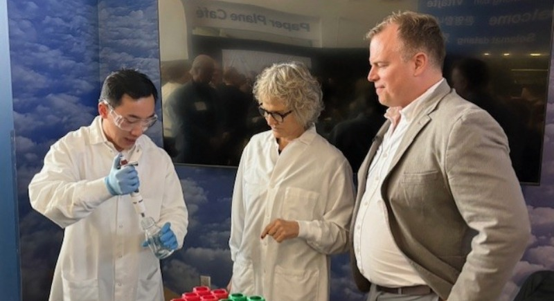
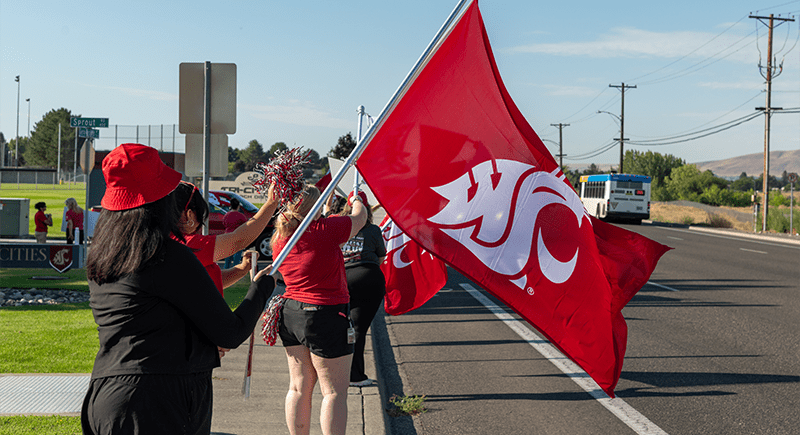
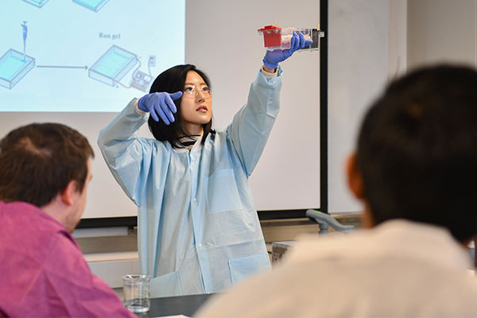
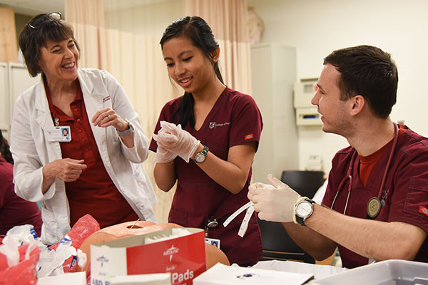
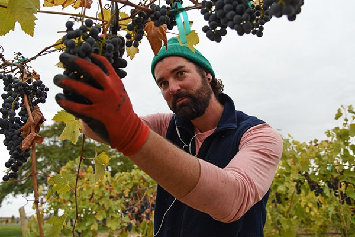

# Page Scan Report

| Field | Value |
|-------|-------|
| URL | https://tricities.wsu.edu/ |
| Title | WSU Tri-Cities - apply now to earn your degree |
| Status | ❌ 0 |
| HTML Size | 204.8 KB |
| Screenshots | 1 (161.1 KB) |
| Images | 21 (809.4 KB) |
| Images Missing Alt | 9 |
| JS Errors | 9 |
| JS Warnings | 1 |
| Auth | none |
| Captured | 2026-02-16T20:37:05.1811720Z |

## JavaScript Errors

- `Failed to load resource: net::ERR_SOCKET_NOT_CONNECTED`
- `Failed to load resource: net::ERR_SOCKET_NOT_CONNECTED`
- `Failed to load resource: net::ERR_SOCKET_NOT_CONNECTED`
- `Failed to load resource: net::ERR_SOCKET_NOT_CONNECTED`
- `Failed to load resource: net::ERR_HTTP2_PROTOCOL_ERROR`
- `Failed to load resource: net::ERR_HTTP2_PROTOCOL_ERROR`
- `Failed to load resource: net::ERR_HTTP2_PROTOCOL_ERROR`
- `Failed to load resource: net::ERR_HTTP2_PROTOCOL_ERROR`
- `Failed to load resource: net::ERR_HTTP2_PROTOCOL_ERROR`

## Actions

- Screenshot #1: page-loaded (161.1 KB)
- Downloaded 21 images to /images/

## Screenshots

### 1. page-loaded

## Page Images (21)

| # | Image | Alt Text | Size |
|---|-------|----------|------|
| 1 | [WSU-TC-lockup-horz-4c_WEB-01.png](images/WSU-TC-lockup-horz-4c_WEB-01.png) | Logo | 12.6 KB |
| 2 | [WSU-TC-lockup-horz-rev_WEB_Spaced_larger-1.png](images/WSU-TC-lockup-horz-rev_WEB_Spaced_larger-1.png) | Logo | 7.3 KB |
| 3 | [WSU-TC-lockup-horz-4c_WEB_Spaced-01.png](images/WSU-TC-lockup-horz-4c_WEB_Spaced-01.png) | Logo | 12.8 KB |
| 4 | [WSU-TC-lockup-horz-rev_WEB_Spaced_Sticky.png](images/WSU-TC-lockup-horz-rev_WEB_Spaced_Sticky.png) | Logo | 2.1 KB |
| 5 | [WSU-TC-lockup-vert-rev_WEB-01.png](images/WSU-TC-lockup-vert-rev_WEB-01.png) | Logo | 15.9 KB |
| 6 | [Cascadia-Web-Story.jpg](images/Cascadia-Web-Story.jpg) | WSU President Cantwell and BSEL Direc... | 74.4 KB |
| 7 | [Manager-Coaching-Series-Web-Story.png](images/Manager-Coaching-Series-Web-Story.png) | Finger pointing to a word cloud with ... | 145.0 KB |
| 8 | [Fall-2025-Enrollment-Web-Story.png](images/Fall-2025-Enrollment-Web-Story.png) | WSU Tri-Cities students and staff wav... | 174.0 KB |
| 9 | [image-9.jpg](images/image-9.jpg) | Logo including a circle segmented int... | 5.5 KB |
| 10 | [cougar-bank.png](images/cougar-bank.png) | *(none)* | 2.9 KB |
| 11 | [minority-150x114.png](images/minority-150x114.png) | *(none)* | 10.9 KB |
| 12 | [CAS.jpg](images/CAS.jpg) | *(none)* | 35.1 KB |
| 13 | [CAS-2home-page-400x700-1.jpg](images/CAS-2home-page-400x700-1.jpg) | *(none)* | 36.0 KB |
| 14 | [business-home-page-400x700-1.jpg](images/business-home-page-400x700-1.jpg) | *(none)* | 46.6 KB |
| 15 | [computer-science-manny.jpg](images/computer-science-manny.jpg) | *(none)* | 57.2 KB |
| 16 | [1nursing-home-page-400x700-1.jpg](images/1nursing-home-page-400x700-1.jpg) | *(none)* | 57.5 KB |
| 17 | [wine-2home-page-400x700-1.jpg](images/wine-2home-page-400x700-1.jpg) | *(none)* | 74.6 KB |
| 18 | [home-pagge_0000_Lian-Jacquez-edited-for-web.jpg](images/home-pagge_0000_Lian-Jacquez-edited-for-web.jpg) | Lian Jacquez | 9.7 KB |
| 19 | [home-pagge_0003_46351106344_0e0cb966d8_z.jpg](images/home-pagge_0003_46351106344_0e0cb966d8_z.jpg) | Vanessa Moore | 9.9 KB |
| 20 | [home-pagge_0002_Catalina-Yepez.jpg](images/home-pagge_0002_Catalina-Yepez.jpg) | *(none)* | 9.4 KB |
| 21 | [home-pagge_0001_Geoff-Schramm-1.jpg](images/home-pagge_0001_Geoff-Schramm-1.jpg) | Geoff Schramm | 10.1 KB |

### Gallery

### ⚠️ Images Missing Alt Text (9)

- `cougar-bank.png` — https://tricities.wsu.edu/wp-content/uploads/cougar-bank.png
- `minority-150x114.png` — https://tricities.wsu.edu/wp-content/uploads/2016/02/minority-150x114.png
- `CAS.jpg` — https://tricities.wsu.edu/wp-content/uploads/CAS.jpg
- `CAS-2home-page-400x700-1.jpg` — https://tricities.wsu.edu/wp-content/uploads/CAS-2home-page-400x700-1.jpg
- `business-home-page-400x700-1.jpg` — https://tricities.wsu.edu/wp-content/uploads/business-home-page-400x700-1.jpg
- `computer-science-manny.jpg` — https://tricities.wsu.edu/wp-content/uploads/computer-science-manny.jpg
- `1nursing-home-page-400x700-1.jpg` — https://tricities.wsu.edu/wp-content/uploads/1nursing-home-page-400x700-1.jpg
- `wine-2home-page-400x700-1.jpg` — https://tricities.wsu.edu/wp-content/uploads/wine-2home-page-400x700-1.jpg
- `home-pagge_0002_Catalina-Yepez.jpg` — https://tricities.wsu.edu/wp-content/uploads/home-pagge_0002_Catalina-Yepez.jpg

## Files

- `01-page-loaded.png` — page-loaded (161.1 KB)
- `page.html` — rendered HTML content
- `metadata.json` — machine-readable scan data
- `errors.log` — JavaScript console errors
- `warnings.log` — JavaScript console warnings
- `info.log` — navigation and timing details
- `actions.log` — interactions performed on the page
- `images/` — 21 page images (809.4 KB)
