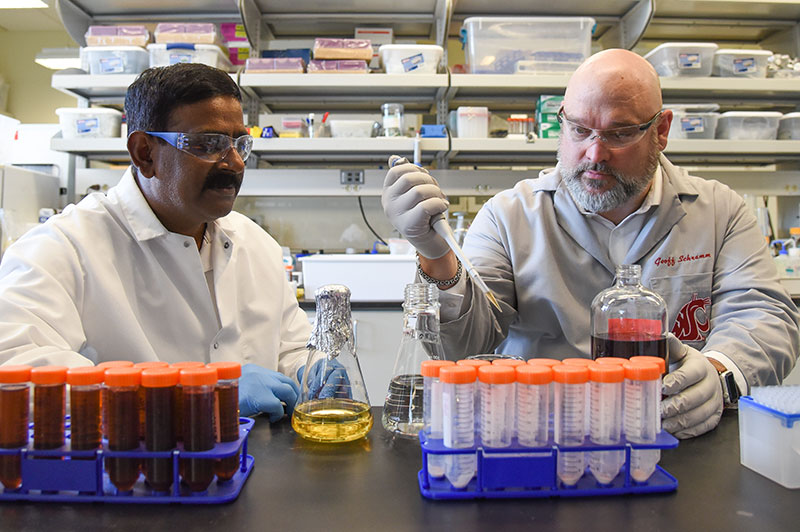

# Page Scan Report

| Field | Value |
|-------|-------|
| URL | https://tricities.wsu.edu/about/ |
| Title | About WSU Tri-Cities - WSU Tri-Cities |
| Status | ❌ 0 |
| HTML Size | 123.4 KB |
| Screenshots | 1 (724.3 KB) |
| Images | 16 (1.1 MB) |
| Images Missing Alt | 9 |
| JS Errors | 0 |
| JS Warnings | 5 |
| Auth | none |
| Captured | 2026-02-16T20:39:30.1078043Z |

## Actions

- Screenshot #1: page-loaded (724.3 KB)
- Downloaded 16 images to /images/

## Screenshots

### 1. page-loaded

## Page Images (16)

| # | Image | Alt Text | Size |
|---|-------|----------|------|
| 1 | [WSU-TC-lockup-horz-4c_WEB-01.png](images/WSU-TC-lockup-horz-4c_WEB-01.png) | Logo | 12.6 KB |
| 2 | [WSU-TC-lockup-horz-rev_WEB_Spaced_larger-1.png](images/WSU-TC-lockup-horz-rev_WEB_Spaced_larger-1.png) | Logo | 7.3 KB |
| 3 | [WSU-TC-lockup-horz-4c_WEB_Spaced-01.png](images/WSU-TC-lockup-horz-4c_WEB_Spaced-01.png) | Logo | 12.8 KB |
| 4 | [WSU-TC-lockup-horz-rev_WEB_Spaced_Sticky.png](images/WSU-TC-lockup-horz-rev_WEB_Spaced_Sticky.png) | Logo | 2.1 KB |
| 5 | [WSU-TC-lockup-vert-rev_WEB-01.png](images/WSU-TC-lockup-vert-rev_WEB-01.png) | Logo | 15.9 KB |
| 6 | [gradient-button-rectangle.png](images/gradient-button-rectangle.png) | *(none)* | 147.3 KB |
| 7 | [Need-Help-800x532-1.jpg](images/Need-Help-800x532-1.jpg) | *(none)* | 120.5 KB |
| 8 | [small-class-800x532-1.jpg](images/small-class-800x532-1.jpg) | *(none)* | 92.2 KB |
| 9 | [affordable-800x532-1.jpg](images/affordable-800x532-1.jpg) | *(none)* | 143.6 KB |
| 10 | [location2-800x532-1.jpg](images/location2-800x532-1.jpg) | *(none)* | 71.1 KB |
| 11 | [industry-800x532-1.jpg](images/industry-800x532-1.jpg) | *(none)* | 65.7 KB |
| 12 | [diverse-first-gen-800x532-1.jpg](images/diverse-first-gen-800x532-1.jpg) | Proud to be a First Generation Student | 49.5 KB |
| 13 | [veteran-800x532-1.jpg](images/veteran-800x532-1.jpg) | *(none)* | 58.0 KB |
| 14 | [research-800x532-1.jpg](images/research-800x532-1.jpg) | *(none)* | 107.5 KB |
| 15 | [running-start-1.jpg](images/running-start-1.jpg) | Running Start | 101.0 KB |
| 16 | [grad-800x532-1.jpg](images/grad-800x532-1.jpg) | *(none)* | 85.4 KB |

### Gallery

### ⚠️ Images Missing Alt Text (9)

- `gradient-button-rectangle.png` — https://tricities.wsu.edu/wp-content/uploads/gradient-button-rectangle.png
- `Need-Help-800x532-1.jpg` — https://tricities.wsu.edu/wp-content/uploads/Need-Help-800x532-1.jpg
- `small-class-800x532-1.jpg` — https://tricities.wsu.edu/wp-content/uploads/small-class-800x532-1.jpg
- `affordable-800x532-1.jpg` — https://tricities.wsu.edu/wp-content/uploads/affordable-800x532-1.jpg
- `location2-800x532-1.jpg` — https://tricities.wsu.edu/wp-content/uploads/location2-800x532-1.jpg
- `industry-800x532-1.jpg` — https://tricities.wsu.edu/wp-content/uploads/industry-800x532-1.jpg
- `veteran-800x532-1.jpg` — https://tricities.wsu.edu/wp-content/uploads/veteran-800x532-1.jpg
- `research-800x532-1.jpg` — https://tricities.wsu.edu/wp-content/uploads/research-800x532-1.jpg
- `grad-800x532-1.jpg` — https://tricities.wsu.edu/wp-content/uploads/grad-800x532-1.jpg

## Files

- `01-page-loaded.png` — page-loaded (724.3 KB)
- `page.html` — rendered HTML content
- `metadata.json` — machine-readable scan data
- `errors.log` — JavaScript console errors
- `warnings.log` — JavaScript console warnings
- `info.log` — navigation and timing details
- `actions.log` — interactions performed on the page
- `images/` — 16 page images (1.1 MB)
