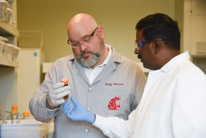
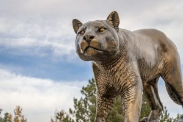
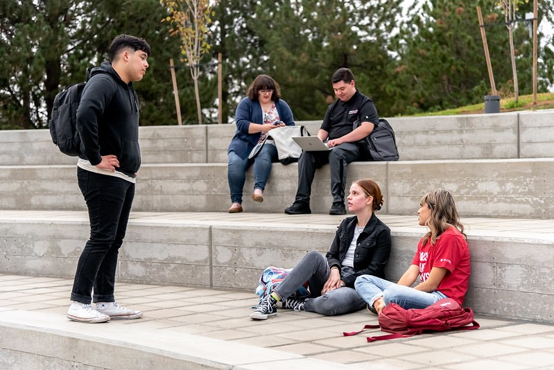
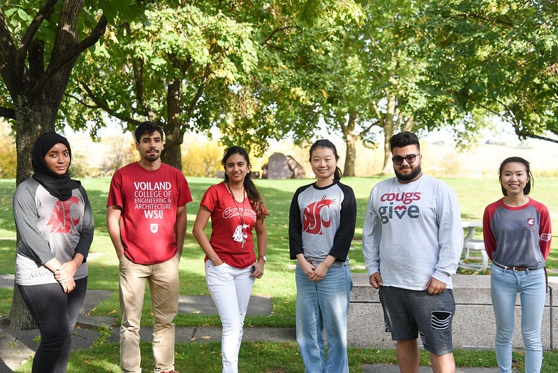
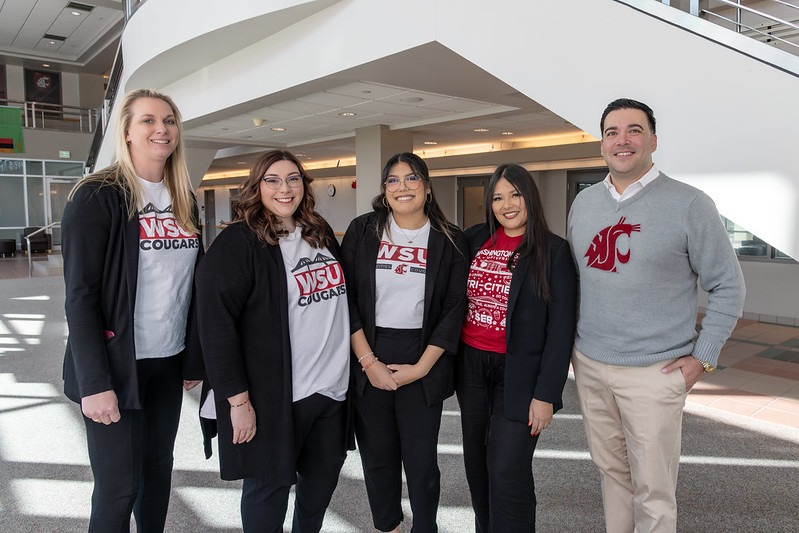

# Page Scan Report

| Field | Value |
|-------|-------|
| URL | https://tricities.wsu.edu/admissions/ |
| Title | Admissions | WSU Tri-Cities |
| Status | ✅ 200 |
| HTML Size | 166.0 KB |
| Screenshots | 1 (2.2 MB) |
| Images | 12 (638.2 KB) |
| Images Missing Alt | 0 |
| JS Errors | 0 |
| JS Warnings | 3 |
| Auth | none |
| Captured | 2026-02-16T21:01:22.0216477Z |

## Actions

- Screenshot #1: page-loaded (2.2 MB)
- Downloaded 12 images to /images/

## Screenshots

### 1. page-loaded

## Page Images (12)

| # | Image | Alt Text | Size |
|---|-------|----------|------|
| 1 | [WSU-TC-lockup-horz-4c_WEB-01.png](images/WSU-TC-lockup-horz-4c_WEB-01.png) | Logo | 12.6 KB |
| 2 | [WSU-TC-lockup-horz-rev_WEB_Spaced_larger-1.png](images/WSU-TC-lockup-horz-rev_WEB_Spaced_larger-1.png) | Logo | 7.3 KB |
| 3 | [WSU-TC-lockup-horz-4c_WEB_Spaced-01.png](images/WSU-TC-lockup-horz-4c_WEB_Spaced-01.png) | Logo | 12.8 KB |
| 4 | [WSU-TC-lockup-horz-rev_WEB_Spaced_Sticky.png](images/WSU-TC-lockup-horz-rev_WEB_Spaced_Sticky.png) | Logo | 2.1 KB |
| 5 | [WSU-TC-lockup-vert-rev_WEB-01.png](images/WSU-TC-lockup-vert-rev_WEB-01.png) | Logo | 15.9 KB |
| 6 | [Undergrad-Student-300x200.jpeg](images/Undergrad-Student-300x200.jpeg) | Student wearing a Coug jacket sitting... | 15.5 KB |
| 7 | [Graduate-Student-300x201.jpeg](images/Graduate-Student-300x201.jpeg) | Graduate students wearing lab coats a... | 10.7 KB |
| 8 | [Cougar-Pride-Statue-Admissions-300x200.jpeg](images/Cougar-Pride-Statue-Admissions-300x200.jpeg) | Bronze Coug statue | 12.2 KB |
| 9 | [WSU-Tri-Cities-Amphitheater.jpeg](images/WSU-Tri-Cities-Amphitheater.jpeg) | Five students with backpacks using th... | 137.4 KB |
| 10 | [WSU-Tri-Cities-Student-Studying.jpeg](images/WSU-Tri-Cities-Student-Studying.jpeg) | Student wearing a crimson WSU sweater... | 112.2 KB |
| 11 | [WSU-Tri-Cities-International-Students.jpeg](images/WSU-Tri-Cities-International-Students.jpeg) | Six international student ambassadors... | 191.9 KB |
| 12 | [WSU-Tri-Cities-Admissions-Team.jpeg](images/WSU-Tri-Cities-Admissions-Team.jpeg) | Admissions staff standing in the Floy... | 107.8 KB |

### Gallery

## Files

- `01-page-loaded.png` — page-loaded (2.2 MB)
- `page.html` — rendered HTML content
- `metadata.json` — machine-readable scan data
- `errors.log` — JavaScript console errors
- `warnings.log` — JavaScript console warnings
- `info.log` — navigation and timing details
- `actions.log` — interactions performed on the page
- `images/` — 12 page images (638.2 KB)
