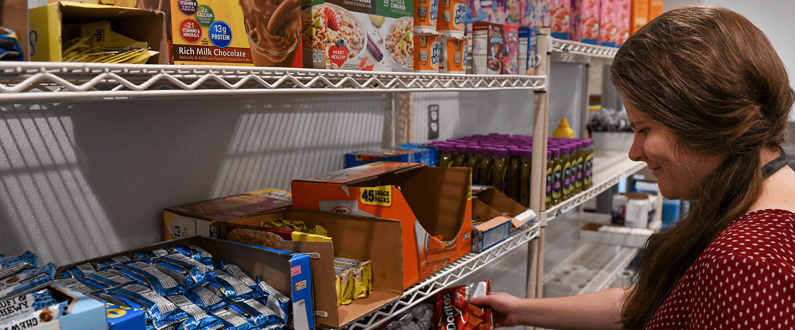

# 📄 Page Scan Report

> **URL:** https://tricities.wsu.edu/student-services/  
> **Captured:** 2026-02-16 22:12:42 UTC  
> **Status:** ✅ 200  

---

## 📑 Contents

- [Summary](#-summary)
- [Screenshots](#-screenshots)
- [Page Images](#-page-images)
- [Actions](#-actions)
- [Files](#-files)

---

## 📋 Summary

| Field | Value |
|-------|-------|
| URL | https://tricities.wsu.edu/student-services/ |
| Redirected To | https://tricities.wsu.edu/wp-content/uploads/Student-Services.png |
| Title | Student-Services.png (1680×700) |
| Status | ✅ 200 |
| HTML Size | 499 bytes |
| Screenshots | 1 (1.2 MB) |
| Images | 1 (645.5 KB) |
| Images Missing Alt | ⚠️ 1 |
| JS Errors | ✅ 0 |
| JS Warnings | 0 |
| Auth | none |
| Captured | 2026-02-16T22:12:42.4435042Z |

## 🔧 Actions

<strong>2 action(s) performed</strong>

- Screenshot #1: page-loaded (1.2 MB)
- Downloaded 1 images to /images/

## 📸 Screenshots

<table>
<tr>
<td align="center" width="50%">

 <strong>1. page-loaded</strong>
 1.2 MB
</td>
<td></td>
</tr>
</table>

## 🖼️ Page Images (1)

<strong>📋 Image Index</strong> — 1 images, 645.5 KB

| # | Image | Alt Text | Size |
|--:|-------|----------|-----:|
| 1 | [Student-Services.png](images/Student-Services.png) | ⚠️ *(missing)* | 645.5 KB |

<strong>🖼️ Gallery</strong>

<table>
<tr>
<td align="center" width="33%">

 Student-Services.png ⚠️
</td>
<td></td>
<td></td>
</tr>
</table>

⚠️ <strong>Images Missing Alt Text</strong> (1)

| Image | Source URL |
|-------|-----------|
| `Student-Services.png` | https://tricities.wsu.edu/wp-content/uploads/Student-Services.png |

## 📁 Files

| File | Description |
|------|-------------|
| `01-page-loaded.png` | page-loaded (1.2 MB) |
| `page.html` | Rendered HTML content |
| `metadata.json` | Machine-readable scan data |
| `errors.log` | JavaScript console errors |
| `warnings.log` | JavaScript console warnings |
| `info.log` | Navigation and timing details |
| `actions.log` | Interactions performed |
| `images/` | 1 page images (645.5 KB) |

---

*Generated by AccessibilityScanner (FreeTools) v1.0*
