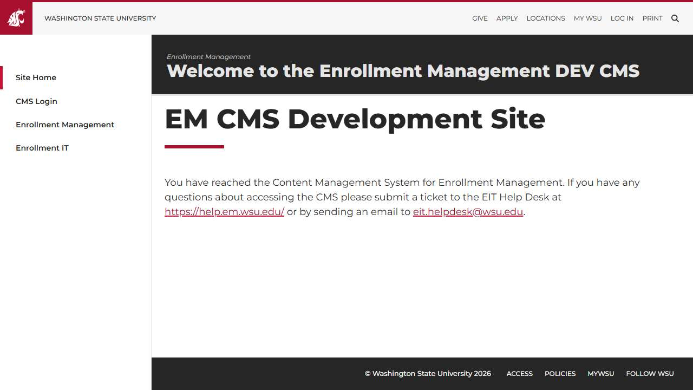
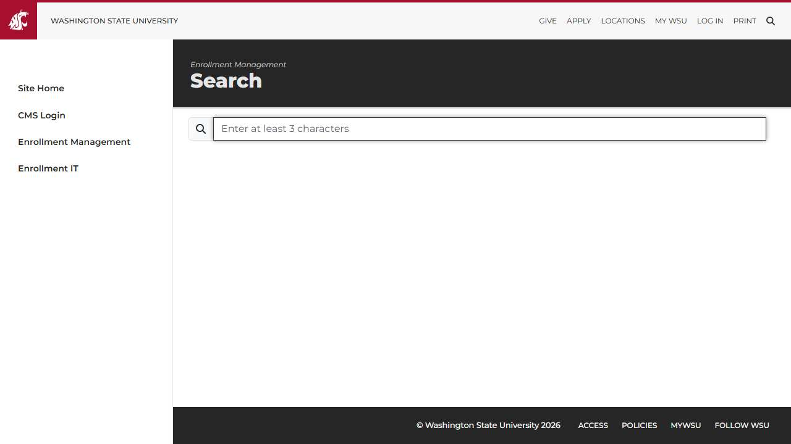

# 🌐 Site Report: https://umbracodev.em.wsu.edu/

> **Status:** ⚠️ 0/3 pages OK  
> **Folder:** `umbracodev-em-wsu-edu/`  

---

## 📋 Summary

```
Success Rate:  [░░░░░░░░░░░░░░░░░░░░░░░░░░░░░░] 0%
```

| Metric | Value |
|--------|-------|
| Pages Scanned | 3 |
| Pages Passed | ✅ 0 |
| Pages Failed | ❌ 3 |
| Total JS Errors | 0 |
| Total JS Warnings | 3 |
| Total Images | 0 (by URL) |
| Images Missing Alt | ✅ 0 |
| A11y Violations | ⚠️ 8 |
| 🔴 Critical | 2 |
| 🟠 Serious | 3 |
| 🟡 Moderate | 2 |
| 🔵 Minor | 1 |
| Total HTML | 1.3 MB |
| Total Screenshots | 211.0 KB |

## 🔒 SSL Certificate

| Field | Value |
|-------|-------|
| Subject | `CN=umbracodev.em.wsu.edu, O=Washington State University, S=Washington, C=US` |
| Issuer | `CN=InCommon RSA Server CA 2, O=Internet2, C=US` |
| Valid From | 2026-01-11 |
| Expires | 🟢 2027-01-12 (327 days) |
| Algorithm | sha256RSA |
| Key Size | 2048 bits |
| Thumbprint | `A09443294B230FB379CC26FBEA9A1D487EE7D8C3` |
| SANs | 1 domain(s) |

<details>
<summary><strong>Subject Alternative Names (1)</strong></summary>

| Domain | Type |
|--------|------|
| `umbracodev.em.wsu.edu` | 🏫 WSU |

</details>

## 📑 Pages

| Status | Page | HTTP | Title | 🔴 | 🟠 | 🟡 | 🔵 | A11y |
|:------:|------|:----:|-------|:--:|:--:|:--:|:--:|:----:|
| ❌ | [/](_root/report.md) | 0 | Enrollment Management | 1 | 1 |  |  | ⚠️ 2 |
| ❌ | [/search/](search/report.md) | 0 | Search \| Enrollment Management | 1 | 2 |  |  | ⚠️ 3 |
| ❌ | [/umbraco](umbraco/report.md) | 0 | Umbraco |  |  | 2 | 1 | ⚠️ 3 |

## 📸 Page Screenshots

Click any thumbnail to view the full page report.

<table>
<tr>
<td align="center" width="33%">
<a href="_root/report.md">

</a>
<br />❌ <code>/</code>
</td>
<td align="center" width="33%">
<a href="search/report.md">

</a>
<br />❌ <code>/search/</code>
</td>
<td align="center" width="33%">
<a href="umbraco/report.md">

</a>
<br />❌ <code>/umbraco</code>
</td>
</tr>
</table>

## ❌ Failed Pages

<details open>
<summary><strong>3 page(s) failed</strong></summary>

| Page | HTTP | Error |
|------|:----:|-------|
| [/](_root/report.md) | 0 | — |
| [/search/](search/report.md) | 0 | — |
| [/umbraco](umbraco/report.md) | 0 | — |

</details>

## ♿ Accessibility Summary

| Metric | Value |
|--------|-------|
| Pages with violations | 3/3 |
| Total violations | 8 |
| 🔴 Critical | 2 |
| 🟠 Serious | 3 |
| 🟡 Moderate | 2 |
| 🔵 Minor | 1 |

### Top 6 Issues

| # | Rule | Sev | Pages | Instances |
|--:|------|:---:|:-----:|:---------:|
| 1 | [aria-allowed-attr](../a11y-rules.md#aria-allowed-attr) | 🔴 | 2/3 | 2 |
| 2 | [skip-link](../a11y-rules.md#skip-link) | 🟡 | 1/3 | 1 |
| 3 | [landmark-one-main](../a11y-rules.md#landmark-one-main) | 🟡 | 1/3 | 1 |
| 4 | [landmark-nav](../a11y-rules.md#landmark-nav) | 🔵 | 1/3 | 1 |
| 5 | [link-name](../a11y-rules.md#link-name) | 🟠 | 2/3 | 2 |
| 6 | [label](../a11y-rules.md#label) | 🟠 | 1/3 | 1 |

---

*Generated by AccessibilityScanner (FreeTools) v1.0*
