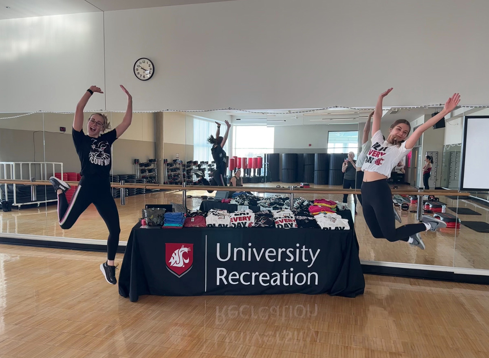
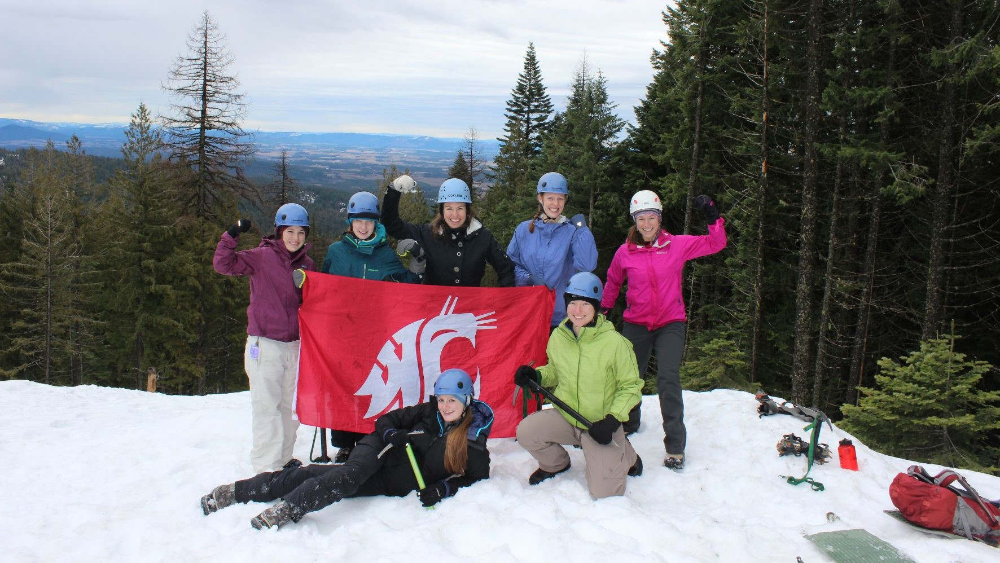
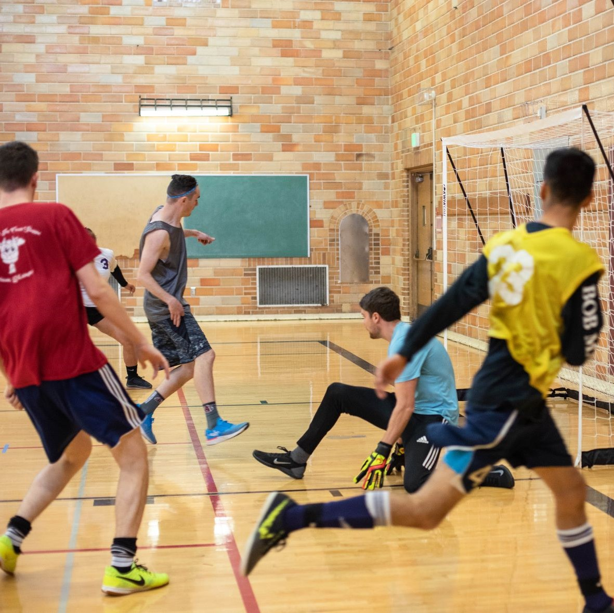

# 📄 Page Scan Report

> **URL:** https://urec.wsu.edu/  
> **Captured:** 2026-02-16 22:12:06 UTC  
> **Status:** ✅ 200  

---

## 📑 Contents

- [Summary](#-summary)
- [Screenshots](#-screenshots)
- [Page Images](#-page-images)
- [Actions](#-actions)
- [Files](#-files)

---

## 📋 Summary

| Field | Value |
|-------|-------|
| URL | https://urec.wsu.edu/ |
| Title | Home |
| Status | ✅ 200 |
| HTML Size | 95.6 KB |
| Screenshots | 1 (1.2 MB) |
| Images | 4 (7.0 MB) |
| Images Missing Alt | ✅ 0 |
| JS Errors | ✅ 0 |
| JS Warnings | 0 |
| Auth | none |
| Captured | 2026-02-16T22:12:06.1334857Z |

## 🔧 Actions

<strong>2 action(s) performed</strong>

- Screenshot #1: page-loaded (1.2 MB)
- Downloaded 4 images to /images/

## 📸 Screenshots

<table>
<tr>
<td align="center" width="50%">

 <strong>1. page-loaded</strong>
 1.2 MB
</td>
<td></td>
</tr>
</table>

## 🖼️ Page Images (4)

<strong>📋 Image Index</strong> — 4 images, 7.0 MB

| # | Image | Alt Text | Size |
|--:|-------|----------|-----:|
| 1 | [pick-2.jpg](images/pick-2.jpg) | Special Events | 290.2 KB |
| 2 | [6q6a1135.jpg](images/6q6a1135.jpg) | Fitness Classes | 6.0 MB |
| 3 | [summit-group-header.jpg](images/summit-group-header.jpg) | Outdoor Adventures | 417.9 KB |
| 4 | [fustal-square.jpg](images/fustal-square.jpg) | Intramural Sports | 327.3 KB |

<strong>🖼️ Gallery</strong>

<table>
<tr>
<td align="center" width="33%">

 pick-2.jpg
</td>
<td align="center" width="33%">

 6q6a1135.jpg
</td>
<td align="center" width="33%">

 summit-group-header.jpg
</td>
</tr>
<tr>
<td align="center" width="33%">

 fustal-square.jpg
</td>
<td></td>
<td></td>
</tr>
</table>

## 📁 Files

| File | Description |
|------|-------------|
| `01-page-loaded.png` | page-loaded (1.2 MB) |
| `page.html` | Rendered HTML content |
| `metadata.json` | Machine-readable scan data |
| `errors.log` | JavaScript console errors |
| `warnings.log` | JavaScript console warnings |
| `info.log` | Navigation and timing details |
| `actions.log` | Interactions performed |
| `images/` | 4 page images (7.0 MB) |

---

*Generated by AccessibilityScanner (FreeTools) v1.0*
