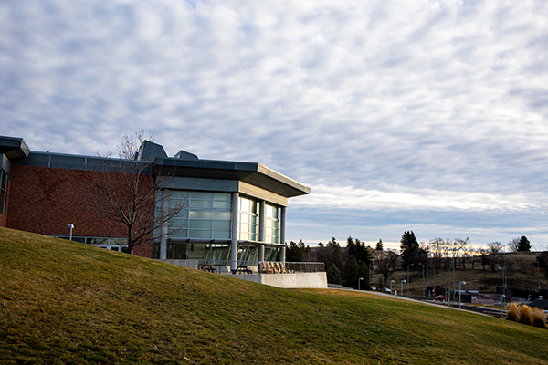
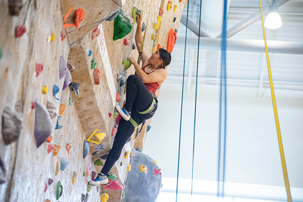
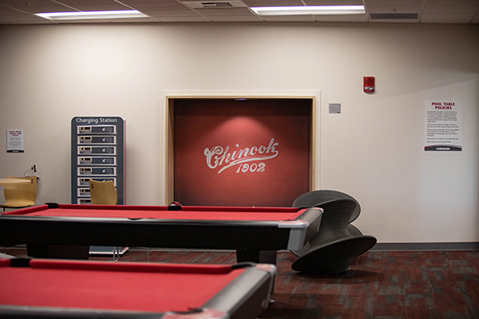
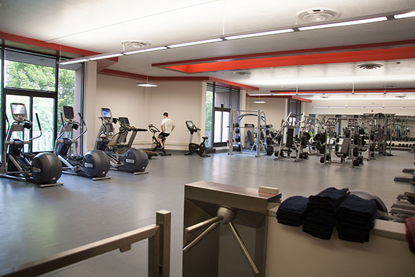
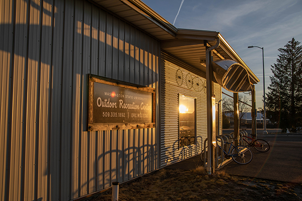
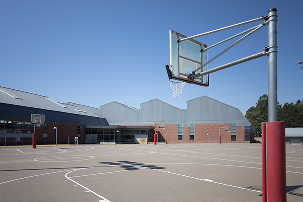
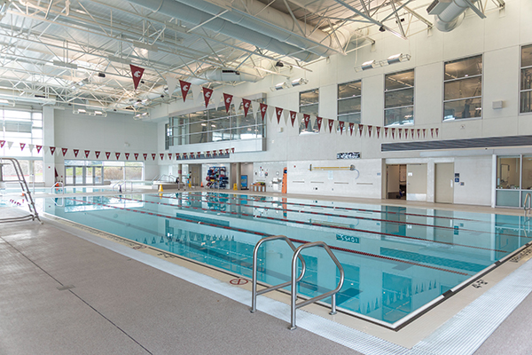
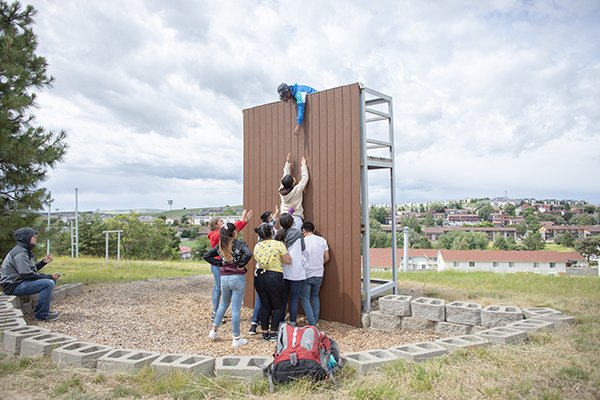
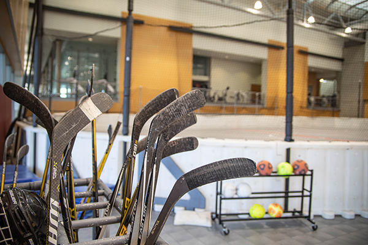

# 📄 Page Scan Report

> **URL:** https://urec.wsu.edu/facilities/  
> **Captured:** 2026-02-16 22:12:12 UTC  
> **Status:** ✅ 200  

---

## 📑 Contents

- [Summary](#-summary)
- [Screenshots](#-screenshots)
- [Page Images](#-page-images)
- [Actions](#-actions)
- [Files](#-files)

---

## 📋 Summary

| Field | Value |
|-------|-------|
| URL | https://urec.wsu.edu/facilities/ |
| Title | Locations & Facilities |
| Status | ✅ 200 |
| HTML Size | 89.1 KB |
| Screenshots | 1 (1.7 MB) |
| Images | 9 (1.8 MB) |
| Images Missing Alt | ⚠️ 9 |
| JS Errors | ✅ 0 |
| JS Warnings | 0 |
| Auth | none |
| Captured | 2026-02-16T22:12:12.8937140Z |

## 🔧 Actions

<strong>2 action(s) performed</strong>

- Screenshot #1: page-loaded (1.7 MB)
- Downloaded 9 images to /images/

## 📸 Screenshots

<table>
<tr>
<td align="center" width="50%">

 <strong>1. page-loaded</strong>
 1.7 MB
</td>
<td></td>
</tr>
</table>

## 🖼️ Page Images (9)

<strong>📋 Image Index</strong> — 9 images, 1.8 MB

| # | Image | Alt Text | Size |
|--:|-------|----------|-----:|
| 1 | [locations-and-facilities-page-src.jpg](images/locations-and-facilities-page-src.jpg) | ⚠️ *(missing)* | 222.2 KB |
| 2 | [locations-and-facilities-page-climbing-wall-content-card.jpg](images/locations-and-facilities-page-climbing-wall-content-card.jpg) | ⚠️ *(missing)* | 195.7 KB |
| 3 | [locations-and-facilities-page-chinook.jpg](images/locations-and-facilities-page-chinook.jpg) | ⚠️ *(missing)* | 150.2 KB |
| 4 | [locations-and-facilities-page-stephenson-fitness-center.jpg](images/locations-and-facilities-page-stephenson-fitness-center.jpg) | ⚠️ *(missing)* | 203.3 KB |
| 5 | [locations-and-facilities-page-outdoor-recreation-center.jpg](images/locations-and-facilities-page-outdoor-recreation-center.jpg) | ⚠️ *(missing)* | 242.3 KB |
| 6 | [locations-and-facilities-page-outdoor-facilites.jpg](images/locations-and-facilities-page-outdoor-facilites.jpg) | ⚠️ *(missing)* | 154.8 KB |
| 7 | [_q6a5335.jpg](images/_q6a5335.jpg) | ⚠️ *(missing)* | 255.6 KB |
| 8 | [locations-and-facilities-page-challenge.jpg](images/locations-and-facilities-page-challenge.jpg) | ⚠️ *(missing)* | 248.5 KB |
| 9 | [locations-and-facilities-page-facility-reservations.jpg](images/locations-and-facilities-page-facility-reservations.jpg) | ⚠️ *(missing)* | 213.3 KB |

<strong>🖼️ Gallery</strong>

<table>
<tr>
<td align="center" width="33%">

 locations-and-facilities-page-src.jpg ⚠️
</td>
<td align="center" width="33%">

 locations-and-facilities-page-climbing-wall-content-card.jpg ⚠️
</td>
<td align="center" width="33%">

 locations-and-facilities-page-chinook.jpg ⚠️
</td>
</tr>
<tr>
<td align="center" width="33%">

 locations-and-facilities-page-stephenson-fitness-center.jpg ⚠️
</td>
<td align="center" width="33%">

 locations-and-facilities-page-outdoor-recreation-center.jpg ⚠️
</td>
<td align="center" width="33%">

 locations-and-facilities-page-outdoor-facilites.jpg ⚠️
</td>
</tr>
<tr>
<td align="center" width="33%">

 _q6a5335.jpg ⚠️
</td>
<td align="center" width="33%">

 locations-and-facilities-page-challenge.jpg ⚠️
</td>
<td align="center" width="33%">

 locations-and-facilities-page-facility-reservations.jpg ⚠️
</td>
</tr>
</table>

⚠️ <strong>Images Missing Alt Text</strong> (9)

| Image | Source URL |
|-------|-----------|
| `locations-and-facilities-page-src.jpg` | https://urec.wsu.edu/media/g5vd5ohu/locations-and-facilities-page-src.jpg |
| `locations-and-facilities-page-climbing-wall-content-card.jpg` | https://urec.wsu.edu/media/4l4bcif0/locations-and-facilities-page-climbing-wa... |
| `locations-and-facilities-page-chinook.jpg` | https://urec.wsu.edu/media/5aonng25/locations-and-facilities-page-chinook.jpg |
| `locations-and-facilities-page-stephenson-fitness-center.jpg` | https://urec.wsu.edu/media/x4fndfdg/locations-and-facilities-page-stephenson-... |
| `locations-and-facilities-page-outdoor-recreation-center.jpg` | https://urec.wsu.edu/media/jfzdvx1h/locations-and-facilities-page-outdoor-rec... |
| `locations-and-facilities-page-outdoor-facilites.jpg` | https://urec.wsu.edu/media/muxhkykq/locations-and-facilities-page-outdoor-fac... |
| `_q6a5335.jpg` | https://urec.wsu.edu/media/brwpqi1h/_q6a5335.jpg |
| `locations-and-facilities-page-challenge.jpg` | https://urec.wsu.edu/media/jfebts4d/locations-and-facilities-page-challenge.jpg |
| `locations-and-facilities-page-facility-reservations.jpg` | https://urec.wsu.edu/media/l0wn1xgp/locations-and-facilities-page-facility-re... |

## 📁 Files

| File | Description |
|------|-------------|
| `01-page-loaded.png` | page-loaded (1.7 MB) |
| `page.html` | Rendered HTML content |
| `metadata.json` | Machine-readable scan data |
| `errors.log` | JavaScript console errors |
| `warnings.log` | JavaScript console warnings |
| `info.log` | Navigation and timing details |
| `actions.log` | Interactions performed |
| `images/` | 9 page images (1.8 MB) |

---

*Generated by AccessibilityScanner (FreeTools) v1.0*
