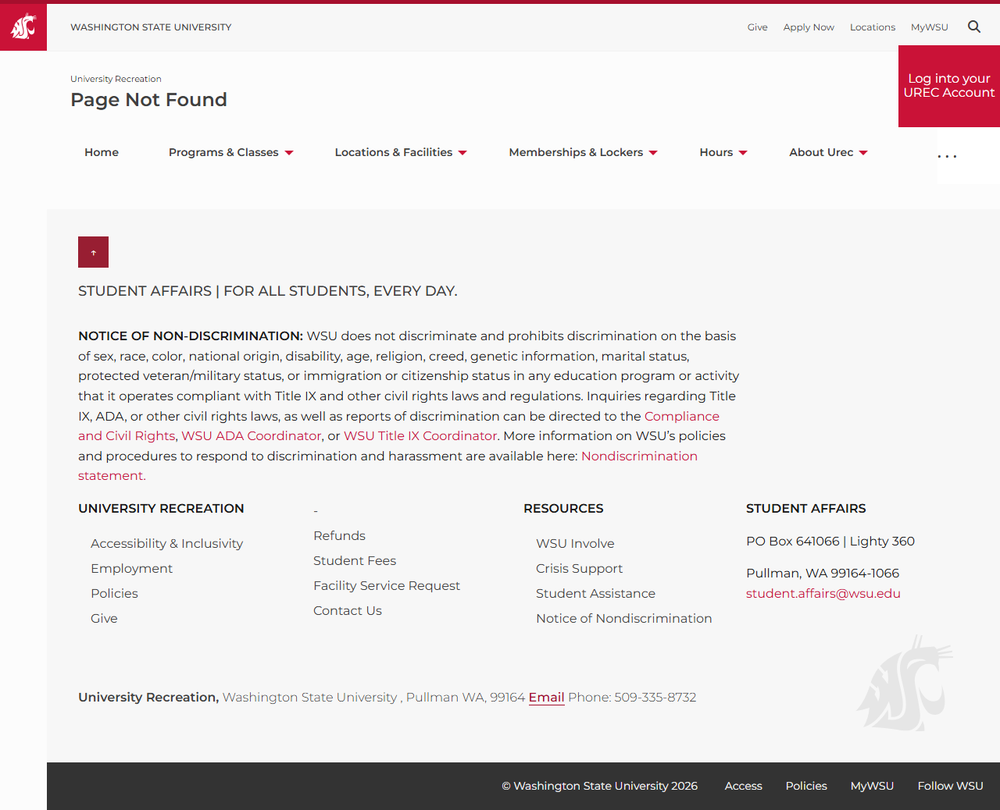

# 📄 Page Scan Report

> **URL:** https://urec.wsu.edu/programs/  
> **Captured:** 2026-02-16 22:12:18 UTC  
> **Status:** ❌ 404  

---

## 📑 Contents

- [Summary](#-summary)
- [Screenshots](#-screenshots)
- [Page Images](#-page-images)
- [JavaScript Errors](#-javascript-errors)
- [Actions](#-actions)
- [Files](#-files)

---

## 📋 Summary

| Field | Value |
|-------|-------|
| URL | https://urec.wsu.edu/programs/ |
| Title | Page Not Found |
| Status | ❌ 404 |
| HTML Size | 67.8 KB |
| Screenshots | 1 (120.7 KB) |
| Images | 0 (0 bytes) |
| Images Missing Alt | ✅ 0 |
| JS Errors | 🔴 1 |
| JS Warnings | 0 |
| Auth | none |
| Captured | 2026-02-16T22:12:18.1662302Z |

## 🔴 JavaScript Errors

<details>
<summary><strong>1 error(s) detected</strong></summary>

```
Failed to load resource: the server responded with a status of 404 ()
```

</details>

## 🔧 Actions

<details>
<summary><strong>2 action(s) performed</strong></summary>

- Screenshot #1: page-loaded (120.7 KB)
- No images found on page

</details>

## 📸 Screenshots

<table>
<tr>
<td align="center" width="50%">
<a href="01-page-loaded.png">

</a>
<br /><strong>1. page-loaded</strong>
<br /><sub>120.7 KB</sub>
</td>
<td></td>
</tr>
</table>

## 🖼️ Page Images (0)

*No images found on page.*

## 📁 Files

| File | Description |
|------|-------------|
| `01-page-loaded.png` | page-loaded (120.7 KB) |
| `page.html` | Rendered HTML content |
| `metadata.json` | Machine-readable scan data |
| `errors.log` | JavaScript console errors |
| `warnings.log` | JavaScript console warnings |
| `info.log` | Navigation and timing details |
| `actions.log` | Interactions performed |

---

*Generated by AccessibilityScanner (FreeTools) v1.0*
