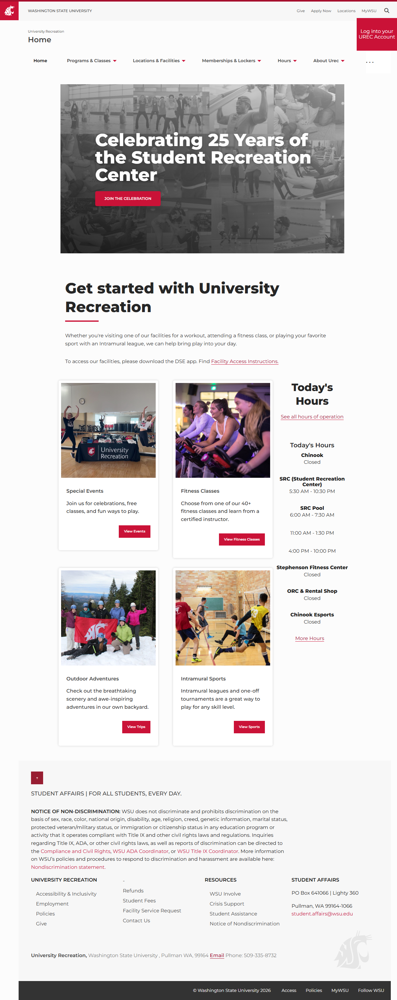
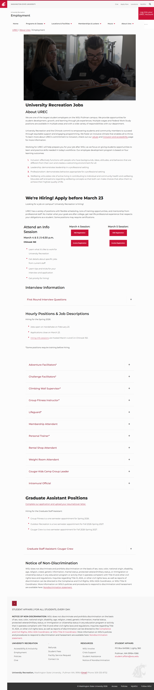

# 🌐 Site Report: https://urec.wsu.edu/

> **Status:** ⚠️ 7/8 pages OK  
> **Folder:** `urec-wsu-edu/`  

---

## 📋 Summary

```
Success Rate:  [██████████████████████████░░░░] 88%
```

| Metric | Value |
|--------|-------|
| Pages Scanned | 8 |
| Pages Passed | ✅ 7 |
| Pages Failed | ❌ 1 |
| Total JS Errors | 🔴 1 |
| Total JS Warnings | 1 |
| Total Images | 36 (51.6 MB) |
| Images Missing Alt | ⚠️ 13 |
| Total HTML | 843.7 KB |
| Total Screenshots | 7.3 MB |

## 📑 Pages

| Status | Page | HTTP | Title | JS Errors | Images | Missing Alt |
|:------:|------|:----:|-------|:---------:|:------:|:-----------:|
| ✅ | [/](_root/report.md) | 200 | Home | 0 | 4 | 0 |
| ✅ | [/employment/](employment/report.md) | 200 | Employment | 0 | 0 | 0 |
| ✅ | [/facilities/](facilities/report.md) | 200 | Locations & Facilities | 0 | 9 | ⚠️ 9 |
| ✅ | [/imsports/](imsports/report.md) | 200 | Intramurals | 0 | 3 | ⚠️ 3 |
| ✅ | [/membership/](membership/report.md) | 200 | Memberships & Lockers | 0 | 4 | 0 |
| ✅ | [/orc/](orc/report.md) | 200 | Outdoor Adventures | 0 | 15 | 0 |
| ❌ | [/programs/](programs/report.md) | 404 | Page Not Found | 🔴 1 | 0 | 0 |
| ✅ | [/sportclubs/](sportclubs/report.md) | 200 | Sport Clubs | 0 | 1 | ⚠️ 1 |

## 📸 Page Screenshots

Click any thumbnail to view the full page report.

<table>
<tr>
<td align="center" width="33%">
<a href="_root/report.md">

</a>
<br />✅ <code>/</code>
</td>
<td align="center" width="33%">
<a href="employment/report.md">

</a>
<br />✅ <code>/employment/</code>
</td>
<td align="center" width="33%">
<a href="facilities/report.md">

</a>
<br />✅ <code>/facilities/</code>
</td>
</tr>
<tr>
<td align="center" width="33%">
<a href="imsports/report.md">

</a>
<br />✅ <code>/imsports/</code>
</td>
<td align="center" width="33%">
<a href="membership/report.md">

</a>
<br />✅ <code>/membership/</code>
</td>
<td align="center" width="33%">
<a href="orc/report.md">

</a>
<br />✅ <code>/orc/</code>
</td>
</tr>
<tr>
<td align="center" width="33%">
<a href="programs/report.md">

</a>
<br />❌ <code>/programs/</code>
</td>
<td align="center" width="33%">
<a href="sportclubs/report.md">

</a>
<br />✅ <code>/sportclubs/</code>
</td>
<td></td>
</tr>
</table>

## ❌ Failed Pages

<details open>
<summary><strong>1 page(s) failed</strong></summary>

| Page | HTTP | Error |
|------|:----:|-------|
| [/programs/](programs/report.md) | 404 | — |

</details>

## 🔴 JavaScript Errors

<details>
<summary><strong>1 error(s) across 1 page(s)</strong></summary>

**/programs/** (1 errors)

```
Failed to load resource: the server responded with a status of 404 ()
```

</details>

---

*Generated by AccessibilityScanner (FreeTools) v1.0*
