# 🌐 Site Report: https://va.wsu.edu/

> **Status:** ⚠️ 0/17 pages OK  
> **Folder:** `va-wsu-edu/`  

---

## 📋 Summary

```
Success Rate:  [░░░░░░░░░░░░░░░░░░░░░░░░░░░░░░] 0%
```

| Metric | Value |
|--------|-------|
| Pages Scanned | 17 |
| Pages Passed | ✅ 0 |
| Pages Failed | ❌ 17 |
| Total JS Errors | 🔴 6 |
| Total JS Warnings | 18 |
| Total Images | 30 (by URL) |
| Images Missing Alt | ⚠️ 4 |
| A11y Violations | ⚠️ 31 |
| 🔴 Critical | 17 |
| 🟠 Serious | 11 |
| 🟡 Moderate | 3 |
| 🔵 Minor | 0 |
| Total HTML | 10.8 MB |
| Total Screenshots | 3.5 MB |

## 🔒 SSL Certificate

| Field | Value |
|-------|-------|
| Subject | `CN=cms.em.wsu.edu, O=Washington State University, S=Washington, C=US` |
| Issuer | `CN=InCommon RSA Server CA 2, O=Internet2, C=US` |
| Valid From | 2025-03-27 |
| Expires | 🟡 2026-03-28 (37 days) |
| Algorithm | sha384RSA |
| Key Size | 2048 bits |
| Thumbprint | `422B0FF3A6D1681FE831C7FDAFEF891649B07426` |
| SANs | 89 domain(s) |

<details>
<summary><strong>Subject Alternative Names (89)</strong></summary>

| Domain | Type |
|--------|------|
| `aas.wsu.edu` | 🏫 WSU |
| `admission.em.wsu.edu` | 🏫 WSU |
| `admissions.em.wsu.edu` | 🏫 WSU |
| `admissionsdocs.wsu.edu` | 🏫 WSU |
| `afd.wsu.edu` | 🏫 WSU |
| `alaskacougs.wsu.edu` | 🏫 WSU |
| `beanoc.wsu.edu` | 🏫 WSU |
| `boisecougs.wsu.edu` | 🏫 WSU |
| `cms.em.wsu.edu` | 🏫 WSU |
| `cmstest1.em.wsu.edu` | 🏫 WSU |
| `cougarinterest.wsu.edu` | 🏫 WSU |
| `cougcompass.wsu.edu` | 🏫 WSU |
| `cougnet.wsu.edu` | 🏫 WSU |
| `counselorbreakfast.wsu.edu` | 🏫 WSU |
| `counselornews.wsu.edu` | 🏫 WSU |
| `curriculum.registrar.wsu.edu` | 🏫 WSU |
| `curriculumchange.registrar.wsu.edu` | 🏫 WSU |
| `datarequest.wsu.edu` | 🏫 WSU |
| `dcms.em.wsu.edu` | 🏫 WSU |
| `dev.finaid.wsu.edu` | 🏫 WSU |
| `divisioninfo.wsu.edu` | 🏫 WSU |
| `easternwacougs.wsu.edu` | 🏫 WSU |
| `edit.em.wsu.edu` | 🏫 WSU |
| `em.wsu.edu` | 🏫 WSU |
| `emcms.wsu.edu` | 🏫 WSU |
| `emsummit.wsu.edu` | 🏫 WSU |
| `enrollmentverification.em.wsu.edu` | 🏫 WSU |
| `fcocwaitlist.wsu.edu` | 🏫 WSU |
| `ferpa.em.wsu.edu` | 🏫 WSU |
| `finaiddev.wsu.edu` | 🏫 WSU |
| `forms.financialaid.wsu.edu` | 🏫 WSU |
| `gocougs.em.wsu.edu` | 🏫 WSU |
| `graduation.wsu.edu` | 🏫 WSU |
| `graduations.wsu.edu` | 🏫 WSU |
| `hawaiicougs.wsu.edu` | 🏫 WSU |
| `icollege.wsu.edu` | 🏫 WSU |
| `idahocougs.wsu.edu` | 🏫 WSU |
| `kelso-longviewcougs.wsu.edu` | 🏫 WSU |
| `kingcountycougs.wsu.edu` | 🏫 WSU |
| `lacougs.wsu.edu` | 🏫 WSU |
| `lvp.wsu.edu` | 🏫 WSU |
| `message.wsu.edu` | 🏫 WSU |
| `mobileapply.wsu.edu` | 🏫 WSU |
| `myfcoc.wsu.edu` | 🏫 WSU |
| `nasc.wsu.edu` | 🏫 WSU |
| `ncaastudy.wsu.edu` | 🏫 WSU |
| `norcalcougs.wsu.edu` | 🏫 WSU |
| `onsite.wsu.edu` | 🏫 WSU |
| `oregoncougs.wsu.edu` | 🏫 WSU |
| `parents.wsu.edu` | 🏫 WSU |
| `pdxcougs.wsu.edu` | 🏫 WSU |
| `peninsulacougs.wsu.edu` | 🏫 WSU |
| `recmark.wsu.edu` | 🏫 WSU |
| `registrar-dev.em.wsu.edu` | 🏫 WSU |
| `registrar.schedule.wsu.edu` | 🏫 WSU |
| `registrar.wsu.edu` | 🏫 WSU |
| `residency.wsu.edu` | 🏫 WSU |
| `ro411.em.wsu.edu` | 🏫 WSU |
| `sandiegocougs.wsu.edu` | 🏫 WSU |
| `scholars.wsu.edu` | 🏫 WSU |
| `scholarships.wsu.edu` | 🏫 WSU |
| `sfs411.wsu.edu` | 🏫 WSU |
| `sfspartners.wsu.edu` | 🏫 WSU |
| `snokingcougs.wsu.edu` | 🏫 WSU |
| `socalcougs.wsu.edu` | 🏫 WSU |
| `submitsfsdocs.wsu.edu` | 🏫 WSU |
| `summerprograms.wsu.edu` | 🏫 WSU |
| `tacomacougs.wsu.edu` | 🏫 WSU |
| `transcript.wsu.edu` | 🏫 WSU |
| `transcripts.wsu.edu` | 🏫 WSU |
| `umbraco.em.wsu.edu` | 🏫 WSU |
| `va.wsu.edu` | 🏫 WSU |
| `vancouvercougs.wsu.edu` | 🏫 WSU |
| `www.boisecougs.wsu.edu` | 🏫 WSU |
| `www.cougarquest.wsu.edu` | 🏫 WSU |
| `www.diversityeducation.wsu.edu` | 🏫 WSU |
| `www.fall-alive.wsu.edu` | 🏫 WSU |
| `www.family.wsu.edu` | 🏫 WSU |
| `www.graduation.wsu.edu` | 🏫 WSU |
| `www.idahocougs.wsu.edu` | 🏫 WSU |
| `www.kingcountycougs.wsu.edu` | 🏫 WSU |
| `www.myfcoc.wsu.edu` | 🏫 WSU |
| `www.orientation-dev.wsu.edu` | 🏫 WSU |
| `www.registrar.wsu.edu` | 🏫 WSU |
| `www.spring-orientation.wsu.edu` | 🏫 WSU |
| `www.tausigma.wsu.edu` | 🏫 WSU |
| `www.transcript.wsu.edu` | 🏫 WSU |
| `www.transcripts.wsu.edu` | 🏫 WSU |
| `www.transfer-days.wsu.edu` | 🏫 WSU |

</details>

## 📑 Pages

| Status | Page | HTTP | Title | 🔴 | 🟠 | 🟡 | 🔵 | A11y |
|:------:|------|:----:|-------|:--:|:--:|:--:|:--:|:----:|
| ❌ | [/](_root/report.md) | 0 | WSU Veterans & Military Affiliated St... | 1 | 1 |  |  | ⚠️ 2 |
| ❌ | [/about/](about/report.md) | 0 | About \| WSU Veterans & Military Affi... | 1 |  |  |  | ⚠️ 1 |
| ❌ | [/announcements/](announcements/report.md) | 0 | Announcements \| WSU Veterans & Milit... | 1 |  | 1 |  | ⚠️ 2 |
| ❌ | [/apply/](apply/report.md) | 0 | Apply for VA Educational Benefits \| ... | 1 |  | 1 |  | ⚠️ 2 |
| ❌ | [/been-recalled/](been-recalled/report.md) | 0 | Been Recalled \| WSU Veterans & Milit... | 1 | 2 |  |  | ⚠️ 3 |
| ❌ | [/contacts/](contacts/report.md) | 0 | Contacts \| WSU Veterans & Military A... | 1 |  |  |  | ⚠️ 1 |
| ❌ | [/links/](links/report.md) | 0 | Links \| WSU Veterans & Military Affi... | 1 |  |  |  | ⚠️ 1 |
| ❌ | [/military-affiliated-student-benefits/](military-affiliated-student-benefits/report.md) | 0 | Military Affiliated Student Benefits ... | 1 |  |  |  | ⚠️ 1 |
| ❌ | [/pullman](pullman/report.md) | 0 | Pullman Veterans & Military Affiliate... | 1 | 5 |  |  | ⚠️ 6 |
| ❌ | [/pullman/announcements-current/](pullman_announcements-current/report.md) | 0 | Page Not Found \| Enrollment Management | 1 |  |  |  | ⚠️ 1 |
| ❌ | [/residency/](residency/report.md) | 0 | Residency for Tuition Purposes \| WSU... | 1 |  |  |  | ⚠️ 1 |
| ❌ | [/resources/](resources/report.md) | 0 | Resources \| WSU Veterans & Military ... | 1 |  |  |  | ⚠️ 1 |
| ❌ | [/timeline/](timeline/report.md) | 0 | Timeline \| WSU Veterans & Military A... | 1 |  |  |  | ⚠️ 1 |
| ❌ | [/tuition-assistance/](tuition-assistance/report.md) | 0 | Federal Tuition Assistance \| WSU Vet... | 1 |  |  |  | ⚠️ 1 |
| ❌ | [/tuition-waivers/](tuition-waivers/report.md) | 0 | Tuition Waivers \| WSU Veterans & Mil... | 1 | 3 |  |  | ⚠️ 4 |
| ❌ | [/va-benefits/](va-benefits/report.md) | 0 | VA Benefits \| WSU Veterans & Militar... | 1 |  | 1 |  | ⚠️ 2 |
| ❌ | [/wsu-rotc/](wsu-rotc/report.md) | 0 | WSU ROTC \| WSU Veterans & Military A... | 1 |  |  |  | ⚠️ 1 |

## 📸 Page Screenshots

Click any thumbnail to view the full page report.

<table>
<tr>
<td align="center" width="33%">
<a href="_root/report.md">
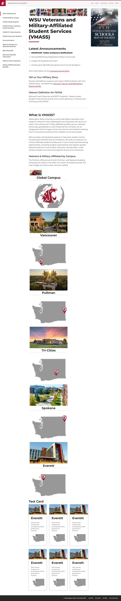
</a>
<br />❌ <code>/</code>
</td>
<td align="center" width="33%">
<a href="about/report.md">
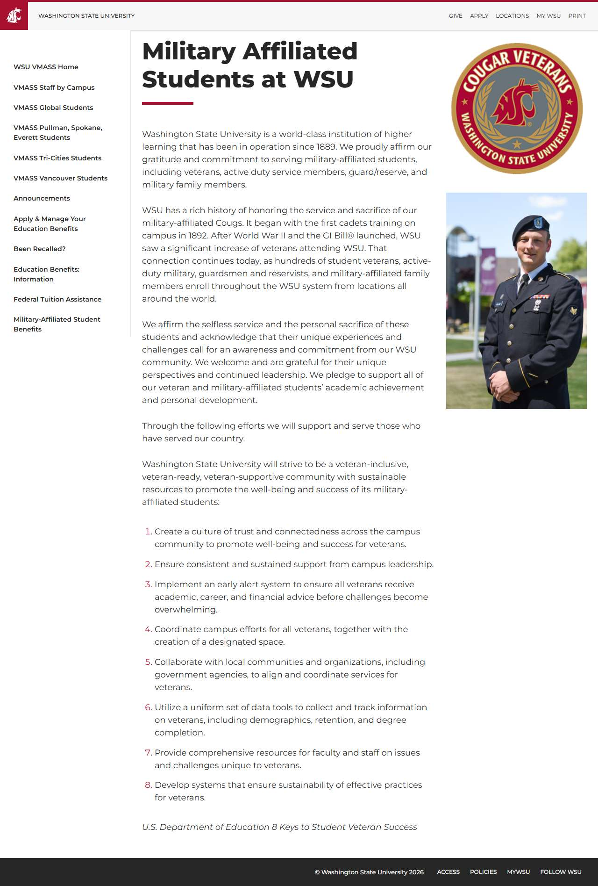
</a>
<br />❌ <code>/about/</code>
</td>
<td align="center" width="33%">
<a href="announcements/report.md">
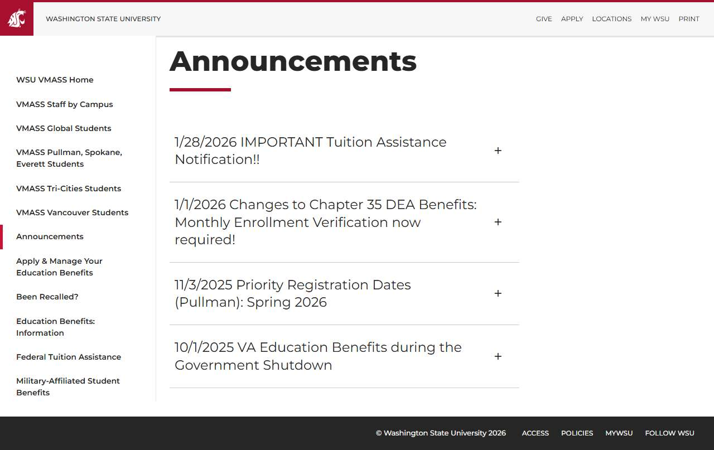
</a>
<br />❌ <code>/announcements/</code>
</td>
</tr>
<tr>
<td align="center" width="33%">
<a href="apply/report.md">
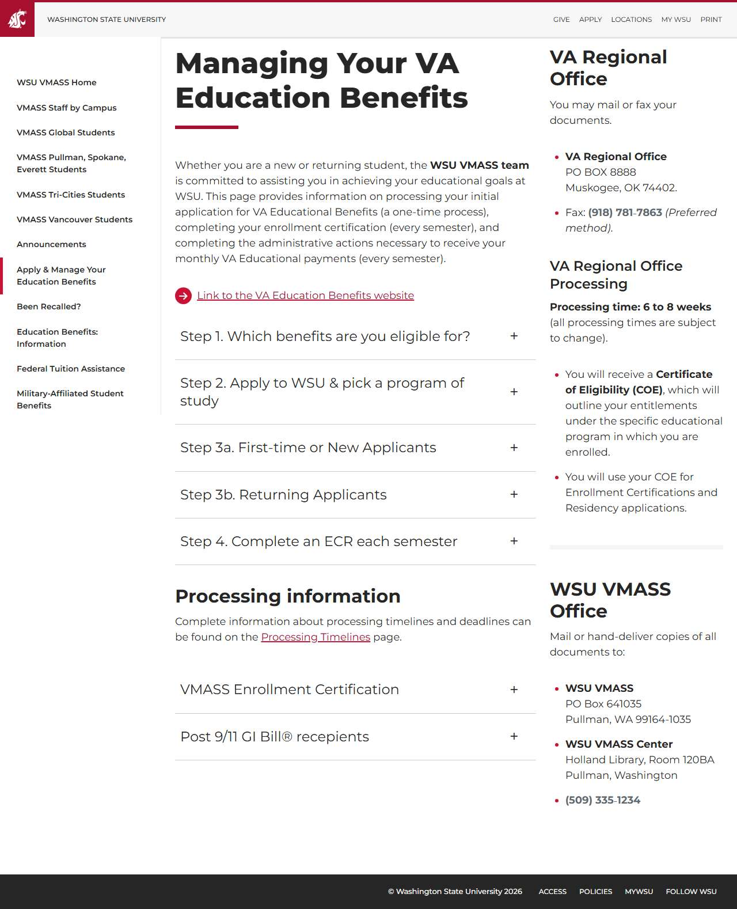
</a>
<br />❌ <code>/apply/</code>
</td>
<td align="center" width="33%">
<a href="been-recalled/report.md">
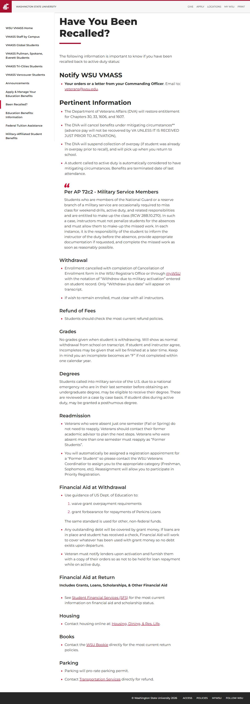
</a>
<br />❌ <code>/been-recalled/</code>
</td>
<td align="center" width="33%">
<a href="contacts/report.md">
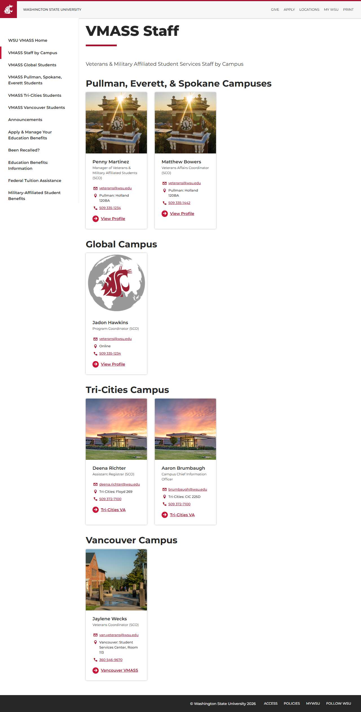
</a>
<br />❌ <code>/contacts/</code>
</td>
</tr>
<tr>
<td align="center" width="33%">
<a href="links/report.md">
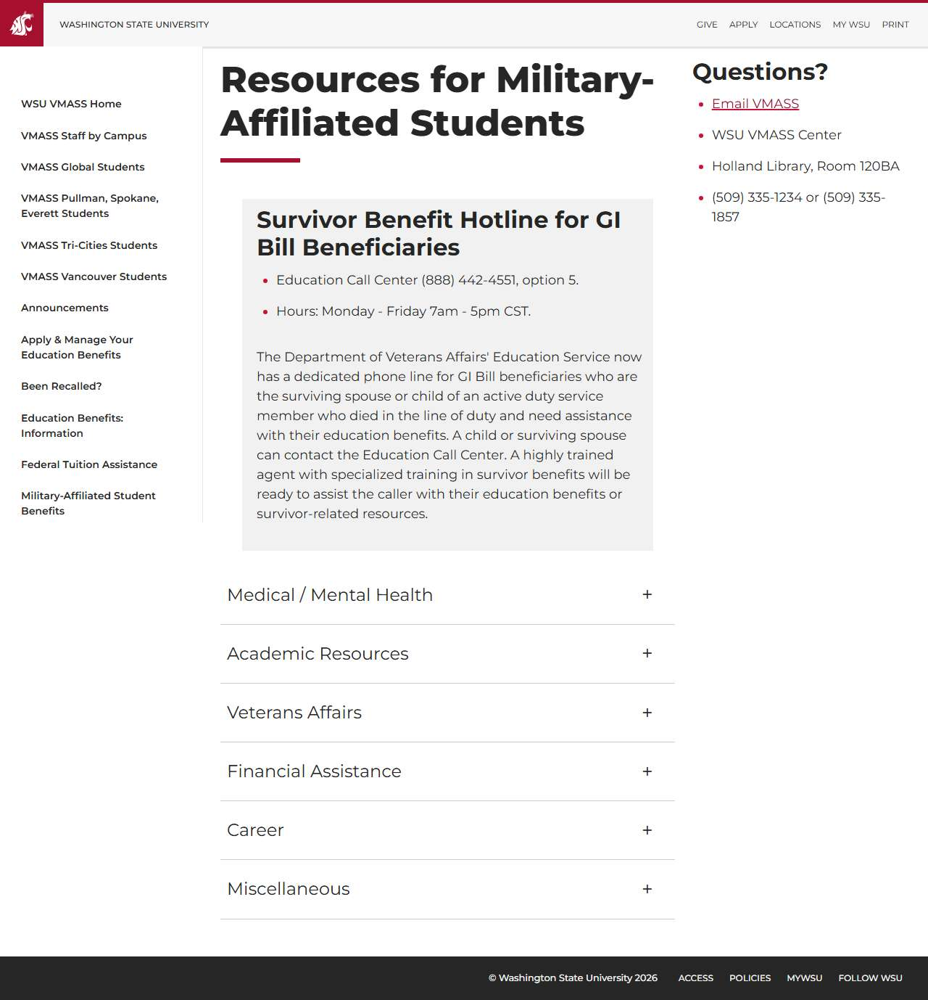
</a>
<br />❌ <code>/links/</code>
</td>
<td align="center" width="33%">
<a href="military-affiliated-student-benefits/report.md">
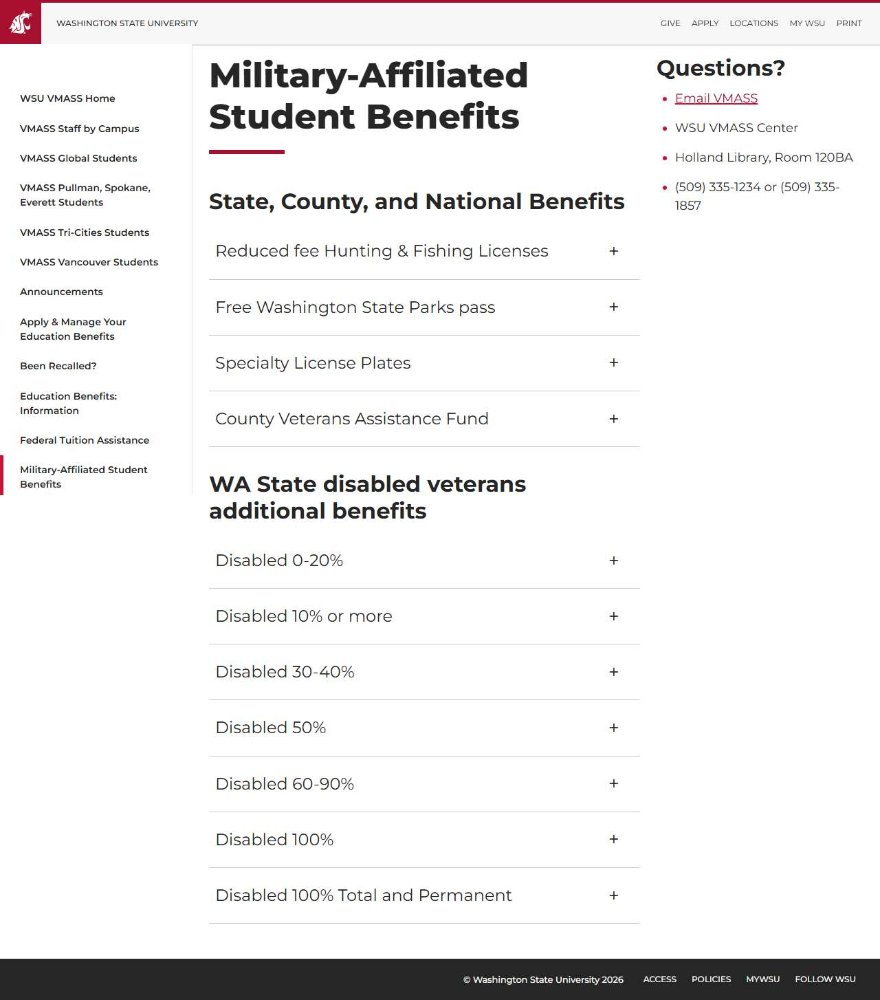
</a>
<br />❌ <code>/military-affiliated-student-benefits/</code>
</td>
<td align="center" width="33%">
<a href="pullman/report.md">
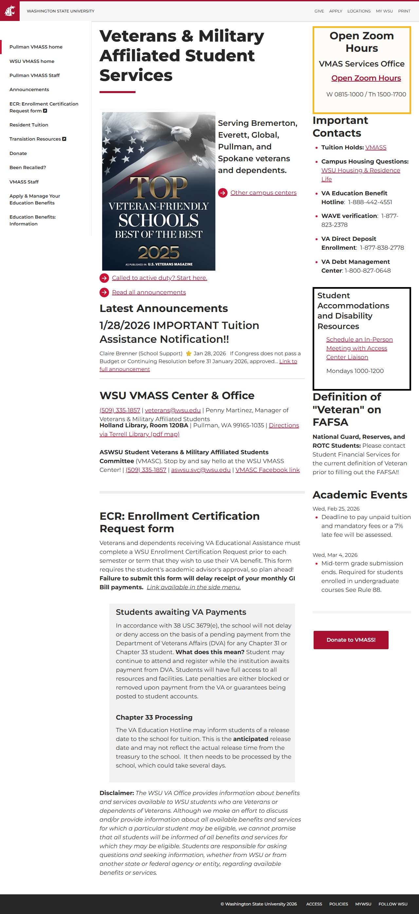
</a>
<br />❌ <code>/pullman</code>
</td>
</tr>
<tr>
<td align="center" width="33%">
<a href="pullman_announcements-current/report.md">

</a>
<br />❌ <code>/pullman/announcements-current/</code>
</td>
<td align="center" width="33%">
<a href="residency/report.md">
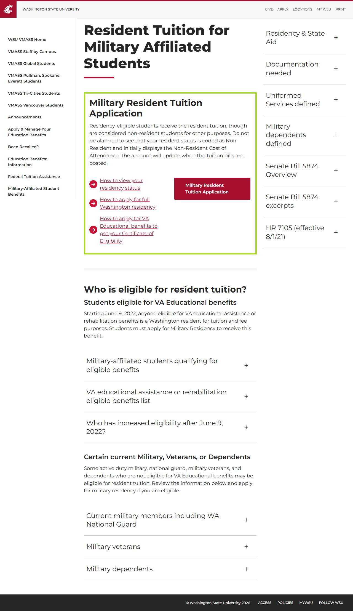
</a>
<br />❌ <code>/residency/</code>
</td>
<td align="center" width="33%">
<a href="resources/report.md">
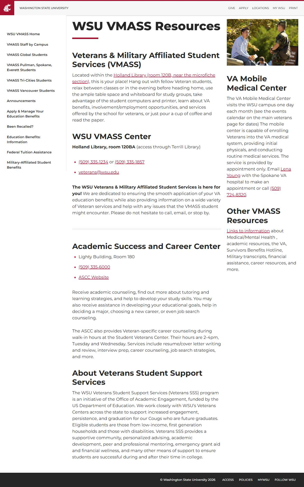
</a>
<br />❌ <code>/resources/</code>
</td>
</tr>
<tr>
<td align="center" width="33%">
<a href="timeline/report.md">

</a>
<br />❌ <code>/timeline/</code>
</td>
<td align="center" width="33%">
<a href="tuition-assistance/report.md">
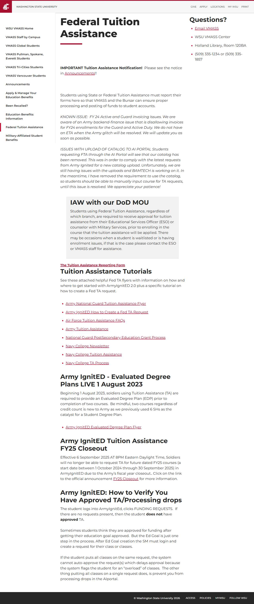
</a>
<br />❌ <code>/tuition-assistance/</code>
</td>
<td align="center" width="33%">
<a href="tuition-waivers/report.md">
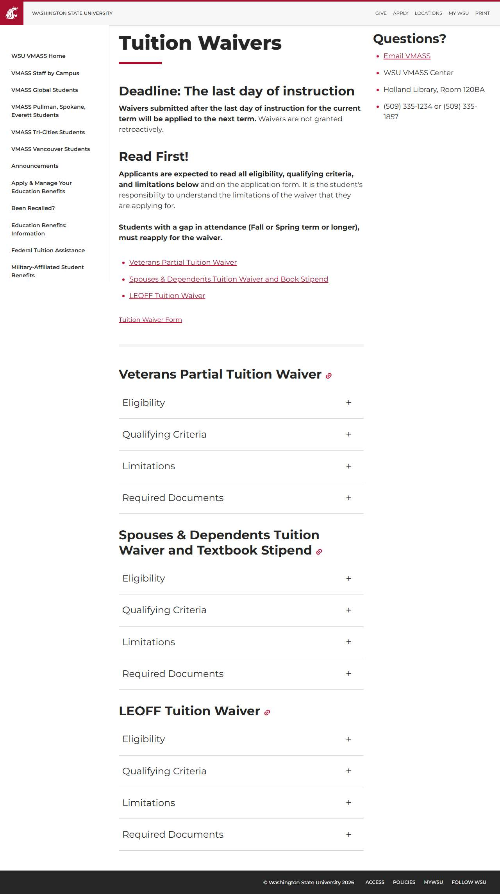
</a>
<br />❌ <code>/tuition-waivers/</code>
</td>
</tr>
<tr>
<td align="center" width="33%">
<a href="va-benefits/report.md">
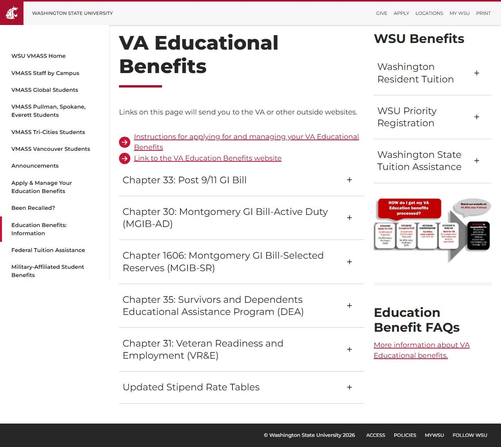
</a>
<br />❌ <code>/va-benefits/</code>
</td>
<td align="center" width="33%">
<a href="wsu-rotc/report.md">
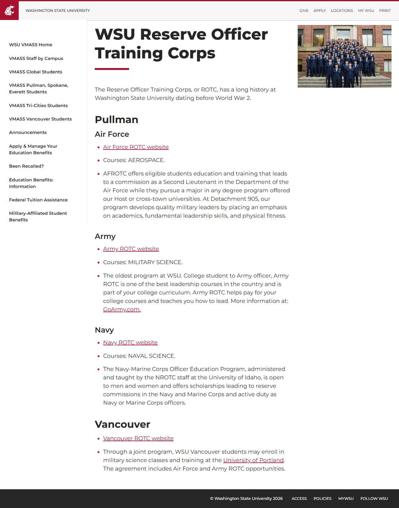
</a>
<br />❌ <code>/wsu-rotc/</code>
</td>
<td></td>
</tr>
</table>

## ❌ Failed Pages

<details open>
<summary><strong>17 page(s) failed</strong></summary>

| Page | HTTP | Error |
|------|:----:|-------|
| [/](_root/report.md) | 0 | — |
| [/about/](about/report.md) | 0 | — |
| [/announcements/](announcements/report.md) | 0 | — |
| [/apply/](apply/report.md) | 0 | — |
| [/been-recalled/](been-recalled/report.md) | 0 | — |
| [/contacts/](contacts/report.md) | 0 | — |
| [/links/](links/report.md) | 0 | — |
| [/military-affiliated-student-benefits/](military-affiliated-student-benefits/report.md) | 0 | — |
| [/pullman](pullman/report.md) | 0 | — |
| [/pullman/announcements-current/](pullman_announcements-current/report.md) | 0 | — |
| [/residency/](residency/report.md) | 0 | — |
| [/resources/](resources/report.md) | 0 | — |
| [/timeline/](timeline/report.md) | 0 | — |
| [/tuition-assistance/](tuition-assistance/report.md) | 0 | — |
| [/tuition-waivers/](tuition-waivers/report.md) | 0 | — |
| [/va-benefits/](va-benefits/report.md) | 0 | — |
| [/wsu-rotc/](wsu-rotc/report.md) | 0 | — |

</details>

## 🔴 JavaScript Errors

<details>
<summary><strong>6 error(s) across 2 page(s)</strong></summary>

**/pullman/announcements-current/** (5 errors)

```
Failed to load resource: the server responded with a status of 404 ()
Access to XMLHttpRequest at 'https://api.oneorigin.us/p-cs/ref?required=y' from origin 'https://va.wsu.edu' has been blocked by CORS policy: No 'Access-Control-Allow-Origin' header is present on the r...
Failed to load resource: net::ERR_FAILED
Access to XMLHttpRequest at 'https://searchassets.oneorigin.us/p-ss/2.6.0/search-bundle.min.css' from origin 'https://va.wsu.edu' has been blocked by CORS policy: No 'Access-Control-Allow-Origin' head...
Failed to load resource: net::ERR_FAILED
```

**/pullman** (1 errors)

```
Failed to load resource: net::ERR_NAME_NOT_RESOLVED
```

</details>

## ♿ Accessibility Summary

| Metric | Value |
|--------|-------|
| Pages with violations | 17/17 |
| Total violations | 31 |
| 🔴 Critical | 17 |
| 🟠 Serious | 11 |
| 🟡 Moderate | 3 |
| 🔵 Minor | 0 |

### Top 3 Issues

| # | Rule | Sev | Pages | Instances |
|--:|------|:---:|:-----:|:---------:|
| 1 | [aria-allowed-attr](../a11y-rules.md#aria-allowed-attr) | 🔴 | 17/17 | 17 |
| 2 | [link-name](../a11y-rules.md#link-name) | 🟠 | 4/17 | 11 |
| 3 | [heading-order](../a11y-rules.md#heading-order) | 🟡 | 3/17 | 3 |

---

*Generated by AccessibilityScanner (FreeTools) v1.0*
