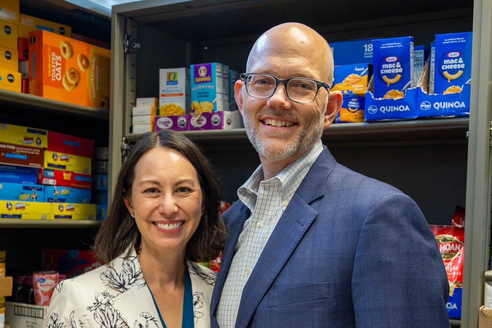
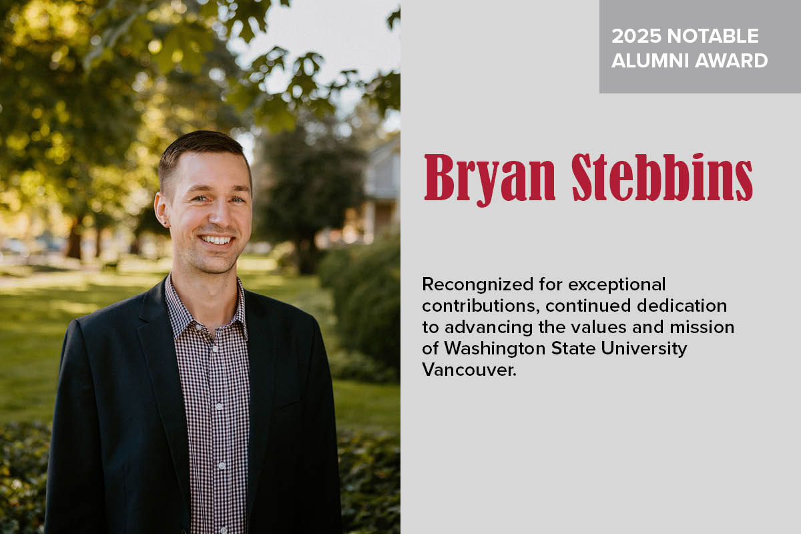

# 📄 Page Scan Report

> **URL:** https://vancouver.wsu.edu/  
> **Captured:** 2026-02-16 22:11:51 UTC  
> **Status:** ✅ 200  

---

## 📑 Contents

- [Summary](#-summary)
- [Screenshots](#-screenshots)
- [Page Images](#-page-images)
- [Actions](#-actions)
- [Files](#-files)

---

## 📋 Summary

| Field | Value |
|-------|-------|
| URL | https://vancouver.wsu.edu/ |
| Redirected To | https://www.vancouver.wsu.edu// |
| Title | Washington State University Vancouver - Vancouver, WA, USA |
| Status | ✅ 200 |
| HTML Size | 69.8 KB |
| Screenshots | 1 (1.3 MB) |
| Images | 16 (1.1 MB) |
| Images Missing Alt | ✅ 0 |
| JS Errors | ✅ 0 |
| JS Warnings | 0 |
| Auth | none |
| Captured | 2026-02-16T22:11:51.5094359Z |

## 🔧 Actions

<strong>2 action(s) performed</strong>

- Screenshot #1: page-loaded (1.3 MB)
- Downloaded 16 images to /images/

## 📸 Screenshots

<table>
<tr>
<td align="center" width="50%">

 <strong>1. page-loaded</strong>
 1.3 MB
</td>
<td></td>
</tr>
</table>

## 🖼️ Page Images (16)

<strong>📋 Image Index</strong> — 16 images, 1.1 MB

| # | Image | Alt Text | Size |
|--:|-------|----------|-----:|
| 1 | [wsu-vancouver-horizontal-logo-rgb.svg](images/wsu-vancouver-horizontal-logo-rgb.svg) | WSU Vancouver home page | 6.8 KB |
| 2 | [wsu-vancouver-primary-logo-rgb.svg](images/wsu-vancouver-primary-logo-rgb.svg) | WSU Vancouver home page | 7.7 KB |
| 3 | [coug-head-white-900x900.png](images/coug-head-white-900x900.png) | WSU Cougar Head | 40.7 KB |
| 4 | [wsupattern-bg_2.png](images/wsupattern-bg_2.png) | WSU pattern background | 303.3 KB |
| 5 | [Student%20AmbassadorWSU-VancouverWSU-Vancouver.jpg](images/Student%20AmbassadorWSU-VancouverWSU-Vancouver.jpg) | Ambassadors sitting on library steps | 154.2 KB |
| 6 | [2026%20-%20Winter%20-%20Cougar%20Quarterly_28.jpg](images/2026%20-%20Winter%20-%20Cougar%20Quarterly_28.jpg) | Alumni Spotlight: Aaron and Jen Thorne | 96.6 KB |
| 7 | [Feature%20Images_19-2025-Feature.jpg](images/Feature%20Images_19-2025-Feature.jpg) | GivingTuesday matching gift supports ... | 131.2 KB |
| 8 | [Notable%20Alumni%20Award_01-WSU-Vancouver_0.jpg](images/Notable%20Alumni%20Award_01-WSU-Vancouver_0.jpg) | 2025 Notable Alumni Award Recipient: ... | 98.9 KB |
| 9 | [wsupattern-bg_3.png](images/wsupattern-bg_3.png) | WSU pattern background | 303.3 KB |
| 10 | [Facebook-white.svg](images/Facebook-white.svg) | WSU Vancouver Facebook profile | 1.1 KB |
| 11 | [instagram-white.svg](images/instagram-white.svg) | WSU Vancouver Instagram profile | 2.1 KB |
| 12 | [Youtube-white.svg](images/Youtube-white.svg) | WSU Vancouver YouTube profile | 1.0 KB |
| 13 | [Tiktok-white.svg](images/Tiktok-white.svg) | WSU Vancouver TikToc | 941 bytes |
| 14 | [Flickr-white.svg](images/Flickr-white.svg) | WSU Vancouver Flickr profile | 905 bytes |
| 15 | [Linkedin-white.svg](images/Linkedin-white.svg) | WSU Vancouver linkedin profile | 1.3 KB |
| 16 | [x-white-logo.svg](images/x-white-logo.svg) | WSU Vancouver Twitter profile | 565 bytes |

<strong>🖼️ Gallery</strong>

<table>
<tr>
<td align="center" width="33%">

 wsu-vancouver-horizontal-logo-rgb.svg
</td>
<td align="center" width="33%">

 wsu-vancouver-primary-logo-rgb.svg
</td>
<td align="center" width="33%">

 coug-head-white-900x900.png
</td>
</tr>
<tr>
<td align="center" width="33%">

 wsupattern-bg_2.png
</td>
<td align="center" width="33%">

 Student%20AmbassadorWSU-VancouverWSU-Vancouver.jpg
</td>
<td align="center" width="33%">

 2026%20-%20Winter%20-%20Cougar%20Quarterly_28.jpg
</td>
</tr>
<tr>
<td align="center" width="33%">

 Feature%20Images_19-2025-Feature.jpg
</td>
<td align="center" width="33%">

 Notable%20Alumni%20Award_01-WSU-Vancouver_0.jpg
</td>
<td align="center" width="33%">

 wsupattern-bg_3.png
</td>
</tr>
<tr>
<td align="center" width="33%">

 Facebook-white.svg
</td>
<td align="center" width="33%">

 instagram-white.svg
</td>
<td align="center" width="33%">

 Youtube-white.svg
</td>
</tr>
<tr>
<td align="center" width="33%">

 Tiktok-white.svg
</td>
<td align="center" width="33%">

 Flickr-white.svg
</td>
<td align="center" width="33%">

 Linkedin-white.svg
</td>
</tr>
<tr>
<td align="center" width="33%">

 x-white-logo.svg
</td>
<td></td>
<td></td>
</tr>
</table>

## 📁 Files

| File | Description |
|------|-------------|
| `01-page-loaded.png` | page-loaded (1.3 MB) |
| `page.html` | Rendered HTML content |
| `metadata.json` | Machine-readable scan data |
| `errors.log` | JavaScript console errors |
| `warnings.log` | JavaScript console warnings |
| `info.log` | Navigation and timing details |
| `actions.log` | Interactions performed |
| `images/` | 16 page images (1.1 MB) |

---

*Generated by AccessibilityScanner (FreeTools) v1.0*
