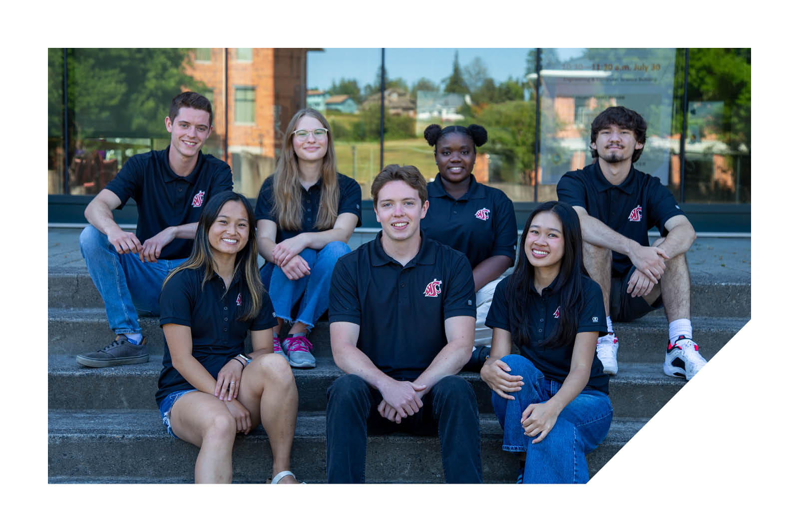
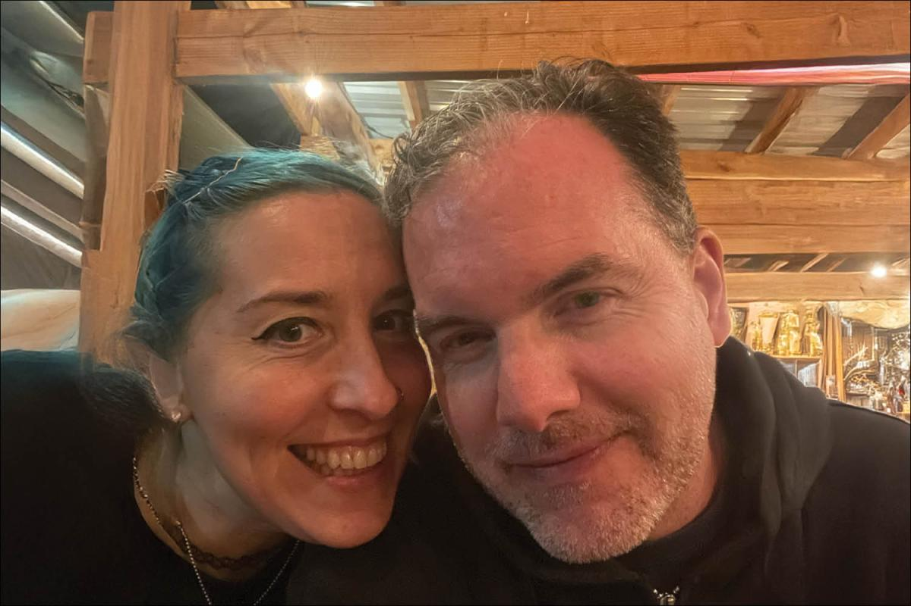

# Page Scan Report

| Field | Value |
|-------|-------|
| URL | https://vancouver.wsu.edu/ |
| Redirected To | https://www.vancouver.wsu.edu// |
| Title | Washington State University Vancouver - Vancouver, WA, USA |
| Status | ❌ 0 |
| HTML Size | 70.5 KB |
| Screenshots | 1 (506.9 KB) |
| Images | 12 (313.9 KB) |
| Images Missing Alt | 0 |
| JS Errors | 4 |
| JS Warnings | 0 |
| Auth | none |
| Captured | 2026-02-16T20:58:42.4756571Z |

## JavaScript Errors

- `Failed to load resource: net::ERR_SOCKET_NOT_CONNECTED`
- `Failed to load resource: net::ERR_SOCKET_NOT_CONNECTED`
- `Failed to load resource: net::ERR_SOCKET_NOT_CONNECTED`
- `Failed to load resource: net::ERR_SOCKET_NOT_CONNECTED`

## Actions

- Screenshot #1: page-loaded (506.9 KB)
- Downloaded 12 images to /images/

## Screenshots

### 1. page-loaded

## Page Images (12)

| # | Image | Alt Text | Size |
|---|-------|----------|------|
| 1 | [wsu-vancouver-horizontal-logo-rgb.svg](images/wsu-vancouver-horizontal-logo-rgb.svg) | WSU Vancouver home page | 6.8 KB |
| 2 | [wsu-vancouver-primary-logo-rgb.svg](images/wsu-vancouver-primary-logo-rgb.svg) | WSU Vancouver home page | 7.7 KB |
| 3 | [coug-head-white-900x900.png](images/coug-head-white-900x900.png) | WSU Cougar Head | 40.7 KB |
| 4 | [Student%20AmbassadorWSU-VancouverWSU-Vancouver.jpg](images/Student%20AmbassadorWSU-VancouverWSU-Vancouver.jpg) | Ambassadors sitting on library steps | 154.2 KB |
| 5 | [2026%20-%20Winter%20-%20Cougar%20Quarterly_28.jpg](images/2026%20-%20Winter%20-%20Cougar%20Quarterly_28.jpg) | Alumni Spotlight: Aaron and Jen Thorne | 96.6 KB |
| 6 | [Facebook-white.svg](images/Facebook-white.svg) | WSU Vancouver Facebook profile | 1.1 KB |
| 7 | [instagram-white.svg](images/instagram-white.svg) | WSU Vancouver Instagram profile | 2.1 KB |
| 8 | [Youtube-white.svg](images/Youtube-white.svg) | WSU Vancouver YouTube profile | 1.0 KB |
| 9 | [Tiktok-white.svg](images/Tiktok-white.svg) | WSU Vancouver TikToc | 941 bytes |
| 10 | [Flickr-white.svg](images/Flickr-white.svg) | WSU Vancouver Flickr profile | 905 bytes |
| 11 | [Linkedin-white.svg](images/Linkedin-white.svg) | WSU Vancouver linkedin profile | 1.3 KB |
| 12 | [x-white-logo.svg](images/x-white-logo.svg) | WSU Vancouver Twitter profile | 565 bytes |

### Gallery

## Files

- `01-page-loaded.png` — page-loaded (506.9 KB)
- `page.html` — rendered HTML content
- `metadata.json` — machine-readable scan data
- `errors.log` — JavaScript console errors
- `warnings.log` — JavaScript console warnings
- `info.log` — navigation and timing details
- `actions.log` — interactions performed on the page
- `images/` — 12 page images (313.9 KB)
