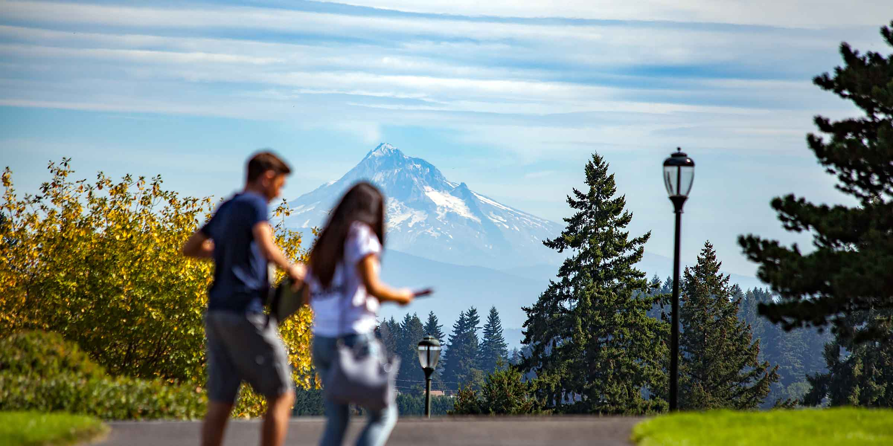
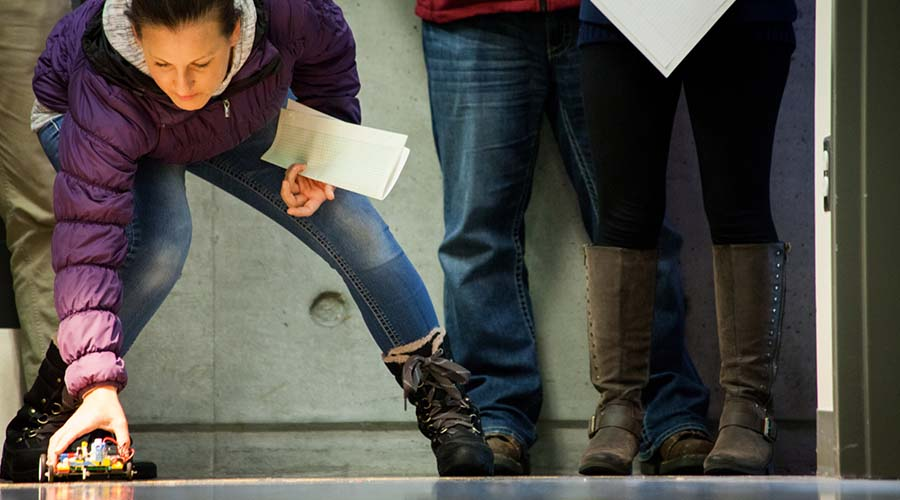
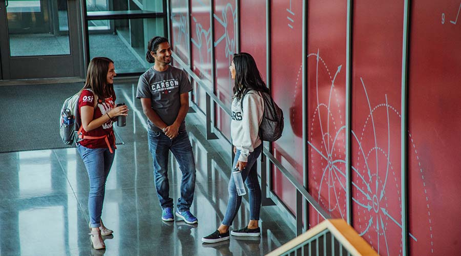
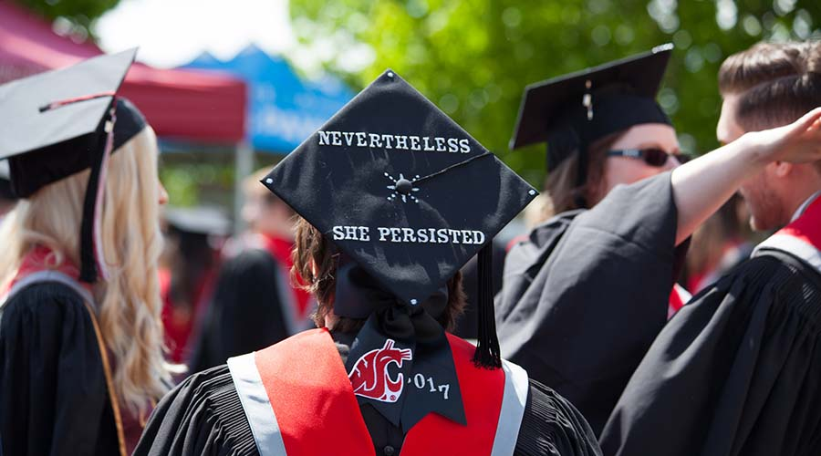
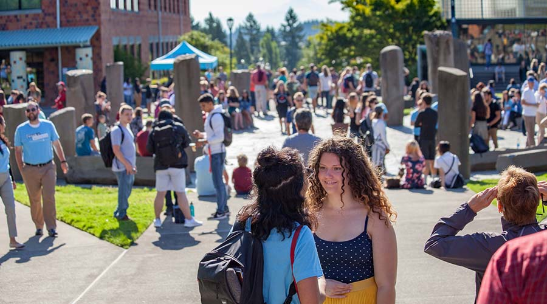

# Page Scan Report

| Field | Value |
|-------|-------|
| URL | https://vancouver.wsu.edu/admissions/ |
| Redirected To | https://studentaffairs.vancouver.wsu.edu/admissions |
| Title | Office of Admissions - Home - WSU Vancouver |
| Status | ❌ 0 |
| HTML Size | 45.4 KB |
| Screenshots | 1 (552.4 KB) |
| Images | 13 (528.9 KB) |
| Images Missing Alt | 6 |
| JS Errors | 0 |
| JS Warnings | 0 |
| Auth | none |
| Captured | 2026-02-16T21:00:20.2992238Z |

## Actions

- Screenshot #1: page-loaded (552.4 KB)
- Downloaded 13 images to /images/

## Screenshots

### 1. page-loaded

## Page Images (13)

| # | Image | Alt Text | Size |
|---|-------|----------|------|
| 1 | [wsu-vancouver-horizontal-logo-rgb.svg](images/wsu-vancouver-horizontal-logo-rgb.svg) | WSU Vancouver home page | 6.8 KB |
| 2 | [wsu-vancouver-primary-logo-rgb.svg](images/wsu-vancouver-primary-logo-rgb.svg) | WSU Vancouver home page | 7.7 KB |
| 3 | [hood-01-hero-2400x1200.jpg](images/hood-01-hero-2400x1200.jpg) | *(none)* | 172.2 KB |
| 4 | [solar-car-competition.jpg](images/solar-car-competition.jpg) | *(none)* | 60.4 KB |
| 5 | [students-ecs-stairs.jpg](images/students-ecs-stairs.jpg) | *(none)* | 68.9 KB |
| 6 | [giselle-900x750.jpg](images/giselle-900x750.jpg) | Giselle Gomez | 35.8 KB |
| 7 | [persistence-graduation-cap.jpg](images/persistence-graduation-cap.jpg) | *(none)* | 52.9 KB |
| 8 | [students-involved-900x500.jpg](images/students-involved-900x500.jpg) | *(none)* | 41.2 KB |
| 9 | [facebook-white.svg](images/facebook-white.svg) | WSU Vancouver Facebook profile | 1.1 KB |
| 10 | [twitter-white.svg](images/twitter-white.svg) | WSU Vancouver Twitter profile | 1.1 KB |
| 11 | [instagram-white.svg](images/instagram-white.svg) | WSU Vancouver Instagram profile | 2.1 KB |
| 12 | [youtube-white.svg](images/youtube-white.svg) | WSU Vancouver YouTube profile | 1.0 KB |
| 13 | [quad-fountain-conversation.jpg](images/quad-fountain-conversation.jpg) | *(none)* | 77.8 KB |

### Gallery

### ⚠️ Images Missing Alt Text (6)

- `hood-01-hero-2400x1200.jpg` — https://studentaffairs.vancouver.wsu.edu/files/hero/2018-11/hood-01-hero-2400x1200.jpg
- `solar-car-competition.jpg` — https://studentaffairs.vancouver.wsu.edu/files/2018-04/solar-car-competition.jpg
- `students-ecs-stairs.jpg` — https://studentaffairs.vancouver.wsu.edu/files/2018-04/students-ecs-stairs.jpg
- `persistence-graduation-cap.jpg` — https://studentaffairs.vancouver.wsu.edu/files/2018-04/persistence-graduation-cap.jpg
- `students-involved-900x500.jpg` — https://studentaffairs.vancouver.wsu.edu/files/2020-08/students-involved-900x500.jpg
- `quad-fountain-conversation.jpg` — https://studentaffairs.vancouver.wsu.edu/files/2018-04/quad-fountain-conversation.jpg

## Files

- `01-page-loaded.png` — page-loaded (552.4 KB)
- `page.html` — rendered HTML content
- `metadata.json` — machine-readable scan data
- `errors.log` — JavaScript console errors
- `warnings.log` — JavaScript console warnings
- `info.log` — navigation and timing details
- `actions.log` — interactions performed on the page
- `images/` — 13 page images (528.9 KB)
