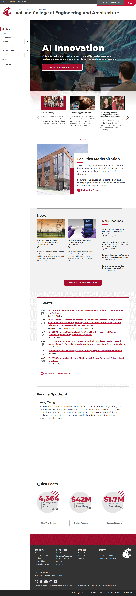

# Page Scan Report

| Field | Value |
|-------|-------|
| URL | https://vcea.wsu.edu/ |
| Title | Voiland College of Engineering and Architecture | Washington State University |
| Status | ❌ 0 |
| HTML Size | 253.6 KB |
| Screenshots | 1 (1.9 MB) |
| JS Errors | 4 |
| JS Warnings | 1 |
| Auth | none |
| Captured | 2026-02-16T20:10:26.1681195Z |

## JavaScript Errors

- `Failed to load resource: net::ERR_SOCKET_NOT_CONNECTED`
- `Failed to load resource: net::ERR_SOCKET_NOT_CONNECTED`
- `Failed to load resource: net::ERR_SOCKET_NOT_CONNECTED`
- `Failed to load resource: net::ERR_SOCKET_NOT_CONNECTED`

## Actions

- Screenshot #1: page-loaded (1.9 MB)

## Screenshots

### 1. page-loaded

## Files

- `01-page-loaded.png` — page-loaded (1.9 MB)
- `page.html` — rendered HTML content
- `metadata.json` — machine-readable scan data
- `errors.log` — JavaScript console errors
- `warnings.log` — JavaScript console warnings
- `info.log` — navigation and timing details
- `actions.log` — interactions performed on the page
