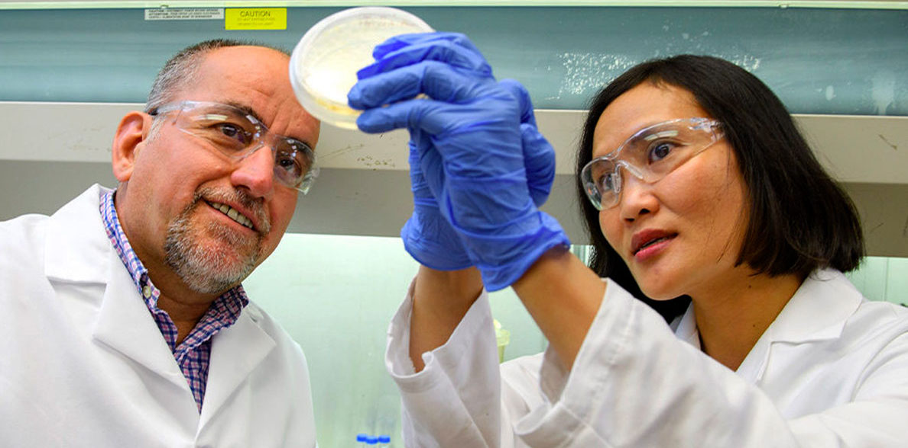
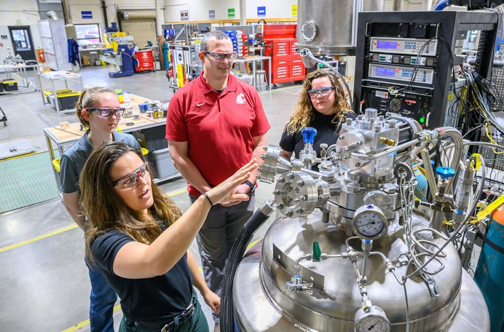
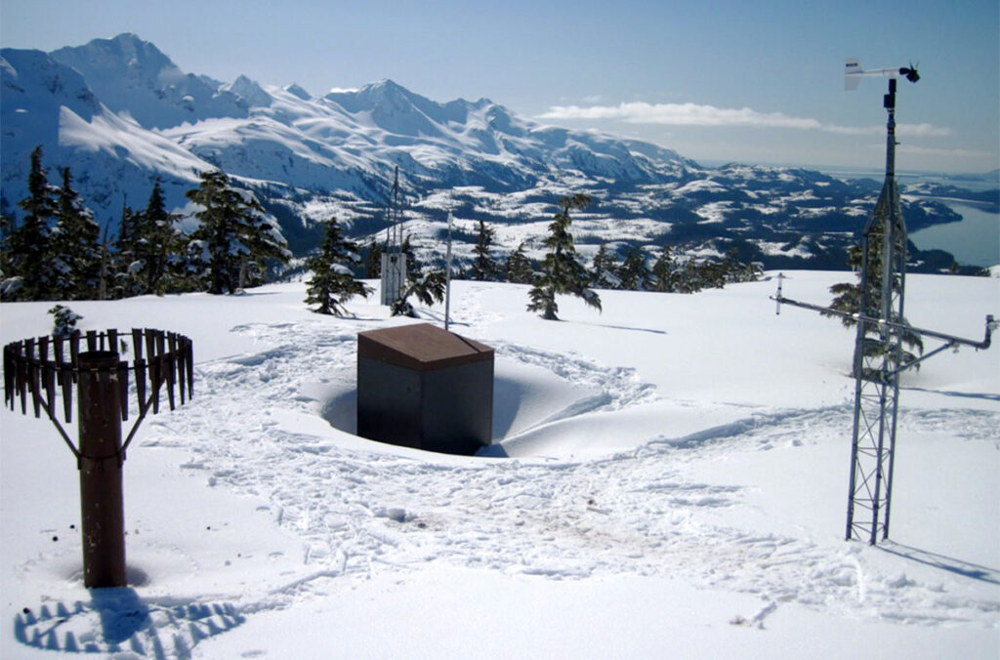

# Page Scan Report

| Field | Value |
|-------|-------|
| URL | https://vcea.wsu.edu/research/ |
| Title | Research | Voiland College of Engineering and Architecture | Washington State University |
| Status | ❌ 0 |
| HTML Size | 241.9 KB |
| Screenshots | 1 (1.5 MB) |
| Images | 7 (854.1 KB) |
| Images Missing Alt | 0 |
| JS Errors | 0 |
| JS Warnings | 0 |
| Auth | none |
| Captured | 2026-02-16T21:00:32.6760747Z |

## Actions

- Screenshot #1: page-loaded (1.5 MB)
- Downloaded 7 images to /images/

## Screenshots

### 1. page-loaded

## Page Images (7)

| # | Image | Alt Text | Size |
|---|-------|----------|------|
| 1 | [citrus-disease-bacteria-1188x792.jpg](images/citrus-disease-bacteria-1188x792.jpg) | Two scientists look at a bacterial cu... | 131.8 KB |
| 2 | [GRID-PHOTO-1024x676.jpg](images/GRID-PHOTO-1024x676.jpg) | Power lines spanning farm fields in W... | 157.6 KB |
| 3 | [gloves-holding-smartphone-and-glucose-monitor-1024x676.jpg](images/gloves-holding-smartphone-and-glucose-monitor-1024x676.jpg) | Gloved hands holding a smartphone and... | 78.7 KB |
| 4 | [rural-roadmap-for-AI-1024x676.jpg](images/rural-roadmap-for-AI-1024x676.jpg) | A composite featuring closeups of a s... | 75.9 KB |
| 5 | [HYPER_4529-USE-1024x676.jpg](images/HYPER_4529-USE-1024x676.jpg) | A professor and students look over eq... | 180.2 KB |
| 6 | [smart-home-Thicha-Satapitanon-1024x676.jpg](images/smart-home-Thicha-Satapitanon-1024x676.jpg) | A clinician looks at a computer while... | 90.8 KB |
| 7 | [snow-monitoring-station-on-Mount-Eyak-1024x676.jpg](images/snow-monitoring-station-on-Mount-Eyak-1024x676.jpg) | A snow monitoring station in Alaska. | 139.0 KB |

### Gallery

## Files

- `01-page-loaded.png` — page-loaded (1.5 MB)
- `page.html` — rendered HTML content
- `metadata.json` — machine-readable scan data
- `errors.log` — JavaScript console errors
- `warnings.log` — JavaScript console warnings
- `info.log` — navigation and timing details
- `actions.log` — interactions performed on the page
- `images/` — 7 page images (854.1 KB)
