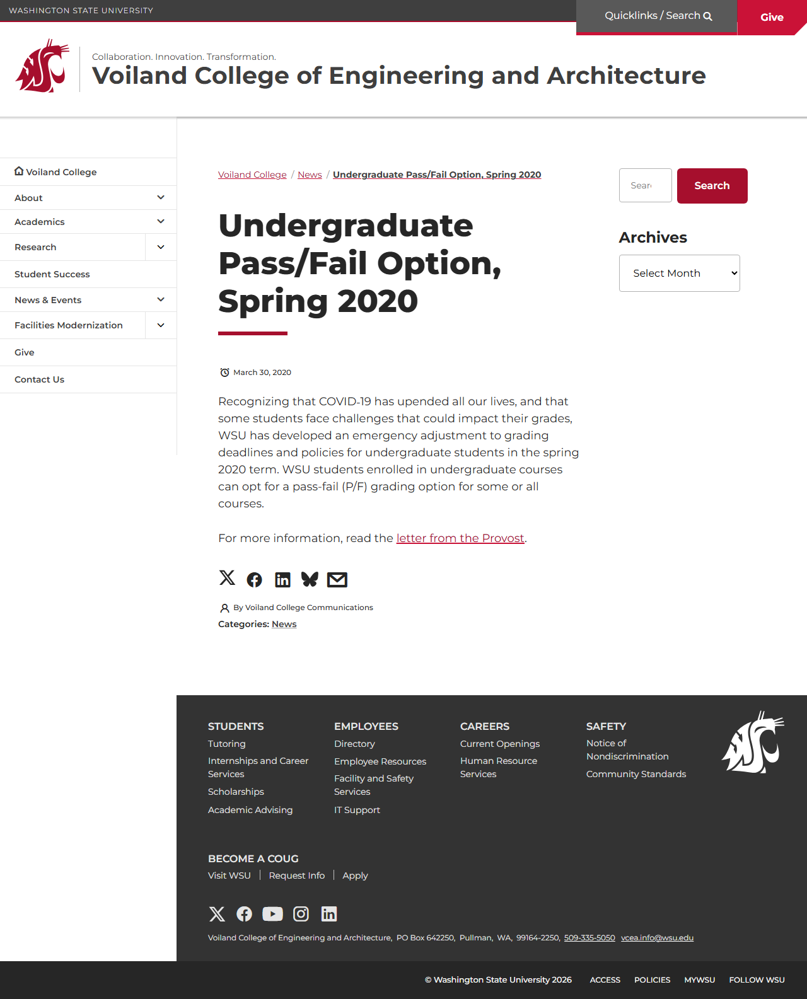

# Page Scan Report

| Field | Value |
|-------|-------|
| URL | https://vcea.wsu.edu/undergraduate/ |
| Redirected To | https://vcea.wsu.edu/2020/03/30/undergraduate-pass-fail-option-spring-2020/ |
| Title | Undergraduate Pass/Fail Option, Spring 2020 | Voiland College of Engineering and Architecture | Washington State University |
| Status | ❌ 0 |
| HTML Size | 229.3 KB |
| Screenshots | 1 (162.0 KB) |
| Images | 0 (0 bytes) |
| Images Missing Alt | 0 |
| JS Errors | 0 |
| JS Warnings | 0 |
| Auth | none |
| Captured | 2026-02-16T21:00:04.6170641Z |

## Actions

- Screenshot #1: page-loaded (162.0 KB)
- No images found on page

## Screenshots

### 1. page-loaded

## Page Images (0)

*No images found on page.*

## Files

- `01-page-loaded.png` — page-loaded (162.0 KB)
- `page.html` — rendered HTML content
- `metadata.json` — machine-readable scan data
- `errors.log` — JavaScript console errors
- `warnings.log` — JavaScript console warnings
- `info.log` — navigation and timing details
- `actions.log` — interactions performed on the page
