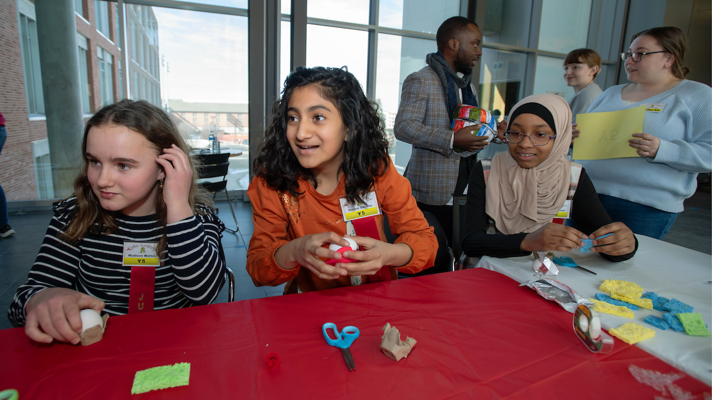
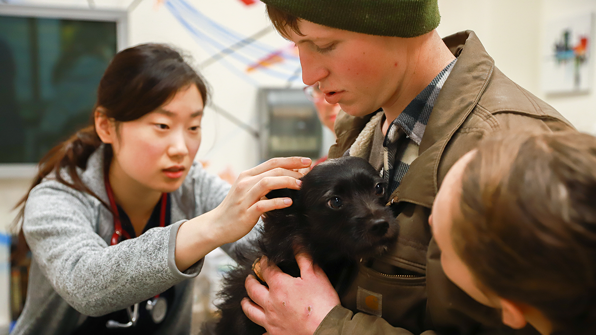

# 📄 Page Scan Report

> **URL:** https://vetmed.wsu.edu/  
> **Captured:** 2026-02-16 22:11:23 UTC  
> **Status:** ✅ 200  

---

## 📑 Contents

- [Summary](#-summary)
- [Screenshots](#-screenshots)
- [Page Images](#-page-images)
- [Actions](#-actions)
- [Files](#-files)

---

## 📋 Summary

| Field | Value |
|-------|-------|
| URL | https://vetmed.wsu.edu/ |
| Title | College of Veterinary Medicine | Washington State University |
| Status | ✅ 200 |
| HTML Size | 271.1 KB |
| Screenshots | 1 (1.1 MB) |
| Images | 13 (3.9 MB) |
| Images Missing Alt | ✅ 0 |
| JS Errors | ✅ 0 |
| JS Warnings | 1 |
| Auth | none |
| Captured | 2026-02-16T22:11:23.9175697Z |

## 🔧 Actions

<strong>2 action(s) performed</strong>

- Screenshot #1: page-loaded (1.1 MB)
- Downloaded 13 images to /images/

## 📸 Screenshots

<table>
<tr>
<td align="center" width="50%">

 <strong>1. page-loaded</strong>
 1.1 MB
</td>
<td></td>
</tr>
</table>

## 🖼️ Page Images (13)

<strong>📋 Image Index</strong> — 13 images, 3.9 MB

| # | Image | Alt Text | Size |
|--:|-------|----------|-----:|
| 1 | [HealthyPeoplePets-DogLickingDr-News720x480.jpg](images/HealthyPeoplePets-DogLickingDr-News720x480.jpg) | Young black lab licking the masked fa... | 244.8 KB |
| 2 | [Hero-kids-judge-2024-02-DSC_4641-1.jpg](images/Hero-kids-judge-2024-02-DSC_4641-1.jpg) | Kids enjoying an activity at the 2024... | 560.9 KB |
| 3 | [81124257-GeminaGL_UWNews_OneHealthClinic4-hero.png](images/81124257-GeminaGL_UWNews_OneHealthClinic4-hero.png) | Small black terrier in the arms of it... | 1.3 MB |
| 4 | [OpenHouse22ButchwDog-720x480-1.jpg](images/OpenHouse22ButchwDog-720x480-1.jpg) | WSU mascot, Butch, at the College Ope... | 344.3 KB |
| 5 | [RaptorClub072622-720x480-1.jpg](images/RaptorClub072622-720x480-1.jpg) | Student in front of the Stauber Rapto... | 270.2 KB |
| 6 | [CowsinField-720x480-1.jpg](images/CowsinField-720x480-1.jpg) | Curious young holsteins in a field lo... | 371.5 KB |
| 7 | [hospital-lobby-578x480-1.jpg](images/hospital-lobby-578x480-1.jpg) | Hustle and bustle in the Veterinary T... | 146.8 KB |
| 8 | [waddl-lobby.jpg](images/waddl-lobby.jpg) | Photo of staircase in WADDL lobby. | 248.3 KB |
| 9 | [2025-Spring-Conference-09_0T89581-792x528.jpg](images/2025-Spring-Conference-09_0T89581-792x528.jpg) | Veterinary dental CE session | 110.3 KB |
| 10 | [Taima-Seattle-Seahawks-mascot-02-26-792x523.jpg](images/Taima-Seattle-Seahawks-mascot-02-26-792x523.jpg) | Taima, an augur hawk, poses for a pho... | 82.7 KB |
| 11 | [Driskell-and-Thompson-with-pigs-02-26-792x523.jpg](images/Driskell-and-Thompson-with-pigs-02-26-792x523.jpg) | Ryan Driskell, left, an associate pro... | 104.3 KB |
| 12 | [Bulls-in-snow-02-26-792x523.jpg](images/Bulls-in-snow-02-26-792x523.jpg) | Two bull elk on a snowy hillside. | 100.4 KB |
| 13 | [June-Morning-at-Kamiak-Butte-Ken-Carper2-792x267.jpg](images/June-Morning-at-Kamiak-Butte-Ken-Carper2-792x267.jpg) | June morning Kamiak butte | 57.8 KB |

<strong>🖼️ Gallery</strong>

<table>
<tr>
<td align="center" width="33%">

 HealthyPeoplePets-DogLickingDr-News720x480.jpg
</td>
<td align="center" width="33%">

 Hero-kids-judge-2024-02-DSC_4641-1.jpg
</td>
<td align="center" width="33%">

 81124257-GeminaGL_UWNews_OneHealthClinic4-hero.png
</td>
</tr>
<tr>
<td align="center" width="33%">

 OpenHouse22ButchwDog-720x480-1.jpg
</td>
<td align="center" width="33%">

 RaptorClub072622-720x480-1.jpg
</td>
<td align="center" width="33%">

 CowsinField-720x480-1.jpg
</td>
</tr>
<tr>
<td align="center" width="33%">

 hospital-lobby-578x480-1.jpg
</td>
<td align="center" width="33%">

 waddl-lobby.jpg
</td>
<td align="center" width="33%">

 2025-Spring-Conference-09_0T89581-792x528.jpg
</td>
</tr>
<tr>
<td align="center" width="33%">

 Taima-Seattle-Seahawks-mascot-02-26-792x523.jpg
</td>
<td align="center" width="33%">

 Driskell-and-Thompson-with-pigs-02-26-792x523.jpg
</td>
<td align="center" width="33%">

 Bulls-in-snow-02-26-792x523.jpg
</td>
</tr>
<tr>
<td align="center" width="33%">

 June-Morning-at-Kamiak-Butte-Ken-Carper2-792x267.jpg
</td>
<td></td>
<td></td>
</tr>
</table>

## 📁 Files

| File | Description |
|------|-------------|
| `01-page-loaded.png` | page-loaded (1.1 MB) |
| `page.html` | Rendered HTML content |
| `metadata.json` | Machine-readable scan data |
| `errors.log` | JavaScript console errors |
| `warnings.log` | JavaScript console warnings |
| `info.log` | Navigation and timing details |
| `actions.log` | Interactions performed |
| `images/` | 13 page images (3.9 MB) |

---

*Generated by AccessibilityScanner (FreeTools) v1.0*
