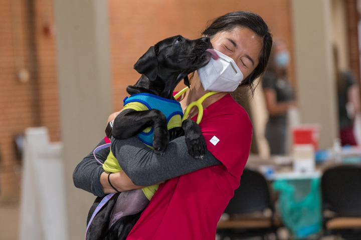
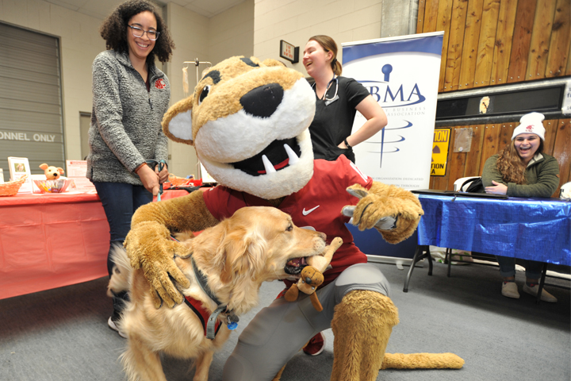
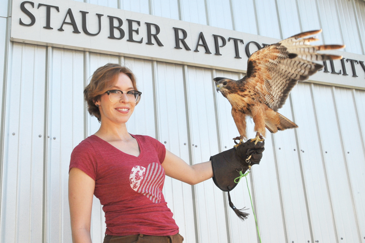
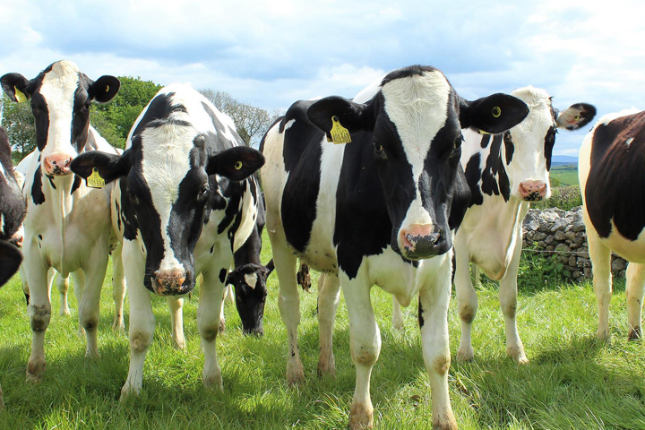
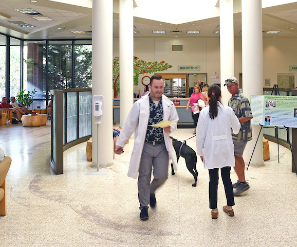
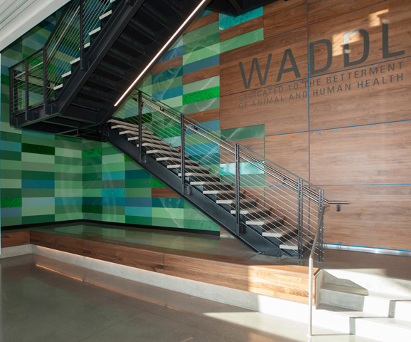
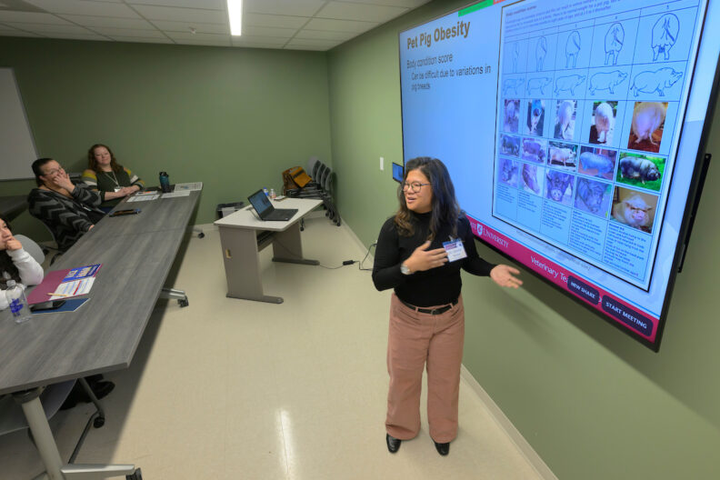
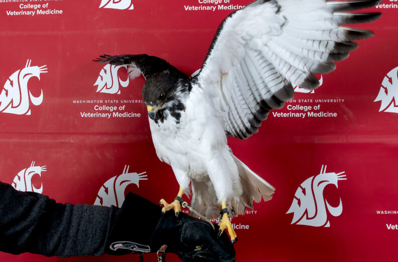
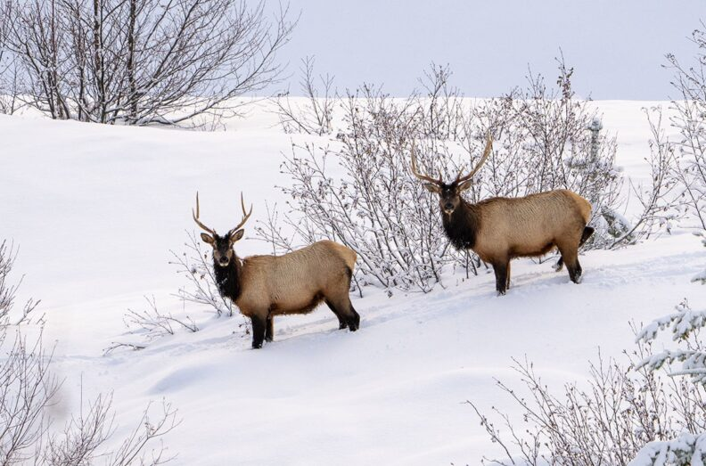

# Page Scan Report

| Field | Value |
|-------|-------|
| URL | https://vetmed.wsu.edu/ |
| Title | College of Veterinary Medicine | Washington State University |
| Status | ❌ 0 |
| HTML Size | 263.4 KB |
| Screenshots | 1 (862.8 KB) |
| Images | 11 (2.0 MB) |
| Images Missing Alt | 0 |
| JS Errors | 3 |
| JS Warnings | 1 |
| Auth | none |
| Captured | 2026-02-16T20:37:05.1819823Z |

## JavaScript Errors

- `Failed to load resource: net::ERR_SOCKET_NOT_CONNECTED`
- `Failed to load resource: net::ERR_SOCKET_NOT_CONNECTED`
- `Failed to load resource: net::ERR_SOCKET_NOT_CONNECTED`

## Actions

- Screenshot #1: page-loaded (862.8 KB)
- Downloaded 11 images to /images/

## Screenshots

### 1. page-loaded

## Page Images (11)

| # | Image | Alt Text | Size |
|---|-------|----------|------|
| 1 | [HealthyPeoplePets-DogLickingDr-News720x480.jpg](images/HealthyPeoplePets-DogLickingDr-News720x480.jpg) | Young black lab licking the masked fa... | 244.8 KB |
| 2 | [OpenHouse22ButchwDog-720x480-1.jpg](images/OpenHouse22ButchwDog-720x480-1.jpg) | WSU mascot, Butch, at the College Ope... | 344.3 KB |
| 3 | [RaptorClub072622-720x480-1.jpg](images/RaptorClub072622-720x480-1.jpg) | Student in front of the Stauber Rapto... | 270.2 KB |
| 4 | [CowsinField-720x480-1.jpg](images/CowsinField-720x480-1.jpg) | Curious young holsteins in a field lo... | 371.5 KB |
| 5 | [hospital-lobby-578x480-1.jpg](images/hospital-lobby-578x480-1.jpg) | Hustle and bustle in the Veterinary T... | 146.8 KB |
| 6 | [waddl-lobby.jpg](images/waddl-lobby.jpg) | Photo of staircase in WADDL lobby. | 248.3 KB |
| 7 | [2025-Spring-Conference-09_0T89581-792x528.jpg](images/2025-Spring-Conference-09_0T89581-792x528.jpg) | Veterinary dental CE session | 110.3 KB |
| 8 | [Taima-Seattle-Seahawks-mascot-02-26-792x523.jpg](images/Taima-Seattle-Seahawks-mascot-02-26-792x523.jpg) | Taima, an augur hawk, poses for a pho... | 82.7 KB |
| 9 | [Driskell-and-Thompson-with-pigs-02-26-792x523.jpg](images/Driskell-and-Thompson-with-pigs-02-26-792x523.jpg) | Ryan Driskell, left, an associate pro... | 104.3 KB |
| 10 | [Bulls-in-snow-02-26-792x523.jpg](images/Bulls-in-snow-02-26-792x523.jpg) | Two bull elk on a snowy hillside. | 100.4 KB |
| 11 | [June-Morning-at-Kamiak-Butte-Ken-Carper2-792x267.jpg](images/June-Morning-at-Kamiak-Butte-Ken-Carper2-792x267.jpg) | June morning Kamiak butte | 57.8 KB |

### Gallery

## Files

- `01-page-loaded.png` — page-loaded (862.8 KB)
- `page.html` — rendered HTML content
- `metadata.json` — machine-readable scan data
- `errors.log` — JavaScript console errors
- `warnings.log` — JavaScript console warnings
- `info.log` — navigation and timing details
- `actions.log` — interactions performed on the page
- `images/` — 11 page images (2.0 MB)
