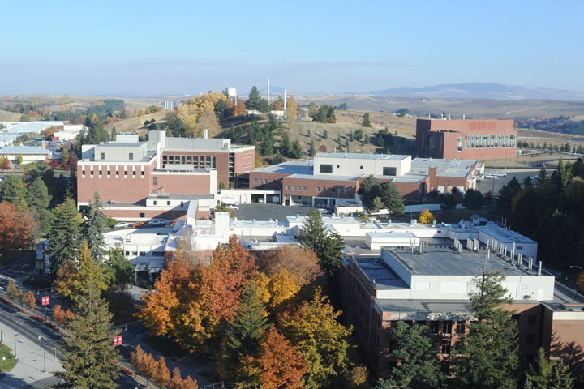
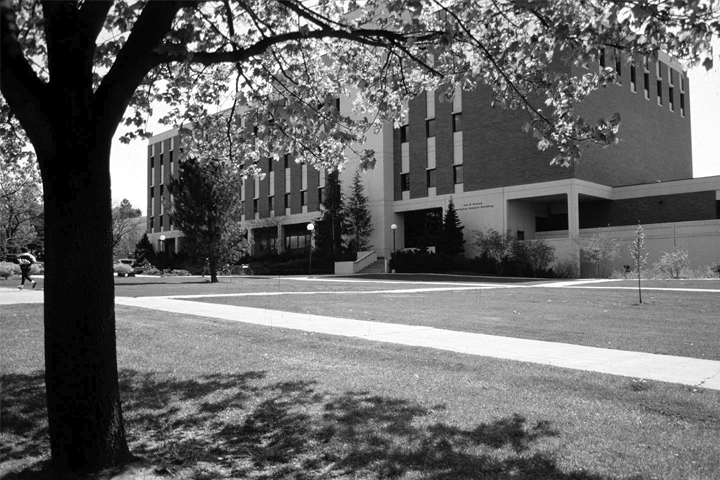

# Page Scan Report

| Field | Value |
|-------|-------|
| URL | https://vetmed.wsu.edu/about/ |
| Title | About | College of Veterinary Medicine | Washington State University |
| Status | ❌ 0 |
| HTML Size | 238.4 KB |
| Screenshots | 1 (677.7 KB) |
| Images | 4 (793.0 KB) |
| Images Missing Alt | 0 |
| JS Errors | 0 |
| JS Warnings | 0 |
| Auth | none |
| Captured | 2026-02-16T20:38:20.7696513Z |

## Actions

- Screenshot #1: page-loaded (677.7 KB)
- Downloaded 4 images to /images/

## Screenshots

### 1. page-loaded

## Page Images (4)

| # | Image | Alt Text | Size |
|---|-------|----------|------|
| 1 | [Borjesson-Dori-10-23.jpg](images/Borjesson-Dori-10-23.jpg) | Dori outside the College in October 2... | 105.8 KB |
| 2 | [VetmedComplex-720x480-1.jpg](images/VetmedComplex-720x480-1.jpg) | Aerial photo of the College of Veteri... | 348.7 KB |
| 3 | [BustadBldg1985-720x480-1.jpg](images/BustadBldg1985-720x480-1.jpg) | A black and white historical photo of... | 280.6 KB |
| 4 | [June-Morning-at-Kamiak-Butte-Ken-Carper2-792x267.jpg](images/June-Morning-at-Kamiak-Butte-Ken-Carper2-792x267.jpg) | June morning Kamiak butte | 57.8 KB |

### Gallery

## Files

- `01-page-loaded.png` — page-loaded (677.7 KB)
- `page.html` — rendered HTML content
- `metadata.json` — machine-readable scan data
- `errors.log` — JavaScript console errors
- `warnings.log` — JavaScript console warnings
- `info.log` — navigation and timing details
- `actions.log` — interactions performed on the page
- `images/` — 4 page images (793.0 KB)
