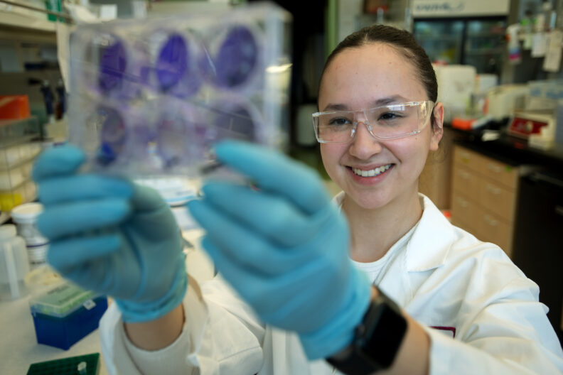
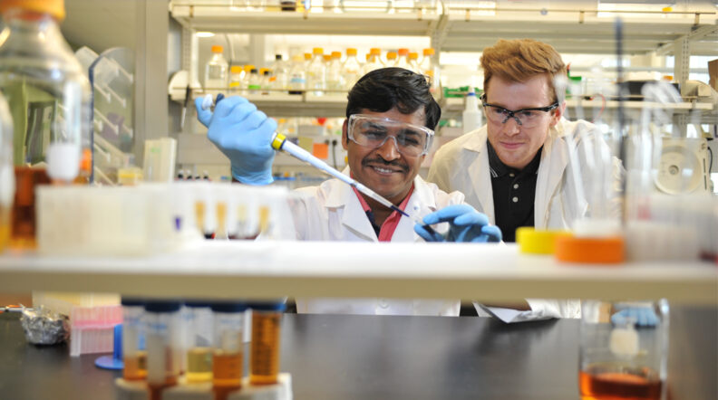
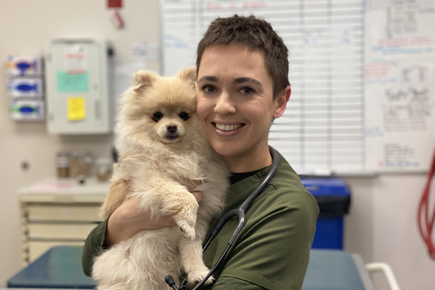
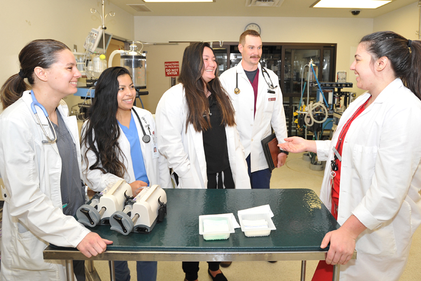
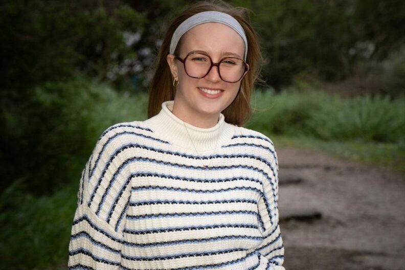
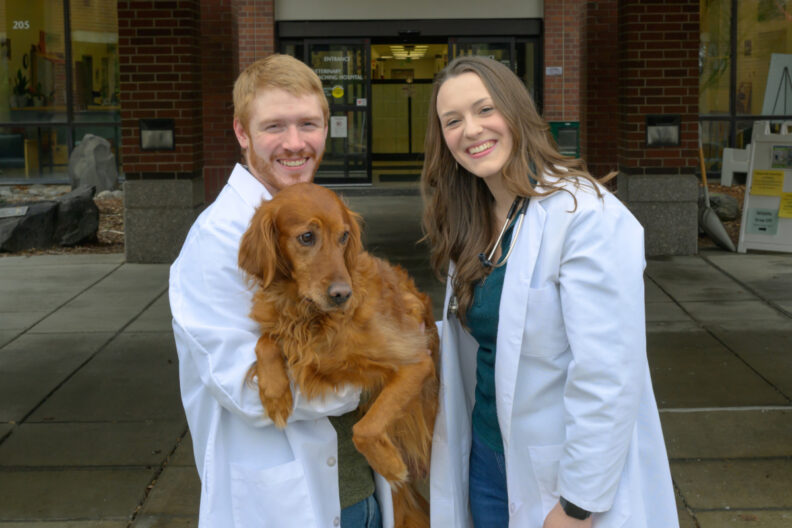
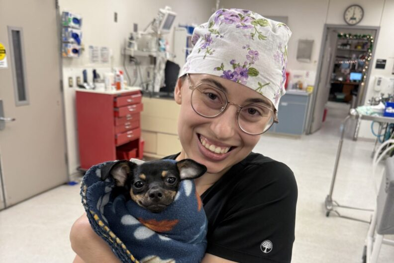

# Page Scan Report

| Field | Value |
|-------|-------|
| URL | https://vetmed.wsu.edu/education/ |
| Title | Education | College of Veterinary Medicine | Washington State University |
| Status | ❌ 0 |
| HTML Size | 243.2 KB |
| Screenshots | 1 (757.8 KB) |
| Images | 7 (916.2 KB) |
| Images Missing Alt | 0 |
| JS Errors | 0 |
| JS Warnings | 0 |
| Auth | none |
| Captured | 2026-02-16T20:39:02.5595759Z |

## Actions

- Screenshot #1: page-loaded (757.8 KB)
- Downloaded 7 images to /images/

## Screenshots

### 1. page-loaded

## Page Images (7)

| # | Image | Alt Text | Size |
|---|-------|----------|------|
| 1 | [SMB-undergrads-Kohler-lab-06-DSC_5439-792x528.jpg](images/SMB-undergrads-Kohler-lab-06-DSC_5439-792x528.jpg) | Two students working in a lab. Both a... | 90.6 KB |
| 2 | [GraduateHero-1156x645-100121-792x442.jpg](images/GraduateHero-1156x645-100121-792x442.jpg) | Graduate student in lab | 76.4 KB |
| 3 | [Zaripova-Elvira-03-24.jpg](images/Zaripova-Elvira-03-24.jpg) | Vet student with dog | 182.7 KB |
| 4 | [ResidentsInterns-Residentw4thYears-720x480-1.jpg](images/ResidentsInterns-Residentw4thYears-720x480-1.jpg) | A Teaching Hospital resident with fou... | 322.6 KB |
| 5 | [catherine-hamisch-e1770310174765-792x528.jpg](images/catherine-hamisch-e1770310174765-792x528.jpg) | Catherine Hamisch poses for a photo. | 70.1 KB |
| 6 | [image-6.jpg](images/image-6.jpg) | Anna Decan and Nolan Nansel, both fou... | 101.9 KB |
| 7 | [rossman-scaled-e1770328567477-792x528.jpeg](images/rossman-scaled-e1770328567477-792x528.jpeg) | Genevea Rossman holds a small dog. | 72.0 KB |

### Gallery

## Files

- `01-page-loaded.png` — page-loaded (757.8 KB)
- `page.html` — rendered HTML content
- `metadata.json` — machine-readable scan data
- `errors.log` — JavaScript console errors
- `warnings.log` — JavaScript console warnings
- `info.log` — navigation and timing details
- `actions.log` — interactions performed on the page
- `images/` — 7 page images (916.2 KB)
