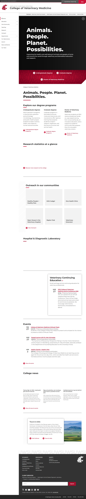
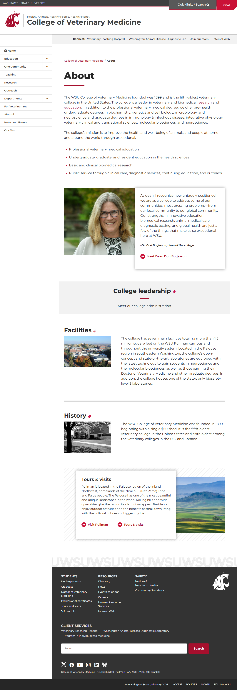
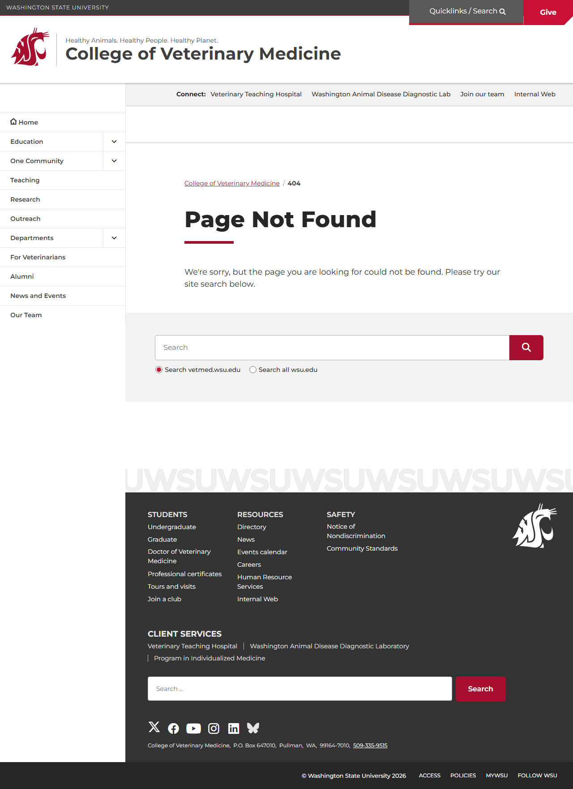
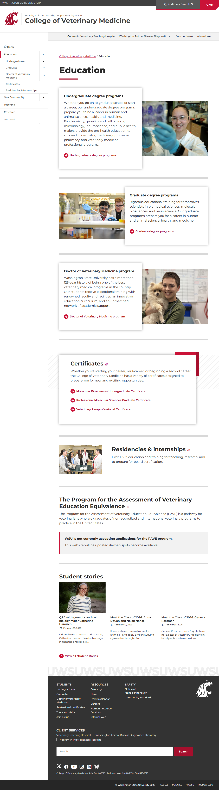

# Site Report: https://vetmed.wsu.edu/

| Metric | Value |
|--------|-------|
| Status | ⚠️ 4/7 pages OK |
| Pages Scanned | 7 |
| Pages Passed | 4 |
| Pages Failed | 3 |
| Total JS Errors | 3 |
| Total JS Warnings | 4 |
| Total HTML | 1.8 MB |
| Total Screenshots | 6.2 MB |
| Folder | `vetmed-wsu-edu/` |

## Pages

| Status | Page | HTTP | Title | JS Errors | JS Warnings | Screenshots |
|--------|------|------|-------|-----------|-------------|-------------|
| ✅ | [/](_root/report.md) | 200 | College of Veterinary Medicine \| Was... | 0 | 1 | 1 |
| ✅ | [/about/](about/report.md) | 200 | About \| College of Veterinary Medici... | 0 | 0 | 1 |
| ❌ | [/admissions/](admissions/report.md) | 404 | Page not found \| College of Veterina... | 1 | 1 | 1 |
| ❌ | [/contact/](contact/report.md) | 404 | Page not found \| College of Veterina... | 1 | 1 | 1 |
| ✅ | [/education/](education/report.md) | 200 | Education \| College of Veterinary Me... | 0 | 0 | 1 |
| ✅ | [/research/](research/report.md) | 200 | Research \| College of Veterinary Med... | 0 | 0 | 1 |
| ❌ | [/services/](services/report.md) | 404 | Page not found \| College of Veterina... | 1 | 1 | 1 |

## Page Screenshots

### [/](_root/report.md)

### [/about/](about/report.md)

### [/admissions/](admissions/report.md)

### [/contact/](contact/report.md)

### [/education/](education/report.md)

### [/research/](research/report.md)

### [/services/](services/report.md)

## Failed Pages

### /admissions/

- **URL:** https://vetmed.wsu.edu/admissions/
- **Status:** 404

### /services/

- **URL:** https://vetmed.wsu.edu/services/
- **Status:** 404

### /contact/

- **URL:** https://vetmed.wsu.edu/contact/
- **Status:** 404

## Pages with JavaScript Errors

### /admissions/ (1 errors)

- `Failed to load resource: the server responded with a status of 404 ()`

### /services/ (1 errors)

- `Failed to load resource: the server responded with a status of 404 ()`

### /contact/ (1 errors)

- `Failed to load resource: the server responded with a status of 404 ()`

---

*Generated by AccessibilityScanner (FreeTools) v1.0*
