# Page Scan Report

| Field | Value |
|-------|-------|
| URL | https://vetmed.wsu.edu/research/ |
| Title | Research | College of Veterinary Medicine | Washington State University |
| Status | ❌ 0 |
| HTML Size | 275.0 KB |
| Screenshots | 1 (2.9 MB) |
| Images | 20 (3.8 MB) |
| Images Missing Alt | 2 |
| JS Errors | 0 |
| JS Warnings | 0 |
| Auth | none |
| Captured | 2026-02-16T21:00:42.6302160Z |

## Actions

- Screenshot #1: page-loaded (2.9 MB)
- Downloaded 20 images to /images/

## Screenshots

### 1. page-loaded

## Page Images (20)

| # | Image | Alt Text | Size |
|---|-------|----------|------|
| 1 | [Bonnie-Gunn-Research-Hero-DSC_9935.jpg](images/Bonnie-Gunn-Research-Hero-DSC_9935.jpg) | Bonnie Gunn removing samples from a f... | 922.3 KB |
| 2 | [Sushanta-Deb-Elk-_0T80246-792x528.jpg](images/Sushanta-Deb-Elk-_0T80246-792x528.jpg) | Dr. Deb Sushanta poses for a photo. | 81.5 KB |
| 3 | [Cole-Allick-01_0T85866-792x528.jpg](images/Cole-Allick-01_0T85866-792x528.jpg) | Dr. Cole Allick is shown. | 74.4 KB |
| 4 | [Kimberly-McBride-01-_0T84368-792x528.jpg](images/Kimberly-McBride-01-_0T84368-792x528.jpg) | Dr. Kimberly McBride | 93.5 KB |
| 5 | [image-5.jpg](images/image-5.jpg) | Heather Koehler with Eschlead student | 158.7 KB |
| 6 | [Bioinformatics-Hero-network-792x446.jpg](images/Bioinformatics-Hero-network-792x446.jpg) | Interconnected network | 50.7 KB |
| 7 | [AnimalProductionCore-Microscope-720x480-1.jpg](images/AnimalProductionCore-Microscope-720x480-1.jpg) | *(none)* | 308.7 KB |
| 8 | [kenyafirstday-792x523.jpg](images/kenyafirstday-792x523.jpg) | Students working in lab. | 165.0 KB |
| 9 | [2025-Research-Symposium41_0T81068-1.jpg](images/2025-Research-Symposium41_0T81068-1.jpg) | Group of winners from the 2025 Resear... | 226.3 KB |
| 10 | [Graduate-Research-Showcase-14-DSC_3995.jpg](images/Graduate-Research-Showcase-14-DSC_3995.jpg) | Graduate Research Showcase | 223.9 KB |
| 11 | [SURCA-10-DSC_2768.jpg](images/SURCA-10-DSC_2768.jpg) | Student explaining research on their ... | 231.3 KB |
| 12 | [cvm-3mt-15-DSC_4418-2-1.jpg](images/cvm-3mt-15-DSC_4418-2-1.jpg) | 2024 CVM 3 Minute Thesis | 255.0 KB |
| 13 | [Summer-Fellows-Group-Shot90-2.jpg](images/Summer-Fellows-Group-Shot90-2.jpg) | Summer fellows | 440.1 KB |
| 14 | [FEPP-Icon.png](images/FEPP-Icon.png) | *(none)* | 6.6 KB |
| 15 | [Elk-Hoof-2025-Report-to-Legislature-792x523.jpg](images/Elk-Hoof-2025-Report-to-Legislature-792x523.jpg) | Seven point bull elk in a dense forest. | 148.2 KB |
| 16 | [Driskell-and-Thompson-with-pigs-02-26-792x523.jpg](images/Driskell-and-Thompson-with-pigs-02-26-792x523.jpg) | Ryan Driskell, left, an associate pro... | 104.3 KB |
| 17 | [image-17.jpg](images/image-17.jpg) | Katy Touretsky, right, a neuroscience... | 98.3 KB |
| 18 | [Waltzek-ResearchAward-R2-11-25-792x531.jpg](images/Waltzek-ResearchAward-R2-11-25-792x531.jpg) | Thomas Waltzek (L), is given the Cata... | 59.6 KB |
| 19 | [2025-Research-Symposium41_0T81068-792x528.jpg](images/2025-Research-Symposium41_0T81068-792x528.jpg) | Group of winners from the 2025 Resear... | 107.0 KB |
| 20 | [image-20.jpg](images/image-20.jpg) | Research Symposium winner. | 112.9 KB |

### Gallery

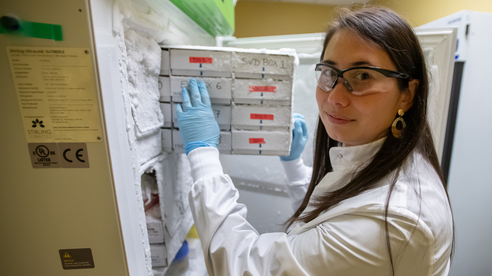

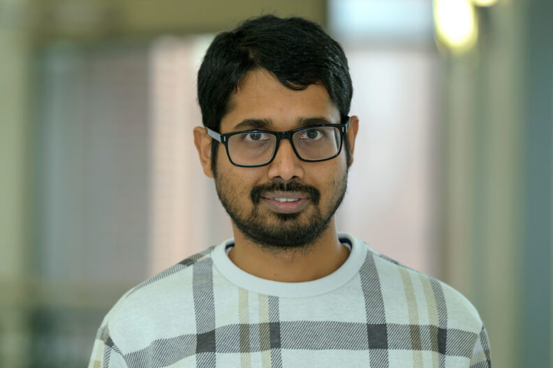

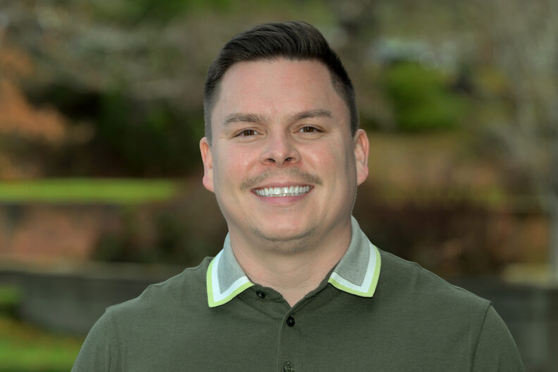

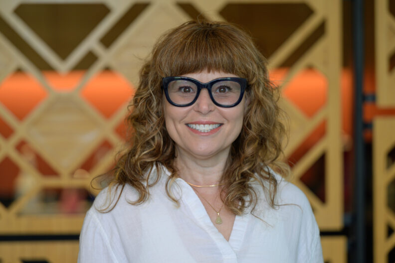

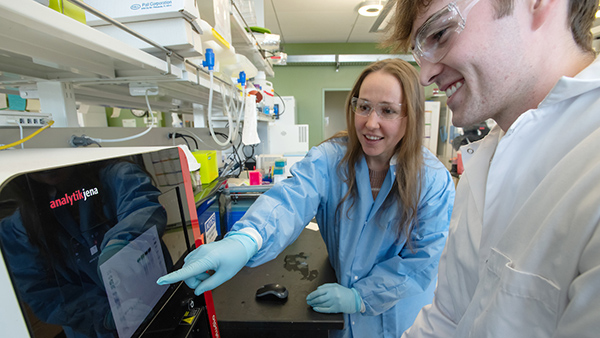

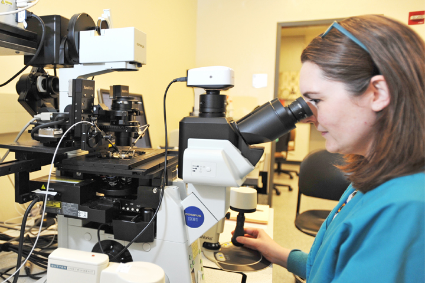

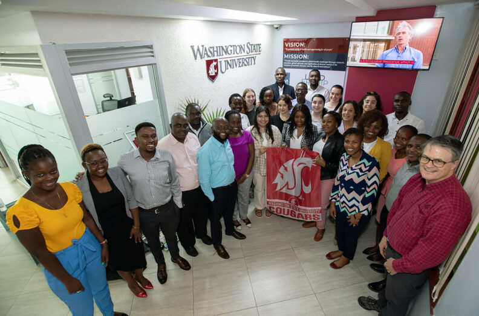

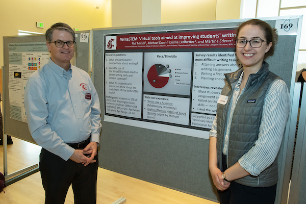

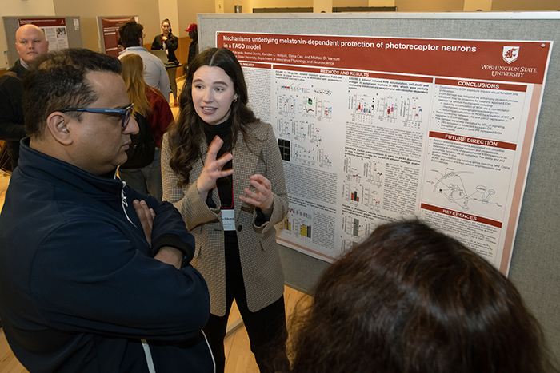

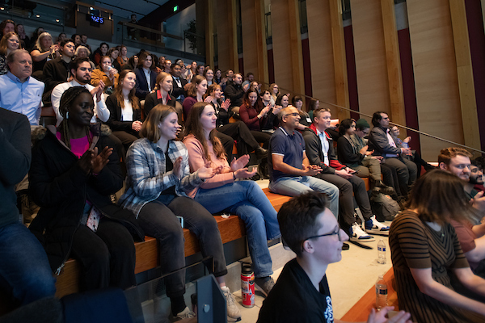

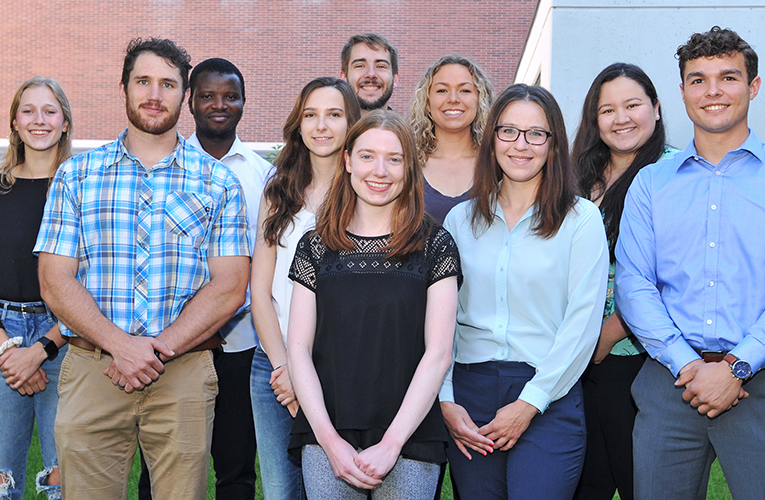

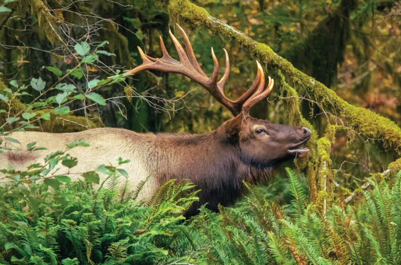

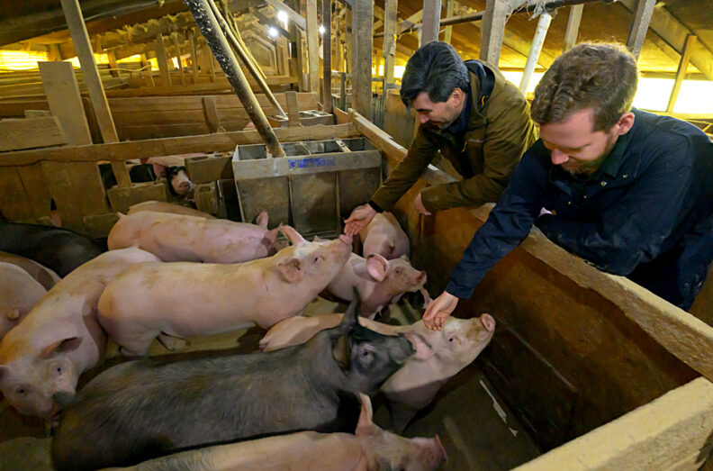

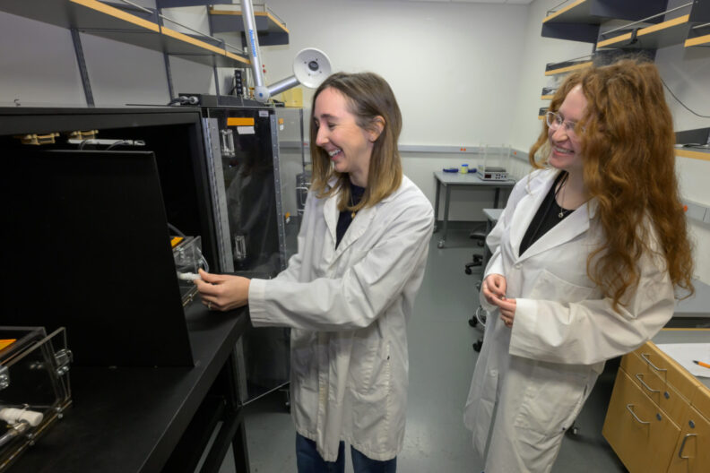

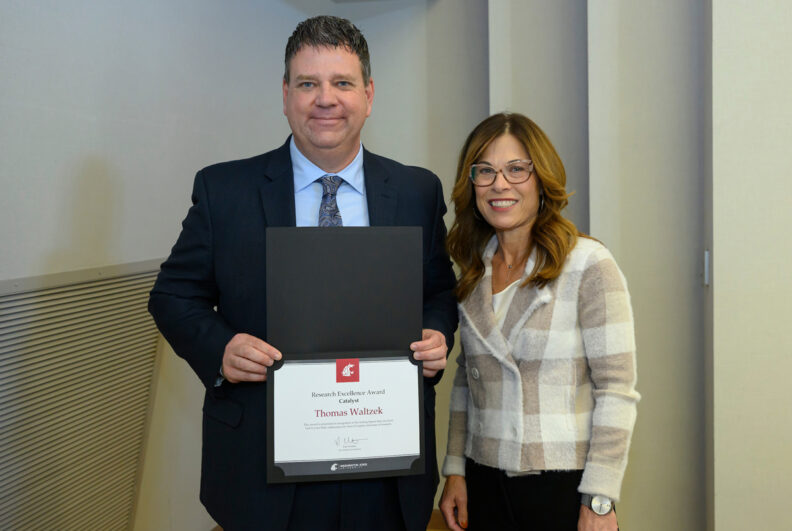

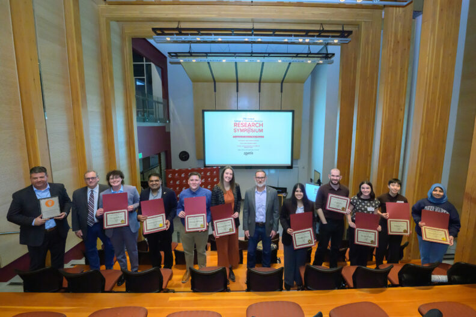

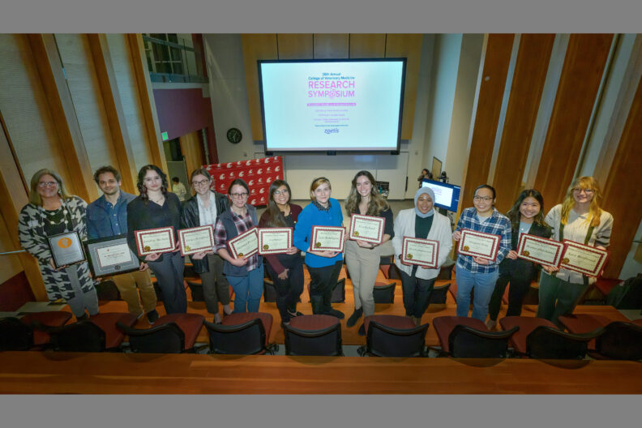

### ⚠️ Images Missing Alt Text (2)

- `AnimalProductionCore-Microscope-720x480-1.jpg` — https://wpcdn.web.wsu.edu/wp-vetmed/uploads/sites/2673/2022/06/AnimalProductionCore-Microscope-720x480-1.jpg
- `FEPP-Icon.png` — https://wpcdn.web.wsu.edu/wp-vetmed/uploads/sites/2673/2022/10/FEPP-Icon.png

## Files

- `01-page-loaded.png` — page-loaded (2.9 MB)
- `page.html` — rendered HTML content
- `metadata.json` — machine-readable scan data
- `errors.log` — JavaScript console errors
- `warnings.log` — JavaScript console warnings
- `info.log` — navigation and timing details
- `actions.log` — interactions performed on the page
- `images/` — 20 page images (3.8 MB)
