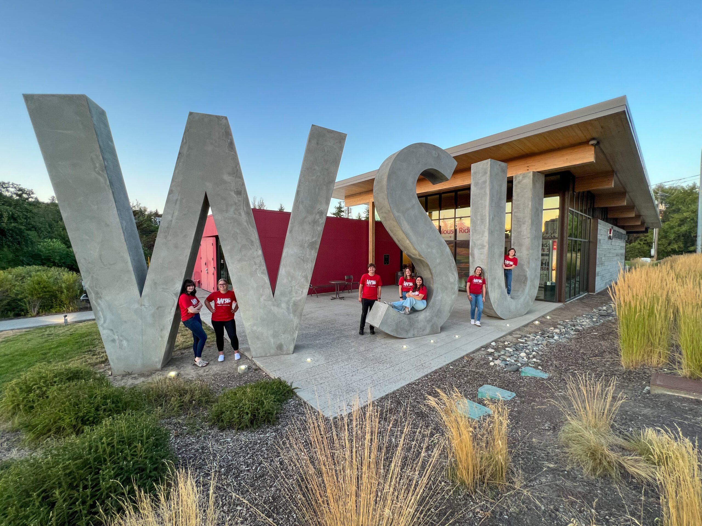
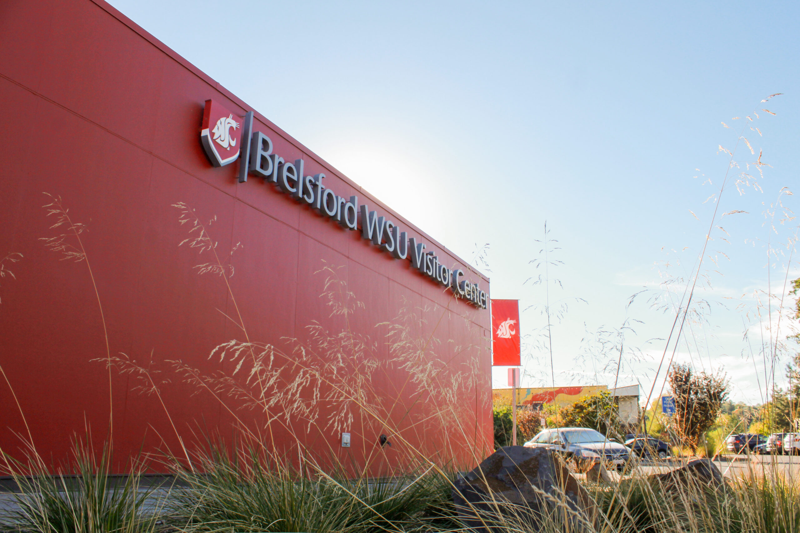
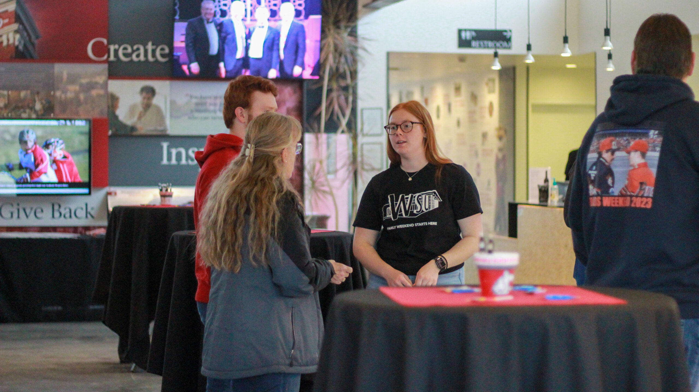
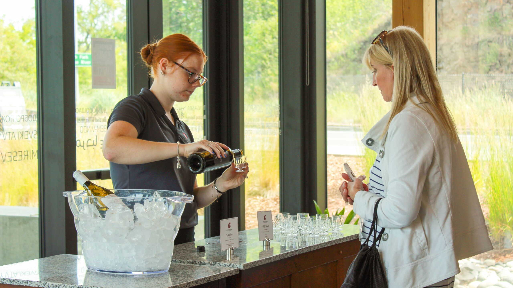
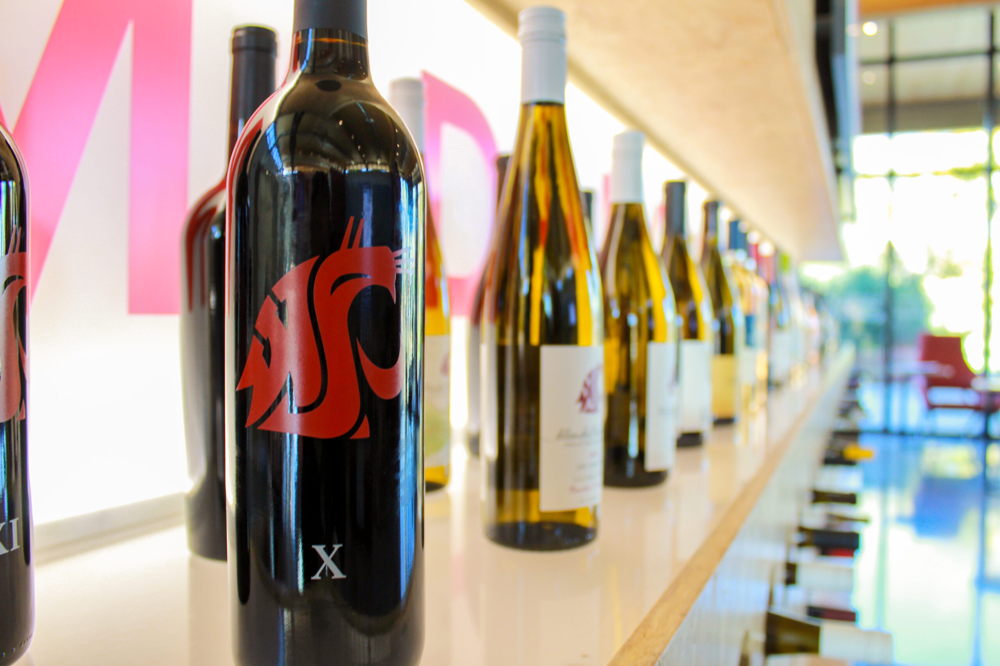
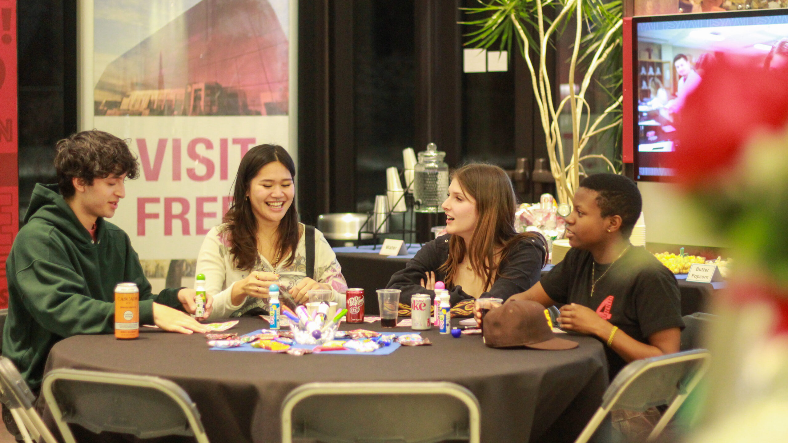
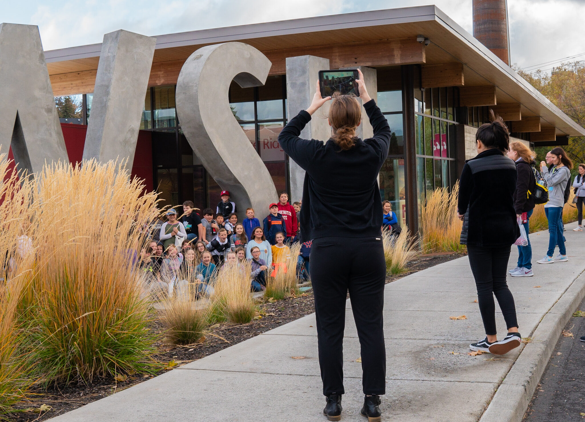

# 📄 Page Scan Report

> **URL:** https://visitor.wsu.edu/  
> **Captured:** 2026-02-16 22:11:16 UTC  
> **Status:** ✅ 200  

---

## 📑 Contents

- [Summary](#-summary)
- [Screenshots](#-screenshots)
- [Page Images](#-page-images)
- [Actions](#-actions)
- [Files](#-files)

---

## 📋 Summary

| Field | Value |
|-------|-------|
| URL | https://visitor.wsu.edu/ |
| Title | Brelsford WSU Visitor Center | Washington State University |
| Status | ✅ 200 |
| HTML Size | 230.9 KB |
| Screenshots | 1 (1.8 MB) |
| Images | 13 (12.7 MB) |
| Images Missing Alt | ✅ 0 |
| JS Errors | ✅ 0 |
| JS Warnings | 0 |
| Auth | none |
| Captured | 2026-02-16T22:11:16.8315442Z |

## 🔧 Actions

<strong>2 action(s) performed</strong>

- Screenshot #1: page-loaded (1.8 MB)
- Downloaded 13 images to /images/

## 📸 Screenshots

<table>
<tr>
<td align="center" width="50%">

 <strong>1. page-loaded</strong>
 1.8 MB
</td>
<td></td>
</tr>
</table>

## 🖼️ Page Images (13)

<strong>📋 Image Index</strong> — 13 images, 12.7 MB

| # | Image | Alt Text | Size |
|--:|-------|----------|-----:|
| 1 | [WSU-letters-with-staff-2-1-scaled.jpg](images/WSU-letters-with-staff-2-1-scaled.jpg) | An image of several Brelsford Washing... | 1018.7 KB |
| 2 | [7-3-4thJulyClosure-scaled-e1656453368336.jpg](images/7-3-4thJulyClosure-scaled-e1656453368336.jpg) | An image of the exterior of the Brels... | 591.3 KB |
| 3 | [BVC-Game-Day-Hours-group-Kylie-Reeder-scaled.jpg](images/BVC-Game-Day-Hours-group-Kylie-Reeder-scaled.jpg) | An image of a group of Brelsford Wash... | 623.7 KB |
| 4 | [BVC-Outside-Brochures-close-up-Rose-Pineda-scaled.jpg](images/BVC-Outside-Brochures-close-up-Rose-Pineda-scaled.jpg) | An image of brochure racks outside th... | 419.8 KB |
| 5 | [BVC-Back-Exterior-Rose-Pineda-scaled.jpg](images/BVC-Back-Exterior-Rose-Pineda-scaled.jpg) | An image of the exterior back wall an... | 725.5 KB |
| 6 | [Family-Weekend-2024-feat-Keleigh-M-visitor-assist-scaled.jpg](images/Family-Weekend-2024-feat-Keleigh-M-visitor-assist-scaled.jpg) | An image of a Brelsford Washington St... | 609.2 KB |
| 7 | [Visitors-Looking-at-Timeline-Rose-Pineda-scaled.jpg](images/Visitors-Looking-at-Timeline-Rose-Pineda-scaled.jpg) | An image of a pair of visitors lookin... | 480.0 KB |
| 8 | [Isabel-with-map-wide-shot.jpeg](images/Isabel-with-map-wide-shot.jpeg) | A Brelsford Washington State Universi... | 5.5 MB |
| 9 | [WSU-Hourly-Parking-Rose-Pineda-1-scaled.jpg](images/WSU-Hourly-Parking-Rose-Pineda-1-scaled.jpg) | image of a parking station along a ro... | 454.4 KB |
| 10 | [image-10.jpg](images/image-10.jpg) | Visitor at a wine tasting event, bein... | 605.1 KB |
| 11 | [Wine-Display-Rose-Pineda-1-scaled.jpg](images/Wine-Display-Rose-Pineda-1-scaled.jpg) | An image of Cougar-connected wines on... | 491.8 KB |
| 12 | [Bingo-at-the-BVC-5-Rose-Pineda-scaled.jpg](images/Bingo-at-the-BVC-5-Rose-Pineda-scaled.jpg) | Group of 4 people at a round table pl... | 598.9 KB |
| 13 | [K-8-Field-Trips-Daniel-Kim-e1752247665984.jpg](images/K-8-Field-Trips-Daniel-Kim-e1752247665984.jpg) | Kids posing for a group photo in fron... | 698.8 KB |

<strong>🖼️ Gallery</strong>

<table>
<tr>
<td align="center" width="33%">

 WSU-letters-with-staff-2-1-scaled.jpg
</td>
<td align="center" width="33%">

 7-3-4thJulyClosure-scaled-e1656453368336.jpg
</td>
<td align="center" width="33%">

 BVC-Game-Day-Hours-group-Kylie-Reeder-scaled.jpg
</td>
</tr>
<tr>
<td align="center" width="33%">

 BVC-Outside-Brochures-close-up-Rose-Pineda-scaled.jpg
</td>
<td align="center" width="33%">

 BVC-Back-Exterior-Rose-Pineda-scaled.jpg
</td>
<td align="center" width="33%">

 Family-Weekend-2024-feat-Keleigh-M-visitor-assist-scaled.jpg
</td>
</tr>
<tr>
<td align="center" width="33%">

 Visitors-Looking-at-Timeline-Rose-Pineda-scaled.jpg
</td>
<td align="center" width="33%">

 Isabel-with-map-wide-shot.jpeg
</td>
<td align="center" width="33%">

 WSU-Hourly-Parking-Rose-Pineda-1-scaled.jpg
</td>
</tr>
<tr>
<td align="center" width="33%">

 image-10.jpg
</td>
<td align="center" width="33%">

 Wine-Display-Rose-Pineda-1-scaled.jpg
</td>
<td align="center" width="33%">

 Bingo-at-the-BVC-5-Rose-Pineda-scaled.jpg
</td>
</tr>
<tr>
<td align="center" width="33%">

 K-8-Field-Trips-Daniel-Kim-e1752247665984.jpg
</td>
<td></td>
<td></td>
</tr>
</table>

## 📁 Files

| File | Description |
|------|-------------|
| `01-page-loaded.png` | page-loaded (1.8 MB) |
| `page.html` | Rendered HTML content |
| `metadata.json` | Machine-readable scan data |
| `errors.log` | JavaScript console errors |
| `warnings.log` | JavaScript console warnings |
| `info.log` | Navigation and timing details |
| `actions.log` | Interactions performed |
| `images/` | 13 page images (12.7 MB) |

---

*Generated by AccessibilityScanner (FreeTools) v1.0*
