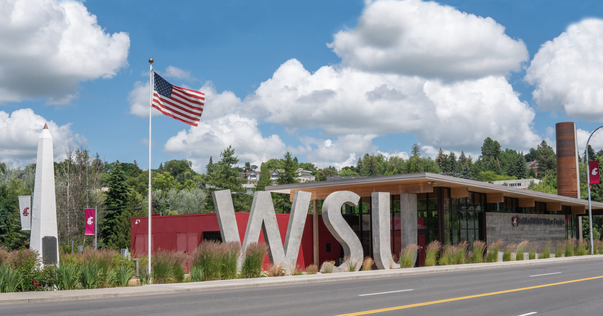
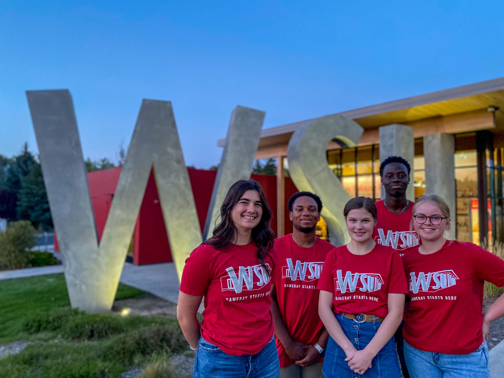
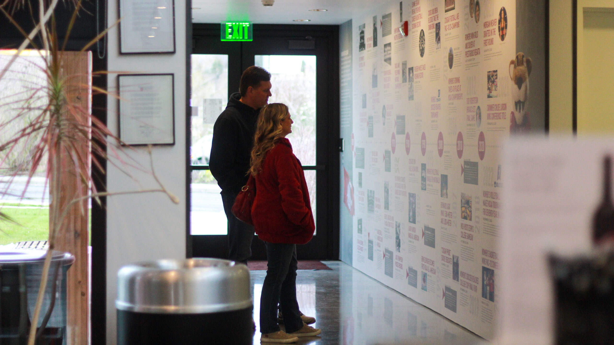
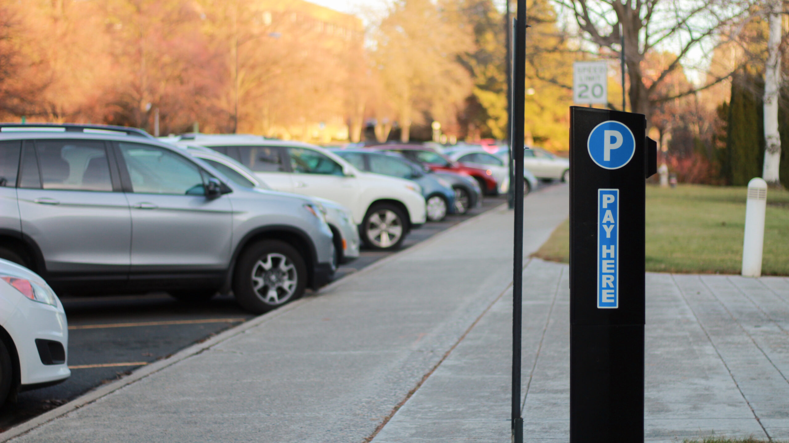

# Page Scan Report

| Field | Value |
|-------|-------|
| URL | https://visitor.wsu.edu/ |
| Title | Brelsford WSU Visitor Center | Washington State University |
| Status | ❌ 0 |
| HTML Size | 219.4 KB |
| Screenshots | 1 (1.3 MB) |
| Images | 5 (2.5 MB) |
| Images Missing Alt | 0 |
| JS Errors | 0 |
| JS Warnings | 0 |
| Auth | none |
| Captured | 2026-02-16T20:37:05.1812534Z |

## Actions

- Screenshot #1: page-loaded (1.3 MB)
- Downloaded 5 images to /images/

## Screenshots

### 1. page-loaded

## Page Images (5)

| # | Image | Alt Text | Size |
|---|-------|----------|------|
| 1 | [7-3-4thJulyClosure-scaled-e1656453368336.jpg](images/7-3-4thJulyClosure-scaled-e1656453368336.jpg) | An image of the exterior of the Brels... | 591.3 KB |
| 2 | [BVC-Game-Day-Hours-group-Kylie-Reeder-scaled.jpg](images/BVC-Game-Day-Hours-group-Kylie-Reeder-scaled.jpg) | An image of a group of Brelsford Wash... | 623.7 KB |
| 3 | [BVC-Outside-Brochures-close-up-Rose-Pineda-scaled.jpg](images/BVC-Outside-Brochures-close-up-Rose-Pineda-scaled.jpg) | An image of brochure racks outside th... | 419.8 KB |
| 4 | [Visitors-Looking-at-Timeline-Rose-Pineda-scaled.jpg](images/Visitors-Looking-at-Timeline-Rose-Pineda-scaled.jpg) | An image of a pair of visitors lookin... | 480.0 KB |
| 5 | [WSU-Hourly-Parking-Rose-Pineda-1-scaled.jpg](images/WSU-Hourly-Parking-Rose-Pineda-1-scaled.jpg) | image of a parking station along a ro... | 454.4 KB |

### Gallery

## Files

- `01-page-loaded.png` — page-loaded (1.3 MB)
- `page.html` — rendered HTML content
- `metadata.json` — machine-readable scan data
- `errors.log` — JavaScript console errors
- `warnings.log` — JavaScript console warnings
- `info.log` — navigation and timing details
- `actions.log` — interactions performed on the page
- `images/` — 5 page images (2.5 MB)
