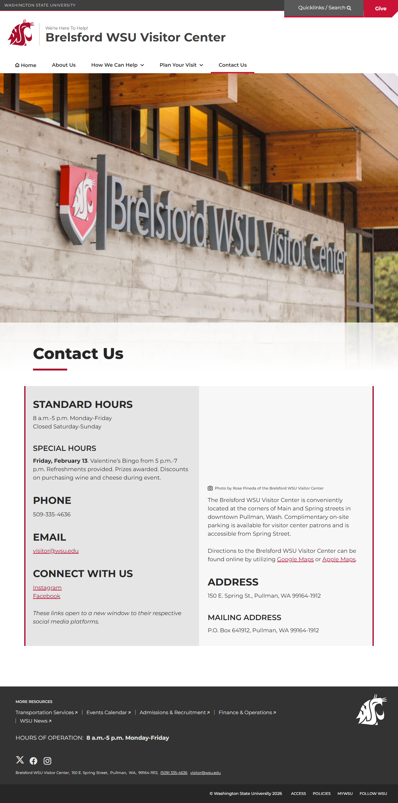
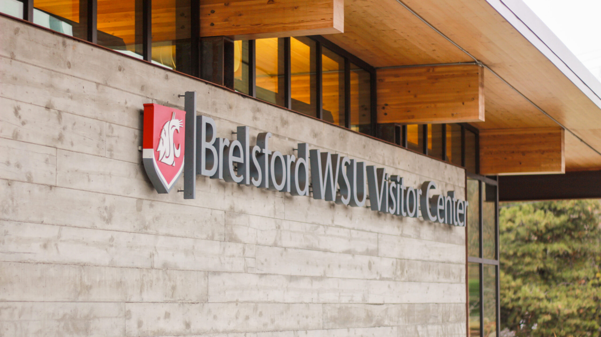
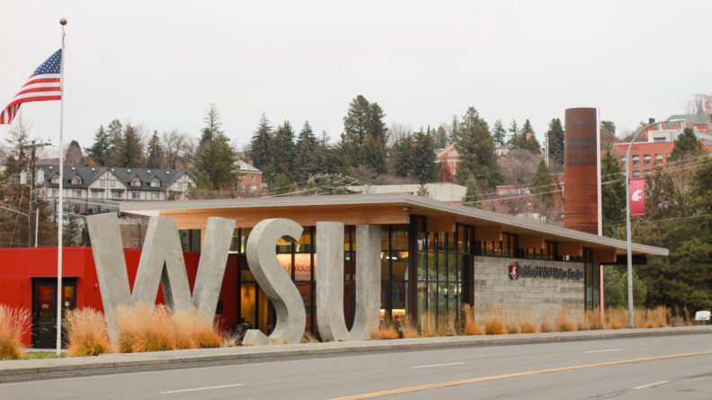

# Page Scan Report

| Field | Value |
|-------|-------|
| URL | https://visitor.wsu.edu/contact/ |
| Redirected To | https://visitor.wsu.edu/contact-us/ |
| Title | Contact Us | Brelsford WSU Visitor Center | Washington State University |
| Status | ❌ 0 |
| HTML Size | 216.2 KB |
| Screenshots | 1 (1.8 MB) |
| Images | 2 (560.5 KB) |
| Images Missing Alt | 0 |
| JS Errors | 0 |
| JS Warnings | 0 |
| Auth | none |
| Captured | 2026-02-16T21:00:30.5987548Z |

## Actions

- Screenshot #1: page-loaded (1.8 MB)
- Downloaded 2 images to /images/

## Screenshots

### 1. page-loaded

## Page Images (2)

| # | Image | Alt Text | Size |
|---|-------|----------|------|
| 1 | [BVC-Front-Name-Plaque-Rose-Pineda-scaled.jpg](images/BVC-Front-Name-Plaque-Rose-Pineda-scaled.jpg) | An image of the Brelsford Washington ... | 466.2 KB |
| 2 | [BVC-Building-Front-Rose-Pineda-792x445.jpg](images/BVC-Building-Front-Rose-Pineda-792x445.jpg) | An image of the front exterior of the... | 94.3 KB |

### Gallery

## Files

- `01-page-loaded.png` — page-loaded (1.8 MB)
- `page.html` — rendered HTML content
- `metadata.json` — machine-readable scan data
- `errors.log` — JavaScript console errors
- `warnings.log` — JavaScript console warnings
- `info.log` — navigation and timing details
- `actions.log` — interactions performed on the page
- `images/` — 2 page images (560.5 KB)
