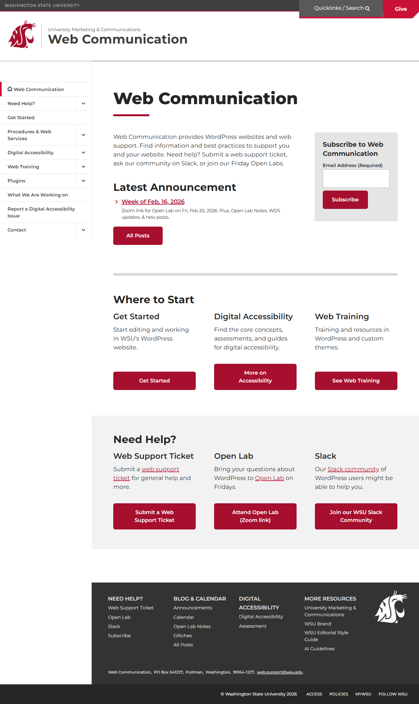
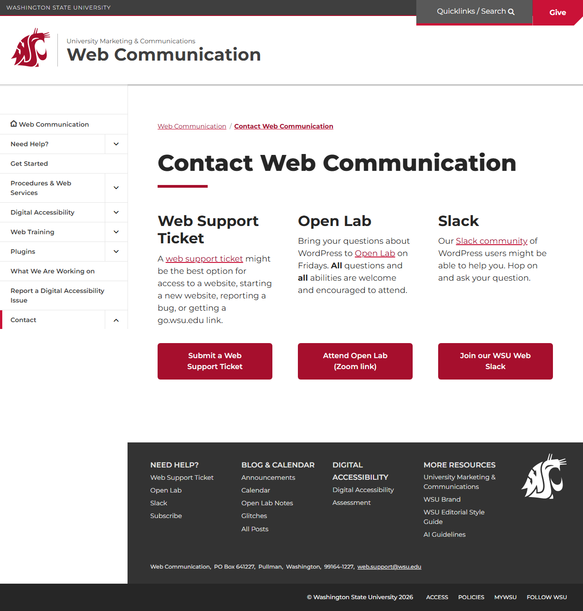
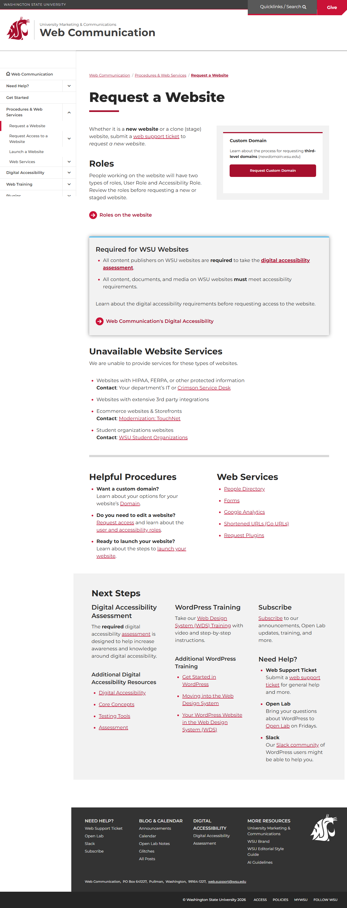
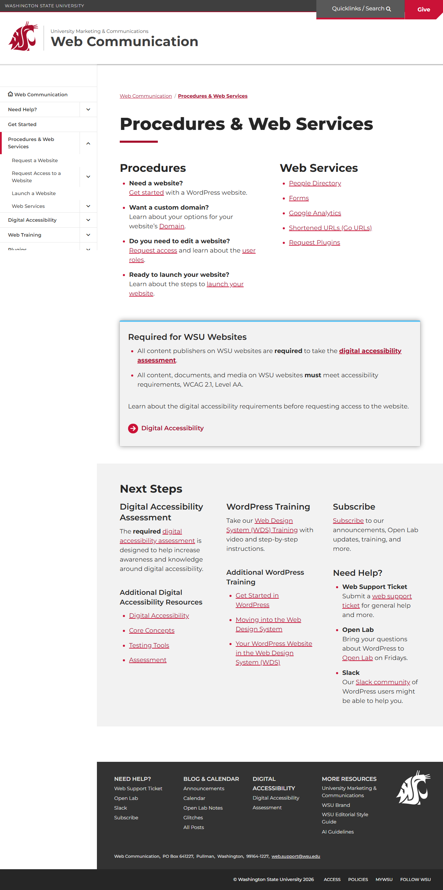

# Site Report: https://web.wsu.edu/

| Metric | Value |
|--------|-------|
| Status | ⚠️ 0/5 pages OK |
| Pages Scanned | 5 |
| Pages Passed | 0 |
| Pages Failed | 5 |
| Total JS Errors | 4 |
| Total JS Warnings | 0 |
| Total HTML | 1.1 MB |
| Total Screenshots | 1.3 MB |
| Total Images | 0 (0 bytes) |
| Images Missing Alt | 0 |
| Folder | `web-wsu-edu/` |

## Pages

| Status | Page | HTTP | Title | JS Errors | Images | Missing Alt |
|--------|------|------|-------|-----------|--------|-------------|
| ❌ | [/](_root/report.md) | 0 | Web Communication \| Washington State... | 0 | 0 | 0 |
| ❌ | [/contact/](contact/report.md) | 0 | Contact Web Communication \| Web Comm... | 1 | 0 | 0 |
| ❌ | [/request/](request/report.md) | 0 | Request a Website \| Web Communicatio... | 1 | 0 | 0 |
| ❌ | [/resources/](resources/report.md) | 0 | Resources \| Web Communication \| Was... | 1 | 0 | 0 |
| ❌ | [/services/](services/report.md) | 0 | Procedures & Web Services \| Web Comm... | 1 | 0 | 0 |

## Page Screenshots

### [/](_root/report.md)

### [/contact/](contact/report.md)

### [/request/](request/report.md)

### [/resources/](resources/report.md)

### [/services/](services/report.md)

## Failed Pages

### /

- **URL:** https://web.wsu.edu/
- **Status:** 0

### /services/

- **URL:** https://web.wsu.edu/services/
- **Status:** 0

### /resources/

- **URL:** https://web.wsu.edu/resources/
- **Status:** 0

### /request/

- **URL:** https://web.wsu.edu/request/
- **Status:** 0

### /contact/

- **URL:** https://web.wsu.edu/contact/
- **Status:** 0

## Pages with JavaScript Errors

### /services/ (1 errors)

- `Failed to load resource: the server responded with a status of 405 ()`

### /resources/ (1 errors)

- `Failed to load resource: the server responded with a status of 405 ()`

### /request/ (1 errors)

- `Failed to load resource: the server responded with a status of 405 ()`

### /contact/ (1 errors)

- `Failed to load resource: the server responded with a status of 405 ()`

---

*Generated by AccessibilityScanner (FreeTools) v1.0*
