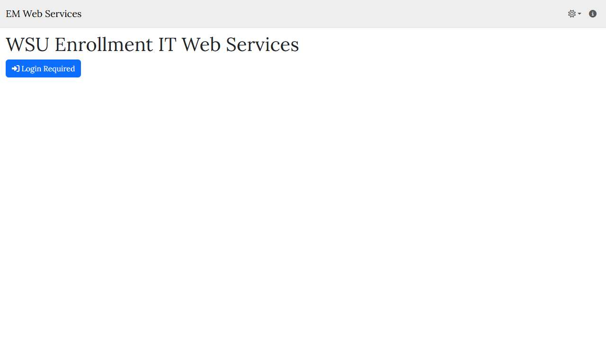
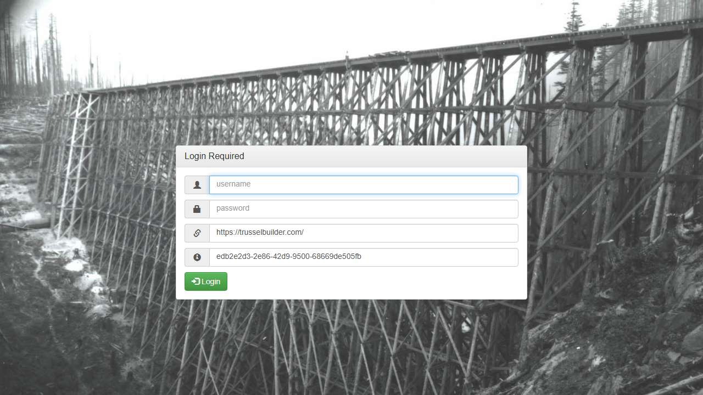
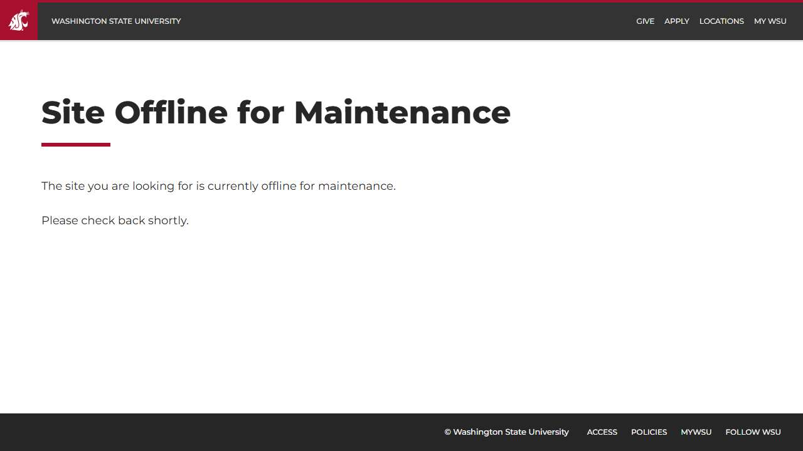

# 🌐 Site Report: https://webservices.em.wsu.edu/

> **Status:** ⚠️ 1/3 pages OK  
> **Folder:** `webservices-em-wsu-edu/`  

---

## 📋 Summary

```
Success Rate:  [██████████░░░░░░░░░░░░░░░░░░░░] 33%
```

| Metric | Value |
|--------|-------|
| Pages Scanned | 3 |
| Pages Passed | ✅ 1 |
| Pages Failed | ❌ 2 |
| Total JS Errors | 🔴 1 |
| Total JS Warnings | 2 |
| Total Images | 0 (by URL) |
| Images Missing Alt | ✅ 0 |
| A11y Violations | ⚠️ 16 |
| 🔴 Critical | 0 |
| 🟠 Serious | 11 |
| 🟡 Moderate | 4 |
| 🔵 Minor | 1 |
| Total HTML | 214.9 KB |
| Total Screenshots | 142.1 KB |

## 🔒 SSL Certificate

| Field | Value |
|-------|-------|
| Subject | `CN=webservices.em.wsu.edu, O=Washington State University, S=Washington, C=US` |
| Issuer | `CN=InCommon RSA Server CA 2, O=Internet2, C=US` |
| Valid From | 2026-01-11 |
| Expires | 🟢 2027-01-12 (327 days) |
| Algorithm | sha256RSA |
| Key Size | 2048 bits |
| Thumbprint | `B24586BC7CD0A04918B7652A5E147207C09C7ABD` |
| SANs | 1 domain(s) |

<details>
<summary><strong>Subject Alternative Names (1)</strong></summary>

| Domain | Type |
|--------|------|
| `webservices.em.wsu.edu` | 🏫 WSU |

</details>

## 📑 Pages

| Status | Page | HTTP | Title | 🔴 | 🟠 | 🟡 | 🔵 | A11y |
|:------:|------|:----:|-------|:--:|:--:|:--:|:--:|:----:|
| ❌ | [/](_root/report.md) | 0 | EM Web Services |  | 4 | 2 |  | ⚠️ 6 |
| ✅ | [/CRMGateway](CRMGateway/report.md) | 200 | Trussel Gateway |  | 7 | 2 | 1 | ⚠️ 10 |
| ❌ | [/Workday](Workday/report.md) | 503 | Maintenance |  |  |  |  | ✅ |

## 📸 Page Screenshots

Click any thumbnail to view the full page report.

<table>
<tr>
<td align="center" width="33%">
<a href="_root/report.md">

</a>
<br />❌ <code>/</code>
</td>
<td align="center" width="33%">
<a href="CRMGateway/report.md">

</a>
<br />✅ <code>/CRMGateway</code>
</td>
<td align="center" width="33%">
<a href="Workday/report.md">

</a>
<br />❌ <code>/Workday</code>
</td>
</tr>
</table>

## ❌ Failed Pages

<details open>
<summary><strong>2 page(s) failed</strong></summary>

| Page | HTTP | Error |
|------|:----:|-------|
| [/](_root/report.md) | 0 | — |
| [/Workday](Workday/report.md) | 503 | — |

</details>

## 🔴 JavaScript Errors

<details>
<summary><strong>1 error(s) across 1 page(s)</strong></summary>

**/Workday** (1 errors)

```
Failed to load resource: the server responded with a status of 503 ()
```

</details>

## ♿ Accessibility Summary

| Metric | Value |
|--------|-------|
| Pages with violations | 2/3 |
| Total violations | 16 |
| 🔴 Critical | 0 |
| 🟠 Serious | 11 |
| 🟡 Moderate | 4 |
| 🔵 Minor | 1 |

### Top 7 Issues

| # | Rule | Sev | Pages | Instances |
|--:|------|:---:|:-----:|:---------:|
| 1 | [link-name](../a11y-rules.md#link-name) | 🟠 | 1/3 | 4 |
| 2 | [html-has-lang](../a11y-rules.md#html-has-lang) | 🟠 | 1/3 | 2 |
| 3 | [label](../a11y-rules.md#label) | 🟠 | 1/3 | 4 |
| 4 | [button-name](../a11y-rules.md#button-name) | 🟠 | 1/3 | 1 |
| 5 | [skip-link](../a11y-rules.md#skip-link) | 🟡 | 2/3 | 2 |
| 6 | [landmark-one-main](../a11y-rules.md#landmark-one-main) | 🟡 | 2/3 | 2 |
| 7 | [landmark-nav](../a11y-rules.md#landmark-nav) | 🔵 | 1/3 | 1 |

---

*Generated by AccessibilityScanner (FreeTools) v1.0*
