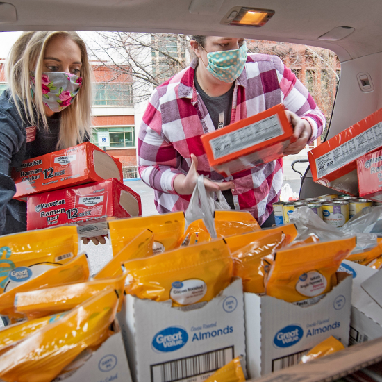
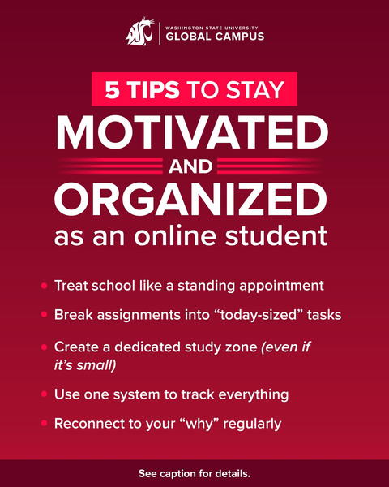
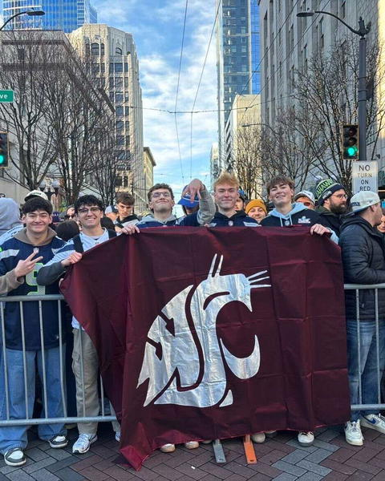
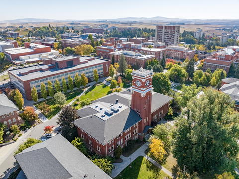
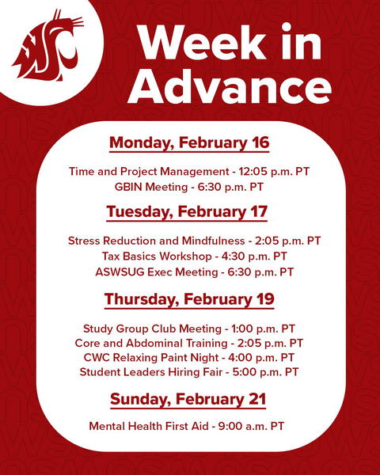

# Page Scan Report

| Field | Value |
|-------|-------|
| URL | https://wsu.edu/ |
| Title | Washington State University | Washington State University |
| Status | ❌ 0 |
| HTML Size | 187.2 KB |
| Screenshots | 1 (2.6 MB) |
| Images | 26 (2.8 MB) |
| Images Missing Alt | 7 |
| JS Errors | 3 |
| JS Warnings | 0 |
| Auth | none |
| Captured | 2026-02-16T20:58:42.4233071Z |

## JavaScript Errors

- `Failed to load resource: net::ERR_SOCKET_NOT_CONNECTED`
- `Failed to load resource: net::ERR_SOCKET_NOT_CONNECTED`
- `Failed to load resource: net::ERR_SOCKET_NOT_CONNECTED`

## Actions

- Screenshot #1: page-loaded (2.6 MB)
- Downloaded 26 images to /images/

## Screenshots

### 1. page-loaded

## Page Images (26)

| # | Image | Alt Text | Size |
|---|-------|----------|------|
| 1 | [Campus-photo-17-scaled-e1661442335869.jpg](images/Campus-photo-17-scaled-e1661442335869.jpg) | *(none)* | 258.1 KB |
| 2 | [WSU-DAYn-11049_3x2-scaled.jpg](images/WSU-DAYn-11049_3x2-scaled.jpg) | College of Nursing students practicin... | 418.7 KB |
| 3 | [Ana-Cabrera.jpg](images/Ana-Cabrera.jpg) | *(none)* | 353.4 KB |
| 4 | [Mask-group-2.jpg](images/Mask-group-2.jpg) | *(none)* | 487.3 KB |
| 5 | [Grizzly_Bears_7-17-2015___020-1-792x288.jpg](images/Grizzly_Bears_7-17-2015___020-1-792x288.jpg) | *(none)* | 69.7 KB |
| 6 | [FluShotFriday_4888-1.jpg](images/FluShotFriday_4888-1.jpg) | *(none)* | 395.0 KB |
| 7 | [Mask-group-5-792x535.jpg](images/Mask-group-5-792x535.jpg) | *(none)* | 137.9 KB |
| 8 | [Mask-group-6.jpg](images/Mask-group-6.jpg) | *(none)* | 432.7 KB |
| 9 | [385282960.jpg](images/385282960.jpg) | Image posted by wsuglobal to instagram | 45.8 KB |
| 10 | [385282960_user_image.jpg](images/385282960_user_image.jpg) | Profile image for wsuglobal | 2.6 KB |
| 11 | [385241110.jpg](images/385241110.jpg) | Image posted by wsu to instagram | 74.9 KB |
| 12 | [385241110_user_image.jpg](images/385241110_user_image.jpg) | Profile image for wsu | 2.2 KB |
| 13 | [385172962_user_image.jpg](images/385172962_user_image.jpg) | Profile image for wsuglobal | 2.6 KB |
| 14 | [385272025.jpg](images/385272025.jpg) | Image posted by wsupullman to instagram | 52.8 KB |
| 15 | [385272025_user_image.jpg](images/385272025_user_image.jpg) | Profile image for wsupullman | 2.5 KB |
| 16 | [385244080.jpg](images/385244080.jpg) | Image posted by wsupullman to instagram | 44.4 KB |
| 17 | [385244080_user_image.jpg](images/385244080_user_image.jpg) | Profile image for wsupullman | 2.5 KB |
| 18 | [385191223_user_image.jpg](images/385191223_user_image.jpg) | Profile image for wsupullman | 2.5 KB |
| 19 | [385262532.jpg](images/385262532.jpg) | Image posted by wsuglobal to instagram | 45.8 KB |
| 20 | [385262532_user_image.jpg](images/385262532_user_image.jpg) | Profile image for wsuglobal | 2.6 KB |
| 21 | [385211494_user_image.jpg](images/385211494_user_image.jpg) | Profile image for wsupullman | 2.5 KB |
| 22 | [385176190_user_image.jpg](images/385176190_user_image.jpg) | Profile image for wsupullman | 2.5 KB |
| 23 | [385246168.jpg](images/385246168.jpg) | Image posted by wsuglobal to instagram | 60.5 KB |
| 24 | [385246168_user_image.jpg](images/385246168_user_image.jpg) | Profile image for wsuglobal | 2.6 KB |
| 25 | [385208067_user_image.jpg](images/385208067_user_image.jpg) | Profile image for wsuglobal | 2.6 KB |
| 26 | [385165179_user_image.jpg](images/385165179_user_image.jpg) | Profile image for wsueverett | 2.6 KB |

### Gallery

### ⚠️ Images Missing Alt Text (7)

- `Campus-photo-17-scaled-e1661442335869.jpg` — https://s3.wp.wsu.edu/uploads/sites/625/2022/08/Campus-photo-17-scaled-e1661442335869.jpg
- `Ana-Cabrera.jpg` — https://s3.wp.wsu.edu/uploads/sites/625/2025/12/Ana-Cabrera.jpg
- `Mask-group-2.jpg` — https://s3.wp.wsu.edu/uploads/sites/625/2022/07/Mask-group-2.jpg
- `Grizzly_Bears_7-17-2015___020-1-792x288.jpg` — https://s3.wp.wsu.edu/uploads/sites/625/2022/07/Grizzly_Bears_7-17-2015___020-1-792x288.jpg
- `FluShotFriday_4888-1.jpg` — https://s3.wp.wsu.edu/uploads/sites/625/2022/07/FluShotFriday_4888-1.jpg
- `Mask-group-5-792x535.jpg` — https://s3.wp.wsu.edu/uploads/sites/625/2022/07/Mask-group-5-792x535.jpg
- `Mask-group-6.jpg` — https://s3.wp.wsu.edu/uploads/sites/625/2022/07/Mask-group-6.jpg

## Files

- `01-page-loaded.png` — page-loaded (2.6 MB)
- `page.html` — rendered HTML content
- `metadata.json` — machine-readable scan data
- `errors.log` — JavaScript console errors
- `warnings.log` — JavaScript console warnings
- `info.log` — navigation and timing details
- `actions.log` — interactions performed on the page
- `images/` — 26 page images (2.8 MB)
