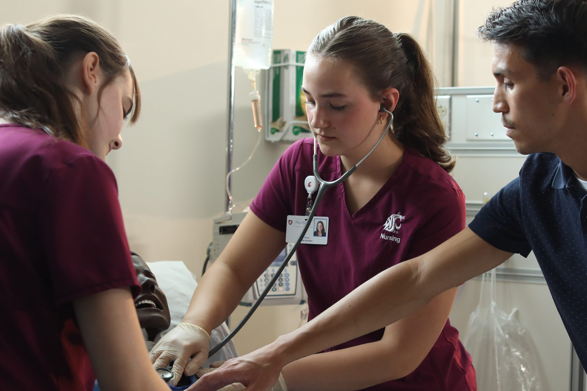
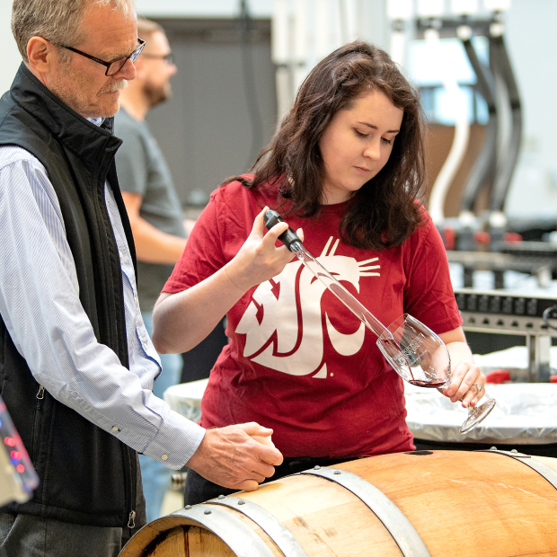
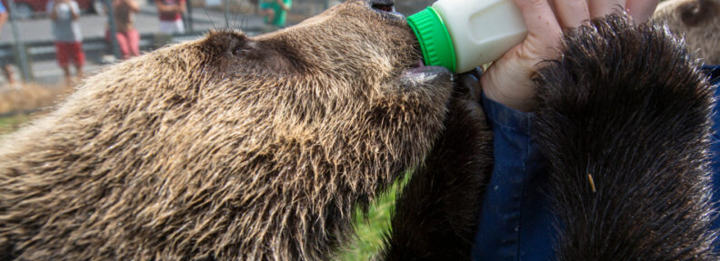
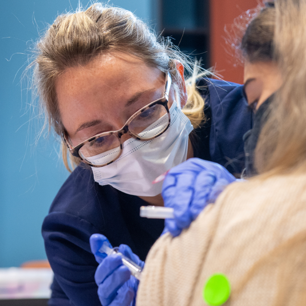

# Page Scan Report

| Field | Value |
|-------|-------|
| URL | https://wsu.edu/ |
| Title | Washington State University | Washington State University |
| Status | ❌ 0 |
| HTML Size | 107.0 KB |
| Screenshots | 1 (923.5 KB) |
| Images | 9 (3.4 MB) |
| Images Missing Alt | 8 |
| JS Errors | 4 |
| JS Warnings | 0 |
| Auth | none |
| Captured | 2026-02-16T20:37:04.9082914Z |

## JavaScript Errors

- `Failed to load resource: net::ERR_SOCKET_NOT_CONNECTED`
- `Failed to load resource: net::ERR_SOCKET_NOT_CONNECTED`
- `Failed to load resource: net::ERR_SOCKET_NOT_CONNECTED`
- `Failed to load resource: net::ERR_TOO_MANY_REDIRECTS`

## Actions

- Screenshot #1: page-loaded (923.5 KB)
- Downloaded 9 images to /images/

## Screenshots

### 1. page-loaded

## Page Images (9)

| # | Image | Alt Text | Size |
|---|-------|----------|------|
| 1 | [Campus-photo-14.jpg](images/Campus-photo-14.jpg) | *(none)* | 916.7 KB |
| 2 | [Campus-photo-17-scaled-e1661442335869.jpg](images/Campus-photo-17-scaled-e1661442335869.jpg) | *(none)* | 258.1 KB |
| 3 | [Chris-Stokes-portrait-and-bobsled-training-run.jpg](images/Chris-Stokes-portrait-and-bobsled-training-run.jpg) | *(none)* | 444.9 KB |
| 4 | [WSU-DAYn-11049_3x2-scaled.jpg](images/WSU-DAYn-11049_3x2-scaled.jpg) | College of Nursing students practicin... | 418.7 KB |
| 5 | [Ana-Cabrera.jpg](images/Ana-Cabrera.jpg) | *(none)* | 353.4 KB |
| 6 | [Mask-group-2.jpg](images/Mask-group-2.jpg) | *(none)* | 487.3 KB |
| 7 | [Grizzly_Bears_7-17-2015___020-1-792x288.jpg](images/Grizzly_Bears_7-17-2015___020-1-792x288.jpg) | *(none)* | 69.7 KB |
| 8 | [FluShotFriday_4888-1.jpg](images/FluShotFriday_4888-1.jpg) | *(none)* | 395.0 KB |
| 9 | [Mask-group-5-792x535.jpg](images/Mask-group-5-792x535.jpg) | *(none)* | 137.9 KB |

### Gallery

### ⚠️ Images Missing Alt Text (8)

- `Campus-photo-14.jpg` — https://s3.wp.wsu.edu/uploads/sites/625/2022/07/Campus-photo-14.jpg
- `Campus-photo-17-scaled-e1661442335869.jpg` — https://s3.wp.wsu.edu/uploads/sites/625/2022/08/Campus-photo-17-scaled-e1661442335869.jpg
- `Chris-Stokes-portrait-and-bobsled-training-run.jpg` — https://s3.wp.wsu.edu/uploads/sites/625/2026/02/Chris-Stokes-portrait-and-bobsled-training-run.jpg
- `Ana-Cabrera.jpg` — https://s3.wp.wsu.edu/uploads/sites/625/2025/12/Ana-Cabrera.jpg
- `Mask-group-2.jpg` — https://s3.wp.wsu.edu/uploads/sites/625/2022/07/Mask-group-2.jpg
- `Grizzly_Bears_7-17-2015___020-1-792x288.jpg` — https://s3.wp.wsu.edu/uploads/sites/625/2022/07/Grizzly_Bears_7-17-2015___020-1-792x288.jpg
- `FluShotFriday_4888-1.jpg` — https://s3.wp.wsu.edu/uploads/sites/625/2022/07/FluShotFriday_4888-1.jpg
- `Mask-group-5-792x535.jpg` — https://s3.wp.wsu.edu/uploads/sites/625/2022/07/Mask-group-5-792x535.jpg

## Files

- `01-page-loaded.png` — page-loaded (923.5 KB)
- `page.html` — rendered HTML content
- `metadata.json` — machine-readable scan data
- `errors.log` — JavaScript console errors
- `warnings.log` — JavaScript console warnings
- `info.log` — navigation and timing details
- `actions.log` — interactions performed on the page
- `images/` — 9 page images (3.4 MB)
