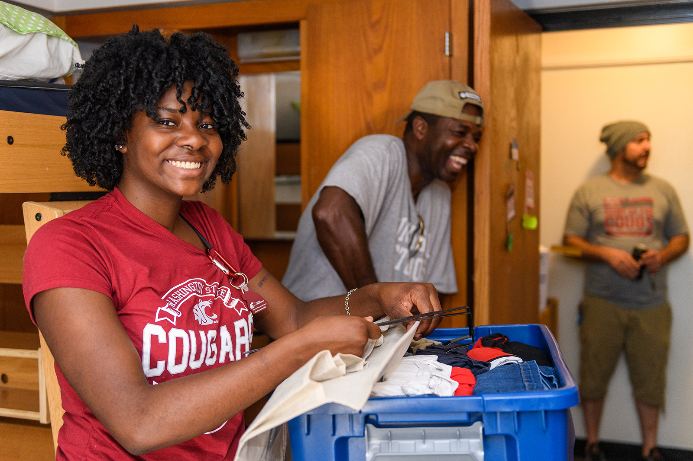
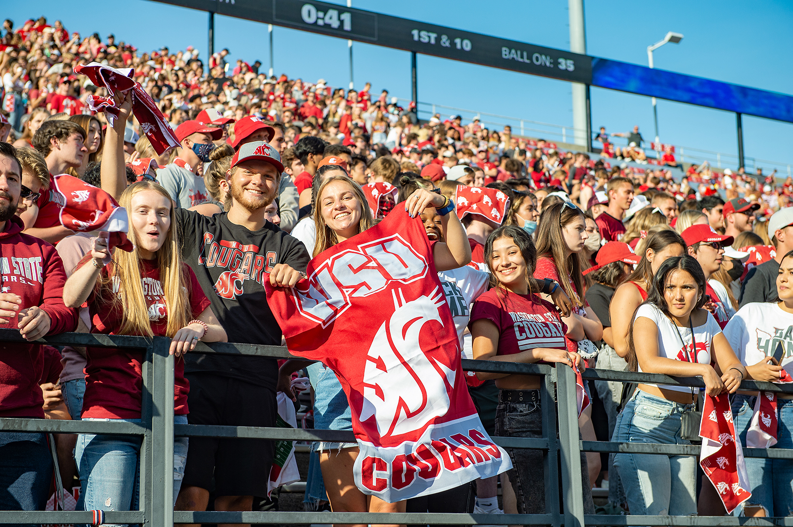
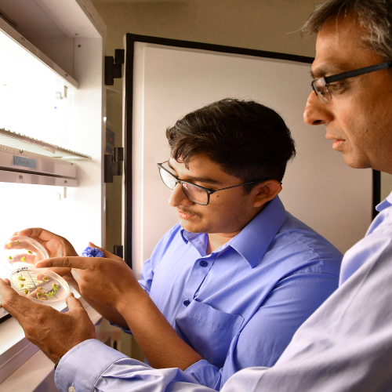
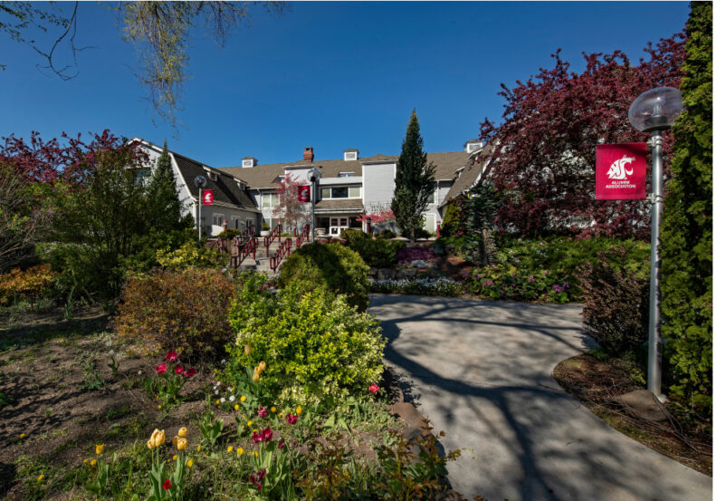
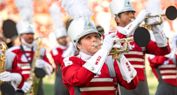

# Page Scan Report

| Field | Value |
|-------|-------|
| URL | https://wsu.edu/about/ |
| Title | About WSU | Washington State University | Washington State University |
| Status | ❌ 0 |
| HTML Size | 124.8 KB |
| Screenshots | 1 (1.9 MB) |
| Images | 15 (7.5 MB) |
| Images Missing Alt | 10 |
| JS Errors | 1 |
| JS Warnings | 0 |
| Auth | none |
| Captured | 2026-02-16T21:00:35.8022116Z |

## JavaScript Errors

- `Failed to load resource: net::ERR_TOO_MANY_REDIRECTS`

## Actions

- Screenshot #1: page-loaded (1.9 MB)
- Downloaded 15 images to /images/

## Screenshots

### 1. page-loaded

## Page Images (15)

| # | Image | Alt Text | Size |
|---|-------|----------|------|
| 1 | [2019-Move-in-Saturday-_-179.jpg](images/2019-Move-in-Saturday-_-179.jpg) | Washington State University students ... | 1.3 MB |
| 2 | [Oct-7-Mural-Painting-_-65.jpg](images/Oct-7-Mural-Painting-_-65.jpg) | Washington State University Intermedi... | 1.1 MB |
| 3 | [PhD-Student-Kaitlin-Witherell_5035.jpg](images/PhD-Student-Kaitlin-Witherell_5035.jpg) | PhD student on the campus of Washingt... | 978.8 KB |
| 4 | [Students-Football-Atmosphere_5321.jpg](images/Students-Football-Atmosphere_5321.jpg) | Happy fans in the crowd cheering the ... | 1.7 MB |
| 5 | [Campus-photo.jpg](images/Campus-photo.jpg) | *(none)* | 279.0 KB |
| 6 | [Campus-photo-1.jpg](images/Campus-photo-1.jpg) | *(none)* | 281.5 KB |
| 7 | [Campus-photo-2.jpg](images/Campus-photo-2.jpg) | *(none)* | 205.2 KB |
| 8 | [Campus-photo-3.jpg](images/Campus-photo-3.jpg) | *(none)* | 311.8 KB |
| 9 | [Campus-photo-4.jpg](images/Campus-photo-4.jpg) | *(none)* | 187.3 KB |
| 10 | [Campus-photo-5.jpg](images/Campus-photo-5.jpg) | *(none)* | 168.4 KB |
| 11 | [Community-Pic.jpg](images/Community-Pic.jpg) | *(none)* | 399.1 KB |
| 12 | [Community-Pic-1.jpg](images/Community-Pic-1.jpg) | *(none)* | 273.6 KB |
| 13 | [Alumni-Center-Pic-792x553.jpg](images/Alumni-Center-Pic-792x553.jpg) | *(none)* | 146.5 KB |
| 14 | [Band-Pic.jpg](images/Band-Pic.jpg) | *(none)* | 108.1 KB |
| 15 | [ButchCheer_0851-3-792x792.jpg](images/ButchCheer_0851-3-792x792.jpg) | Student dressed in Butch T. Cougar co... | 103.7 KB |

### Gallery

### ⚠️ Images Missing Alt Text (10)

- `Campus-photo.jpg` — https://s3.wp.wsu.edu/uploads/sites/625/2022/07/Campus-photo.jpg
- `Campus-photo-1.jpg` — https://s3.wp.wsu.edu/uploads/sites/625/2022/07/Campus-photo-1.jpg
- `Campus-photo-2.jpg` — https://s3.wp.wsu.edu/uploads/sites/625/2022/07/Campus-photo-2.jpg
- `Campus-photo-3.jpg` — https://s3.wp.wsu.edu/uploads/sites/625/2022/07/Campus-photo-3.jpg
- `Campus-photo-4.jpg` — https://s3.wp.wsu.edu/uploads/sites/625/2022/07/Campus-photo-4.jpg
- `Campus-photo-5.jpg` — https://s3.wp.wsu.edu/uploads/sites/625/2022/07/Campus-photo-5.jpg
- `Community-Pic.jpg` — https://s3.wp.wsu.edu/uploads/sites/625/2022/07/Community-Pic.jpg
- `Community-Pic-1.jpg` — https://s3.wp.wsu.edu/uploads/sites/625/2022/07/Community-Pic-1.jpg
- `Alumni-Center-Pic-792x553.jpg` — https://s3.wp.wsu.edu/uploads/sites/625/2022/07/Alumni-Center-Pic-792x553.jpg
- `Band-Pic.jpg` — https://s3.wp.wsu.edu/uploads/sites/625/2022/07/Band-Pic.jpg

## Files

- `01-page-loaded.png` — page-loaded (1.9 MB)
- `page.html` — rendered HTML content
- `metadata.json` — machine-readable scan data
- `errors.log` — JavaScript console errors
- `warnings.log` — JavaScript console warnings
- `info.log` — navigation and timing details
- `actions.log` — interactions performed on the page
- `images/` — 15 page images (7.5 MB)
