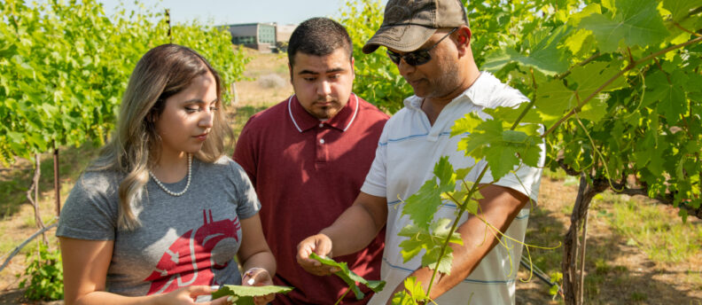
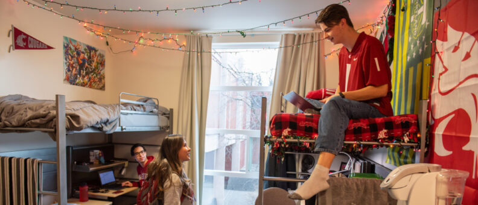
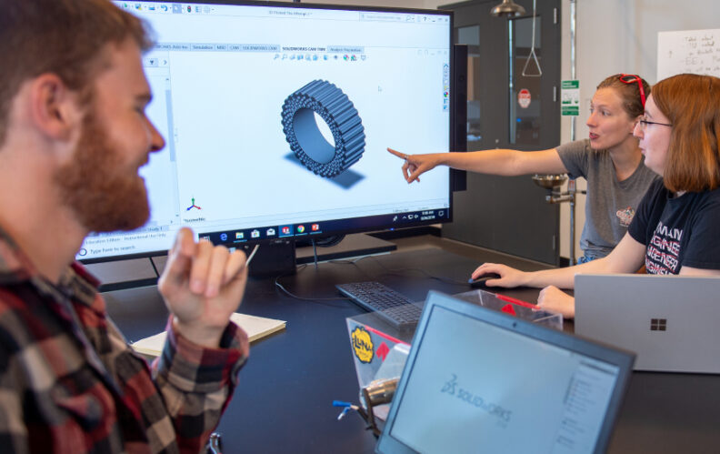

# Page Scan Report

| Field | Value |
|-------|-------|
| URL | https://wsu.edu/about/accolades/ |
| Title | Accolades | Washington State University | Washington State University |
| Status | ❌ 0 |
| HTML Size | 107.9 KB |
| Screenshots | 1 (2.6 MB) |
| Images | 11 (1.7 MB) |
| Images Missing Alt | 11 |
| JS Errors | 1 |
| JS Warnings | 0 |
| Auth | none |
| Captured | 2026-02-16T20:39:23.0693690Z |

## JavaScript Errors

- `Failed to load resource: net::ERR_TOO_MANY_REDIRECTS`

## Actions

- Screenshot #1: page-loaded (2.6 MB)
- Downloaded 11 images to /images/

## Screenshots

### 1. page-loaded

## Page Images (11)

| # | Image | Alt Text | Size |
|---|-------|----------|------|
| 1 | [Campus-photo-25-792x344.jpg](images/Campus-photo-25-792x344.jpg) | *(none)* | 90.4 KB |
| 2 | [Commencment-BH_5884-1.jpg](images/Commencment-BH_5884-1.jpg) | *(none)* | 417.2 KB |
| 3 | [Technicolor_Heart_1239-1-792x529.jpg](images/Technicolor_Heart_1239-1-792x529.jpg) | *(none)* | 155.3 KB |
| 4 | [CBBRBusinessClass_1972-1.jpg](images/CBBRBusinessClass_1972-1.jpg) | *(none)* | 236.8 KB |
| 5 | [ResidenceHallRoomGlobalScholars_7820-1-792x340.jpg](images/ResidenceHallRoomGlobalScholars_7820-1-792x340.jpg) | *(none)* | 71.2 KB |
| 6 | [WSU-Eggert-Organic-Farm_8083-1-792x380.jpg](images/WSU-Eggert-Organic-Farm_8083-1-792x380.jpg) | *(none)* | 60.6 KB |
| 7 | [nwccu-logo-1.jpg](images/nwccu-logo-1.jpg) | *(none)* | 34.9 KB |
| 8 | [Everett_4913-1-792x499.jpg](images/Everett_4913-1-792x499.jpg) | *(none)* | 69.5 KB |
| 9 | [Vancouver_9002-1.jpg](images/Vancouver_9002-1.jpg) | *(none)* | 475.4 KB |
| 10 | [TriCities_3937-1-792x375.jpg](images/TriCities_3937-1-792x375.jpg) | *(none)* | 60.1 KB |
| 11 | [Alumni-Centre-Bell-Flowers_5126-1-792x345.jpg](images/Alumni-Centre-Bell-Flowers_5126-1-792x345.jpg) | *(none)* | 58.7 KB |

### Gallery

### ⚠️ Images Missing Alt Text (11)

- `Campus-photo-25-792x344.jpg` — https://s3.wp.wsu.edu/uploads/sites/625/2022/11/Campus-photo-25-792x344.jpg
- `Commencment-BH_5884-1.jpg` — https://s3.wp.wsu.edu/uploads/sites/625/2022/11/Commencment-BH_5884-1.jpg
- `Technicolor_Heart_1239-1-792x529.jpg` — https://s3.wp.wsu.edu/uploads/sites/625/2022/11/Technicolor_Heart_1239-1-792x529.jpg
- `CBBRBusinessClass_1972-1.jpg` — https://s3.wp.wsu.edu/uploads/sites/625/2022/11/CBBRBusinessClass_1972-1.jpg
- `ResidenceHallRoomGlobalScholars_7820-1-792x340.jpg` — https://s3.wp.wsu.edu/uploads/sites/625/2022/11/ResidenceHallRoomGlobalScholars_7820-1-792x340.jpg
- `WSU-Eggert-Organic-Farm_8083-1-792x380.jpg` — https://s3.wp.wsu.edu/uploads/sites/625/2022/11/WSU-Eggert-Organic-Farm_8083-1-792x380.jpg
- `nwccu-logo-1.jpg` — https://s3.wp.wsu.edu/uploads/sites/625/2022/11/nwccu-logo-1.jpg
- `Everett_4913-1-792x499.jpg` — https://s3.wp.wsu.edu/uploads/sites/625/2022/11/Everett_4913-1-792x499.jpg
- `Vancouver_9002-1.jpg` — https://s3.wp.wsu.edu/uploads/sites/625/2022/11/Vancouver_9002-1.jpg
- `TriCities_3937-1-792x375.jpg` — https://s3.wp.wsu.edu/uploads/sites/625/2022/11/TriCities_3937-1-792x375.jpg
- `Alumni-Centre-Bell-Flowers_5126-1-792x345.jpg` — https://s3.wp.wsu.edu/uploads/sites/625/2022/11/Alumni-Centre-Bell-Flowers_5126-1-792x345.jpg

## Files

- `01-page-loaded.png` — page-loaded (2.6 MB)
- `page.html` — rendered HTML content
- `metadata.json` — machine-readable scan data
- `errors.log` — JavaScript console errors
- `warnings.log` — JavaScript console warnings
- `info.log` — navigation and timing details
- `actions.log` — interactions performed on the page
- `images/` — 11 page images (1.7 MB)
