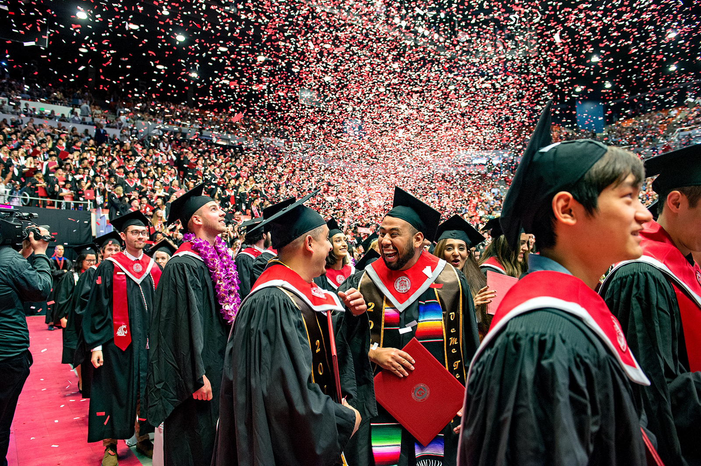
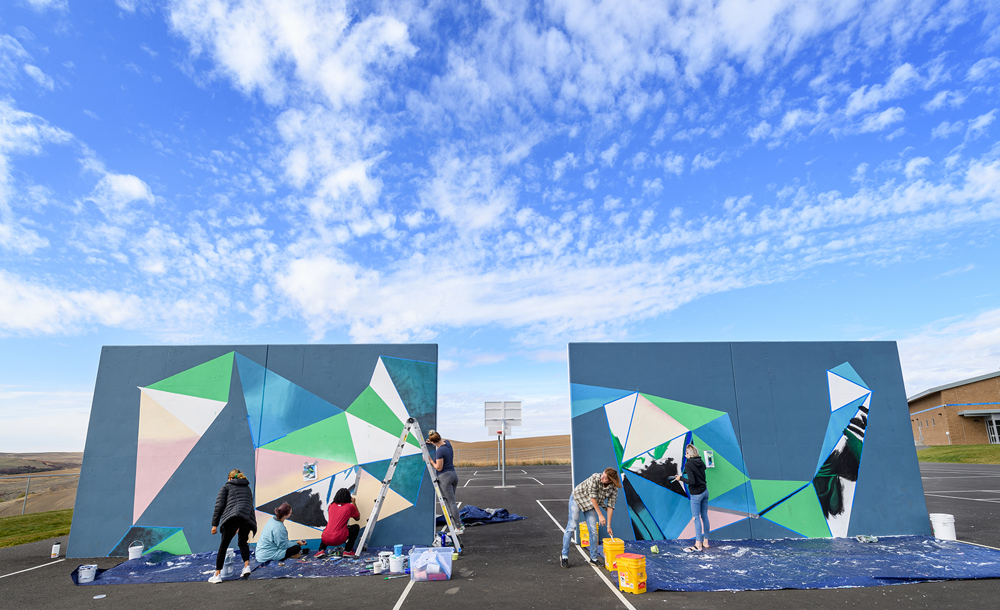
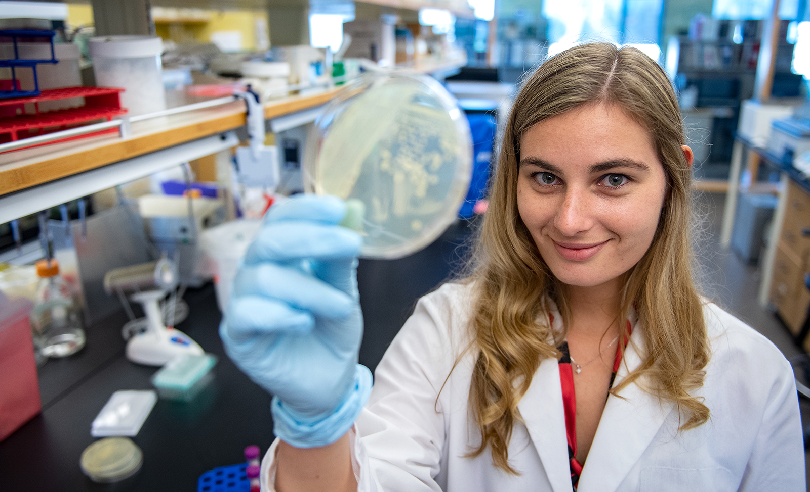
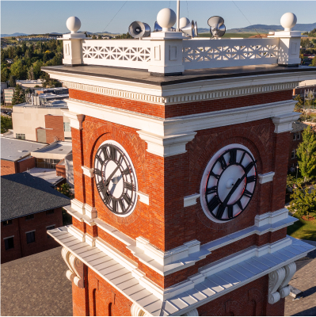
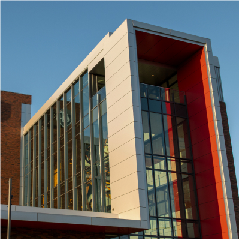
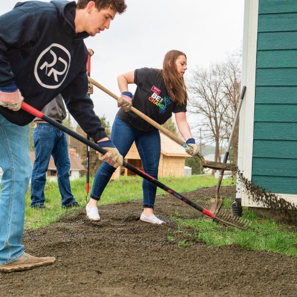
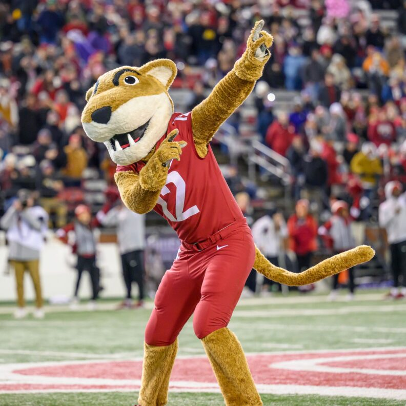

# 📄 Page Scan Report

> **URL:** https://wsu.edu/about/facts/  
> **Captured:** 2026-02-16 22:09:43 UTC  
> **Status:** ✅ 200  

---

## 📑 Contents

- [Summary](#-summary)
- [Screenshots](#-screenshots)
- [Page Images](#-page-images)
- [JavaScript Errors](#-javascript-errors)
- [Actions](#-actions)
- [Files](#-files)

---

## 📋 Summary

| Field | Value |
|-------|-------|
| URL | https://wsu.edu/about/facts/ |
| Redirected To | https://wsu.edu/about/ |
| Title | About WSU | Washington State University | Washington State University |
| Status | ✅ 200 |
| HTML Size | 131.1 KB |
| Screenshots | 1 (3.0 MB) |
| Images | 16 (9.8 MB) |
| Images Missing Alt | ⚠️ 10 |
| JS Errors | 🔴 1 |
| JS Warnings | 0 |
| Auth | none |
| Captured | 2026-02-16T22:09:43.9281390Z |

## 🔴 JavaScript Errors

<details>
<summary><strong>1 error(s) detected</strong></summary>

```
Failed to load resource: net::ERR_TOO_MANY_REDIRECTS
```

</details>

## 🔧 Actions

<details>
<summary><strong>2 action(s) performed</strong></summary>

- Screenshot #1: page-loaded (3.0 MB)
- Downloaded 16 images to /images/

</details>

## 📸 Screenshots

<table>
<tr>
<td align="center" width="50%">
<a href="01-page-loaded.png">

</a>
<br /><strong>1. page-loaded</strong>
<br /><sub>3.0 MB</sub>
</td>
<td></td>
</tr>
</table>

## 🖼️ Page Images (16)

<details open>
<summary><strong>📋 Image Index</strong> — 16 images, 9.8 MB</summary>

| # | Image | Alt Text | Size |
|--:|-------|----------|-----:|
| 1 | [2019-Move-in-Saturday-_-179.jpg](images/2019-Move-in-Saturday-_-179.jpg) | Washington State University students ... | 1.3 MB |
| 2 | [Commencement_1948.jpg](images/Commencement_1948.jpg) | WSU students partake and celebrate du... | 2.3 MB |
| 3 | [Oct-7-Mural-Painting-_-65.jpg](images/Oct-7-Mural-Painting-_-65.jpg) | Washington State University Intermedi... | 1.1 MB |
| 4 | [PhD-Student-Kaitlin-Witherell_5035.jpg](images/PhD-Student-Kaitlin-Witherell_5035.jpg) | PhD student on the campus of Washingt... | 978.8 KB |
| 5 | [Students-Football-Atmosphere_5321.jpg](images/Students-Football-Atmosphere_5321.jpg) | Happy fans in the crowd cheering the ... | 1.7 MB |
| 6 | [Campus-photo.jpg](images/Campus-photo.jpg) | ⚠️ *(missing)* | 279.0 KB |
| 7 | [Campus-photo-1.jpg](images/Campus-photo-1.jpg) | ⚠️ *(missing)* | 281.5 KB |
| 8 | [Campus-photo-2.jpg](images/Campus-photo-2.jpg) | ⚠️ *(missing)* | 205.2 KB |
| 9 | [Campus-photo-3.jpg](images/Campus-photo-3.jpg) | ⚠️ *(missing)* | 311.8 KB |
| 10 | [Campus-photo-4.jpg](images/Campus-photo-4.jpg) | ⚠️ *(missing)* | 187.3 KB |
| 11 | [Campus-photo-5.jpg](images/Campus-photo-5.jpg) | ⚠️ *(missing)* | 168.4 KB |
| 12 | [Community-Pic.jpg](images/Community-Pic.jpg) | ⚠️ *(missing)* | 399.1 KB |
| 13 | [Community-Pic-1.jpg](images/Community-Pic-1.jpg) | ⚠️ *(missing)* | 273.6 KB |
| 14 | [Alumni-Center-Pic-792x553.jpg](images/Alumni-Center-Pic-792x553.jpg) | ⚠️ *(missing)* | 146.5 KB |
| 15 | [Band-Pic.jpg](images/Band-Pic.jpg) | ⚠️ *(missing)* | 108.1 KB |
| 16 | [ButchCheer_0851-3-792x792.jpg](images/ButchCheer_0851-3-792x792.jpg) | Student dressed in Butch T. Cougar co... | 103.7 KB |

</details>

<details open>
<summary><strong>🖼️ Gallery</strong></summary>

<table>
<tr>
<td align="center" width="33%">
<a href="images/2019-Move-in-Saturday-_-179.jpg">

</a>
<br /><sub>2019-Move-in-Saturday-_-179.jpg</sub>
</td>
<td align="center" width="33%">
<a href="images/Commencement_1948.jpg">

</a>
<br /><sub>Commencement_1948.jpg</sub>
</td>
<td align="center" width="33%">
<a href="images/Oct-7-Mural-Painting-_-65.jpg">

</a>
<br /><sub>Oct-7-Mural-Painting-_-65.jpg</sub>
</td>
</tr>
<tr>
<td align="center" width="33%">
<a href="images/PhD-Student-Kaitlin-Witherell_5035.jpg">

</a>
<br /><sub>PhD-Student-Kaitlin-Witherell_5035.jpg</sub>
</td>
<td align="center" width="33%">
<a href="images/Students-Football-Atmosphere_5321.jpg">

</a>
<br /><sub>Students-Football-Atmosphere_5321.jpg</sub>
</td>
<td align="center" width="33%">
<a href="images/Campus-photo.jpg">

</a>
<br /><sub>Campus-photo.jpg ⚠️</sub>
</td>
</tr>
<tr>
<td align="center" width="33%">
<a href="images/Campus-photo-1.jpg">

</a>
<br /><sub>Campus-photo-1.jpg ⚠️</sub>
</td>
<td align="center" width="33%">
<a href="images/Campus-photo-2.jpg">

</a>
<br /><sub>Campus-photo-2.jpg ⚠️</sub>
</td>
<td align="center" width="33%">
<a href="images/Campus-photo-3.jpg">

</a>
<br /><sub>Campus-photo-3.jpg ⚠️</sub>
</td>
</tr>
<tr>
<td align="center" width="33%">
<a href="images/Campus-photo-4.jpg">

</a>
<br /><sub>Campus-photo-4.jpg ⚠️</sub>
</td>
<td align="center" width="33%">
<a href="images/Campus-photo-5.jpg">

</a>
<br /><sub>Campus-photo-5.jpg ⚠️</sub>
</td>
<td align="center" width="33%">
<a href="images/Community-Pic.jpg">

</a>
<br /><sub>Community-Pic.jpg ⚠️</sub>
</td>
</tr>
<tr>
<td align="center" width="33%">
<a href="images/Community-Pic-1.jpg">

</a>
<br /><sub>Community-Pic-1.jpg ⚠️</sub>
</td>
<td align="center" width="33%">
<a href="images/Alumni-Center-Pic-792x553.jpg">

</a>
<br /><sub>Alumni-Center-Pic-792x553.jpg ⚠️</sub>
</td>
<td align="center" width="33%">
<a href="images/Band-Pic.jpg">

</a>
<br /><sub>Band-Pic.jpg ⚠️</sub>
</td>
</tr>
<tr>
<td align="center" width="33%">
<a href="images/ButchCheer_0851-3-792x792.jpg">

</a>
<br /><sub>ButchCheer_0851-3-792x792.jpg</sub>
</td>
<td></td>
<td></td>
</tr>
</table>

</details>

<details>
<summary>⚠️ <strong>Images Missing Alt Text</strong> (10)</summary>

| Image | Source URL |
|-------|-----------|
| `Campus-photo.jpg` | https://s3.wp.wsu.edu/uploads/sites/625/2022/07/Campus-photo.jpg |
| `Campus-photo-1.jpg` | https://s3.wp.wsu.edu/uploads/sites/625/2022/07/Campus-photo-1.jpg |
| `Campus-photo-2.jpg` | https://s3.wp.wsu.edu/uploads/sites/625/2022/07/Campus-photo-2.jpg |
| `Campus-photo-3.jpg` | https://s3.wp.wsu.edu/uploads/sites/625/2022/07/Campus-photo-3.jpg |
| `Campus-photo-4.jpg` | https://s3.wp.wsu.edu/uploads/sites/625/2022/07/Campus-photo-4.jpg |
| `Campus-photo-5.jpg` | https://s3.wp.wsu.edu/uploads/sites/625/2022/07/Campus-photo-5.jpg |
| `Community-Pic.jpg` | https://s3.wp.wsu.edu/uploads/sites/625/2022/07/Community-Pic.jpg |
| `Community-Pic-1.jpg` | https://s3.wp.wsu.edu/uploads/sites/625/2022/07/Community-Pic-1.jpg |
| `Alumni-Center-Pic-792x553.jpg` | https://s3.wp.wsu.edu/uploads/sites/625/2022/07/Alumni-Center-Pic-792x553.jpg |
| `Band-Pic.jpg` | https://s3.wp.wsu.edu/uploads/sites/625/2022/07/Band-Pic.jpg |

</details>

## 📁 Files

| File | Description |
|------|-------------|
| `01-page-loaded.png` | page-loaded (3.0 MB) |
| `page.html` | Rendered HTML content |
| `metadata.json` | Machine-readable scan data |
| `errors.log` | JavaScript console errors |
| `warnings.log` | JavaScript console warnings |
| `info.log` | Navigation and timing details |
| `actions.log` | Interactions performed |
| `images/` | 16 page images (9.8 MB) |

---

*Generated by AccessibilityScanner (FreeTools) v1.0*
