# Page Scan Report

| Field | Value |
|-------|-------|
| URL | https://wsu.edu/academics/ |
| Title | WSU Academics | Washington State University | Washington State University |
| Status | ✅ 200 |
| HTML Size | 125.9 KB |
| Screenshots | 1 (3.6 MB) |
| Images | 14 (10.7 MB) |
| Images Missing Alt | 10 |
| JS Errors | 1 |
| JS Warnings | 0 |
| Auth | none |
| Captured | 2026-02-16T21:02:00.0226985Z |

## JavaScript Errors

- `Failed to load resource: net::ERR_TOO_MANY_REDIRECTS`

## Actions

- Screenshot #1: page-loaded (3.6 MB)
- Downloaded 14 images to /images/

## Screenshots

### 1. page-loaded

## Page Images (14)

| # | Image | Alt Text | Size |
|---|-------|----------|------|
| 1 | [Filipino-Cultural-Night-_8253.jpg](images/Filipino-Cultural-Night-_8253.jpg) | Filipino Cultural Night hosted by the... | 1.1 MB |
| 2 | [Game-Day-Atmosphere_8020.jpg](images/Game-Day-Atmosphere_8020.jpg) | ROTC  and Marching Band Leader leads ... | 683.8 KB |
| 3 | [Nursing-Spring-2019_2369.jpg](images/Nursing-Spring-2019_2369.jpg) | WSU Nursing students practice skills ... | 1.2 MB |
| 4 | [Tri-Cities-Core-Fall-2019_3913.jpg](images/Tri-Cities-Core-Fall-2019_3913.jpg) | Students relax and study in the Stude... | 1.3 MB |
| 5 | [Mask-group.jpg](images/Mask-group.jpg) | *(none)* | 163.1 KB |
| 6 | [Mask-group-22.png](images/Mask-group-22.png) | *(none)* | 664.3 KB |
| 7 | [Mask-group-23.png](images/Mask-group-23.png) | *(none)* | 1.5 MB |
| 8 | [Mask-group-7.jpg](images/Mask-group-7.jpg) | *(none)* | 680.3 KB |
| 9 | [Campus-photo-17.png](images/Campus-photo-17.png) | *(none)* | 479.9 KB |
| 10 | [Campus-photo-18.png](images/Campus-photo-18.png) | *(none)* | 719.3 KB |
| 11 | [Campus-photo-19.png](images/Campus-photo-19.png) | *(none)* | 939.8 KB |
| 12 | [Campus-photo-20.png](images/Campus-photo-20.png) | *(none)* | 722.9 KB |
| 13 | [affordable-photo.jpg](images/affordable-photo.jpg) | *(none)* | 246.8 KB |
| 14 | [students.jpg](images/students.jpg) | *(none)* | 404.7 KB |

### Gallery

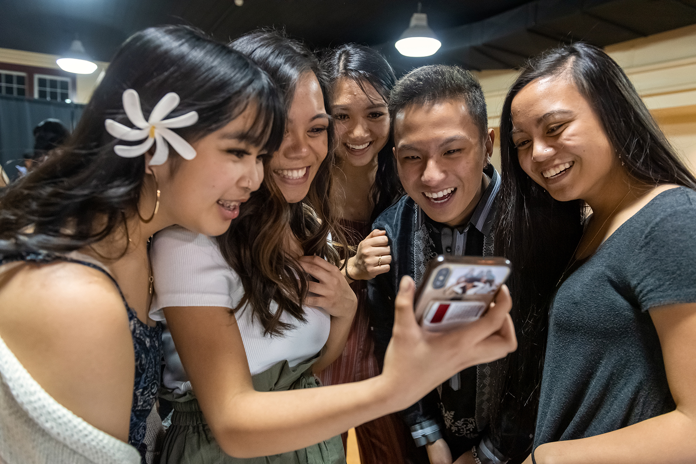

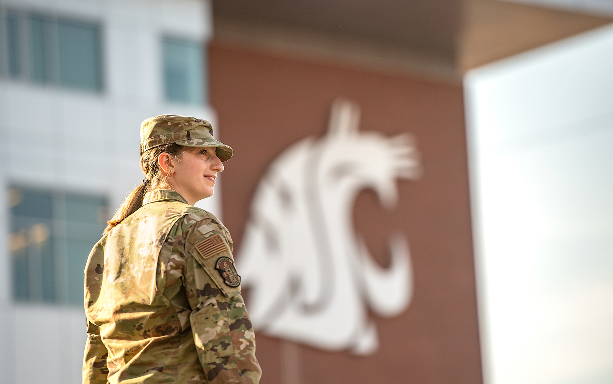

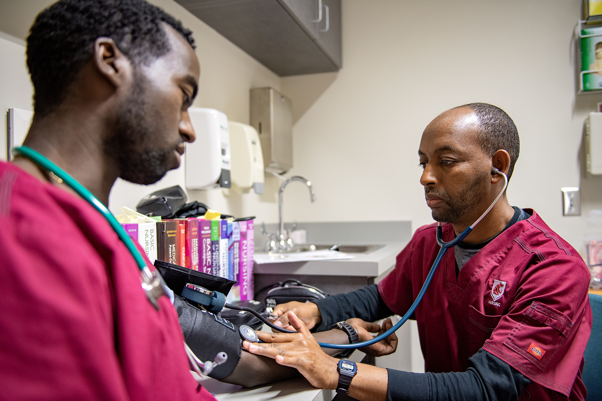

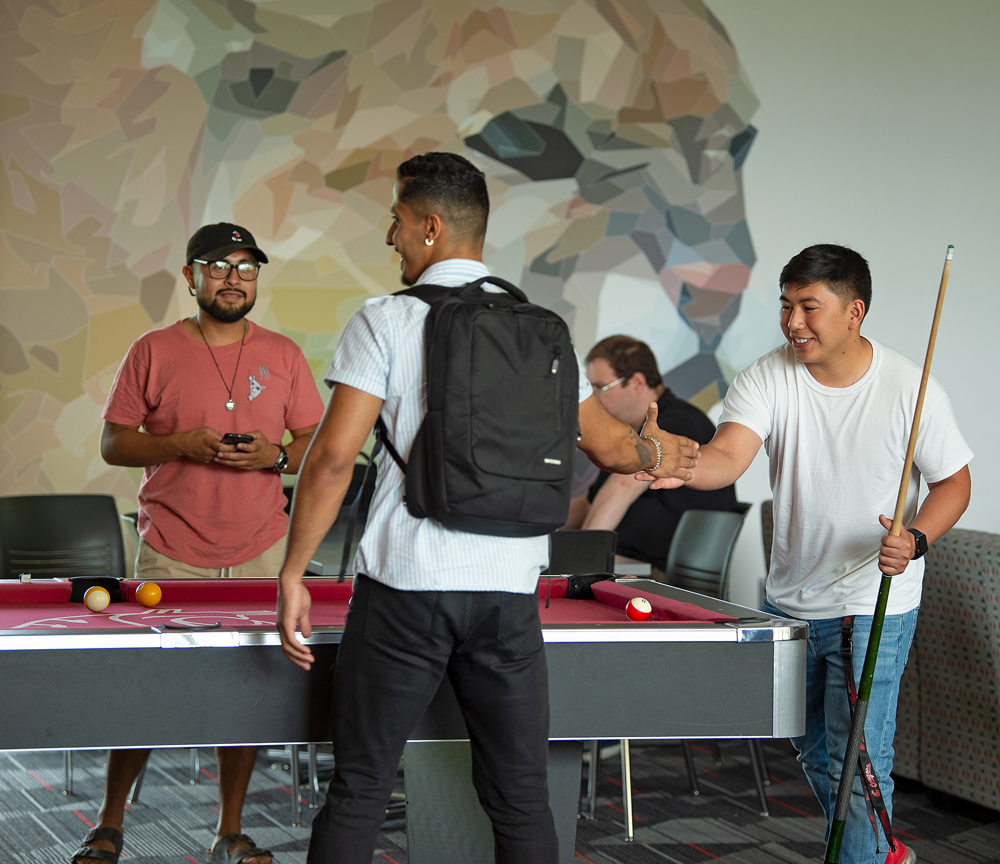

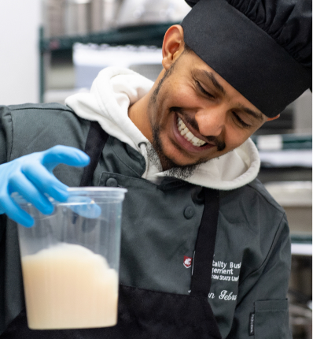

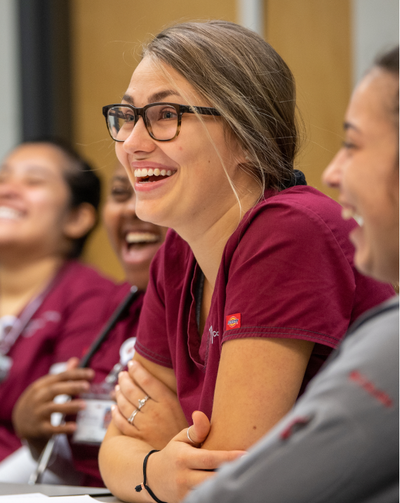

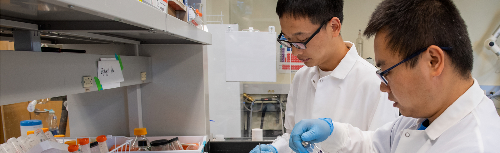

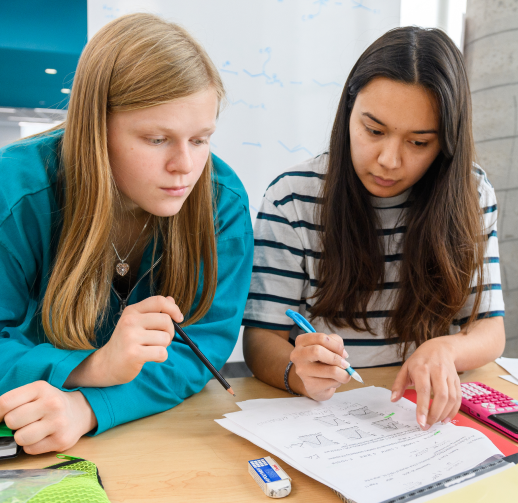

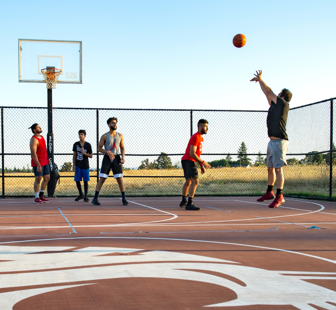

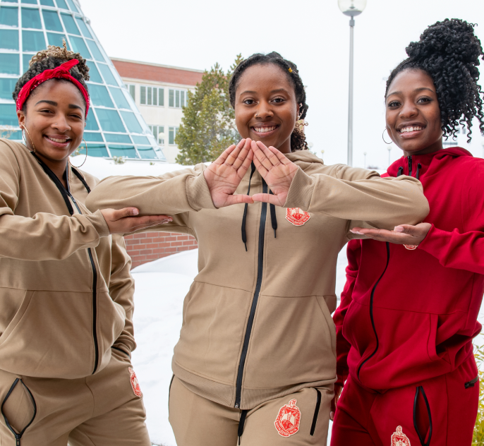

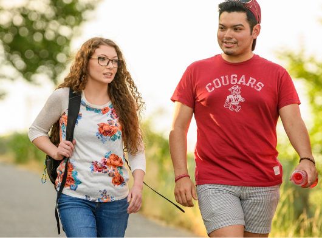

### ⚠️ Images Missing Alt Text (10)

- `Mask-group.jpg` — https://s3.wp.wsu.edu/uploads/sites/625/2022/07/Mask-group.jpg
- `Mask-group-22.png` — https://s3.wp.wsu.edu/uploads/sites/625/2022/07/Mask-group-22.png
- `Mask-group-23.png` — https://s3.wp.wsu.edu/uploads/sites/625/2022/07/Mask-group-23.png
- `Mask-group-7.jpg` — https://s3.wp.wsu.edu/uploads/sites/625/2022/07/Mask-group-7.jpg
- `Campus-photo-17.png` — https://s3.wp.wsu.edu/uploads/sites/625/2022/07/Campus-photo-17.png
- `Campus-photo-18.png` — https://s3.wp.wsu.edu/uploads/sites/625/2022/07/Campus-photo-18.png
- `Campus-photo-19.png` — https://s3.wp.wsu.edu/uploads/sites/625/2022/07/Campus-photo-19.png
- `Campus-photo-20.png` — https://s3.wp.wsu.edu/uploads/sites/625/2022/07/Campus-photo-20.png
- `affordable-photo.jpg` — https://s3.wp.wsu.edu/uploads/sites/625/2022/07/affordable-photo.jpg
- `students.jpg` — https://s3.wp.wsu.edu/uploads/sites/625/2022/07/students.jpg

## Files

- `01-page-loaded.png` — page-loaded (3.6 MB)
- `page.html` — rendered HTML content
- `metadata.json` — machine-readable scan data
- `errors.log` — JavaScript console errors
- `warnings.log` — JavaScript console warnings
- `info.log` — navigation and timing details
- `actions.log` — interactions performed on the page
- `images/` — 14 page images (10.7 MB)
