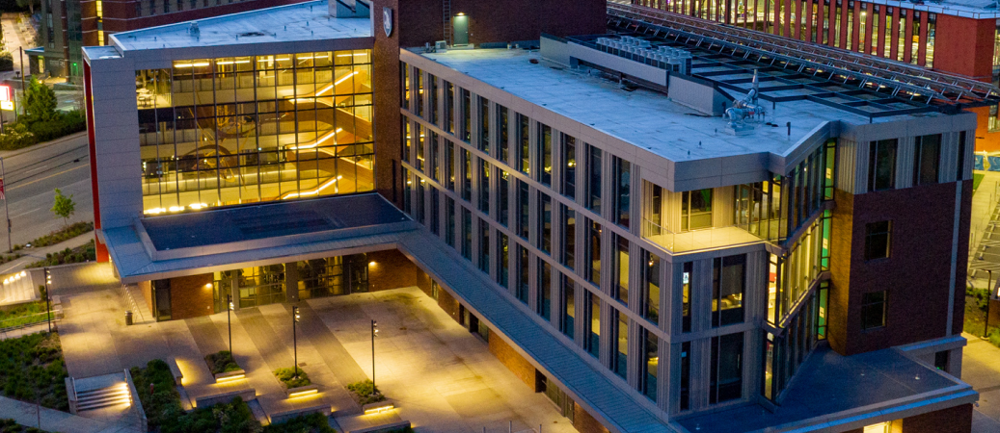
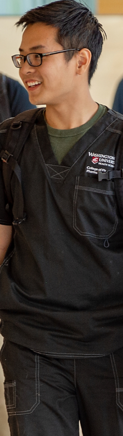
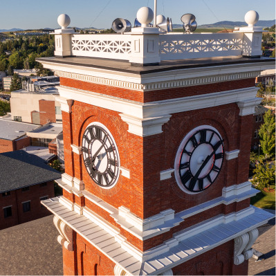
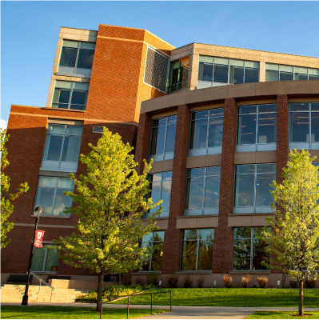
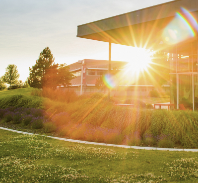
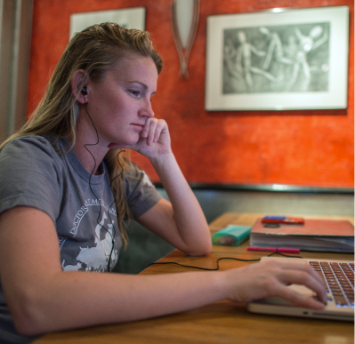

# Page Scan Report

| Field | Value |
|-------|-------|
| URL | https://wsu.edu/admission/ |
| Redirected To | https://wsu.edu/admissions/ |
| Title | WSU Admissions | Washington State University | Washington State University |
| Status | ✅ 200 |
| HTML Size | 117.6 KB |
| Screenshots | 1 (1.8 MB) |
| Images | 11 (5.8 MB) |
| Images Missing Alt | 2 |
| JS Errors | 1 |
| JS Warnings | 2 |
| Auth | none |
| Captured | 2026-02-16T20:40:59.5454837Z |

## JavaScript Errors

- `Failed to load resource: net::ERR_TOO_MANY_REDIRECTS`

## Actions

- Screenshot #1: page-loaded (1.8 MB)
- Downloaded 11 images to /images/

## Screenshots

### 1. page-loaded

## Page Images (11)

| # | Image | Alt Text | Size |
|---|-------|----------|------|
| 1 | [Mask-group-8.png](images/Mask-group-8.png) | *(none)* | 2.3 MB |
| 2 | [Campus-photo-8.png](images/Campus-photo-8.png) | *(none)* | 990.8 KB |
| 3 | [Mask-group-20.png](images/Mask-group-20.png) | Smiling person in a WSU cap holding u... | 561.1 KB |
| 4 | [Mask-group-1.jpg](images/Mask-group-1.jpg) | Smiling student wearing Washington St... | 223.2 KB |
| 5 | [Mask-group-21.png](images/Mask-group-21.png) | Two students with big smiles holding ... | 374.7 KB |
| 6 | [Campus-photo-6.jpg](images/Campus-photo-6.jpg) | The WSU Pullman clock tower. | 277.7 KB |
| 7 | [Campus-photo-7.jpg](images/Campus-photo-7.jpg) | A tree-lined academic building. | 281.5 KB |
| 8 | [Campus-photo-8.jpg](images/Campus-photo-8.jpg) | The sun shining through a WSU Tri-Cit... | 205.2 KB |
| 9 | [Campus-photo-9.jpg](images/Campus-photo-9.jpg) | The sun shining over the WSU Vancouve... | 311.8 KB |
| 10 | [Campus-photo-10.jpg](images/Campus-photo-10.jpg) | A glass-walled building at WSU Everett. | 187.3 KB |
| 11 | [Campus-photo-11.jpg](images/Campus-photo-11.jpg) | A student working on a laptop. | 168.4 KB |

### Gallery

### ⚠️ Images Missing Alt Text (2)

- `Mask-group-8.png` — https://s3.wp.wsu.edu/uploads/sites/625/2022/06/Mask-group-8.png
- `Campus-photo-8.png` — https://s3.wp.wsu.edu/uploads/sites/625/2022/07/Campus-photo-8.png

## Files

- `01-page-loaded.png` — page-loaded (1.8 MB)
- `page.html` — rendered HTML content
- `metadata.json` — machine-readable scan data
- `errors.log` — JavaScript console errors
- `warnings.log` — JavaScript console warnings
- `info.log` — navigation and timing details
- `actions.log` — interactions performed on the page
- `images/` — 11 page images (5.8 MB)
