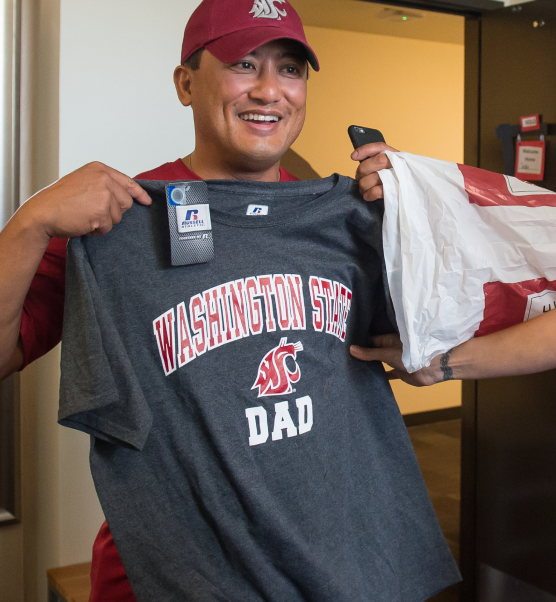
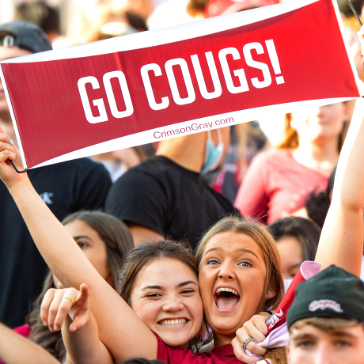
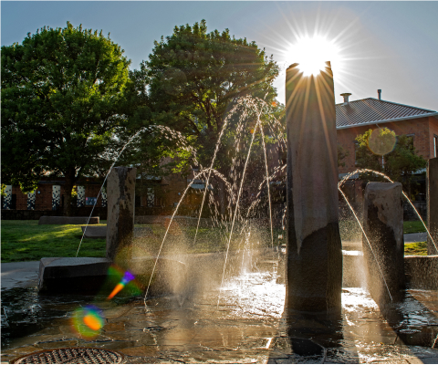

# 📄 Page Scan Report

> **URL:** https://wsu.edu/admissions/  
> **Captured:** 2026-02-16 22:10:26 UTC  
> **Status:** ✅ 200  

---

## 📑 Contents

- [Summary](#-summary)
- [Screenshots](#-screenshots)
- [Page Images](#-page-images)
- [JavaScript Errors](#-javascript-errors)
- [Actions](#-actions)
- [Files](#-files)

---

## 📋 Summary

| Field | Value |
|-------|-------|
| URL | https://wsu.edu/admissions/ |
| Title | WSU Admissions | Washington State University | Washington State University |
| Status | ✅ 200 |
| HTML Size | 117.5 KB |
| Screenshots | 1 (2.0 MB) |
| Images | 11 (5.8 MB) |
| Images Missing Alt | ⚠️ 2 |
| JS Errors | 🔴 1 |
| JS Warnings | 2 |
| Auth | none |
| Captured | 2026-02-16T22:10:26.0801908Z |

## 🔴 JavaScript Errors

<details>
<summary><strong>1 error(s) detected</strong></summary>

```
Failed to load resource: net::ERR_TOO_MANY_REDIRECTS
```

</details>

## 🔧 Actions

<details>
<summary><strong>2 action(s) performed</strong></summary>

- Screenshot #1: page-loaded (2.0 MB)
- Downloaded 11 images to /images/

</details>

## 📸 Screenshots

<table>
<tr>
<td align="center" width="50%">
<a href="01-page-loaded.png">

</a>
<br /><strong>1. page-loaded</strong>
<br /><sub>2.0 MB</sub>
</td>
<td></td>
</tr>
</table>

## 🖼️ Page Images (11)

<details open>
<summary><strong>📋 Image Index</strong> — 11 images, 5.8 MB</summary>

| # | Image | Alt Text | Size |
|--:|-------|----------|-----:|
| 1 | [Mask-group-8.png](images/Mask-group-8.png) | ⚠️ *(missing)* | 2.3 MB |
| 2 | [Campus-photo-8.png](images/Campus-photo-8.png) | ⚠️ *(missing)* | 990.8 KB |
| 3 | [Mask-group-20.png](images/Mask-group-20.png) | Smiling person in a WSU cap holding u... | 561.1 KB |
| 4 | [Mask-group-1.jpg](images/Mask-group-1.jpg) | Smiling student wearing Washington St... | 223.2 KB |
| 5 | [Mask-group-21.png](images/Mask-group-21.png) | Two students with big smiles holding ... | 374.7 KB |
| 6 | [Campus-photo-6.jpg](images/Campus-photo-6.jpg) | The WSU Pullman clock tower. | 277.7 KB |
| 7 | [Campus-photo-7.jpg](images/Campus-photo-7.jpg) | A tree-lined academic building. | 281.5 KB |
| 8 | [Campus-photo-8.jpg](images/Campus-photo-8.jpg) | The sun shining through a WSU Tri-Cit... | 205.2 KB |
| 9 | [Campus-photo-9.jpg](images/Campus-photo-9.jpg) | The sun shining over the WSU Vancouve... | 311.8 KB |
| 10 | [Campus-photo-10.jpg](images/Campus-photo-10.jpg) | A glass-walled building at WSU Everett. | 187.3 KB |
| 11 | [Campus-photo-11.jpg](images/Campus-photo-11.jpg) | A student working on a laptop. | 168.4 KB |

</details>

<details open>
<summary><strong>🖼️ Gallery</strong></summary>

<table>
<tr>
<td align="center" width="33%">
<a href="images/Mask-group-8.png">

</a>
<br /><sub>Mask-group-8.png ⚠️</sub>
</td>
<td align="center" width="33%">
<a href="images/Campus-photo-8.png">

</a>
<br /><sub>Campus-photo-8.png ⚠️</sub>
</td>
<td align="center" width="33%">
<a href="images/Mask-group-20.png">

</a>
<br /><sub>Mask-group-20.png</sub>
</td>
</tr>
<tr>
<td align="center" width="33%">
<a href="images/Mask-group-1.jpg">

</a>
<br /><sub>Mask-group-1.jpg</sub>
</td>
<td align="center" width="33%">
<a href="images/Mask-group-21.png">

</a>
<br /><sub>Mask-group-21.png</sub>
</td>
<td align="center" width="33%">
<a href="images/Campus-photo-6.jpg">

</a>
<br /><sub>Campus-photo-6.jpg</sub>
</td>
</tr>
<tr>
<td align="center" width="33%">
<a href="images/Campus-photo-7.jpg">

</a>
<br /><sub>Campus-photo-7.jpg</sub>
</td>
<td align="center" width="33%">
<a href="images/Campus-photo-8.jpg">

</a>
<br /><sub>Campus-photo-8.jpg</sub>
</td>
<td align="center" width="33%">
<a href="images/Campus-photo-9.jpg">

</a>
<br /><sub>Campus-photo-9.jpg</sub>
</td>
</tr>
<tr>
<td align="center" width="33%">
<a href="images/Campus-photo-10.jpg">

</a>
<br /><sub>Campus-photo-10.jpg</sub>
</td>
<td align="center" width="33%">
<a href="images/Campus-photo-11.jpg">

</a>
<br /><sub>Campus-photo-11.jpg</sub>
</td>
<td></td>
</tr>
</table>

</details>

<details>
<summary>⚠️ <strong>Images Missing Alt Text</strong> (2)</summary>

| Image | Source URL |
|-------|-----------|
| `Mask-group-8.png` | https://s3.wp.wsu.edu/uploads/sites/625/2022/06/Mask-group-8.png |
| `Campus-photo-8.png` | https://s3.wp.wsu.edu/uploads/sites/625/2022/07/Campus-photo-8.png |

</details>

## 📁 Files

| File | Description |
|------|-------------|
| `01-page-loaded.png` | page-loaded (2.0 MB) |
| `page.html` | Rendered HTML content |
| `metadata.json` | Machine-readable scan data |
| `errors.log` | JavaScript console errors |
| `warnings.log` | JavaScript console warnings |
| `info.log` | Navigation and timing details |
| `actions.log` | Interactions performed |
| `images/` | 11 page images (5.8 MB) |

---

*Generated by AccessibilityScanner (FreeTools) v1.0*
