# Page Scan Report

| Field | Value |
|-------|-------|
| URL | https://wsu.edu/athletics/ |
| Title | WSU Athletics | Washington State University | Washington State University |
| Status | ✅ 200 |
| HTML Size | 118.3 KB |
| Screenshots | 1 (3.9 MB) |
| Images | 14 (15.6 MB) |
| Images Missing Alt | 8 |
| JS Errors | 0 |
| JS Warnings | 0 |
| Auth | none |
| Captured | 2026-02-16T20:41:23.5307592Z |

## Actions

- Screenshot #1: page-loaded (3.9 MB)
- Downloaded 14 images to /images/

## Screenshots

### 1. page-loaded

## Page Images (14)

| # | Image | Alt Text | Size |
|---|-------|----------|------|
| 1 | [Baseball-vs-Gonzaga-2020-_-Butch-in-Crowd-_-3108.jpg](images/Baseball-vs-Gonzaga-2020-_-Butch-in-Crowd-_-3108.jpg) | Washington State mascot Butch T. Coug... | 1.5 MB |
| 2 | [Bike-Trail_0146-scaled.jpg](images/Bike-Trail_0146-scaled.jpg) | WSU students ride bikes on the Bill C... | 505.5 KB |
| 3 | [Chinook-Outdoor-Workout_1135.jpg](images/Chinook-Outdoor-Workout_1135.jpg) | A WSU student gets in a good workout ... | 1.8 MB |
| 4 | [Football_Homecoming_2015_Atmosphere_0226.jpg](images/Football_Homecoming_2015_Atmosphere_0226.jpg) | Fans and atmosphere during the Cougar... | 1.4 MB |
| 5 | [Soccer-Fans-_-4854.jpg](images/Soccer-Fans-_-4854.jpg) | A group of Washington State Universit... | 1.1 MB |
| 6 | [WSU-Mens-Basketball-Atmosphere-sh_9204.jpg](images/WSU-Mens-Basketball-Atmosphere-sh_9204.jpg) | Fans celebrate during the WSU Men's B... | 1.5 MB |
| 7 | [Mask-group-7-792x363.png](images/Mask-group-7-792x363.png) | *(none)* | 664.8 KB |
| 8 | [Mask-group-8.png](images/Mask-group-8.png) | *(none)* | 2.3 MB |
| 9 | [Mask-group-9.png](images/Mask-group-9.png) | *(none)* | 770.1 KB |
| 10 | [Mask-group-10.png](images/Mask-group-10.png) | *(none)* | 1.4 MB |
| 11 | [Mask-group-11-792x686.png](images/Mask-group-11-792x686.png) | *(none)* | 797.5 KB |
| 12 | [Mask-group-12.png](images/Mask-group-12.png) | *(none)* | 422.1 KB |
| 13 | [Mask-group-13-792x495.png](images/Mask-group-13-792x495.png) | *(none)* | 589.8 KB |
| 14 | [Mask-group-14.png](images/Mask-group-14.png) | *(none)* | 1001.3 KB |

### Gallery

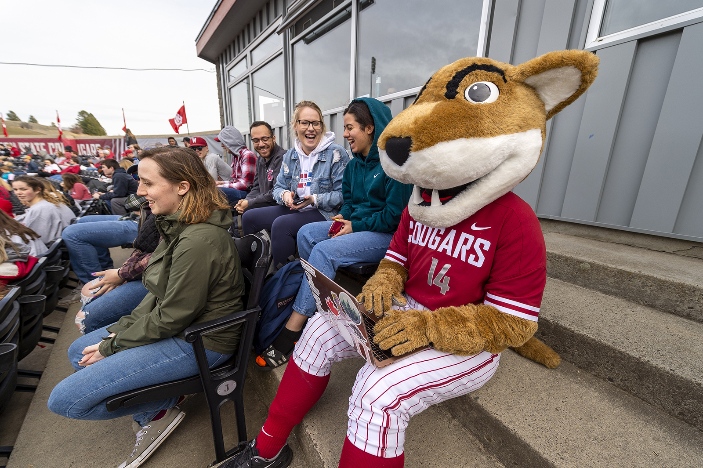

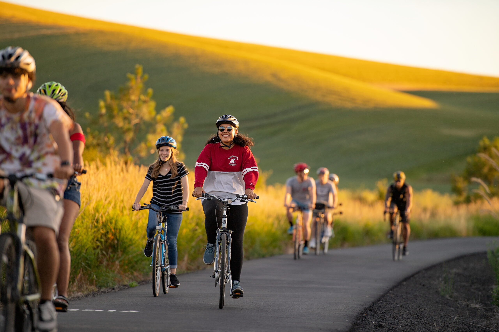

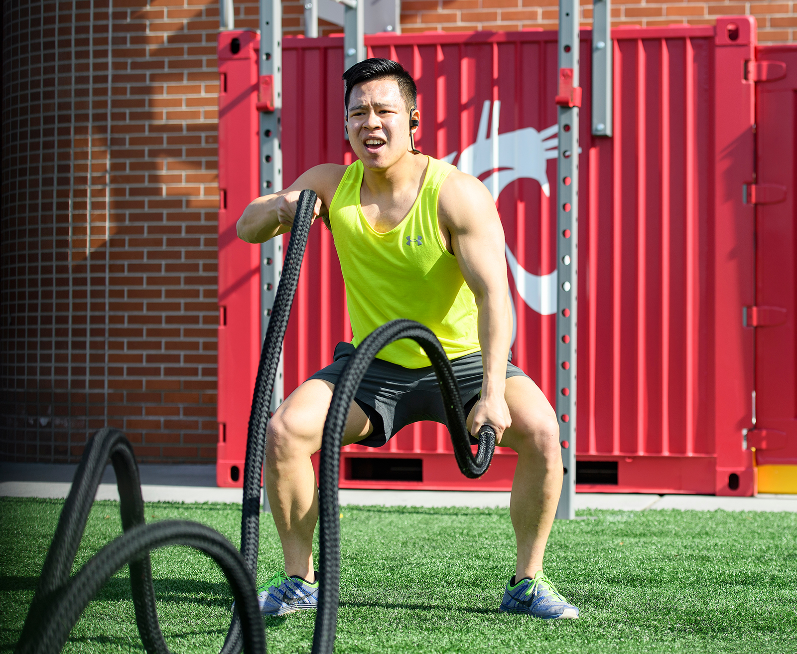

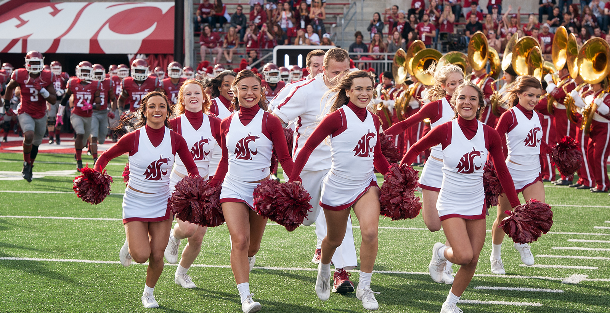

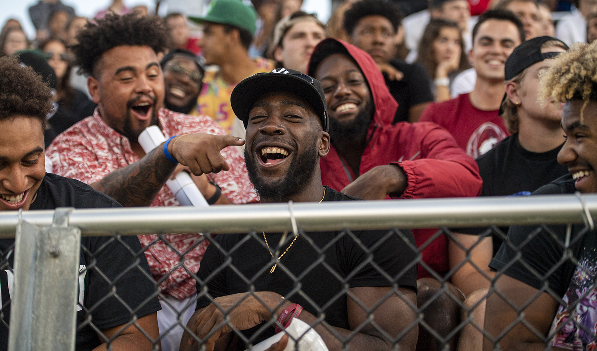

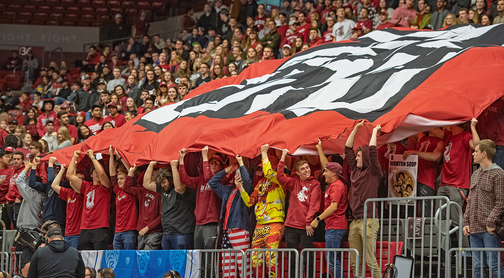

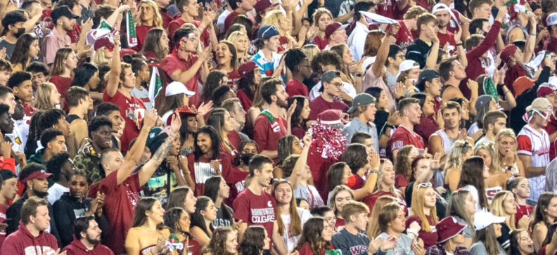

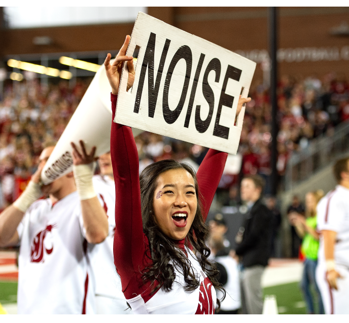

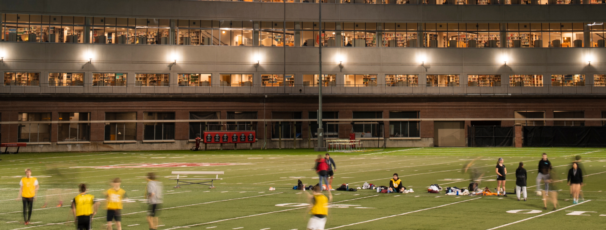

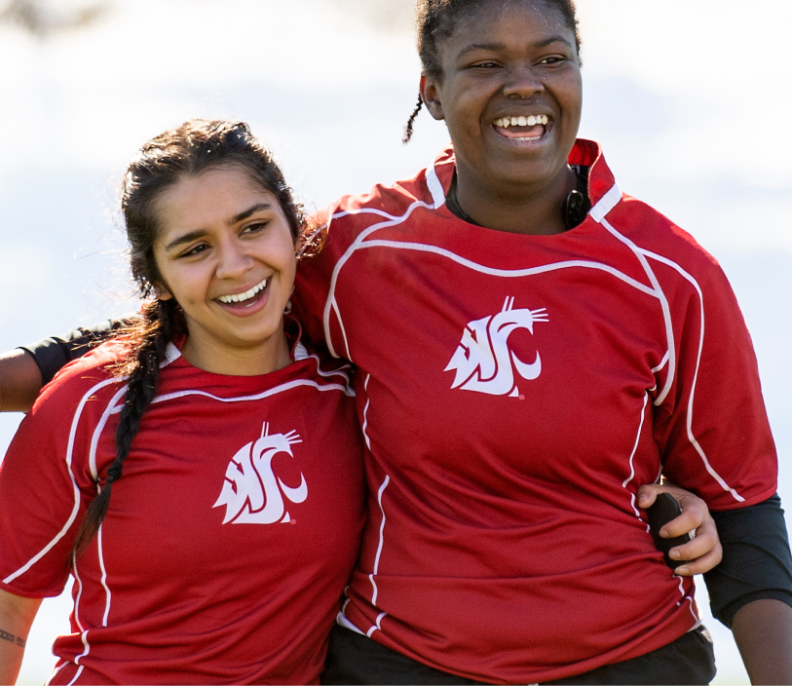

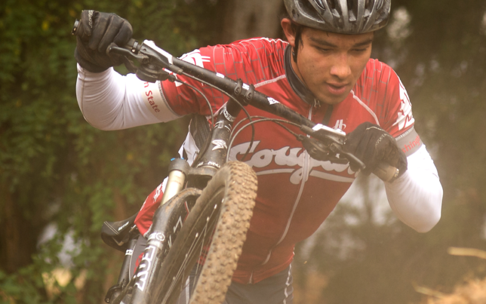

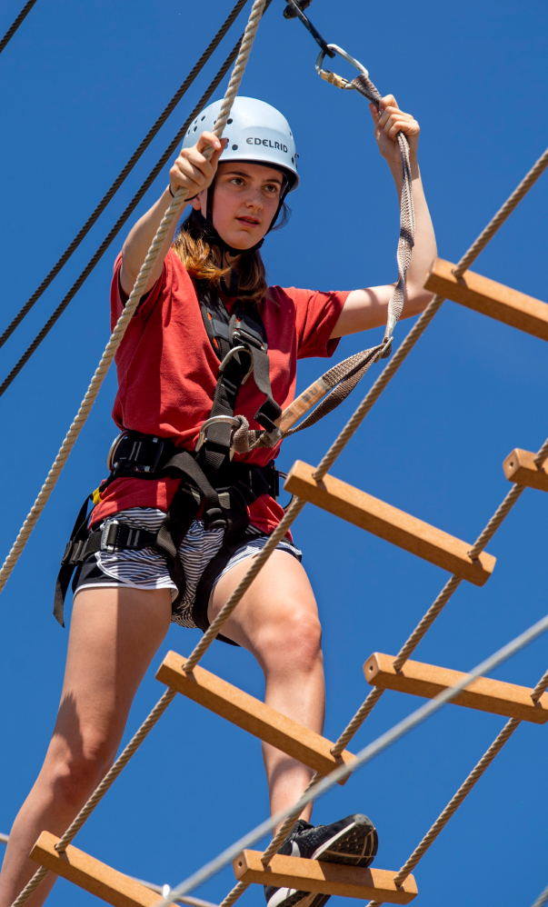

### ⚠️ Images Missing Alt Text (8)

- `Mask-group-7-792x363.png` — https://s3.wp.wsu.edu/uploads/sites/625/2022/06/Mask-group-7-792x363.png
- `Mask-group-8.png` — https://s3.wp.wsu.edu/uploads/sites/625/2022/06/Mask-group-8.png
- `Mask-group-9.png` — https://s3.wp.wsu.edu/uploads/sites/625/2022/06/Mask-group-9.png
- `Mask-group-10.png` — https://s3.wp.wsu.edu/uploads/sites/625/2022/06/Mask-group-10.png
- `Mask-group-11-792x686.png` — https://s3.wp.wsu.edu/uploads/sites/625/2022/06/Mask-group-11-792x686.png
- `Mask-group-12.png` — https://s3.wp.wsu.edu/uploads/sites/625/2022/06/Mask-group-12.png
- `Mask-group-13-792x495.png` — https://s3.wp.wsu.edu/uploads/sites/625/2022/06/Mask-group-13-792x495.png
- `Mask-group-14.png` — https://s3.wp.wsu.edu/uploads/sites/625/2022/06/Mask-group-14.png

## Files

- `01-page-loaded.png` — page-loaded (3.9 MB)
- `page.html` — rendered HTML content
- `metadata.json` — machine-readable scan data
- `errors.log` — JavaScript console errors
- `warnings.log` — JavaScript console warnings
- `info.log` — navigation and timing details
- `actions.log` — interactions performed on the page
- `images/` — 14 page images (15.6 MB)
