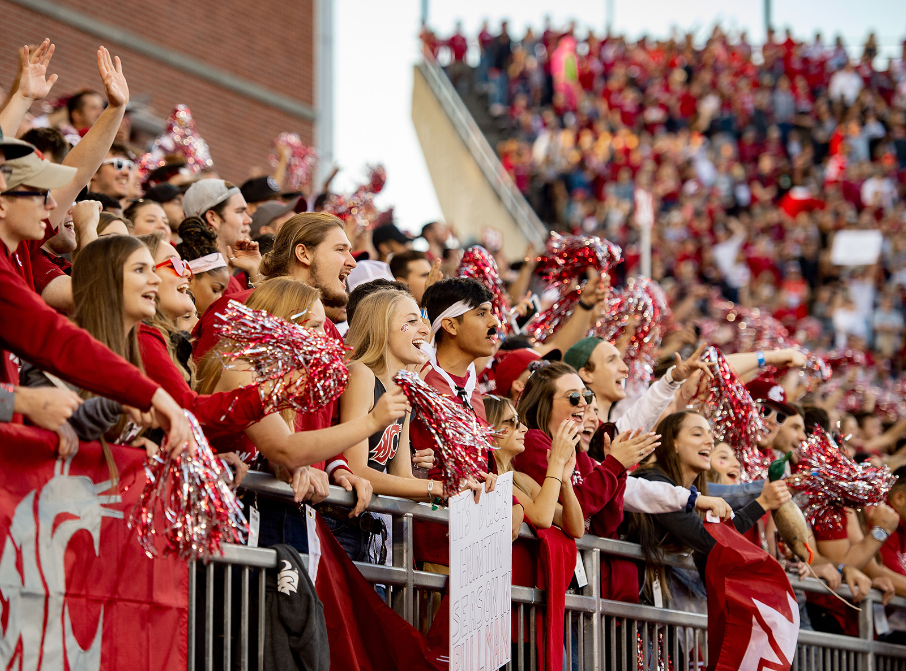
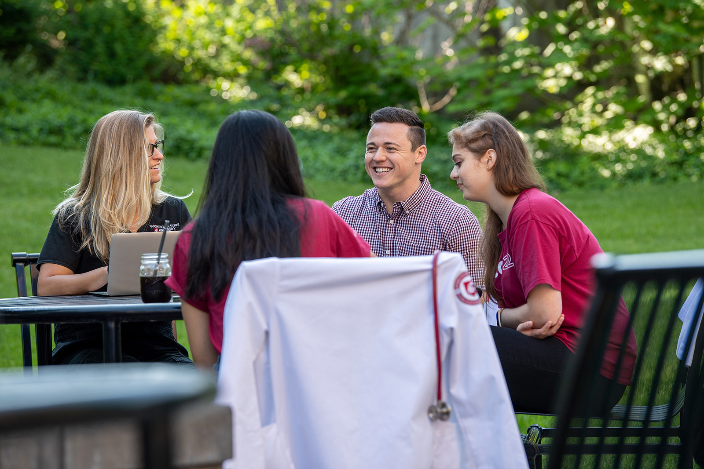
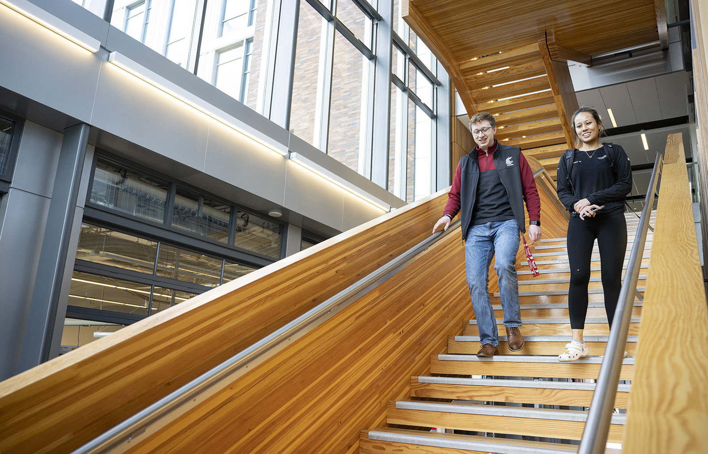
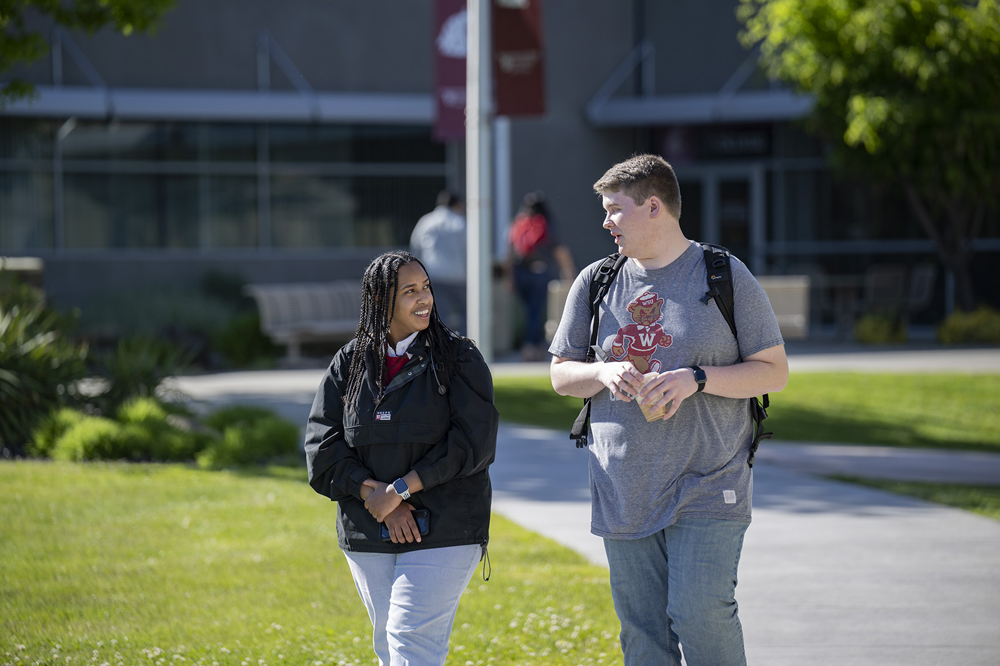
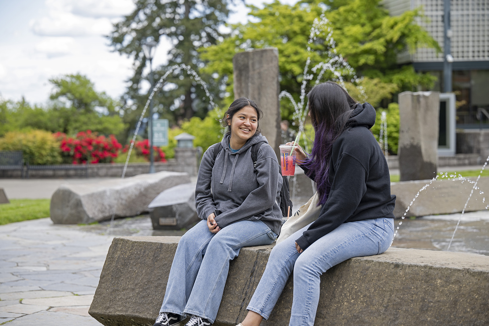
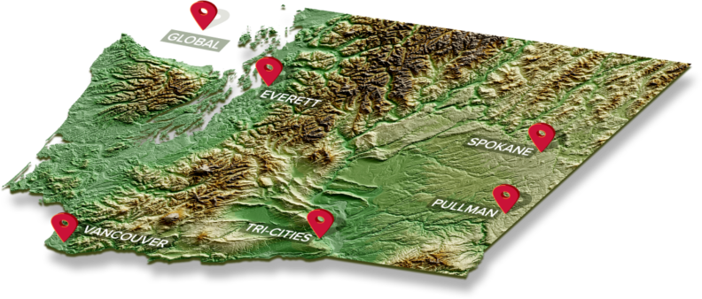
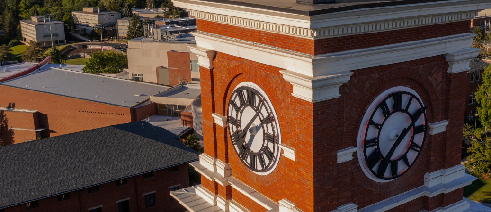
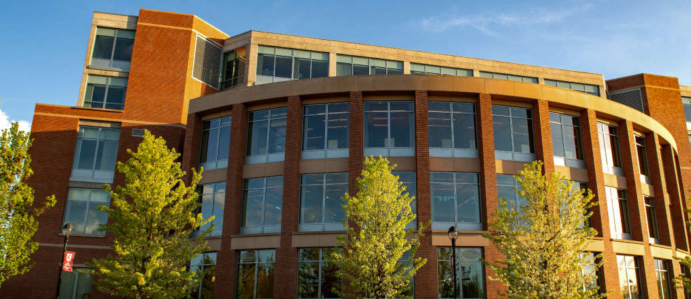
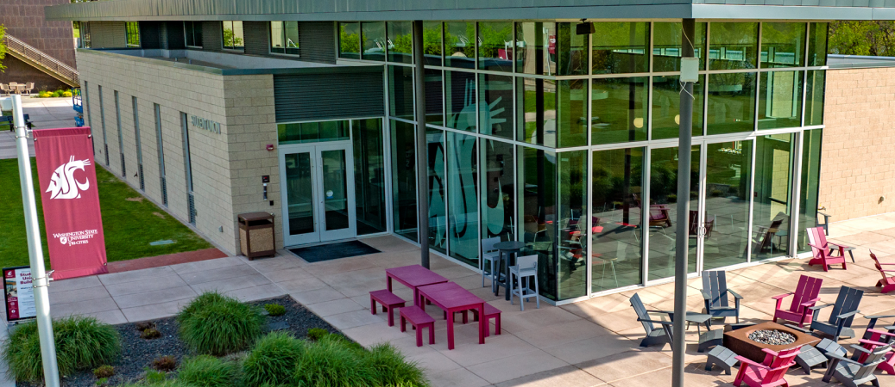
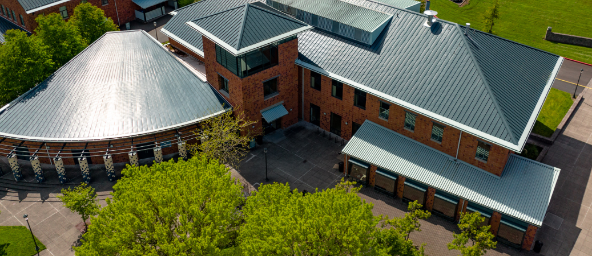

# Page Scan Report

| Field | Value |
|-------|-------|
| URL | https://wsu.edu/campuses/ |
| Title | WSU Campuses | Washington State University | Washington State University |
| Status | ✅ 200 |
| HTML Size | 140.6 KB |
| Screenshots | 1 (7.7 MB) |
| Images | 12 (8.6 MB) |
| Images Missing Alt | 6 |
| JS Errors | 1 |
| JS Warnings | 0 |
| Auth | none |
| Captured | 2026-02-16T21:02:42.8129926Z |

## JavaScript Errors

- `Failed to load resource: net::ERR_TOO_MANY_REDIRECTS`

## Actions

- Screenshot #1: page-loaded (7.7 MB)
- Downloaded 12 images to /images/

## Screenshots

### 1. page-loaded

## Page Images (12)

| # | Image | Alt Text | Size |
|---|-------|----------|------|
| 1 | [Happy-Cougar-Crowd_3423.jpg](images/Happy-Cougar-Crowd_3423.jpg) | WSU Cougar fans cheer at the WSU vs O... | 740.9 KB |
| 2 | [Spokane_1336.jpg](images/Spokane_1336.jpg) | Students enjoy time outside to collab... | 451.2 KB |
| 3 | [WSU-Everett-spring-2022_8014.jpg](images/WSU-Everett-spring-2022_8014.jpg) | Two people walking down a flight of s... | 560.8 KB |
| 4 | [WSU-TriCities-spring-2022_0066.jpg](images/WSU-TriCities-spring-2022_0066.jpg) | Two students talk as they walk around... | 351.0 KB |
| 5 | [WSU-Vancouver-spring-2022_8518.jpg](images/WSU-Vancouver-spring-2022_8518.jpg) | Two smiling students talk while sitti... | 499.9 KB |
| 6 | [WA_Topographic-ISO-01-1-2-792x338.png](images/WA_Topographic-ISO-01-1-2-792x338.png) | A physical map of Washington state wi... | 449.3 KB |
| 7 | [Campus-photo-4.png](images/Campus-photo-4.png) | *(none)* | 957.0 KB |
| 8 | [Campus-photo-5.png](images/Campus-photo-5.png) | *(none)* | 1019.5 KB |
| 9 | [Campus-photo-6.png](images/Campus-photo-6.png) | *(none)* | 950.4 KB |
| 10 | [Campus-photo-7.png](images/Campus-photo-7.png) | *(none)* | 1.1 MB |
| 11 | [Campus-photo-8.png](images/Campus-photo-8.png) | *(none)* | 990.8 KB |
| 12 | [Campus-photo-9.png](images/Campus-photo-9.png) | *(none)* | 737.2 KB |

### Gallery

### ⚠️ Images Missing Alt Text (6)

- `Campus-photo-4.png` — https://s3.wp.wsu.edu/uploads/sites/625/2022/06/Campus-photo-4.png
- `Campus-photo-5.png` — https://s3.wp.wsu.edu/uploads/sites/625/2022/07/Campus-photo-5.png
- `Campus-photo-6.png` — https://s3.wp.wsu.edu/uploads/sites/625/2022/07/Campus-photo-6.png
- `Campus-photo-7.png` — https://s3.wp.wsu.edu/uploads/sites/625/2022/07/Campus-photo-7.png
- `Campus-photo-8.png` — https://s3.wp.wsu.edu/uploads/sites/625/2022/07/Campus-photo-8.png
- `Campus-photo-9.png` — https://s3.wp.wsu.edu/uploads/sites/625/2022/07/Campus-photo-9.png

## Files

- `01-page-loaded.png` — page-loaded (7.7 MB)
- `page.html` — rendered HTML content
- `metadata.json` — machine-readable scan data
- `errors.log` — JavaScript console errors
- `warnings.log` — JavaScript console warnings
- `info.log` — navigation and timing details
- `actions.log` — interactions performed on the page
- `images/` — 12 page images (8.6 MB)
