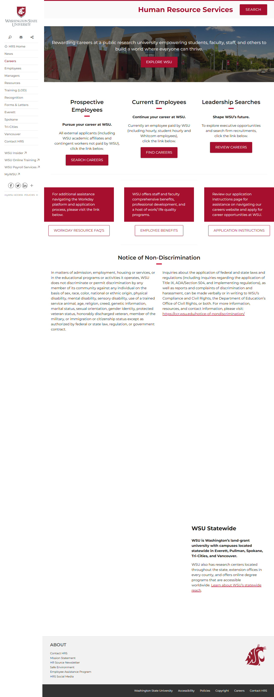
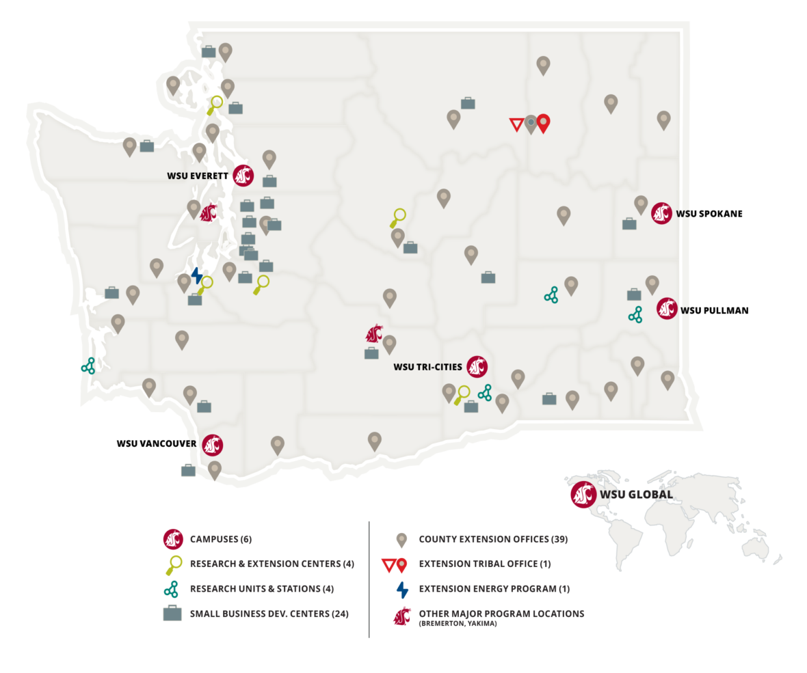

# Page Scan Report

| Field | Value |
|-------|-------|
| URL | https://wsu.edu/jobs/ |
| Redirected To | https://hrs.wsu.edu/careers/ |
| Title | Careers – Human Resource Services, Washington State University |
| Status | ✅ 200 |
| HTML Size | 84.2 KB |
| Screenshots | 1 (598.2 KB) |
| Images | 2 (530.3 KB) |
| Images Missing Alt | 1 |
| JS Errors | 0 |
| JS Warnings | 2 |
| Auth | none |
| Captured | 2026-02-16T20:41:43.5929144Z |

## Actions

- Screenshot #1: page-loaded (598.2 KB)
- Downloaded 2 images to /images/

## Screenshots

### 1. page-loaded

## Page Images (2)

| # | Image | Alt Text | Size |
|---|-------|----------|------|
| 1 | [wsu-visitor-center_4x3.jpg](images/wsu-visitor-center_4x3.jpg) | *(none)* | 229.7 KB |
| 2 | [WSU-System-Map-1180x985.png](images/WSU-System-Map-1180x985.png) | A map of Washington State showing ico... | 300.6 KB |

### Gallery

### ⚠️ Images Missing Alt Text (1)

- `wsu-visitor-center_4x3.jpg` — https://hrs.wsu.edu/wp-content/uploads/2019/09/wsu-visitor-center_4x3.jpg

## Files

- `01-page-loaded.png` — page-loaded (598.2 KB)
- `page.html` — rendered HTML content
- `metadata.json` — machine-readable scan data
- `errors.log` — JavaScript console errors
- `warnings.log` — JavaScript console warnings
- `info.log` — navigation and timing details
- `actions.log` — interactions performed on the page
- `images/` — 2 page images (530.3 KB)
