# 🌐 Site Report: https://wsu.edu/

> **Status:** ⚠️ 77/87 pages OK  
> **Folder:** `wsu-edu/`  

---

## 📋 Summary

```
Success Rate:  [██████████████████████████░░░░] 89%
```

| Metric | Value |
|--------|-------|
| Pages Scanned | 87 |
| Pages Passed | ✅ 77 |
| Pages Failed | ❌ 10 |
| Total JS Errors | 🔴 54 |
| Total JS Warnings | 19 |
| Total Images | 383 (by URL) |
| Images Missing Alt | ⚠️ 177 |
| A11y Violations | ⚠️ 478 |
| 🔴 Critical | 36 |
| 🟠 Serious | 377 |
| 🟡 Moderate | 49 |
| 🔵 Minor | 16 |
| Total HTML | 13.1 MB |
| Total Screenshots | 55.1 MB |

## 🔒 SSL Certificate

| Field | Value |
|-------|-------|
| Subject | `CN=wsu.edu` |
| Issuer | `CN=R12, O=Let's Encrypt, C=US` |
| Valid From | 2026-02-09 |
| Expires | 🟡 2026-05-10 (80 days) |
| Algorithm | sha256RSA |
| Key Size | 4096 bits |
| Thumbprint | `0C0A11EE741418A19BC8474BF378536666560811` |
| SANs | 2 domain(s) |

<details>
<summary><strong>Subject Alternative Names (2)</strong></summary>

| Domain | Type |
|--------|------|
| `wsu.edu` | 🏫 WSU Root |
| `www.wsu.edu` | 🏫 WSU |

</details>

## 📑 Pages

| Status | Page | HTTP | Title | 🔴 | 🟠 | 🟡 | 🔵 | A11y |
|:------:|------|:----:|-------|:--:|:--:|:--:|:--:|:----:|
| ✅ | [/](_root/report.md) | 200 | Washington State University \| Washin... |  | 8 |  |  | ⚠️ 8 |
| ✅ | [/2023/07/11/data-breach-impacts-wsu/](2023_07_11_data-breach-impacts-wsu/report.md) | 200 | Third-party data breach impacts WSU c... |  | 5 |  |  | ⚠️ 5 |
| ✅ | [/about/](about/report.md) | 200 | About WSU \| Washington State Univers... |  | 5 |  |  | ⚠️ 5 |
| ✅ | [/about/accolades/](about_accolades/report.md) | 200 | Accolades \| Washington State Univers... |  | 13 | 1 |  | ⚠️ 14 |
| ✅ | [/about/facts/](about_facts/report.md) | 200 | About WSU \| Washington State Univers... |  | 5 |  |  | ⚠️ 5 |
| ✅ | [/about/land-acknowledgement/](about_land-acknowledgement/report.md) | 200 | Land Acknowledgement \| Washington St... |  | 5 |  |  | ⚠️ 5 |
| ✅ | [/about/leadership/](about_leadership/report.md) | 200 | Leadership \| Washington State Univer... |  | 5 |  |  | ⚠️ 5 |
| ✅ | [/about/leadership/administrators/](about_leadership_administrators/report.md) | 200 | Leadership \| Washington State Univer... |  | 5 |  |  | ⚠️ 5 |
| ❌ | [/about/leadership/administrators/%20/](about_leadership_administrators_%20/report.md) | 404 | Page not found \| Washington State Un... |  | 5 |  |  | ⚠️ 5 |
| ✅ | [/about/services/](about_services/report.md) | 200 | Washington State University \| Washin... |  | 8 |  |  | ⚠️ 8 |
| ✅ | [/about/statewide-impact/](about_statewide-impact/report.md) | 200 | Statewide Impact \| Washington State ... |  | 7 |  |  | ⚠️ 7 |
| ✅ | [/about/statewide/](about_statewide/report.md) | 200 | WSU Campuses \| Washington State Univ... |  | 5 | 5 |  | ⚠️ 10 |
| ✅ | [/about/wsu-land-acknowledgement/](about_wsu-land-acknowledgement/report.md) | 200 | Land Acknowledgement \| Washington St... |  | 5 |  |  | ⚠️ 5 |
| ✅ | [/academics/](academics/report.md) | 200 | WSU Academics \| Washington State Uni... |  | 5 |  |  | ⚠️ 5 |
| ✅ | [/academics/degrees-majors/](academics_degrees-majors/report.md) | 200 | Degrees & Majors \| Washington State ... |  | 6 |  |  | ⚠️ 6 |
| ✅ | [/admission/](admission/report.md) | 200 | WSU Admissions \| Washington State Un... |  | 5 |  |  | ⚠️ 5 |
| ✅ | [/admissions/](admissions/report.md) | 200 | WSU Admissions \| Washington State Un... |  | 5 |  |  | ⚠️ 5 |
| ✅ | [/admissions/affordability/](admissions_affordability/report.md) | 200 | Affordability \| Washington State Uni... |  | 11 | 2 |  | ⚠️ 13 |
| ✅ | [/athletics/](athletics/report.md) | 200 | WSU Athletics \| Washington State Uni... |  | 5 |  |  | ⚠️ 5 |
| ✅ | [/campuses/](campuses/report.md) | 200 | WSU Campuses \| Washington State Univ... |  | 5 | 5 |  | ⚠️ 10 |
| ✅ | [/contact/](contact/report.md) | 200 | Employee Directory \| Search \| Washi... |  | 3 |  |  | ⚠️ 3 |
| ✅ | [/covid-19/](covid-19/report.md) | 200 | COVID-19 Recovery Guidance \| Washing... |  | 4 |  |  | ⚠️ 4 |
| ✅ | [/covid-19/wp-json/](covid-19_wp-json/report.md) | 200 |  |  | 3 | 2 | 1 | ⚠️ 6 |
| ❌ | [/covid-19/wp-json/oembed/1.0/embed](covid-19_wp-json_oembed_1.0_embed/report.md) | 400 |  |  | 3 | 2 | 1 | ⚠️ 6 |
| ✅ | [/covid-19/wp-json/wp/v2/pages/4109](covid-19_wp-json_wp_v2_pages_4109/report.md) | 200 |  |  | 3 | 2 | 1 | ⚠️ 6 |
| ✅ | [/digital-accessibility/](digital-accessibility/report.md) | 200 | Digital Accessibility \| Washington S... | 1 | 3 |  |  | ⚠️ 4 |
| ✅ | [/digital-accessibility/announcements/](digital-accessibility_announcements/report.md) | 200 | Announcements \| Digital Accessibilit... | 1 | 3 |  |  | ⚠️ 4 |
| ✅ | [/digital-accessibility/announcements/2026/02/06/february-2026/](digital-accessibility_announcements_2026_02_06_february-2026/report.md) | 200 | February 2026 Digital Accessibility U... | 1 | 3 |  |  | ⚠️ 4 |
| ✅ | [/digital-accessibility/assessment/](digital-accessibility_assessment/report.md) | 200 | Assessment \| Digital Accessibility \... | 1 | 3 |  |  | ⚠️ 4 |
| ✅ | [/digital-accessibility/assessment/check-assessment-status/](digital-accessibility_assessment_check-assessment-status/report.md) | 200 | Check Assessment Status \| Digital Ac... | 1 | 3 |  |  | ⚠️ 4 |
| ✅ | [/digital-accessibility/core-concepts/](digital-accessibility_core-concepts/report.md) | 200 | Core Concepts \| Digital Accessibilit... | 1 | 10 |  |  | ⚠️ 11 |
| ✅ | [/digital-accessibility/core-concepts/audio-video/](digital-accessibility_core-concepts_audio-video/report.md) | 200 | Audio and Video \| Digital Accessibil... | 1 | 5 |  |  | ⚠️ 6 |
| ✅ | [/digital-accessibility/core-concepts/color-color-contrast/](digital-accessibility_core-concepts_color-color-contrast/report.md) | 200 | Color and Color Contrast \| Digital A... | 1 | 5 |  |  | ⚠️ 6 |
| ✅ | [/digital-accessibility/core-concepts/headings/](digital-accessibility_core-concepts_headings/report.md) | 200 | Headings \| Digital Accessibility \| ... | 1 | 3 |  |  | ⚠️ 4 |
| ✅ | [/digital-accessibility/core-concepts/images/](digital-accessibility_core-concepts_images/report.md) | 200 | Images \| Digital Accessibility \| Wa... | 1 | 3 |  |  | ⚠️ 4 |
| ✅ | [/digital-accessibility/core-concepts/links/](digital-accessibility_core-concepts_links/report.md) | 200 | Links \| Digital Accessibility \| Was... | 1 | 5 |  |  | ⚠️ 6 |
| ✅ | [/digital-accessibility/core-concepts/lists/](digital-accessibility_core-concepts_lists/report.md) | 200 | Lists \| Digital Accessibility \| Was... | 1 | 3 |  |  | ⚠️ 4 |
| ✅ | [/digital-accessibility/core-concepts/tables/](digital-accessibility_core-concepts_tables/report.md) | 200 | Tables \| Digital Accessibility \| Wa... | 1 | 3 | 1 |  | ⚠️ 5 |
| ❌ | [/digital-accessibility/documents/2023/10/core-concept-check-sheet.pdf/](digital-accessibility_documents_2023_10_core-concept-check-sheet.pdf/report.md) | 0 | *(none)* |  |  |  |  | ✅ |
| ✅ | [/digital-accessibility/event/accelerating-digital-accessibility-axe-con-2026/](digital-accessibility_event_accelerating-digital-accessibility-axe-con-2026/report.md) | 200 | Accelerating Digital Accessibility \|... | 1 | 6 |  |  | ⚠️ 7 |
| ✅ | [/digital-accessibility/events/](digital-accessibility_events/report.md) | 200 | Upcoming Events \| Digital Accessibil... | 1 | 3 | 1 |  | ⚠️ 5 |
| ✅ | [/digital-accessibility/get-started/](digital-accessibility_get-started/report.md) | 200 | Get Started \| Digital Accessibility ... | 1 | 3 |  |  | ⚠️ 4 |
| ✅ | [/digital-accessibility/get-started/glossary/](digital-accessibility_get-started_glossary/report.md) | 200 | Glossary \| Digital Accessibility \| ... | 1 | 3 |  |  | ⚠️ 4 |
| ✅ | [/digital-accessibility/get-started/glossary/digital-content-and-technology/](digital-accessibility_get-started_glossary_digital-content-and-technology/report.md) | 200 | Glossary: Digital Content and Technol... | 1 | 3 |  |  | ⚠️ 4 |
| ✅ | [/digital-accessibility/get-started/subscribe/](digital-accessibility_get-started_subscribe/report.md) | 200 | Subscribe \| Digital Accessibility \|... | 1 | 4 |  |  | ⚠️ 5 |
| ✅ | [/digital-accessibility/get-started/what-is-digital-accessibility/](digital-accessibility_get-started_what-is-digital-accessibility/report.md) | 200 | What is Digital Accessibility? \| Dig... | 1 | 3 |  |  | ⚠️ 4 |
| ✅ | [/digital-accessibility/guides/](digital-accessibility_guides/report.md) | 200 | Guides \| Digital Accessibility \| Wa... | 1 | 3 |  |  | ⚠️ 4 |
| ✅ | [/digital-accessibility/guides/course-delivery/](digital-accessibility_guides_course-delivery/report.md) | 200 | Course Delivery \| Digital Accessibil... | 1 | 3 |  |  | ⚠️ 4 |
| ✅ | [/digital-accessibility/guides/documents-and-presentations/](digital-accessibility_guides_documents-and-presentations/report.md) | 200 | Documents, Presentations, and PDFs \|... | 1 | 3 |  |  | ⚠️ 4 |
| ✅ | [/digital-accessibility/guides/documents-and-presentations/creating-an-accessible-microsoft-word-document/](digital-accessibility_guides_documents-and-presentations_creating-an-accessible-microsoft-word-document/report.md) | 200 | Creating an Accessible Microsoft Word... | 1 | 3 |  |  | ⚠️ 4 |
| ✅ | [/digital-accessibility/guides/documents-and-presentations/creating-an-accessible-pdf/](digital-accessibility_guides_documents-and-presentations_creating-an-accessible-pdf/report.md) | 200 | Creating an Accessible PDF \| Digital... | 1 | 3 |  |  | ⚠️ 4 |
| ✅ | [/digital-accessibility/guides/multimedia/](digital-accessibility_guides_multimedia/report.md) | 200 | Multimedia \| Digital Accessibility \... | 1 | 3 |  |  | ⚠️ 4 |
| ✅ | [/digital-accessibility/guides/resources/](digital-accessibility_guides_resources/report.md) | 200 | Resources \| Digital Accessibility \|... | 1 | 3 |  |  | ⚠️ 4 |
| ✅ | [/digital-accessibility/guides/social-media/](digital-accessibility_guides_social-media/report.md) | 200 | Social Media \| Digital Accessibility... | 1 | 3 |  |  | ⚠️ 4 |
| ✅ | [/digital-accessibility/guides/social-media/social-media/](digital-accessibility_guides_social-media_social-media/report.md) | 200 | Social Media Overview \| Digital Acce... | 1 | 3 |  |  | ⚠️ 4 |
| ✅ | [/digital-accessibility/guides/web-design-and-development/](digital-accessibility_guides_web-design-and-development/report.md) | 200 | Web Design and Development \| Digital... | 1 | 3 |  |  | ⚠️ 4 |
| ✅ | [/digital-accessibility/policies/](digital-accessibility_policies/report.md) | 200 | Policies \| Digital Accessibility \| ... | 1 | 3 |  |  | ⚠️ 4 |
| ✅ | [/digital-accessibility/questions/](digital-accessibility_questions/report.md) | 200 | Questions? \| Digital Accessibility \... | 1 | 3 |  |  | ⚠️ 4 |
| ✅ | [/digital-accessibility/report-digital-accessibility-issue/](digital-accessibility_report-digital-accessibility-issue/report.md) | 200 | Report a Digital Accessibility Issue ... | 1 | 3 |  |  | ⚠️ 4 |
| ✅ | [/digital-accessibility/sample-page/feed/](digital-accessibility_sample-page_feed/report.md) | 200 |  |  | 3 | 2 | 1 | ⚠️ 6 |
| ✅ | [/digital-accessibility/testing-tools/](digital-accessibility_testing-tools/report.md) | 200 | Digital Accessibility Testing/Scannin... | 1 | 3 |  |  | ⚠️ 4 |
| ❌ | [/digital-accessibility/wp-json/](digital-accessibility_wp-json/report.md) | 200 | *(none)* |  |  |  |  | ✅ |
| ❌ | [/digital-accessibility/wp-json/oembed/1.0/embed](digital-accessibility_wp-json_oembed_1.0_embed/report.md) | 400 |  |  | 3 | 2 | 1 | ⚠️ 6 |
| ✅ | [/digital-accessibility/wp-json/tribe/events/v1/](digital-accessibility_wp-json_tribe_events_v1/report.md) | 200 |  |  | 3 | 2 | 1 | ⚠️ 6 |
| ✅ | [/digital-accessibility/wp-json/wp/v2/pages/2](digital-accessibility_wp-json_wp_v2_pages_2/report.md) | 200 |  |  | 3 | 2 | 1 | ⚠️ 6 |
| ✅ | [/digital-accessibility/wp-json/wp/v2/pages/735](digital-accessibility_wp-json_wp_v2_pages_735/report.md) | 200 |  |  | 3 | 2 | 1 | ⚠️ 6 |
| ✅ | [/economicimpact/](economicimpact/report.md) | 200 | Economic Impact \| Washington State U... |  | 5 | 1 |  | ⚠️ 6 |
| ✅ | [/economicimpact/wp-json/](economicimpact_wp-json/report.md) | 200 |  |  | 3 | 2 | 1 | ⚠️ 6 |
| ❌ | [/economicimpact/wp-json/oembed/1.0/embed](economicimpact_wp-json_oembed_1.0_embed/report.md) | 400 |  |  | 3 | 2 | 1 | ⚠️ 6 |
| ✅ | [/economicimpact/wp-json/wp/v2/pages/6](economicimpact_wp-json_wp_v2_pages_6/report.md) | 200 |  |  | 3 | 2 | 1 | ⚠️ 6 |
| ✅ | [/impact/katie-doonan/](impact_katie-doonan/report.md) | 200 | Washington State University \| Washin... |  | 8 |  |  | ⚠️ 8 |
| ✅ | [/in/](in/report.md) | 200 | WSU In Events \| Washington State Uni... |  | 5 |  |  | ⚠️ 5 |
| ✅ | [/in/sample-page/feed/](in_sample-page_feed/report.md) | 200 |  |  | 3 | 2 | 1 | ⚠️ 6 |
| ✅ | [/in/wp-json/](in_wp-json/report.md) | 200 |  |  | 3 | 2 | 1 | ⚠️ 6 |
| ❌ | [/in/wp-json/oembed/1.0/embed](in_wp-json_oembed_1.0_embed/report.md) | 400 |  |  | 3 | 2 | 1 | ⚠️ 6 |
| ✅ | [/in/wp-json/wp/v2/pages/2](in_wp-json_wp_v2_pages_2/report.md) | 200 |  |  | 3 | 2 | 1 | ⚠️ 6 |
| ✅ | [/jobs/](jobs/report.md) | 200 | Careers – Human Resource Services, Wa... |  | 4 | 1 |  | ⚠️ 5 |
| ✅ | [/life/overview/](life_overview/report.md) | 200 | WSU Pullman Community Life \| Pullman... | 1 | 7 |  |  | ⚠️ 8 |
| ❌ | [/life/things-to-do/entertainment/](life_things-to-do_entertainment/report.md) | 404 | Page not found \| Washington State Un... |  | 5 |  |  | ⚠️ 5 |
| ✅ | [/life/things-to-do/sightseeing/](life_things-to-do_sightseeing/report.md) | 200 | WSU Pullman Community Life \| Pullman... | 1 | 7 |  |  | ⚠️ 8 |
| ✅ | [/new/admissions/](new_admissions/report.md) | 200 | Washington State University \| Washin... |  | 8 |  |  | ⚠️ 8 |
| ✅ | [/request-info/](request-info/report.md) | 200 | Request for Information \| Washington... |  | 5 |  |  | ⚠️ 5 |
| ✅ | [/research/](research/report.md) | 200 | WSU Research \| Washington State Univ... |  | 11 |  |  | ⚠️ 11 |
| ❌ | [/resources/employee-assistance-program/](resources_employee-assistance-program/report.md) | 404 | Page not found \| Washington State Un... |  | 5 |  |  | ⚠️ 5 |
| ❌ | [/resources/employee-handbooks/](resources_employee-handbooks/report.md) | 404 | Page not found \| Washington State Un... |  | 5 |  |  | ⚠️ 5 |
| ✅ | [/rfi/](rfi/report.md) | 200 | Request for Information \| Washington... |  | 5 |  |  | ⚠️ 5 |
| ✅ | [/sample-page/feed/](sample-page_feed/report.md) | 200 |  |  | 3 | 2 | 1 | ⚠️ 6 |

## 📸 Page Screenshots

Click any thumbnail to view the full page report.

<table>
<tr>
<td align="center" width="33%">
<a href="_root/report.md">

</a>
<br />✅ <code>/</code>
</td>
<td align="center" width="33%">
<a href="2023_07_11_data-breach-impacts-wsu/report.md">
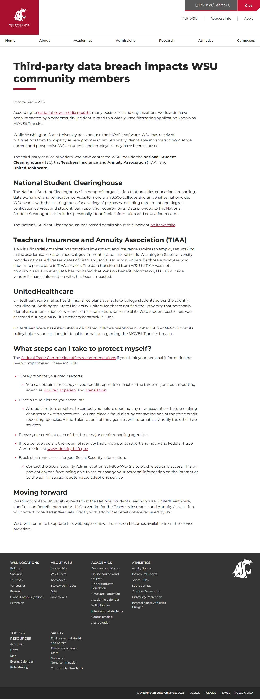
</a>
<br />✅ <code>/2023/07/11/data-breach-impacts-wsu/</code>
</td>
<td align="center" width="33%">
<a href="about/report.md">

</a>
<br />✅ <code>/about/</code>
</td>
</tr>
<tr>
<td align="center" width="33%">
<a href="about_accolades/report.md">

</a>
<br />✅ <code>/about/accolades/</code>
</td>
<td align="center" width="33%">
<a href="about_facts/report.md">

</a>
<br />✅ <code>/about/facts/</code>
</td>
<td align="center" width="33%">
<a href="about_land-acknowledgement/report.md">

</a>
<br />✅ <code>/about/land-acknowledgement/</code>
</td>
</tr>
<tr>
<td align="center" width="33%">
<a href="about_leadership/report.md">

</a>
<br />✅ <code>/about/leadership/</code>
</td>
<td align="center" width="33%">
<a href="about_leadership_administrators/report.md">

</a>
<br />✅ <code>/about/leadership/administrators/</code>
</td>
<td align="center" width="33%">
<a href="about_leadership_administrators_%20/report.md">

</a>
<br />❌ <code>/about/leadership/administrators/%20/</code>
</td>
</tr>
<tr>
<td align="center" width="33%">
<a href="about_services/report.md">

</a>
<br />✅ <code>/about/services/</code>
</td>
<td align="center" width="33%">
<a href="about_statewide-impact/report.md">

</a>
<br />✅ <code>/about/statewide-impact/</code>
</td>
<td align="center" width="33%">
<a href="about_statewide/report.md">

</a>
<br />✅ <code>/about/statewide/</code>
</td>
</tr>
<tr>
<td align="center" width="33%">
<a href="about_wsu-land-acknowledgement/report.md">

</a>
<br />✅ <code>/about/wsu-land-acknowledgement/</code>
</td>
<td align="center" width="33%">
<a href="academics/report.md">

</a>
<br />✅ <code>/academics/</code>
</td>
<td align="center" width="33%">
<a href="academics_degrees-majors/report.md">

</a>
<br />✅ <code>/academics/degrees-majors/</code>
</td>
</tr>
<tr>
<td align="center" width="33%">
<a href="admission/report.md">

</a>
<br />✅ <code>/admission/</code>
</td>
<td align="center" width="33%">
<a href="admissions/report.md">

</a>
<br />✅ <code>/admissions/</code>
</td>
<td align="center" width="33%">
<a href="admissions_affordability/report.md">

</a>
<br />✅ <code>/admissions/affordability/</code>
</td>
</tr>
<tr>
<td align="center" width="33%">
<a href="athletics/report.md">

</a>
<br />✅ <code>/athletics/</code>
</td>
<td align="center" width="33%">
<a href="campuses/report.md">

</a>
<br />✅ <code>/campuses/</code>
</td>
<td align="center" width="33%">
<a href="contact/report.md">
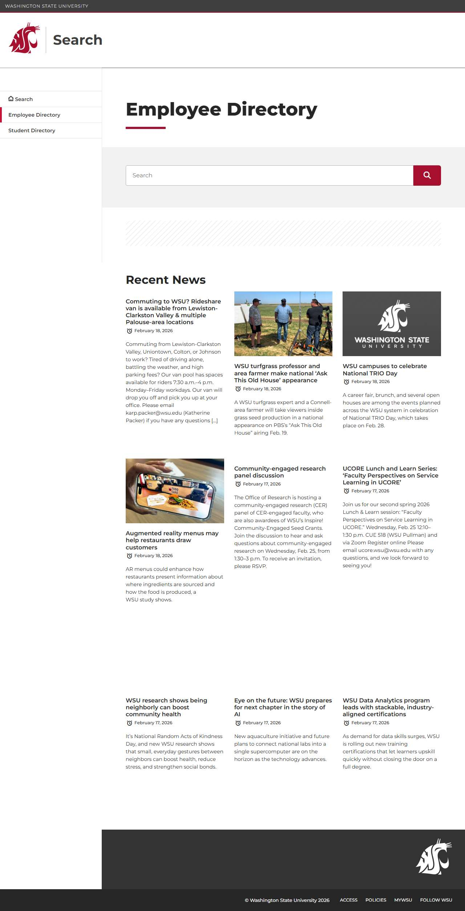
</a>
<br />✅ <code>/contact/</code>
</td>
</tr>
<tr>
<td align="center" width="33%">
<a href="covid-19/report.md">

</a>
<br />✅ <code>/covid-19/</code>
</td>
<td align="center" width="33%">
<a href="covid-19_wp-json/report.md">

</a>
<br />✅ <code>/covid-19/wp-json/</code>
</td>
<td align="center" width="33%">
<a href="covid-19_wp-json_oembed_1.0_embed/report.md">
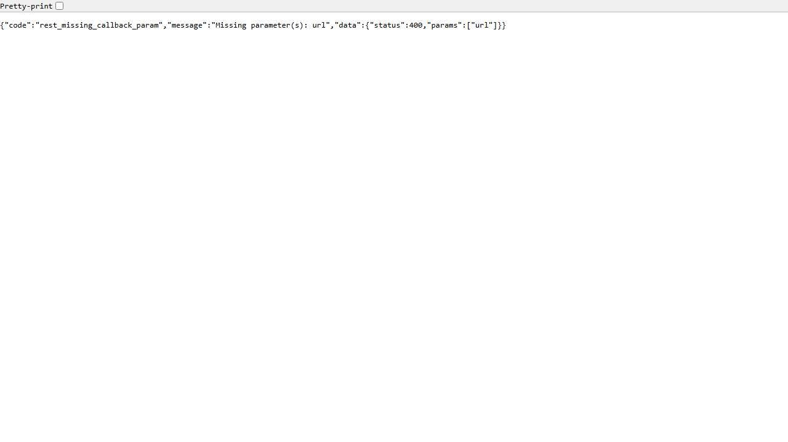
</a>
<br />❌ <code>/covid-19/wp-json/oembed/1.0/embed</code>
</td>
</tr>
<tr>
<td align="center" width="33%">
<a href="covid-19_wp-json_wp_v2_pages_4109/report.md">
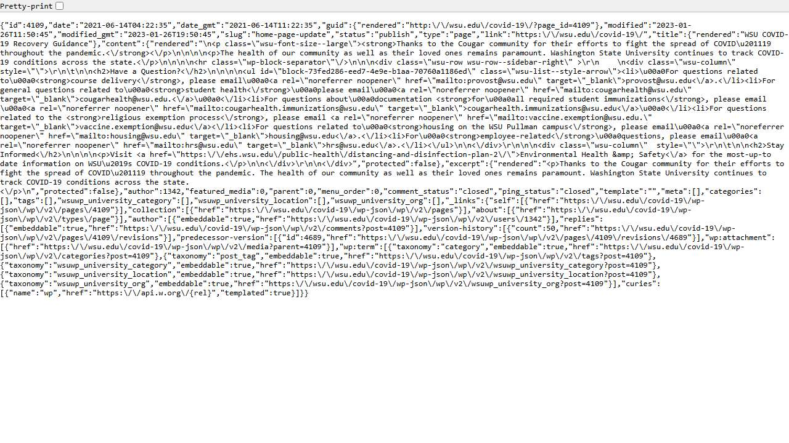
</a>
<br />✅ <code>/covid-19/wp-json/wp/v2/pages/4109</code>
</td>
<td align="center" width="33%">
<a href="digital-accessibility/report.md">

</a>
<br />✅ <code>/digital-accessibility/</code>
</td>
<td align="center" width="33%">
<a href="digital-accessibility_announcements/report.md">
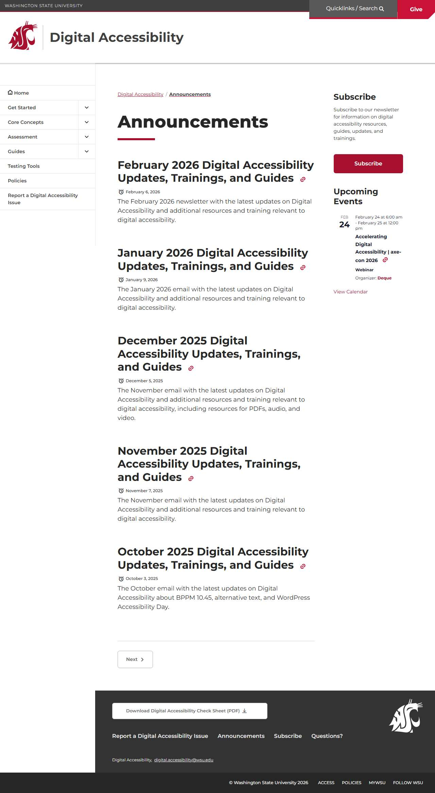
</a>
<br />✅ <code>/digital-accessibility/announcements/</code>
</td>
</tr>
<tr>
<td align="center" width="33%">
<a href="digital-accessibility_announcements_2026_02_06_february-2026/report.md">
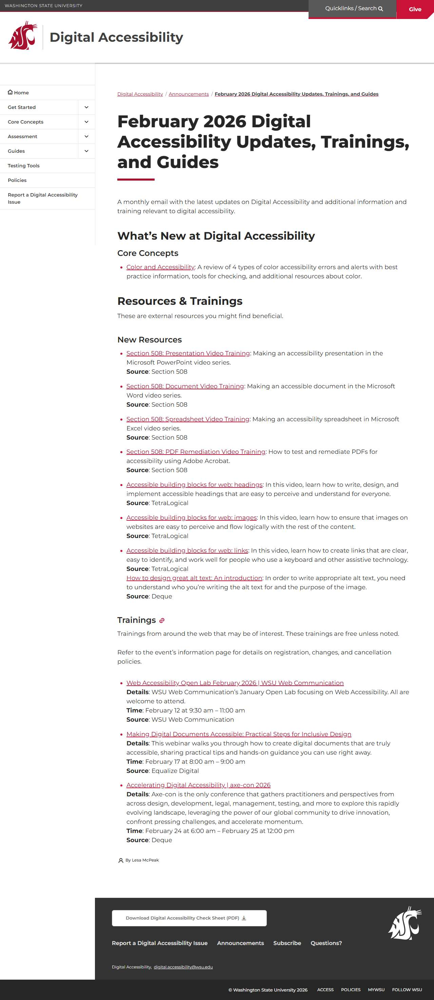
</a>
<br />✅ <code>/digital-accessibility/announcements/2026/02/06/february-2026/</code>
</td>
<td align="center" width="33%">
<a href="digital-accessibility_assessment/report.md">

</a>
<br />✅ <code>/digital-accessibility/assessment/</code>
</td>
<td align="center" width="33%">
<a href="digital-accessibility_assessment_check-assessment-status/report.md">
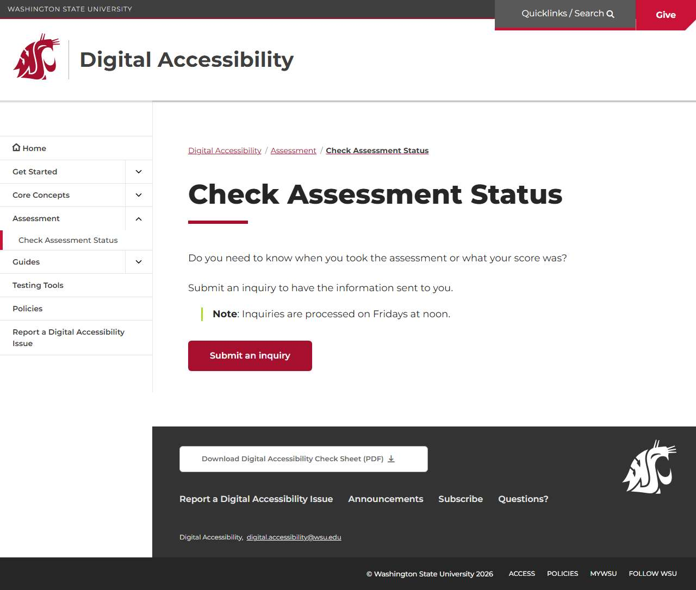
</a>
<br />✅ <code>/digital-accessibility/assessment/check-assessment-status/</code>
</td>
</tr>
<tr>
<td align="center" width="33%">
<a href="digital-accessibility_core-concepts/report.md">
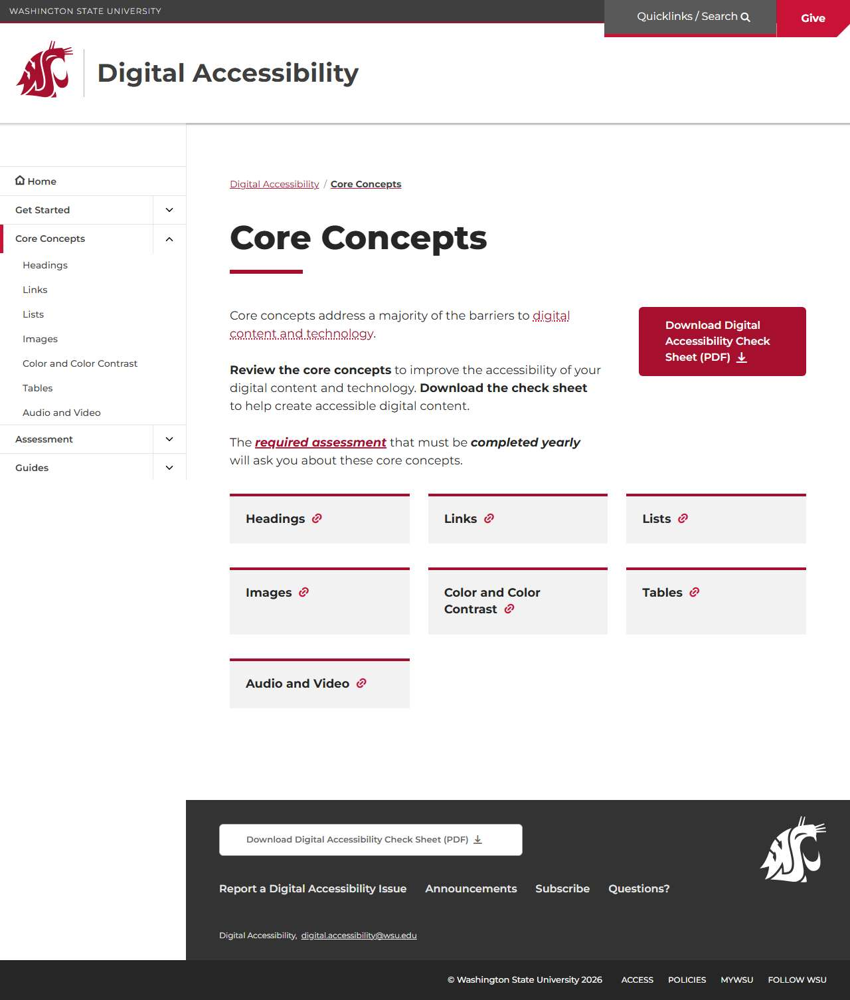
</a>
<br />✅ <code>/digital-accessibility/core-concepts/</code>
</td>
<td align="center" width="33%">
<a href="digital-accessibility_core-concepts_audio-video/report.md">
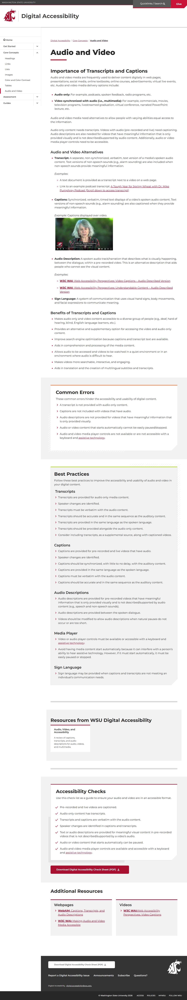
</a>
<br />✅ <code>/digital-accessibility/core-concepts/audio-video/</code>
</td>
<td align="center" width="33%">
<a href="digital-accessibility_core-concepts_color-color-contrast/report.md">
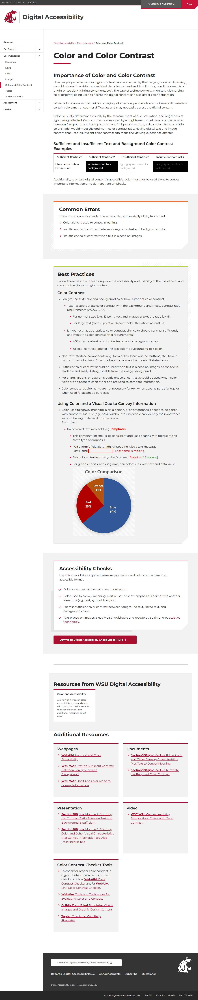
</a>
<br />✅ <code>/digital-accessibility/core-concepts/color-color-contrast/</code>
</td>
</tr>
<tr>
<td align="center" width="33%">
<a href="digital-accessibility_core-concepts_headings/report.md">
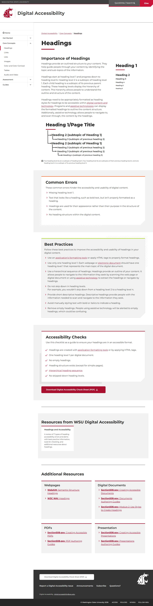
</a>
<br />✅ <code>/digital-accessibility/core-concepts/headings/</code>
</td>
<td align="center" width="33%">
<a href="digital-accessibility_core-concepts_images/report.md">
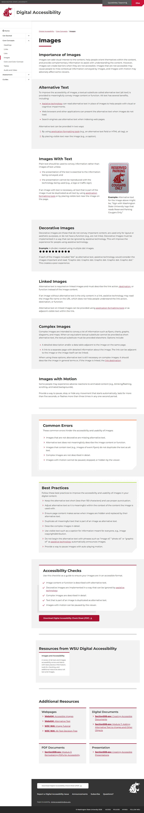
</a>
<br />✅ <code>/digital-accessibility/core-concepts/images/</code>
</td>
<td align="center" width="33%">
<a href="digital-accessibility_core-concepts_links/report.md">
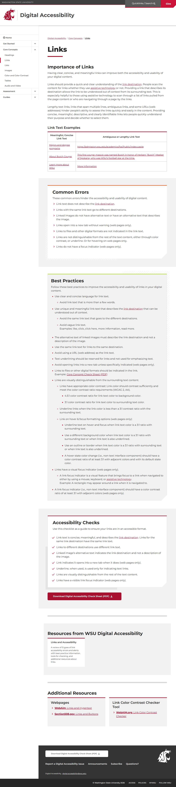
</a>
<br />✅ <code>/digital-accessibility/core-concepts/links/</code>
</td>
</tr>
<tr>
<td align="center" width="33%">
<a href="digital-accessibility_core-concepts_lists/report.md">
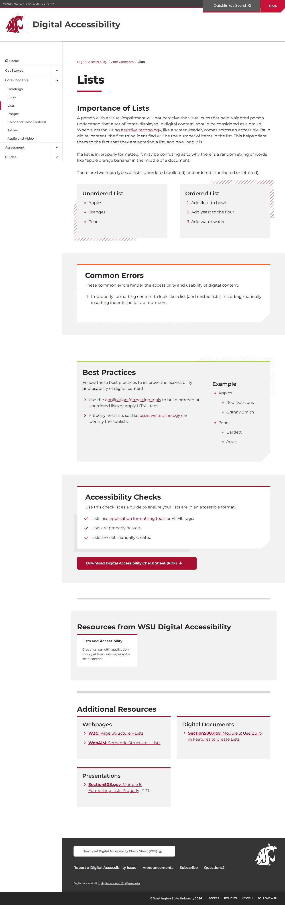
</a>
<br />✅ <code>/digital-accessibility/core-concepts/lists/</code>
</td>
<td align="center" width="33%">
<a href="digital-accessibility_core-concepts_tables/report.md">
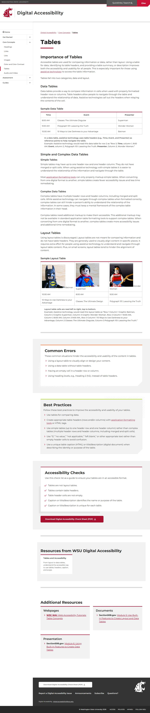
</a>
<br />✅ <code>/digital-accessibility/core-concepts/tables/</code>
</td>
<td align="center" width="33%">
<a href="digital-accessibility_event_accelerating-digital-accessibility-axe-con-2026/report.md">
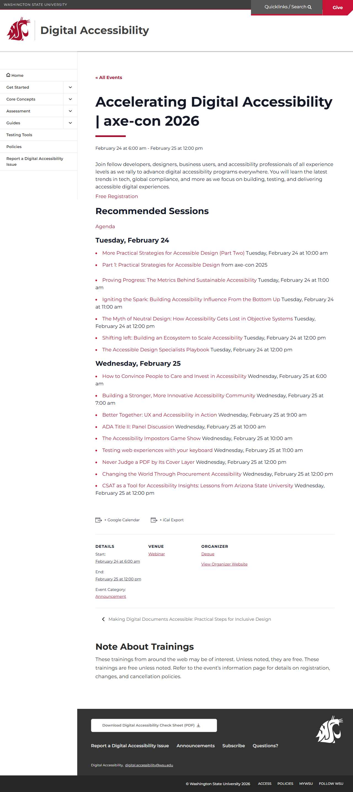
</a>
<br />✅ <code>/digital-accessibility/event/accelerating-digital-accessibility-axe-con-2026/</code>
</td>
</tr>
<tr>
<td align="center" width="33%">
<a href="digital-accessibility_events/report.md">
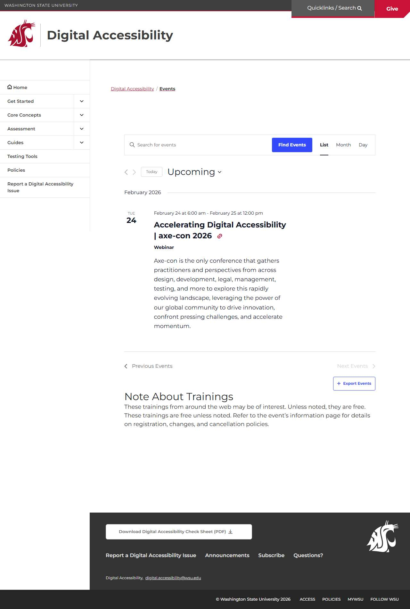
</a>
<br />✅ <code>/digital-accessibility/events/</code>
</td>
<td align="center" width="33%">
<a href="digital-accessibility_get-started/report.md">
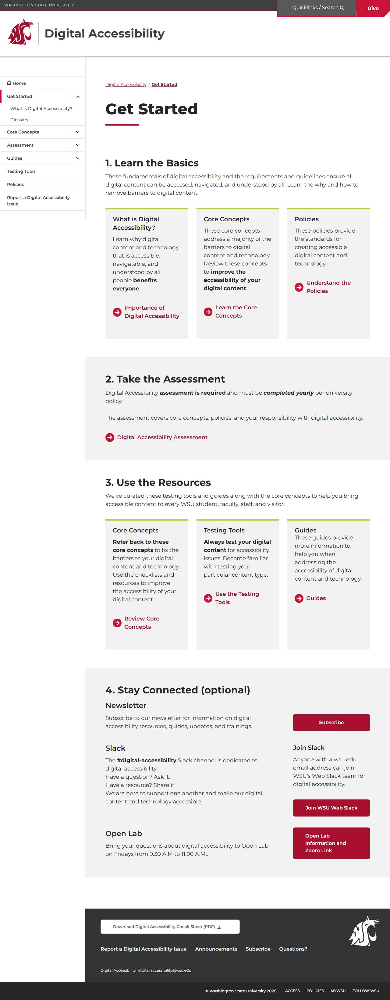
</a>
<br />✅ <code>/digital-accessibility/get-started/</code>
</td>
<td align="center" width="33%">
<a href="digital-accessibility_get-started_glossary/report.md">
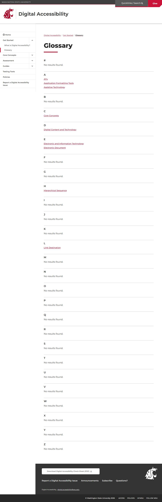
</a>
<br />✅ <code>/digital-accessibility/get-started/glossary/</code>
</td>
</tr>
<tr>
<td align="center" width="33%">
<a href="digital-accessibility_get-started_glossary_digital-content-and-technology/report.md">
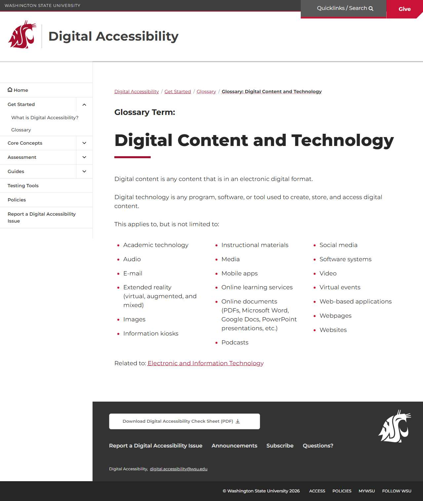
</a>
<br />✅ <code>/digital-accessibility/get-started/glossary/digital-content-and-technology/</code>
</td>
<td align="center" width="33%">
<a href="digital-accessibility_get-started_subscribe/report.md">
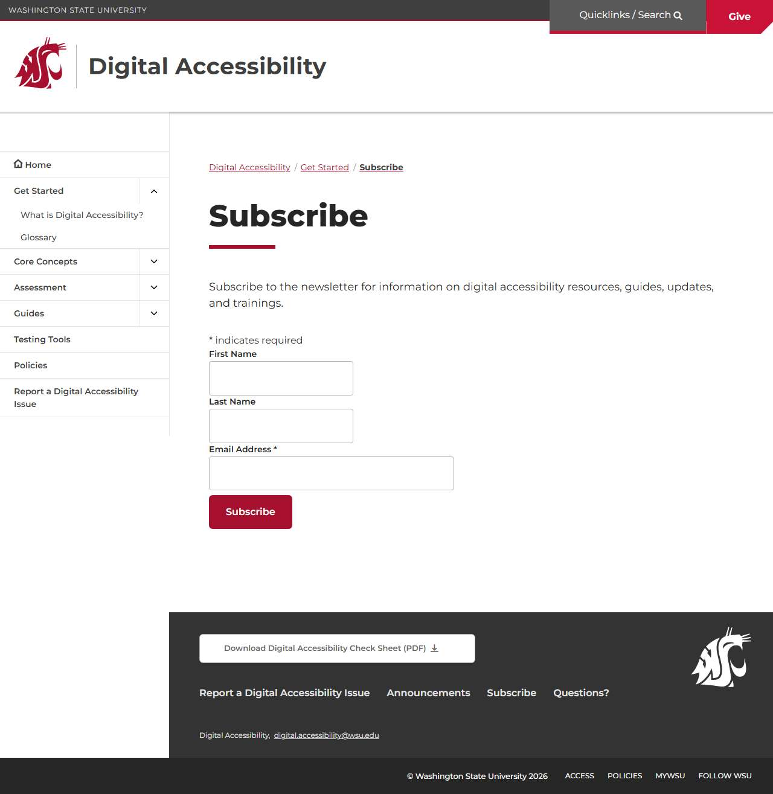
</a>
<br />✅ <code>/digital-accessibility/get-started/subscribe/</code>
</td>
<td align="center" width="33%">
<a href="digital-accessibility_get-started_what-is-digital-accessibility/report.md">
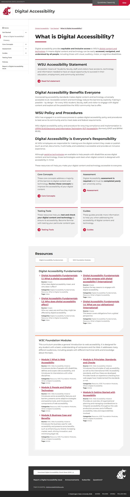
</a>
<br />✅ <code>/digital-accessibility/get-started/what-is-digital-accessibility/</code>
</td>
</tr>
<tr>
<td align="center" width="33%">
<a href="digital-accessibility_guides/report.md">
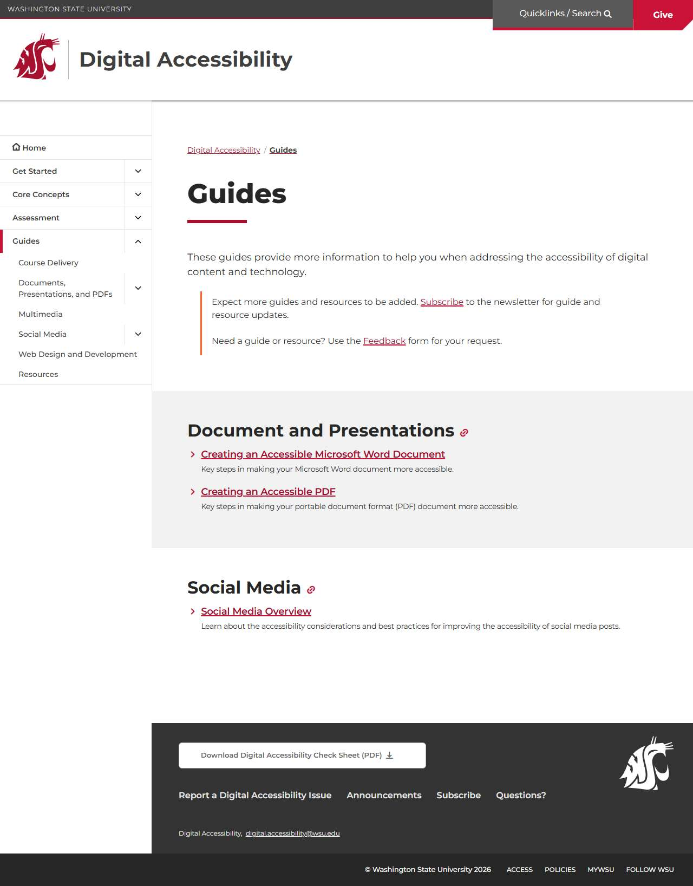
</a>
<br />✅ <code>/digital-accessibility/guides/</code>
</td>
<td align="center" width="33%">
<a href="digital-accessibility_guides_course-delivery/report.md">
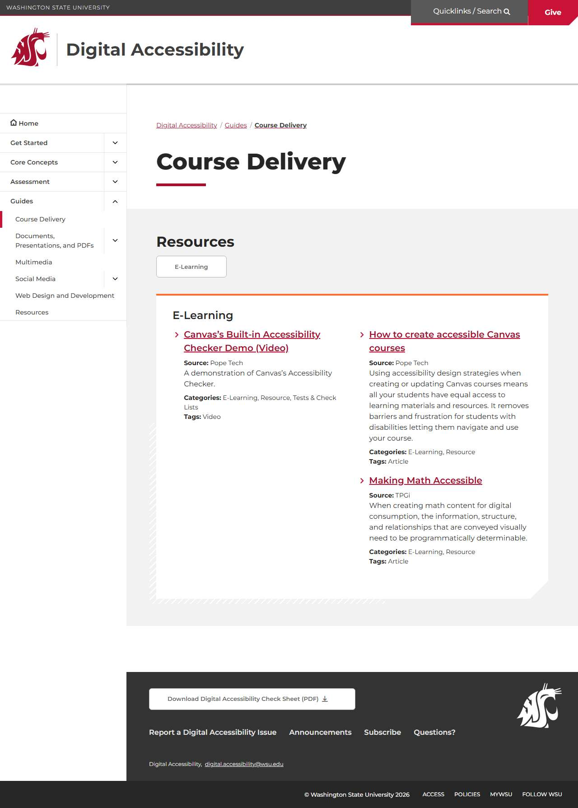
</a>
<br />✅ <code>/digital-accessibility/guides/course-delivery/</code>
</td>
<td align="center" width="33%">
<a href="digital-accessibility_guides_documents-and-presentations/report.md">

</a>
<br />✅ <code>/digital-accessibility/guides/documents-and-presentations/</code>
</td>
</tr>
<tr>
<td align="center" width="33%">
<a href="digital-accessibility_guides_documents-and-presentations_creating-an-accessible-microsoft-word-document/report.md">
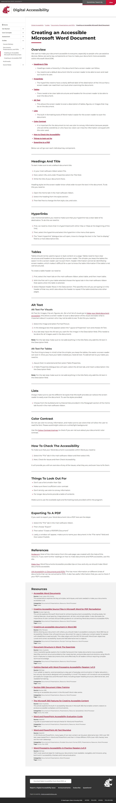
</a>
<br />✅ <code>/digital-accessibility/guides/documents-and-presentations/creating-an-accessible-microsoft-word-document/</code>
</td>
<td align="center" width="33%">
<a href="digital-accessibility_guides_documents-and-presentations_creating-an-accessible-pdf/report.md">
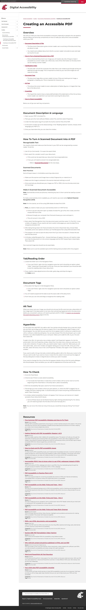
</a>
<br />✅ <code>/digital-accessibility/guides/documents-and-presentations/creating-an-accessible-pdf/</code>
</td>
<td align="center" width="33%">
<a href="digital-accessibility_guides_multimedia/report.md">
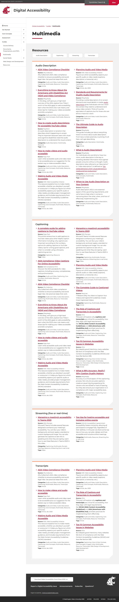
</a>
<br />✅ <code>/digital-accessibility/guides/multimedia/</code>
</td>
</tr>
<tr>
<td align="center" width="33%">
<a href="digital-accessibility_guides_resources/report.md">

</a>
<br />✅ <code>/digital-accessibility/guides/resources/</code>
</td>
<td align="center" width="33%">
<a href="digital-accessibility_guides_social-media/report.md">
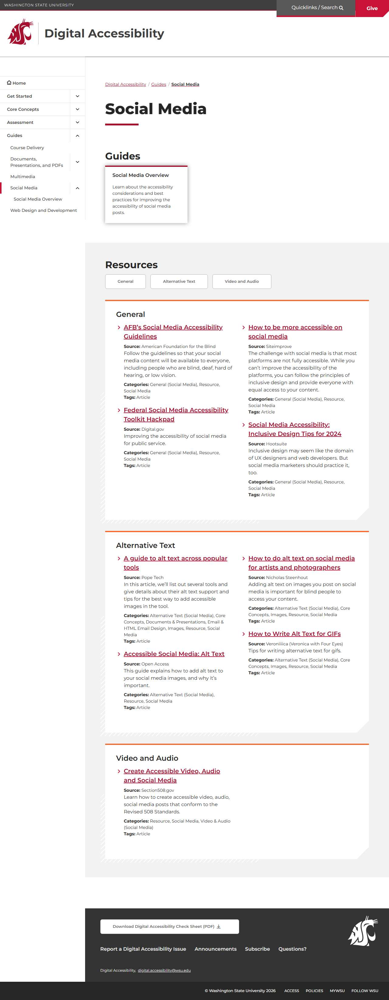
</a>
<br />✅ <code>/digital-accessibility/guides/social-media/</code>
</td>
<td align="center" width="33%">
<a href="digital-accessibility_guides_social-media_social-media/report.md">
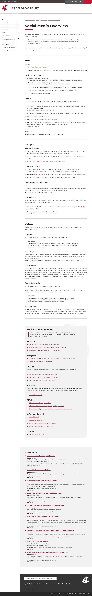
</a>
<br />✅ <code>/digital-accessibility/guides/social-media/social-media/</code>
</td>
</tr>
<tr>
<td align="center" width="33%">
<a href="digital-accessibility_guides_web-design-and-development/report.md">
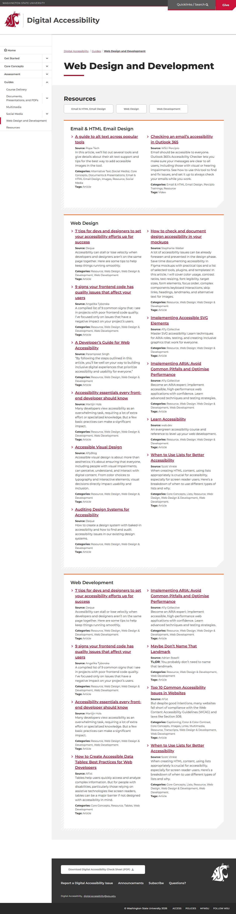
</a>
<br />✅ <code>/digital-accessibility/guides/web-design-and-development/</code>
</td>
<td align="center" width="33%">
<a href="digital-accessibility_policies/report.md">
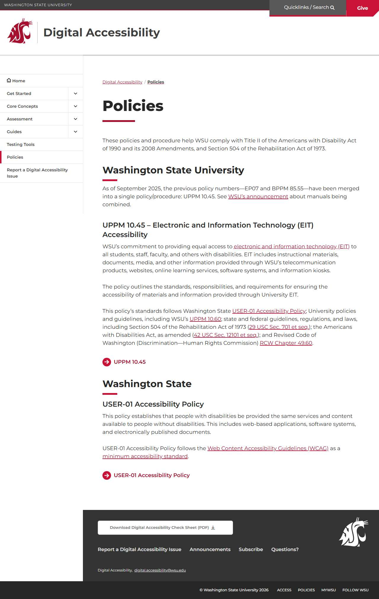
</a>
<br />✅ <code>/digital-accessibility/policies/</code>
</td>
<td align="center" width="33%">
<a href="digital-accessibility_questions/report.md">
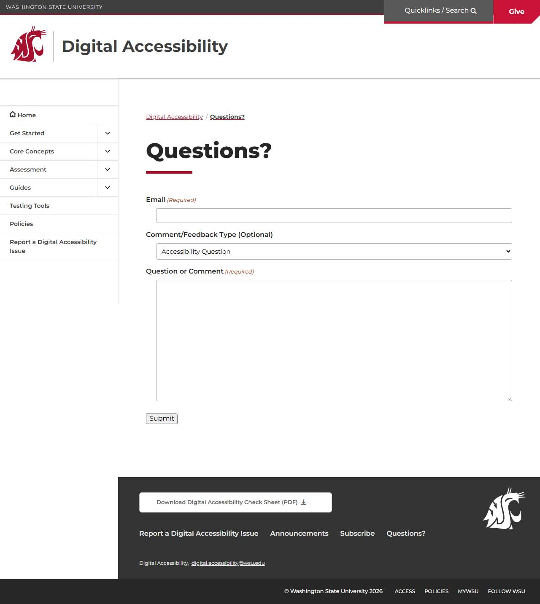
</a>
<br />✅ <code>/digital-accessibility/questions/</code>
</td>
</tr>
<tr>
<td align="center" width="33%">
<a href="digital-accessibility_report-digital-accessibility-issue/report.md">
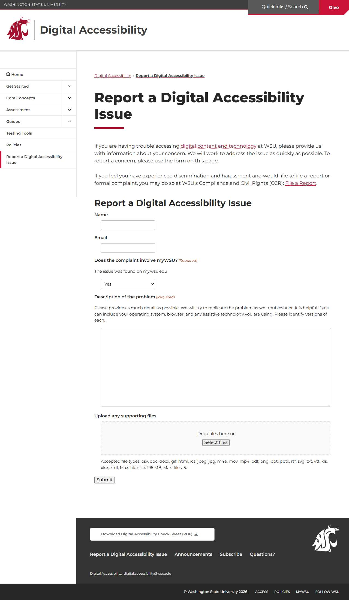
</a>
<br />✅ <code>/digital-accessibility/report-digital-accessibility-issue/</code>
</td>
<td align="center" width="33%">
<a href="digital-accessibility_sample-page_feed/report.md">
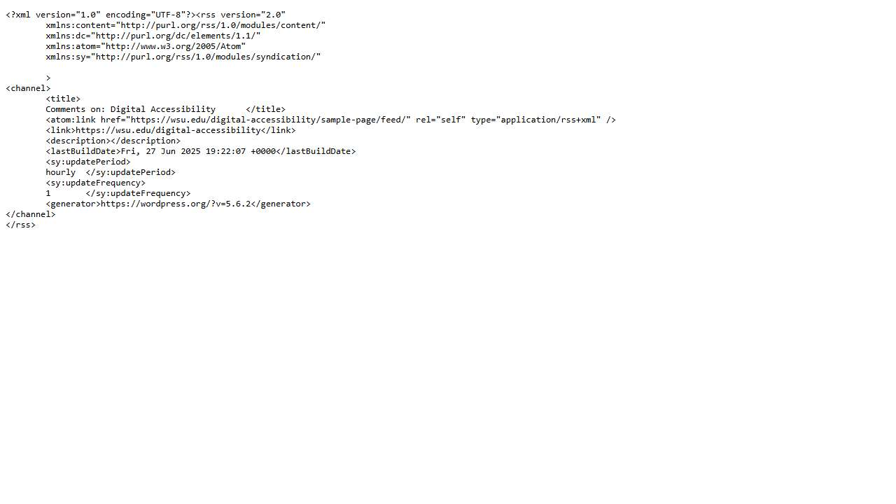
</a>
<br />✅ <code>/digital-accessibility/sample-page/feed/</code>
</td>
<td align="center" width="33%">
<a href="digital-accessibility_testing-tools/report.md">
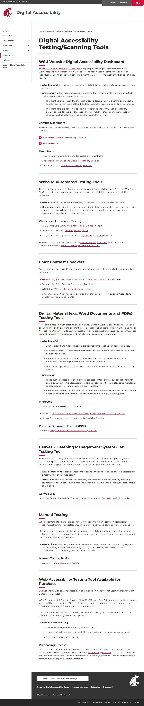
</a>
<br />✅ <code>/digital-accessibility/testing-tools/</code>
</td>
</tr>
<tr>
<td align="center" width="33%">
<a href="digital-accessibility_wp-json_oembed_1.0_embed/report.md">

</a>
<br />❌ <code>/digital-accessibility/wp-json/oembed/1.0/embed</code>
</td>
<td align="center" width="33%">
<a href="digital-accessibility_wp-json_tribe_events_v1/report.md">
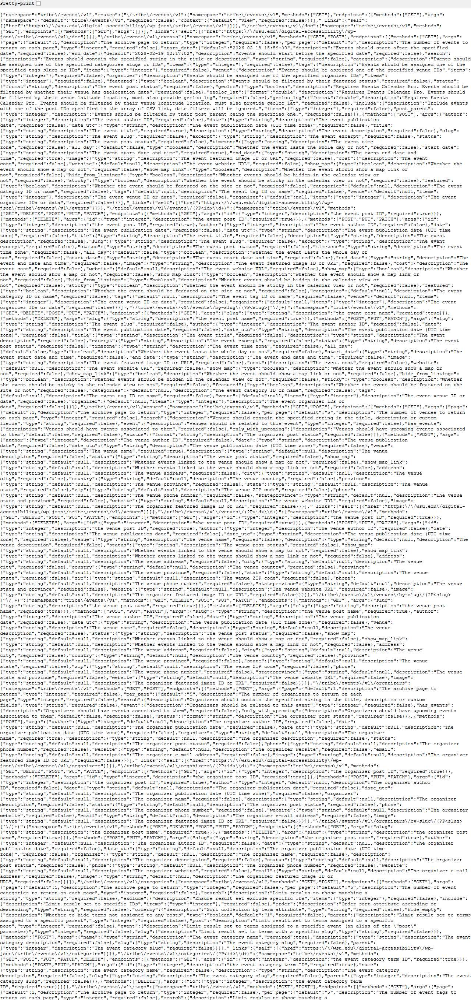
</a>
<br />✅ <code>/digital-accessibility/wp-json/tribe/events/v1/</code>
</td>
<td align="center" width="33%">
<a href="digital-accessibility_wp-json_wp_v2_pages_2/report.md">
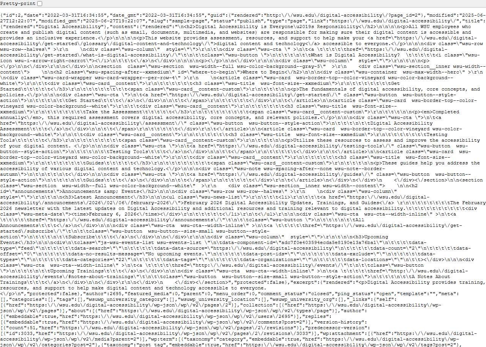
</a>
<br />✅ <code>/digital-accessibility/wp-json/wp/v2/pages/2</code>
</td>
</tr>
<tr>
<td align="center" width="33%">
<a href="digital-accessibility_wp-json_wp_v2_pages_735/report.md">

</a>
<br />✅ <code>/digital-accessibility/wp-json/wp/v2/pages/735</code>
</td>
<td align="center" width="33%">
<a href="economicimpact/report.md">

</a>
<br />✅ <code>/economicimpact/</code>
</td>
<td align="center" width="33%">
<a href="economicimpact_wp-json/report.md">

</a>
<br />✅ <code>/economicimpact/wp-json/</code>
</td>
</tr>
<tr>
<td align="center" width="33%">
<a href="economicimpact_wp-json_oembed_1.0_embed/report.md">

</a>
<br />❌ <code>/economicimpact/wp-json/oembed/1.0/embed</code>
</td>
<td align="center" width="33%">
<a href="economicimpact_wp-json_wp_v2_pages_6/report.md">
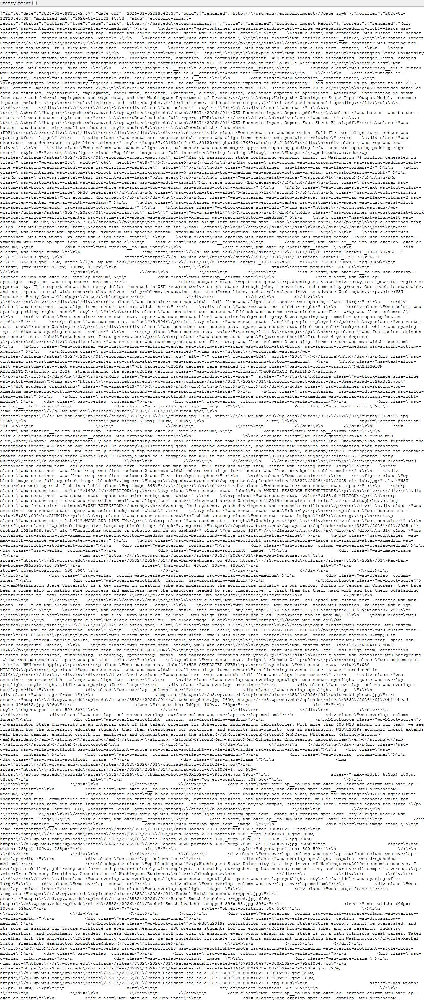
</a>
<br />✅ <code>/economicimpact/wp-json/wp/v2/pages/6</code>
</td>
<td align="center" width="33%">
<a href="impact_katie-doonan/report.md">

</a>
<br />✅ <code>/impact/katie-doonan/</code>
</td>
</tr>
<tr>
<td align="center" width="33%">
<a href="in/report.md">

</a>
<br />✅ <code>/in/</code>
</td>
<td align="center" width="33%">
<a href="in_sample-page_feed/report.md">
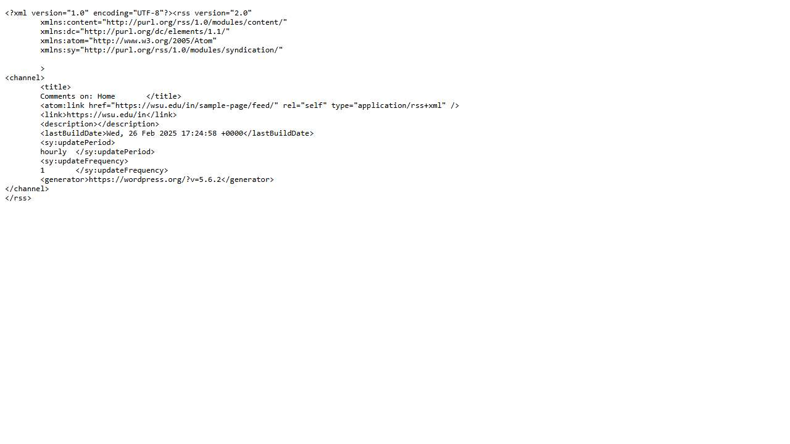
</a>
<br />✅ <code>/in/sample-page/feed/</code>
</td>
<td align="center" width="33%">
<a href="in_wp-json/report.md">

</a>
<br />✅ <code>/in/wp-json/</code>
</td>
</tr>
<tr>
<td align="center" width="33%">
<a href="in_wp-json_oembed_1.0_embed/report.md">

</a>
<br />❌ <code>/in/wp-json/oembed/1.0/embed</code>
</td>
<td align="center" width="33%">
<a href="in_wp-json_wp_v2_pages_2/report.md">
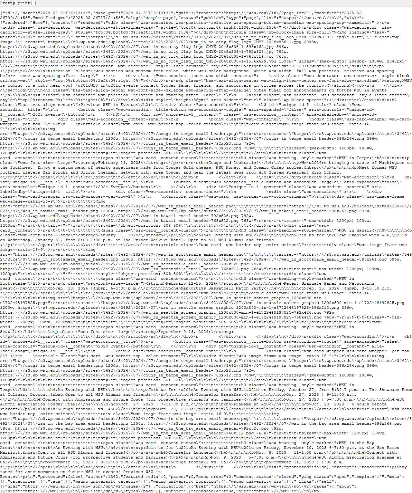
</a>
<br />✅ <code>/in/wp-json/wp/v2/pages/2</code>
</td>
<td align="center" width="33%">
<a href="jobs/report.md">

</a>
<br />✅ <code>/jobs/</code>
</td>
</tr>
<tr>
<td align="center" width="33%">
<a href="life_overview/report.md">

</a>
<br />✅ <code>/life/overview/</code>
</td>
<td align="center" width="33%">
<a href="life_things-to-do_entertainment/report.md">
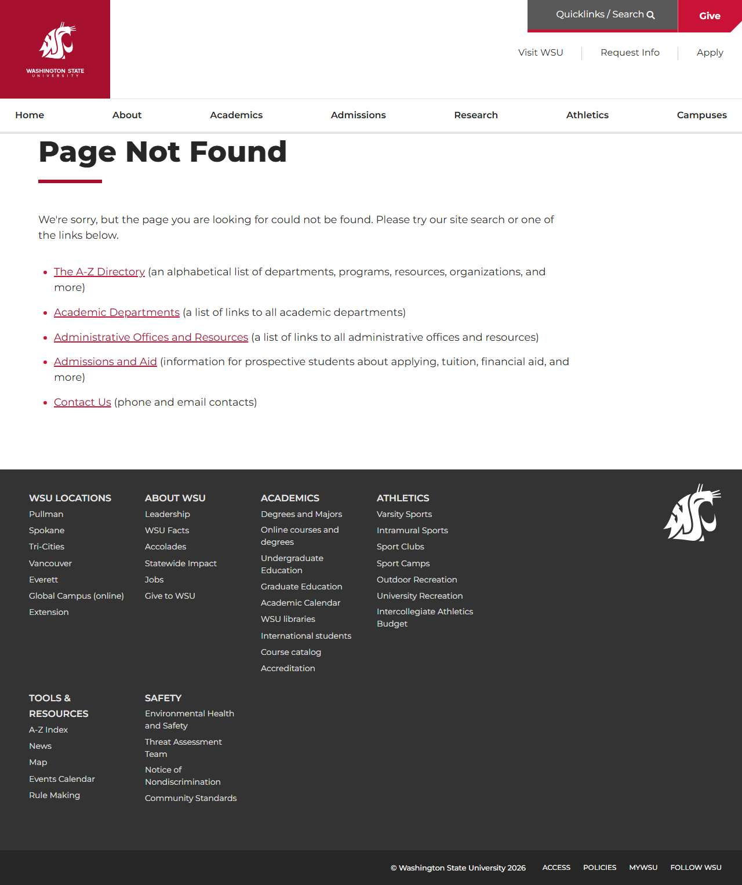
</a>
<br />❌ <code>/life/things-to-do/entertainment/</code>
</td>
<td align="center" width="33%">
<a href="life_things-to-do_sightseeing/report.md">

</a>
<br />✅ <code>/life/things-to-do/sightseeing/</code>
</td>
</tr>
<tr>
<td align="center" width="33%">
<a href="new_admissions/report.md">

</a>
<br />✅ <code>/new/admissions/</code>
</td>
<td align="center" width="33%">
<a href="request-info/report.md">

</a>
<br />✅ <code>/request-info/</code>
</td>
<td align="center" width="33%">
<a href="research/report.md">

</a>
<br />✅ <code>/research/</code>
</td>
</tr>
<tr>
<td align="center" width="33%">
<a href="resources_employee-assistance-program/report.md">

</a>
<br />❌ <code>/resources/employee-assistance-program/</code>
</td>
<td align="center" width="33%">
<a href="resources_employee-handbooks/report.md">

</a>
<br />❌ <code>/resources/employee-handbooks/</code>
</td>
<td align="center" width="33%">
<a href="rfi/report.md">
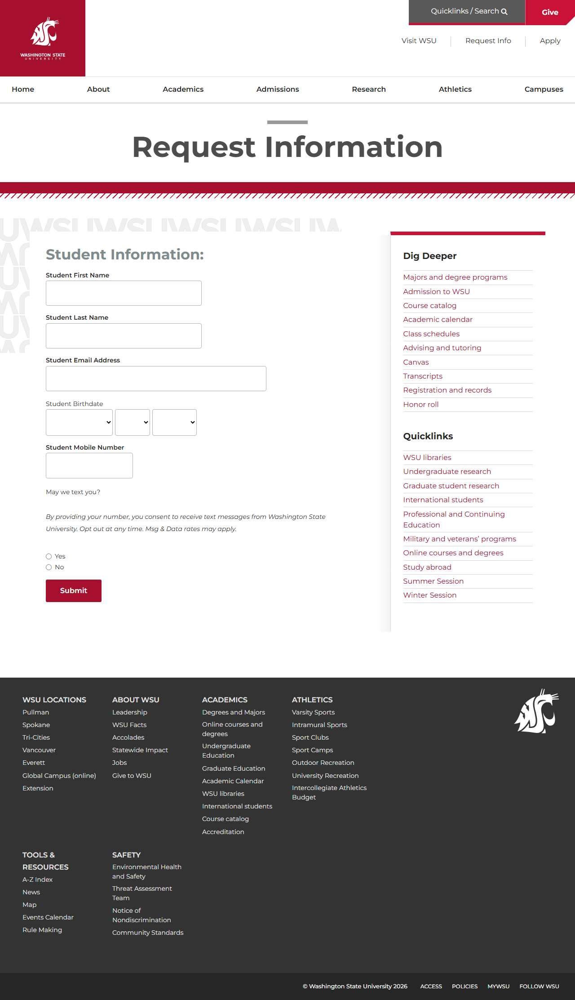
</a>
<br />✅ <code>/rfi/</code>
</td>
</tr>
<tr>
<td align="center" width="33%">
<a href="sample-page_feed/report.md">
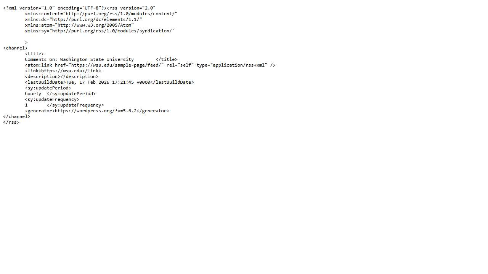
</a>
<br />✅ <code>/sample-page/feed/</code>
</td>
<td></td>
<td></td>
</tr>
</table>

## ❌ Failed Pages

<details open>
<summary><strong>10 page(s) failed</strong></summary>

| Page | HTTP | Error |
|------|:----:|-------|
| [/about/leadership/administrators/%20/](about_leadership_administrators_%20/report.md) | 404 | — |
| [/covid-19/wp-json/oembed/1.0/embed](covid-19_wp-json_oembed_1.0_embed/report.md) | 400 | — |
| [/digital-accessibility/documents/2023/10/core-concept-check-sheet.pdf/](digital-accessibility_documents_2023_10_core-concept-check-sheet.pdf/report.md) | 0 | Download is starting
Call log:
  - navigating to "https:/... |
| [/digital-accessibility/wp-json/](digital-accessibility_wp-json/report.md) | 200 | Timeout 30000ms exceeded.
Call log:
  - taking page scree... |
| [/digital-accessibility/wp-json/oembed/1.0/embed](digital-accessibility_wp-json_oembed_1.0_embed/report.md) | 400 | — |
| [/economicimpact/wp-json/oembed/1.0/embed](economicimpact_wp-json_oembed_1.0_embed/report.md) | 400 | — |
| [/in/wp-json/oembed/1.0/embed](in_wp-json_oembed_1.0_embed/report.md) | 400 | — |
| [/life/things-to-do/entertainment/](life_things-to-do_entertainment/report.md) | 404 | — |
| [/resources/employee-assistance-program/](resources_employee-assistance-program/report.md) | 404 | — |
| [/resources/employee-handbooks/](resources_employee-handbooks/report.md) | 404 | — |

</details>

## 🔴 JavaScript Errors

<details>
<summary><strong>54 error(s) across 30 page(s)</strong></summary>

**/** (5 errors)

```
Failed to load resource: net::ERR_TOO_MANY_REDIRECTS
Access to XMLHttpRequest at 'https://cdn.curator.io/5.0/curator.embed.css' from origin 'https://wsu.edu' has been blocked by CORS policy: No 'Access-Control-Allow-Origin' header is present on the requ...
Failed to load resource: net::ERR_FAILED
Access to XMLHttpRequest at 'https://cdn.curator.io/published-css/655259a3-1b3e-4d24-9fcf-940885db13b3.css' from origin 'https://wsu.edu' has been blocked by CORS policy: No 'Access-Control-Allow-Orig...
Failed to load resource: net::ERR_FAILED
```

**/about/services/** (5 errors)

```
Failed to load resource: net::ERR_TOO_MANY_REDIRECTS
Access to XMLHttpRequest at 'https://cdn.curator.io/5.0/curator.embed.css' from origin 'https://wsu.edu' has been blocked by CORS policy: No 'Access-Control-Allow-Origin' header is present on the requ...
Failed to load resource: net::ERR_FAILED
Access to XMLHttpRequest at 'https://cdn.curator.io/published-css/655259a3-1b3e-4d24-9fcf-940885db13b3.css' from origin 'https://wsu.edu' has been blocked by CORS policy: No 'Access-Control-Allow-Orig...
Failed to load resource: net::ERR_FAILED
```

**/impact/katie-doonan/** (5 errors)

```
Failed to load resource: net::ERR_TOO_MANY_REDIRECTS
Access to XMLHttpRequest at 'https://cdn.curator.io/5.0/curator.embed.css' from origin 'https://wsu.edu' has been blocked by CORS policy: No 'Access-Control-Allow-Origin' header is present on the requ...
Failed to load resource: net::ERR_FAILED
Access to XMLHttpRequest at 'https://cdn.curator.io/published-css/655259a3-1b3e-4d24-9fcf-940885db13b3.css' from origin 'https://wsu.edu' has been blocked by CORS policy: No 'Access-Control-Allow-Orig...
Failed to load resource: net::ERR_FAILED
```

**/new/admissions/** (5 errors)

```
Failed to load resource: net::ERR_TOO_MANY_REDIRECTS
Access to XMLHttpRequest at 'https://cdn.curator.io/5.0/curator.embed.css' from origin 'https://wsu.edu' has been blocked by CORS policy: No 'Access-Control-Allow-Origin' header is present on the requ...
Failed to load resource: net::ERR_FAILED
Access to XMLHttpRequest at 'https://cdn.curator.io/published-css/655259a3-1b3e-4d24-9fcf-940885db13b3.css' from origin 'https://wsu.edu' has been blocked by CORS policy: No 'Access-Control-Allow-Orig...
Failed to load resource: net::ERR_FAILED
```

**/request-info/** (4 errors)

```
Access to XMLHttpRequest at 'https://fw.cdn.technolutions.net/framework/base_safe.css?v=db27' from origin 'https://wsu.edu' has been blocked by CORS policy: No 'Access-Control-Allow-Origin' header is ...
Failed to load resource: net::ERR_FAILED
Access to XMLHttpRequest at 'https://slate-technolutions-net.cdn.technolutions.net/register/embed.css?v=TS-db27-638899359743360055' from origin 'https://wsu.edu' has been blocked by CORS policy: No 'A...
Failed to load resource: net::ERR_FAILED
```

**/rfi/** (4 errors)

```
Access to XMLHttpRequest at 'https://fw.cdn.technolutions.net/framework/base_safe.css?v=db27' from origin 'https://wsu.edu' has been blocked by CORS policy: No 'Access-Control-Allow-Origin' header is ...
Failed to load resource: net::ERR_FAILED
Access to XMLHttpRequest at 'https://slate-technolutions-net.cdn.technolutions.net/register/embed.css?v=TS-db27-638899359743360055' from origin 'https://wsu.edu' has been blocked by CORS policy: No 'A...
Failed to load resource: net::ERR_FAILED
```

**/about/leadership/administrators/%20/** (2 errors)

```
Failed to load resource: the server responded with a status of 404 (Not Found)
Failed to load resource: net::ERR_TOO_MANY_REDIRECTS
```

**/jobs/** (2 errors)

```
Access to XMLHttpRequest at 'https://repo.wsu.edu/spine/2/spine.min.css?ver=2.0.3' from origin 'https://hrs.wsu.edu' has been blocked by CORS policy: No 'Access-Control-Allow-Origin' header is present...
Failed to load resource: net::ERR_FAILED
```

**/about/** (1 errors)

```
Failed to load resource: net::ERR_TOO_MANY_REDIRECTS
```

**/about/accolades/** (1 errors)

```
Failed to load resource: net::ERR_TOO_MANY_REDIRECTS
```

**/about/facts/** (1 errors)

```
Failed to load resource: net::ERR_TOO_MANY_REDIRECTS
```

**/about/land-acknowledgement/** (1 errors)

```
Failed to load resource: net::ERR_TOO_MANY_REDIRECTS
```

**/about/leadership/** (1 errors)

```
Failed to load resource: net::ERR_TOO_MANY_REDIRECTS
```

**/about/leadership/administrators/** (1 errors)

```
Failed to load resource: net::ERR_TOO_MANY_REDIRECTS
```

**/about/statewide/** (1 errors)

```
Failed to load resource: net::ERR_TOO_MANY_REDIRECTS
```

**/about/statewide-impact/** (1 errors)

```
Failed to load resource: net::ERR_TOO_MANY_REDIRECTS
```

**/about/wsu-land-acknowledgement/** (1 errors)

```
Failed to load resource: net::ERR_TOO_MANY_REDIRECTS
```

**/academics/** (1 errors)

```
Failed to load resource: net::ERR_TOO_MANY_REDIRECTS
```

**/academics/degrees-majors/** (1 errors)

```
Failed to load resource: net::ERR_TOO_MANY_REDIRECTS
```

**/admission/** (1 errors)

```
Failed to load resource: net::ERR_TOO_MANY_REDIRECTS
```

**/admissions/** (1 errors)

```
Failed to load resource: net::ERR_TOO_MANY_REDIRECTS
```

**/admissions/affordability/** (1 errors)

```
Failed to load resource: net::ERR_TOO_MANY_REDIRECTS
```

**/campuses/** (1 errors)

```
Failed to load resource: net::ERR_TOO_MANY_REDIRECTS
```

**/covid-19/wp-json/oembed/1.0/embed** (1 errors)

```
Failed to load resource: the server responded with a status of 400 (Bad Request)
```

**/digital-accessibility/wp-json/oembed/1.0/embed** (1 errors)

```
Failed to load resource: the server responded with a status of 400 (Bad Request)
```

**/economicimpact/wp-json/oembed/1.0/embed** (1 errors)

```
Failed to load resource: the server responded with a status of 400 (Bad Request)
```

**/in/wp-json/oembed/1.0/embed** (1 errors)

```
Failed to load resource: the server responded with a status of 400 (Bad Request)
```

**/life/things-to-do/entertainment/** (1 errors)

```
Failed to load resource: the server responded with a status of 404 (Not Found)
```

**/resources/employee-assistance-program/** (1 errors)

```
Failed to load resource: the server responded with a status of 404 (Not Found)
```

**/resources/employee-handbooks/** (1 errors)

```
Failed to load resource: the server responded with a status of 404 (Not Found)
```

</details>

## ♿ Accessibility Summary

| Metric | Value |
|--------|-------|
| Pages with violations | 85/87 |
| Total violations | 478 |
| 🔴 Critical | 36 |
| 🟠 Serious | 377 |
| 🟡 Moderate | 49 |
| 🔵 Minor | 16 |

### Top 10 Issues

| # | Rule | Sev | Pages | Instances |
|--:|------|:---:|:-----:|:---------:|
| 1 | [aria-allowed-attr](../a11y-rules.md#aria-allowed-attr) | 🔴 | 36/87 | 36 |
| 2 | [html-has-lang](../a11y-rules.md#html-has-lang) | 🟠 | 16/87 | 32 |
| 3 | [color-contrast](../a11y-rules.md#color-contrast) | 🟠 | 5/87 | 19 |
| 4 | [link-name](../a11y-rules.md#link-name) | 🟠 | 12/87 | 35 |
| 5 | [image-alt](../a11y-rules.md#image-alt) | 🟠 | 69/87 | 207 |
| 6 | [label](../a11y-rules.md#label) | 🟠 | 34/87 | 36 |
| 7 | [button-name](../a11y-rules.md#button-name) | 🟠 | 30/87 | 30 |
| 8 | [document-title](../a11y-rules.md#document-title) | 🟠 | 16/87 | 16 |
| 9 | [definition-list](../a11y-rules.md#definition-list) | 🟠 | 1/87 | 1 |
| 10 | [link-in-text-block](../a11y-rules.md#link-in-text-block) | 🟠 | 1/87 | 1 |

---

*Generated by AccessibilityScanner (FreeTools) v1.0*
