# 📄 Page Scan Report

> **URL:** https://wsu.edu/research/  
> **Captured:** 2026-02-16 22:11:07 UTC  
> **Status:** ✅ 200  

---

## 📑 Contents

- [Summary](#-summary)
- [Screenshots](#-screenshots)
- [Page Images](#-page-images)
- [Actions](#-actions)
- [Files](#-files)

---

## 📋 Summary

| Field | Value |
|-------|-------|
| URL | https://wsu.edu/research/ |
| Title | WSU Research | Washington State University | Washington State University |
| Status | ✅ 200 |
| HTML Size | 125.0 KB |
| Screenshots | 1 (4.3 MB) |
| Images | 16 (9.4 MB) |
| Images Missing Alt | ⚠️ 11 |
| JS Errors | ✅ 0 |
| JS Warnings | 0 |
| Auth | none |
| Captured | 2026-02-16T22:11:07.4675153Z |

## 🔧 Actions

<strong>2 action(s) performed</strong>

- Screenshot #1: page-loaded (4.3 MB)
- Downloaded 16 images to /images/

## 📸 Screenshots

<table>
<tr>
<td align="center" width="50%">

 <strong>1. page-loaded</strong>
 4.3 MB
</td>
<td></td>
</tr>
</table>

## 🖼️ Page Images (16)

<strong>📋 Image Index</strong> — 16 images, 9.4 MB

| # | Image | Alt Text | Size |
|--:|-------|----------|-----:|
| 1 | [Grizzly_Bears_7-17-2015___120.jpg](images/Grizzly_Bears_7-17-2015___120.jpg) | Six-month-old grizzly bear cubs run i... | 708.4 KB |
| 2 | [Pharmacy-1_18_20-BH_2649.jpg](images/Pharmacy-1_18_20-BH_2649.jpg) | Research is conducted in the Pharmacy... | 511.8 KB |
| 3 | [PhD-Student-Kaitlin-Witherell_5028.jpg](images/PhD-Student-Kaitlin-Witherell_5028.jpg) | PhD student on the campus of Washingt... | 326.0 KB |
| 4 | [Tri-Cities-Wine-Science-2019_9495.jpg](images/Tri-Cities-Wine-Science-2019_9495.jpg) | Students learn about the Viticulture ... | 554.7 KB |
| 5 | [VCEA-Travis-Olds-Glowing-Minerals_5115.jpg](images/VCEA-Travis-Olds-Glowing-Minerals_5115.jpg) | Graduate student showing minerals he ... | 382.0 KB |
| 6 | [Mask-group-15.png](images/Mask-group-15.png) | ⚠️ *(missing)* | 584.4 KB |
| 7 | [Mask-group-16-792x686.png](images/Mask-group-16-792x686.png) | ⚠️ *(missing)* | 689.0 KB |
| 8 | [Mask-group-17.png](images/Mask-group-17.png) | ⚠️ *(missing)* | 632.3 KB |
| 9 | [Mask-group-18-792x408.png](images/Mask-group-18-792x408.png) | ⚠️ *(missing)* | 416.1 KB |
| 10 | [Mask-group-19-792x378.png](images/Mask-group-19-792x378.png) | ⚠️ *(missing)* | 495.0 KB |
| 11 | [couple-in-warm-embrace.jpg](images/couple-in-warm-embrace.jpg) | ⚠️ *(missing)* | 524.6 KB |
| 12 | [Ryan-Driskell-and-Sean-Thompson-with-pigs.jpg](images/Ryan-Driskell-and-Sean-Thompson-with-pigs.jpg) | ⚠️ *(missing)* | 914.3 KB |
| 13 | [arthritis-photo.jpg](images/arthritis-photo.jpg) | ⚠️ *(missing)* | 175.9 KB |
| 14 | [bull-elk-in-snow.jpg](images/bull-elk-in-snow.jpg) | ⚠️ *(missing)* | 1.0 MB |
| 15 | [medical-professor-and-students-in-classroom.jpg](images/medical-professor-and-students-in-classroom.jpg) | ⚠️ *(missing)* | 496.0 KB |
| 16 | [Elsa-the-donkey.jpg](images/Elsa-the-donkey.jpg) | ⚠️ *(missing)* | 1.1 MB |

<strong>🖼️ Gallery</strong>

<table>
<tr>
<td align="center" width="33%">
<a href="images/Grizzly_Bears_7-17-2015___120.jpg">
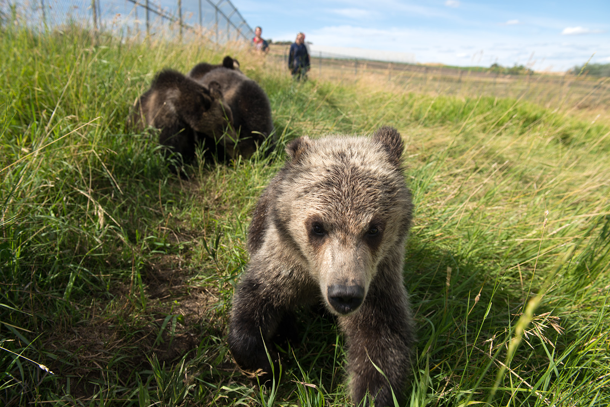
</a>
 Grizzly_Bears_7-17-2015___120.jpg
</td>
<td align="center" width="33%">
<a href="images/Pharmacy-1_18_20-BH_2649.jpg">
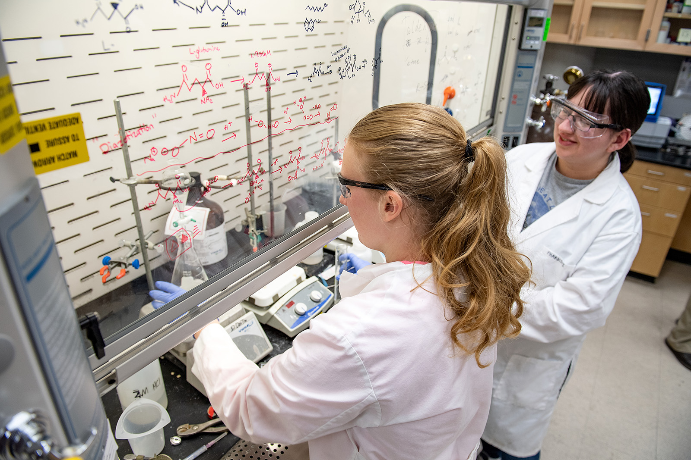
</a>
 Pharmacy-1_18_20-BH_2649.jpg
</td>
<td align="center" width="33%">
<a href="images/PhD-Student-Kaitlin-Witherell_5028.jpg">
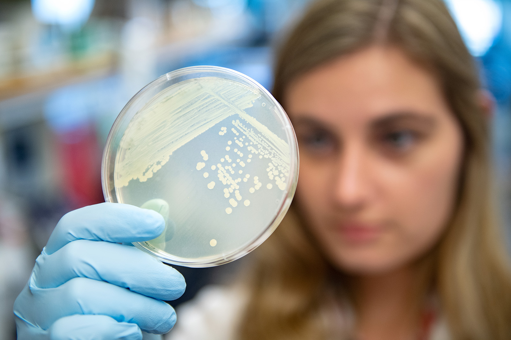
</a>
 PhD-Student-Kaitlin-Witherell_5028.jpg
</td>
</tr>
<tr>
<td align="center" width="33%">
<a href="images/Tri-Cities-Wine-Science-2019_9495.jpg">
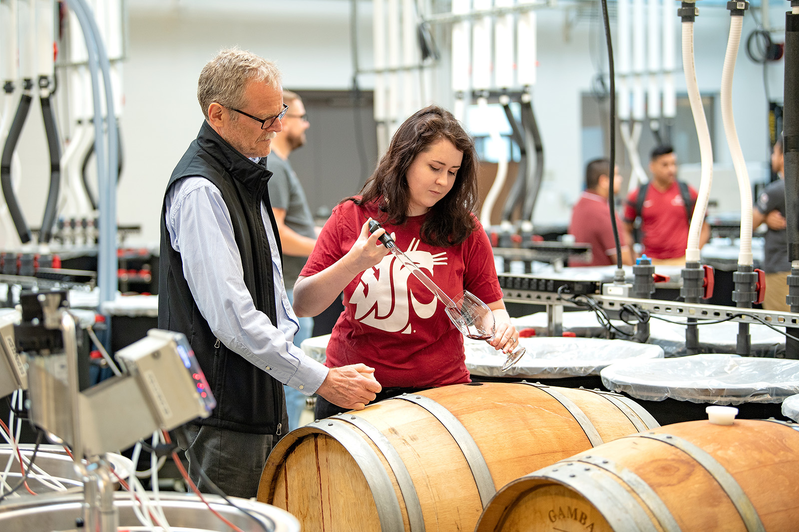
</a>
 Tri-Cities-Wine-Science-2019_9495.jpg
</td>
<td align="center" width="33%">
<a href="images/VCEA-Travis-Olds-Glowing-Minerals_5115.jpg">
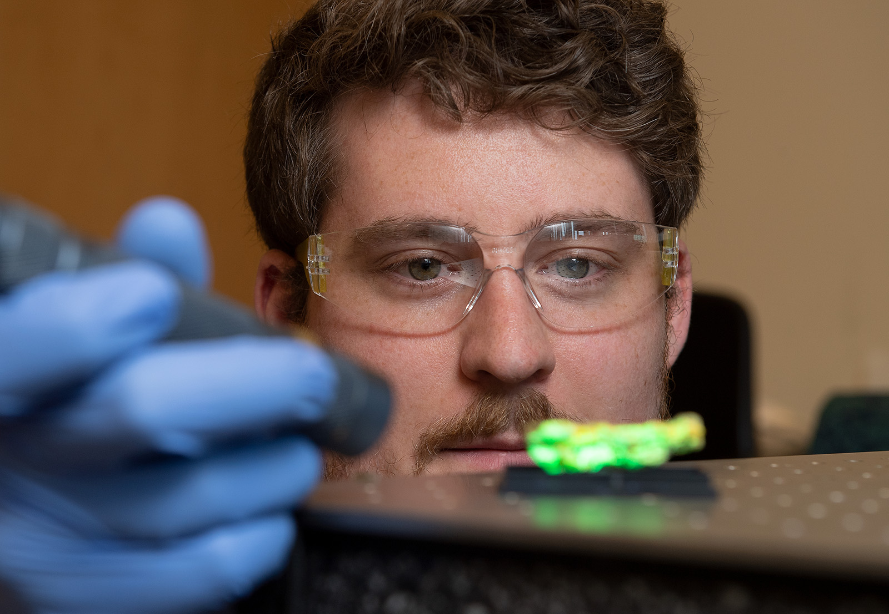
</a>
 VCEA-Travis-Olds-Glowing-Minerals_5115.jpg
</td>
<td align="center" width="33%">
<a href="images/Mask-group-15.png">
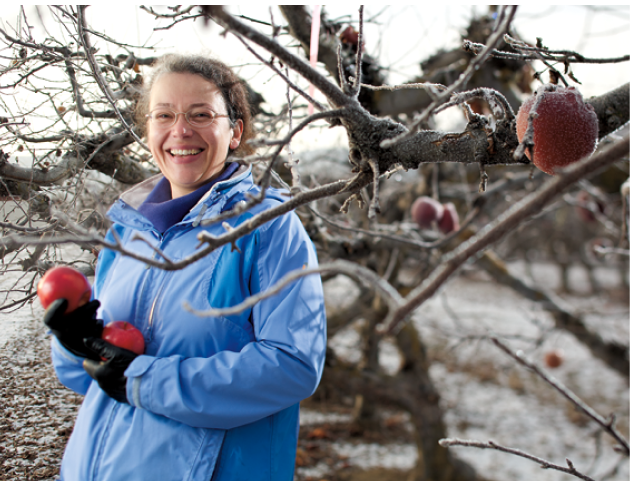
</a>
 Mask-group-15.png ⚠️
</td>
</tr>
<tr>
<td align="center" width="33%">
<a href="images/Mask-group-16-792x686.png">
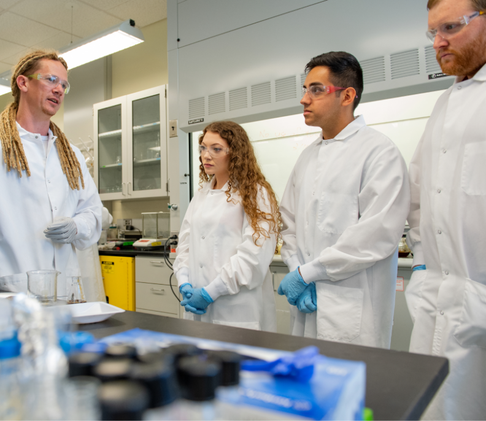
</a>
 Mask-group-16-792x686.png ⚠️
</td>
<td align="center" width="33%">
<a href="images/Mask-group-17.png">
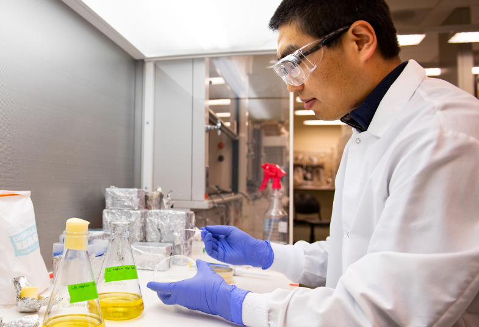
</a>
 Mask-group-17.png ⚠️
</td>
<td align="center" width="33%">
<a href="images/Mask-group-18-792x408.png">
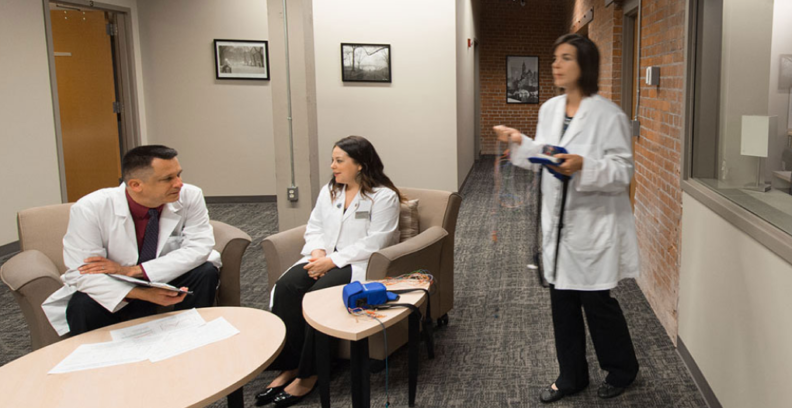
</a>
 Mask-group-18-792x408.png ⚠️
</td>
</tr>
<tr>
<td align="center" width="33%">
<a href="images/Mask-group-19-792x378.png">
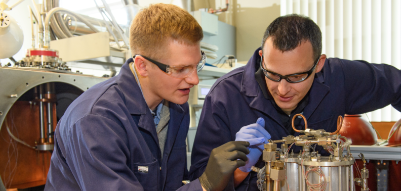
</a>
 Mask-group-19-792x378.png ⚠️
</td>
<td align="center" width="33%">

 couple-in-warm-embrace.jpg ⚠️
</td>
<td align="center" width="33%">
<a href="images/Ryan-Driskell-and-Sean-Thompson-with-pigs.jpg">
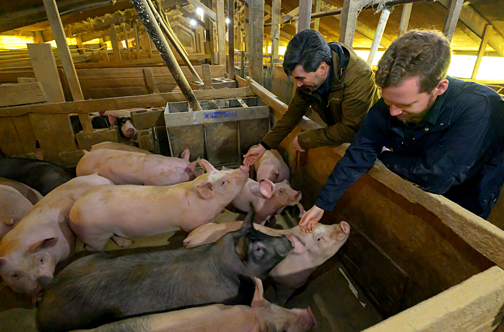
</a>
 Ryan-Driskell-and-Sean-Thompson-with-pigs.jpg ⚠️
</td>
</tr>
<tr>
<td align="center" width="33%">

 arthritis-photo.jpg ⚠️
</td>
<td align="center" width="33%">
<a href="images/bull-elk-in-snow.jpg">
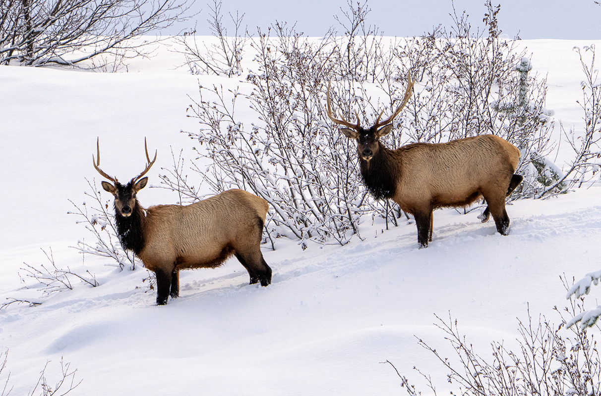
</a>
 bull-elk-in-snow.jpg ⚠️
</td>
<td align="center" width="33%">
<a href="images/medical-professor-and-students-in-classroom.jpg">
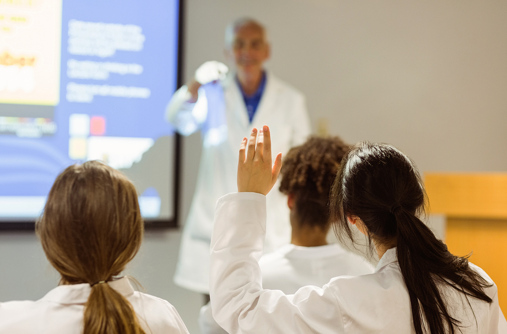
</a>
 medical-professor-and-students-in-classroom.jpg ⚠️
</td>
</tr>
<tr>
<td align="center" width="33%">
<a href="images/Elsa-the-donkey.jpg">
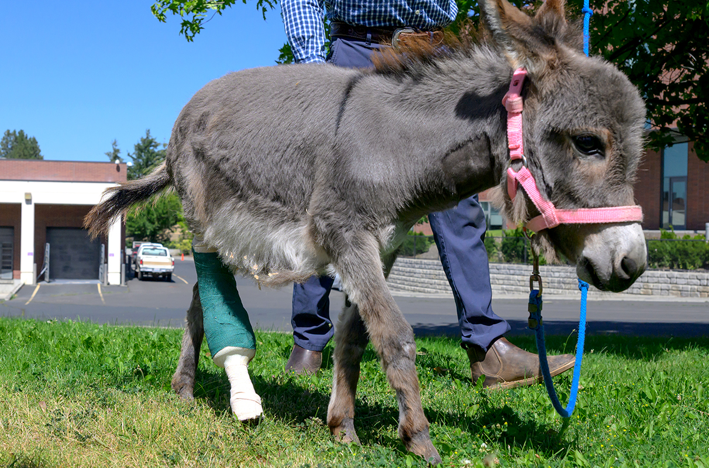
</a>
 Elsa-the-donkey.jpg ⚠️
</td>
<td></td>
<td></td>
</tr>
</table>

⚠️ <strong>Images Missing Alt Text</strong> (11)

| Image | Source URL |
|-------|-----------|
| `Mask-group-15.png` | https://s3.wp.wsu.edu/uploads/sites/625/2022/07/Mask-group-15.png |
| `Mask-group-16-792x686.png` | https://s3.wp.wsu.edu/uploads/sites/625/2022/07/Mask-group-16-792x686.png |
| `Mask-group-17.png` | https://s3.wp.wsu.edu/uploads/sites/625/2022/07/Mask-group-17.png |
| `Mask-group-18-792x408.png` | https://s3.wp.wsu.edu/uploads/sites/625/2022/07/Mask-group-18-792x408.png |
| `Mask-group-19-792x378.png` | https://s3.wp.wsu.edu/uploads/sites/625/2022/07/Mask-group-19-792x378.png |
| `couple-in-warm-embrace.jpg` | https://s3.wp.wsu.edu/uploads/sites/625/2026/02/couple-in-warm-embrace.jpg |
| `Ryan-Driskell-and-Sean-Thompson-with-pigs.jpg` | https://s3.wp.wsu.edu/uploads/sites/625/2026/02/Ryan-Driskell-and-Sean-Thomps... |
| `arthritis-photo.jpg` | https://s3.wp.wsu.edu/uploads/sites/625/2026/02/arthritis-photo.jpg |
| `bull-elk-in-snow.jpg` | https://s3.wp.wsu.edu/uploads/sites/625/2026/02/bull-elk-in-snow.jpg |
| `medical-professor-and-students-in-classroom.jpg` | https://s3.wp.wsu.edu/uploads/sites/625/2026/01/medical-professor-and-student... |
| `Elsa-the-donkey.jpg` | https://s3.wp.wsu.edu/uploads/sites/625/2026/01/Elsa-the-donkey.jpg |

## 📁 Files

| File | Description |
|------|-------------|
| `01-page-loaded.png` | page-loaded (4.3 MB) |
| `page.html` | Rendered HTML content |
| `metadata.json` | Machine-readable scan data |
| `errors.log` | JavaScript console errors |
| `warnings.log` | JavaScript console warnings |
| `info.log` | Navigation and timing details |
| `actions.log` | Interactions performed |
| `images/` | 16 page images (9.4 MB) |

---

*Generated by AccessibilityScanner (FreeTools) v1.0*
