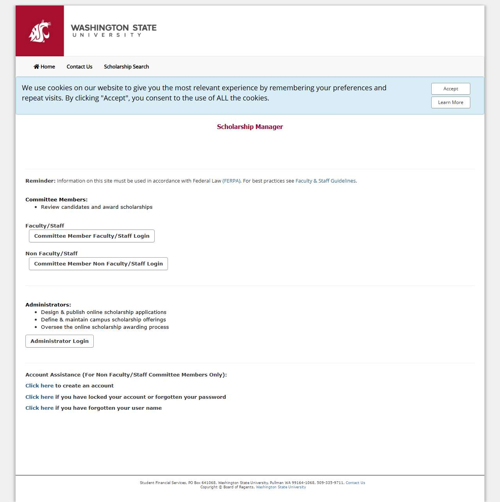

# 🌐 Site Report: https://wsu.scholarships.ngwebsolutions.com/

> **Status:** ✅ 1/1 pages OK  
> **Folder:** `wsu-scholarships-ngwebsolutions-com/`  

---

## 📋 Summary

```
Success Rate:  [██████████████████████████████] 100%
```

| Metric | Value |
|--------|-------|
| Pages Scanned | 1 |
| Pages Passed | ✅ 1 |
| Pages Failed | 0 |
| Total JS Errors | 🔴 1 |
| Total JS Warnings | 0 |
| Total Images | 3 (by URL) |
| Images Missing Alt | ⚠️ 2 |
| A11y Violations | ⚠️ 7 |
| 🔴 Critical | 2 |
| 🟠 Serious | 4 |
| 🟡 Moderate | 1 |
| 🔵 Minor | 0 |
| Total HTML | 24.2 KB |
| Total Screenshots | 81.8 KB |

## 🔒 SSL Certificate

| Field | Value |
|-------|-------|
| Subject | `CN=*.scholarships.ngwebsolutions.com` |
| Issuer | `CN=Go Daddy Secure Certificate Authority - G2, OU=http://certs.godaddy.com/re...` |
| Valid From | 2025-10-03 |
| Expires | 🟢 2026-11-04 (258 days) |
| Algorithm | sha256RSA |
| Key Size | 2048 bits |
| Thumbprint | `C65591655E697A95FB5EEEC7DCAAC7378FA6064D` |
| SANs | 2 domain(s) |

<details>
<summary><strong>Subject Alternative Names (2)</strong></summary>

| Domain | Type |
|--------|------|
| `*.scholarships.ngwebsolutions.com` | 🌐 Wildcard |
| `scholarships.ngwebsolutions.com` | 🔗 External |

</details>

## 📑 Pages

| Status | Page | HTTP | Title | 🔴 | 🟠 | 🟡 | 🔵 | A11y |
|:------:|------|:----:|-------|:--:|:--:|:--:|:--:|:----:|
| ✅ | [/](_root/report.md) | 200 | Scholarship Manager | 2 | 4 | 1 |  | ⚠️ 7 |

## 📸 Page Screenshots

Click any thumbnail to view the full page report.

<table>
<tr>
<td align="center" width="33%">
<a href="_root/report.md">

</a>
<br />✅ <code>/</code>
</td>
<td></td>
<td></td>
</tr>
</table>

## 🔴 JavaScript Errors

<details>
<summary><strong>1 error(s) across 1 page(s)</strong></summary>

**/** (1 errors)

```
Error with Permissions-Policy header: Parse of permissions policy failed because of errors reported by structured header parser.
```

</details>

## ♿ Accessibility Summary

| Metric | Value |
|--------|-------|
| Pages with violations | 1/1 |
| Total violations | 7 |
| 🔴 Critical | 2 |
| 🟠 Serious | 4 |
| 🟡 Moderate | 1 |
| 🔵 Minor | 0 |

### Top 3 Issues

| # | Rule | Sev | Pages | Instances |
|--:|------|:---:|:-----:|:---------:|
| 1 | [image-alt](../a11y-rules.md#image-alt) | 🔴 | 1/1 | 4 |
| 2 | [link-in-text-block](../a11y-rules.md#link-in-text-block) | 🟠 | 1/1 | 2 |
| 3 | [skip-link](../a11y-rules.md#skip-link) | 🟡 | 1/1 | 1 |

---

*Generated by AccessibilityScanner (FreeTools) v1.0*
