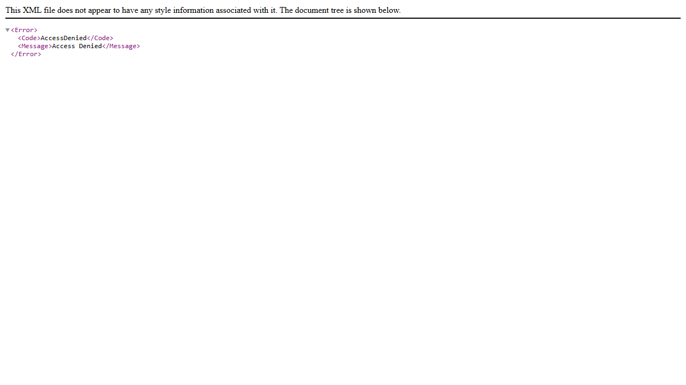

# Site Report: https://zzusis-utilities.wsu.edu/

| Metric | Value |
|--------|-------|
| Status | ⚠️ 0/1 pages OK |
| Pages Scanned | 1 |
| Pages Passed | 0 |
| Pages Failed | 1 |
| Total JS Errors | 1 |
| Total JS Warnings | 0 |
| Total HTML | 2.3 KB |
| Total Screenshots | 12.0 KB |
| Total Images | 0 (0 bytes) |
| Images Missing Alt | 0 |
| Folder | `zzusis-utilities-wsu-edu/` |

## Pages

| Status | Page | HTTP | Title | JS Errors | Images | Missing Alt |
|--------|------|------|-------|-----------|--------|-------------|
| ❌ | [/](_root/report.md) | 403 |  | 1 | 0 | 0 |

## Page Screenshots

### [/](_root/report.md)

## Failed Pages

### /

- **URL:** https://zzusis-utilities.wsu.edu/
- **Status:** 403

## Pages with JavaScript Errors

### / (1 errors)

- `Failed to load resource: the server responded with a status of 403 ()`

---

*Generated by AccessibilityScanner (FreeTools) v1.0*
